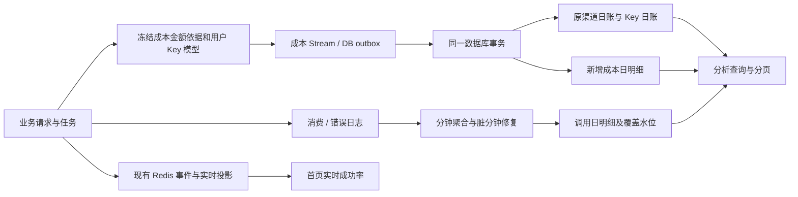

# 渠道成本与成功率／缓存分层分析设计

日期：2026-09-05。状态：设计建议，尚未实施。

调研基线：`9d40dec1de3fff382ba53670a9ec473c953cb981`；本地 `upstream/main`：`0ed497f066a68613375124303ef54f220267b334`。本方案依据当前下游代码，文档与实现不一致时以代码为准。规模、延迟和容量数字是设计假设及待验证目标，并非生产实测结果。

## 1. 推荐方案

保留首页“渠道成本”“成功率／缓存”两个卡片，点击后进入共用交互规则的分析面板，分别展示成本指标和成功率／缓存指标。

**需求边界修正（2026-09-05）**：本需求的重点是降低监控页面刷新时的数据库扫描和 Go 内存聚合，不要求把成本拆成分钟级查询明细，也不要求所有历史查询都走 Redis。目标链路是：**当日页面数据读取专用 Redis 日汇总 key；历史页面数据读取数据库日汇总表；每分钟关闭时将上一分钟样本增量汇总并更新日表；调度热路径读取 Redis 实时聚合数据。** 数据库成本账本仍然保留为成本权威来源，Redis 只承担当天监控展示读模型。

**请求隔离要求（补充确认，2026-09-05）**：样本解析、指标计算、Redis `HINCRBY`／聚合、分钟汇总和日表更新都必须在请求返回之后由异步 writer／Stream consumer／history worker 执行。请求处理只构造一次有界事件并尝试投递，不能在请求 goroutine 内查询明细、执行聚合 SQL 或更新监控汇总表。当前代码的正常路径已经如此；但监控事件队列满时默认允许一次有界的直接 `XADD`，成本可靠链路也可能同步等待 Redis 或 DB outbox fallback，这是“可靠投递”带来的请求侧等待，后续需要与纯监控样本链路分离，不能把它描述为绝对零等待。

**样本丢弃与告警策略（已确认）**：监控样本属于可丢失的观测数据。队列满、Redis 不可用、Stream 发布失败、消费持续积压或聚合器停止时，优先保护用户正常请求，允许丢弃样本，不得同步等待数据库或 Redis 作为监控补偿。丢弃和异常必须进入渠道监控运行状态，显示异常类型、首次／最近发生时间、累计次数、当前是否恢复、影响时间段和统计覆盖状态；页面不得把缺失样本显示成“没有请求”或成功率 0。渠道监控设置中增加或复用邮件通知开关、收件人、冷却时间和恢复通知策略：异常从未恢复时按冷却时间抑制重复邮件，恢复时可发送一次恢复通知。成本账务 Stream／outbox 仍遵循可靠账务链路，不能套用监控样本可丢弃规则。

**数据链路结论（补充核对，2026-09-05）**：当前实现已经是“监控事件进入 Redis Stream，消费后写 Redis 维度聚合 key”的混合架构，但只对成功率／缓存／性能主链路成立。成功率性能接口直接读 Redis shared projection；当日成功卡片也先读 Redis。历史成功率再读数据库分钟表，并在请求时做一次范围汇总。成本卡片目前仍直接查询数据库日成本账本，虽然 Redis shared projection 已经维护了按日成本 key，但成本控制器只把 Redis 当作健康元数据来源，没有读取该 key。成本账本和监控事件还分别有成本 Stream、outbox 与监控事件 Stream，不能把它们误认为一条完全统一的读链路。

- **渠道汇总**：渠道总计 → 该渠道的用户汇总 → 该用户在该渠道的 API Key → 该 Key 在该渠道使用的模型。
- **API Key 明细**：可搜索、分页的 Key 汇总列表 → 该 Key 的「渠道 × 模型」明细；支持切换为按渠道汇总、按模型汇总。
- **规模控制**：每次只查询当前层、当前范围；汇总在服务端针对完整筛选范围计算，列表服务端分页，前端不接收整棵树。
- **存储**：保留现有渠道成本账本、分钟统计和 Redis 实时链路；补充用户归属快照、模型成本归属及按日明细读表。成本、调用指标分开存储，通过相同维度提供统一查询体验。
- **时间一致性**：成本分析读取已提交账本；可下钻的成功率／缓存分析统一读取已完成分钟生成的日汇总。首页实时成功率继续使用现有 Redis 数据，并标明实时与分析时间差。

第一版不建设通用 OLAP 平台，不引入新数据库，也不把所有渠道、用户、Key、模型组合预先生成。先覆盖单日及 7／30／90 天范围；任意分钟范围仍由现有性能详情承担。

### 需求对应关系

| 用户目标 | 操作路径 | 最终可见内容 |
| --- | --- | --- |
| 查看一个渠道总的表现 | 渠道汇总 | 渠道成本、业务成本与系统成本构成；调用／缓存指标 |
| 查看渠道下每个用户、每个 Key | 选渠道 → 用户列表 → 选用户 | 用户汇总、该用户所有有活动 Key 的分页列表 |
| 直接定位某个 Key | API Key 明细 → 搜索名称或 ID | Key 在完整筛选范围的汇总及所属用户 |
| 查看 Key 对应的渠道和模型 | 选 Key → 渠道 × 模型 | 每个实际使用组合及其指标；可继续汇总到渠道或模型 |
| 几十渠道、几百用户、数千至上万 Key | 搜索、分页、按需下钻 | 首屏及每次操作的返回量固定，不随全站 Key 数线性增长 |

## 2. 当前实现与需要补齐的地方

### 2.1 页面与接口

| 当前实现 | 已有能力 | 本次设计需要解决的问题 |
| --- | --- | --- |
| `channel-monitor-cost-history-dialog.tsx` | 成本趋势／渠道汇总／API Key 明细三个页签 | 渠道表不能下钻用户、Key |
| `channel-monitor-api-key-cost-table.tsx` | 前端按用户分组，Key 可展开关联渠道 | 全量输入后本地分组、排序；无模型；折叠只隐藏已有内容，没有减少数据查询 |
| `channel-monitor-today-success-dialog.tsx`、`channel-monitor-success-api-key-table.tsx` | 渠道明细和按用户分组的 Key 汇总 | 没有 Key 下的渠道、模型明细，也没有服务端用户分页 |
| `GET /api/channel_monitor/cost` | 日趋势、渠道汇总、Key 明细；`summary_only` 可跳过明细 | `page` 是日期分页，不是用户或 Key 分页；成本 Key／渠道分组限量后再组装 |
| `GET /api/channel_monitor/success/today` | 当天读 Redis，历史读分钟表 | 请求先读当天 Redis，即使选历史日期也会依赖它；Key 明细生成后截断 |
| `GET /api/channel_monitor/success/detail` | 当前渠道／分组／模型过滤，Redis 实时详情 | 没有用户、Key 过滤；Key 明细超过 1000 项会截断 |

成本明细响应最多 1000 项，并预留未归属残差项；底层先取金额最高的有限个「渠道／Key」分组。成功率详情在聚合后截取最多 1000 个 Key。这些限制可以保护响应大小，但不等价于分页：前端用返回子集计算出的用户小计，不能当作该用户的完整总计。新分析接口必须消除这层歧义，不能简单把 1000 调大。

### 2.2 数据与事实来源

当前读路径可以准确概括为：

```text
成功率／缓存／性能：ChannelMonitorEvent
    → Redis Stream
    → shared projection 的分钟／范围维度 hash
    → 当天和实时接口读 Redis

成功率历史：消费日志
    → 每分钟数据库聚合表
    → 历史接口按分钟查询并在请求内汇总

渠道成本：成本 Stream／DB outbox
    → ChannelDailyCost、ChannelDailyAPIKeyCost 日账本
    → 成本接口按日期、渠道、Key 在数据库聚合
```

因此，当前不是“所有渠道监控页面数据都读 Redis”，也不是“历史所有指标都按分钟表”。成本是数据库日账本；成功率历史是数据库分钟表并在查询时汇总；当日成功率／缓存才是 Redis。当前成功率接口还会在返回后批量查 Token/User 补用户信息，渠道名称等元数据也仍查库；这不影响指标聚合，但会影响“完全不查库”的判断。

请求侧异步状态可以分成两层理解：`EnqueueChannelMonitorEvent` 的通常路径是投递到有界本地 writer 队列，writer 后台发布到监控 Redis Stream；Stream consumer 后台更新 Redis 聚合 key。它不会在请求中执行聚合。当前 writer 默认队列容量为 8192，默认单 worker；队列满时 `CHANNEL_MONITOR_EVENT_WRITER_DIRECT_OVERFLOW` 默认开启，可能在请求中等待最多约 250ms 直接发布，失败后还可能走有界 outbox 写入。成本可靠事件的 Redis 发布超时为约 250ms，数据库 fallback 超时为约 750ms。它们是当前实现中的边界，不能忽略。

| 数据 | 当前粒度／来源 | 结论 |
| --- | --- | --- |
| `ChannelDailyCost` | 北京时间自然日 × 物理渠道；金额为整数 nano-CNY | 保留渠道金额事实；包含探测和模型检测分类 |
| `ChannelDailyAPIKeyCost` | 日 × 渠道 × 指纹；另有入站 `APIKeyId` | 有 Key 到渠道关系，没有用户 ID、模型 |
| `ChannelDailyCostDelta`、`ChannelDailyCostOutbox` | 普通成本可靠写入及幂等边界 | 没有用户、模型；新增明细必须沿此链路传递 |
| `ChannelTaskCostEvent` | 异步任务原始日、初始成本、修正后的绝对金额 | 同样缺用户、模型，任务修正必须同时更新新明细 |
| `ChannelMonitorMinuteAPIKeyMetric` | 分钟 × 渠道 × 模型 × 分组 × Key | 已能支持 Key→渠道／模型；缺少用户归属字段、以 Key 为首的时间范围索引 |
| `ChannelMonitorEvent` | 请求事件，含渠道、模型、Key、重试及缓存指标 | 没有用户 ID；成功事件的模型取 `OriginModelName` |
| `Log` | 有 `UserId`、`TokenId`、`ModelName`、渠道、时间等 | 可用于有覆盖范围内的历史归属回填；不能由用户消费额度推算渠道实际成本 |
| Redis shared projection | 实时渠道、Key、Key／路由等维度 | 已有部分交叉信息，但继续扩大 hash 扫描范围不能解决大列表问题 |

当前成本接口的 `applyChannelMonitorRealtimeCost` **只附加 Redis 健康元数据**，金额、计数始终读取数据库日账。不能因为函数名有 realtime 就再叠加 Redis 金额。

当前用户归属通过 `Token` 和 `User` 的 `Unscoped()` 批量查找补齐，软删除通常仍能查到；硬删除、数据清理或未来归属变更时，查询时关联不等于发生时归属。已有批量查询应保留，不能退回逐行查库。

默认保留期为：渠道成本 30 天、路由分钟指标 30 天、API Key 分钟指标 7 天。页面支持 90 天不代表 90 天所有维度都完整。Redis shared 分钟投影 TTL 为 48 小时，且有维度、扫描量、响应量预算；它不是长期明细库。

### 2.3 代码依据

主要前端文件在 `web/src/features/channel-monitor/`，包含 `api.ts`、`types.ts`、`hooks/use-channel-monitor-daily-insight.ts` 及上述组件。

主要后端文件：

- `controller/channel_monitor_cost.go`、`controller/channel_monitor_realtime_cost.go`。
- `controller/channel_monitor_today_success.go`、`controller/channel_ratio_monitor_performance.go`。
- `model/channel_daily_cost.go`、`model/channel_daily_api_key_cost.go`、`model/channel_daily_cost_outbox.go`、`model/channel_task_cost_event.go`。
- `model/channel_monitor_minute.go`、`model/channel_monitor_success.go`、`model/channel_monitor_dirty_minute.go`。
- `service/channel_daily_cost.go`、`service/channel_daily_cost_outbox.go`、`service/channel_monitor_event_emit.go`、`service/channel_monitor_redis_page_query.go`、`service/channel_monitor_redis_shared_projection.go`。
- `controller/channel_ratio_monitor_settings.go`、`model/channel_monitor_cost_retention.go`、`router/channel-monitor-router.go`。

## 3. 页面与交互

### 3.1 分析面板骨架

桌面使用一个可放大的宽分析面板，建议宽度不超过 1440px、高度约 90dvh；窄屏全屏显示。沿用项目 Base UI、Hugeicons、主题变量、表格和 React Query，不另外引入 UI 体系。

顶部固定显示标题、日期范围、选定日期／整个范围、数据更新时间、刷新、关闭。第二行是当前范围的指标摘要。趋势、渠道汇总、API Key 明细为主导航；趋势图只在趋势页签出现，避免每次下钻都要滚过图表。

```text
渠道成本                         [近30天 ▾] [2026-09-05 ▾] [刷新] [放大] [×]
范围：9月5日 00:00—当前；北京时间       已入库 · 更新于 14:32:08
已结算成本 ¥1,240.80   业务成本 ¥1,220.00   系统成本 ¥20.80   未解析 17

[成本趋势] [渠道汇总] [API Key 明细]
┌─────────────────────┬─────────────────────────────────────────────────────┐
│ 搜索渠道            │ 渠道 A > 用户张三                                  │
│ 渠道 A    ¥320.00 ● │ 当前用户在渠道 A：业务成本 ¥125.00，12 个活跃 Key      │
│ 渠道 B    ¥215.50   │ [搜索 Key 名称或 ID]                  [只看未解析]   │
│ 渠道 C     ¥98.40   │ Key 名称 / ID       已结算成本    结算 / 未解析  查看 │
│ …                   │ 应用生产 #201        ¥80.00          900 / 1      → │
│ [上一页] [下一页]   │ 测试调用 #208        ¥45.00          300 / 0      → │
│                     │ [上一页]             第1页，20条         [下一页]   │
└─────────────────────┴─────────────────────────────────────────────────────┘
```

图中数据仅用于说明布局。成功率／缓存面板沿用相同骨架和导航，替换指标摘要与列，不要求一次读取两类指标。

### 3.2 渠道汇总：逐层进入，始终保留渠道总计

1. 进入页签，显示所有有统计活动的渠道汇总；默认每页 20 个，支持搜索及显示无活动渠道。当前停用或已删除但存在历史事实的渠道仍可见。
2. 选择渠道后，左侧保留渠道列表与总计；右侧显示该渠道用户汇总，每页 20 个。用户行显示姓名／ID、活跃 Key 数和指标。
3. 选择用户，右侧替换为“该用户在当前渠道的 Key 列表”，上方显示面包屑、用户小计及返回入口。
4. 选择 Key，右侧替换为该 Key 在当前渠道的模型表。已固定的渠道、用户、Key 显示为筛选标签，可逐项移除。
5. 提供“本渠道全部 Key”切换，省去逐个用户进入；Key 表始终显示所属用户列。

不在同一表格里展开四层嵌套表格。每层都是独立分页的平面表，返回保留上一层页码、排序、搜索词、滚动位置。面板内只有当前明细区纵向滚动，表格横向滚动限制在自身容器。

成本渠道总额包括系统活动。用户列表上方显示“业务成本”；系统探测、模型检测、历史未归属金额作为单独构成项显示，不伪装成真实用户或某个 Key。点击用户后的摘要必须明确为“当前渠道内”，不能误显示该用户全站总计。

### 3.3 API Key 明细：先定位 Key，再看渠道和模型

默认使用扁平 Key 表，而不是把所有用户作为展开组。这样跨用户定位某个 Key 只需一次搜索。支持可选“按用户浏览”，但它也是用户分页 → Key 分页的服务端查询。

```text
API Key 明细
[搜索名称或ID] [用户 ▾] [渠道 ▾] [模型 ▾] [只看异常]
用户 / ID        Key / ID         渠道数  模型数   当前指标…       查看
张三 #31         应用生产 #201        3       4     ¥80.00          →
李四 #72         自动任务 #319        2       2     ¥66.00          →

选中“应用生产 #201”后：
张三 #31 > 应用生产 #201          Key 汇总：¥80.00
[渠道 × 模型] [按渠道汇总] [按模型汇总]
渠道              模型                  已结算成本   结算 / 未解析
渠道 A            模型 X                  ¥40.00        500 / 0
渠道 A            模型 Y                  ¥15.00        200 / 1
渠道 B            模型 X                  ¥25.00        300 / 0
```

“渠道数”“模型数”均为当前时间和筛选范围内有活动的去重数量，不是渠道配置支持数。不能把同一 Key 每天的渠道数相加。

主明细直接显示「渠道 × 模型」组合，避免仅给出两个互不对应的渠道列表和模型列表。其他两个页签为同一事实的聚合视图；两张表是替代视图，不能把它们的金额再次相加。

### 3.4 指标列与筛选

| 层级 | 成本默认列 | 成功率／缓存默认列 |
| --- | --- | --- |
| 渠道 | 渠道、已结算总成本、业务成本、系统成本、未解析、解析率 | 渠道、实际调用数、成功率、失败数、缓存利用率、缓存写请求数 |
| 用户 | 用户、活跃 Key 数、业务成本、结算数、未解析、解析率 | 用户、活跃 Key 数、实际调用数、成功率、缓存利用率 |
| Key | 用户、Key 名称／ID、渠道数、模型数、成本、未解析 | 用户、Key 名称／ID、渠道数、模型数、调用数、成功率、缓存利用率 |
| 渠道 × 模型 | 渠道、模型、成本、结算数、未解析、解析率 | 渠道、模型、成功／失败／样本、成功率、缓存利用率 |

次要指标放入列选择或行详情：缓存命中率、缓存读取 tokens、有效输入 tokens、缓存样本数、最终结果成功率。模型层可跳转现有使用日志，携带相同物理渠道、用户、Key、模型和时间过滤；日志缺失时说明覆盖情况。

成本默认按金额降序；成功率默认按实际调用数降序，并提供“失败最多”“成功率最低”快捷排序。成功率排序支持最小样本数，避免一条失败样本长期占据榜首；无分母排在末尾并显示“—”。

搜索建议 300ms 防抖；筛选用户／Key／模型使用远程分页搜索，每次至多返回 20 项。ID 精确匹配优先，名称做有界前缀搜索，禁止读取完整 Key 或用真实密钥当搜索词。重名实体由 ID 区分。

### 3.5 加载、刷新和窄屏

- 首页仅获取两个摘要，不带用户、Key、失败分类数组。未打开的页签不发明细请求，未选择的用户不预取其 Key。
- 首次进入显示当前表的骨架；同范围刷新保留已有行并显示更新状态。切换渠道时不得把旧渠道行当成新渠道结果展示。
- 每个分页列表默认 20／50 条，可选最多 100 条；普通分页已足够，不用虚拟滚动弥补全量传输。只有未来需要连续滚动数百行时才启用现有 `@tanstack/react-virtual`。
- 保留当前手动刷新习惯，不增加周期轮询。刷新创建新查询快照，重新读取当前视图；其他页签下次激活时获取新数据。
- 窄屏隐藏左侧列表，顶部改为渠道选择器；每次只显示一层，返回路径固定。名称允许截断并可查看完整值，数字使用等宽字形和单位。
- 行操作有明确可访问名称，键盘可进入／返回；关闭面板返回原卡片焦点，切换层级后焦点落到新层标题。

### 3.6 监控异常与邮件通知

在渠道监控页面顶部显示独立的“数据链路状态”区域，不把它混入业务成功率。状态至少包括：

| 状态 | 页面表现 | 是否影响数据完整性 |
| --- | --- | --- |
| 正常 | Redis、Stream consumer、writer、分钟汇总均正常 | 当前窗口按覆盖水位展示 |
| 样本丢弃 | 显示丢弃计数、最近丢弃时间和影响窗口 | 是；该窗口显示部分数据 |
| Redis 不可用 | 显示不可用时间、当前降级来源和恢复状态 | 是；当天实时数据可能滞后 |
| 消费积压 | 显示 pending 数、最老消息时间、积压秒数 | 是；实时统计落后 |
| 聚合器停止／异常 | 显示最后处理时间和异常原因 | 是；实时或历史覆盖可能中断 |
| 历史汇总延迟 | 显示日汇总完成水位和预计缺口 | 只影响历史日表最新区间 |

状态卡片支持展开运行详情，但不阻塞渠道、用户、Key 明细浏览。异常指标返回独立的 `monitoring_health` 与 `coverage` 字段；不能用 `success_metrics_available=false` 把 Redis 故障伪装成未开启统计。

渠道监控设置增加以下邮件通知配置：

- `monitor_alert_email_enabled`：是否启用邮件通知。
- `monitor_alert_recipients`：收件人列表，保存规范化后的地址。
- `monitor_alert_cooldown_minutes`：同一异常指纹的重复通知冷却时间。
- `monitor_alert_recovery_enabled`：异常恢复时是否通知。

异常指纹至少包含异常类型和必要的实例／链路角色，避免每个渠道样本丢弃事件都发送一封邮件。告警发送本身异步执行，不能阻塞请求、Stream consumer 或 Redis 聚合；邮件失败只记录通知失败状态，不回滚或重试业务样本。设置变更后新策略只影响后续通知，不伪造过去的告警。

## 4. 统计口径必须先固定

### 4.1 身份、模型与时间

- **API Key 指入站 Token**，主身份为 `tokens.id`。上游渠道密钥、其轮换版本或掩码不能作为用户 Key 身份；新表不再因上游密钥轮换增加一条用户 Key 记录。
- 用户归属取请求发生时的 `UserId`，写入事实；查询当前 Token 所属用户只用于旧数据回填或元数据展示，并记录来源。Key 归属如果发生变更，历史事实仍保留原用户。
- 模型默认沿用当前监控的规范化请求模型语义，与 `OriginModelName` 对齐；保留可读名称。映射后的上游实际模型属于另一个维度，第一版不混入“模型”列。以后增加时必须独立命名并从发送时快照记录，不能读当前映射倒推历史。
- 成本始终归属实际物理渠道。逻辑渠道组不再复制一份成本。
- 时间统一北京时间自然日，后端计算日界限，查询使用 `[start_at, end_at)`。趋势范围和明细范围分开表达：选择某一天就只展示那一天；“整个范围”才汇总所选 7／30／90 天。
- 成本使用账本已有归属日；异步任务最终修正回写原始归属日。调用指标使用现有调用完成／失败时间。两者在跨天任务上可能不同，不能强行用成功请求数解释成本结算次数。

### 4.2 成功率、重试与缓存

```text
实际成功率 = Σ实际成功次数 / (Σ实际成功次数 + Σ实际失败次数)
最终成功率 = Σ最终成功次数 / (Σ最终成功次数 + Σ最终失败次数)
缓存命中率 = Σ命中请求数 / Σ具备有效缓存字段的请求样本数
缓存利用率 = Σ有效流式缓存读取 tokens / Σ有效流式总输入 tokens
成本解析率 = Σ已结算次数 / (Σ已结算次数 + Σ未解析次数)
```

只能先加分子、分母再相除，不能平均子行百分比。缓存利用率继续沿用当前流式口径和不同供应商的输入 token 归一化；未上报缓存、非流式及无有效输入时不能补成有意义的 0%。缓存命中率与利用率保持不同名称。

实际调用包含已发送到上游的每次尝试。重试最终摘要不能再增加一次实际调用，未发送的本地错误不能混入实际渠道调用分母。最终结果只计一次，继承已有最终尝试／重试摘要规则。第一版不要另写一套简化的请求去重算法。

例如同一个 Key 先在渠道 A 失败，再在渠道 B 成功：实际调用为 2 次、实际成功率 50%；最终请求为 1 次、最终成功率 100%。渠道 A 的中间失败不成为一次最终失败；按最终结果拆分时仅将终态贡献归到终态渠道／模型，并标明“最终结果归属”。无渠道可归属的终态放入未归属项，不能分摊到每个尝试渠道。

保留零金额的已结算请求、只有失败的 Key、只有未解析成本的 Key。不能用 `cost > 0` 或 `success > 0` 判断是否有活动。

### 4.3 总计与覆盖

分页响应的 `scope_summary` 是完整筛选范围总计，`items` 只是当前页，二者语义不能混淆。分页之外的记录不是“未归属”，也不是“其他用户”。

金额需要可解释地对账：

```text
渠道总成本 = 可归属业务成本 + 未归属业务／历史成本 + 系统成本
系统成本 = 非分组探测成本 + 分组探测成本 + 模型检测成本
非分组探测成本 = 当前 probe_cost - group_probe_cost
```

现有 `group_probe_cost` 是 `probe_cost` 的子集，不能把二者直接再相加。类型未知的历史残差单列，不能假定它全是某一种探测。金额、结算数、未解析数分别做对账；旧分类缺计数时标明“分类次数不可用”，不按金额比例分配次数。

每个响应返回独立覆盖状态：`complete`、`partial`、`unavailable`，以及缺失原因、覆盖起止时间、历史归属推断状态和未归属量。删除日志、关闭消费／错误日志、Key 分钟表过期、模型维度启用前、聚合积压分别表达。没有数据不等于指标为零。

## 5. 查询接口与效率

### 5.1 新增窄接口，逐步替换大响应

在现有 Root 权限路由下新增 `/api/channel_monitor/analytics/`，示意契约如下；路径是设计名，不是现有接口。

| 接口 | 用途 |
| --- | --- |
| `GET /summary` | 当前指标类别、时间范围、筛选条件的全量摘要 |
| `GET /trend` | 最多 90 个日点；无需附带任何实体列表 |
| `GET /rows` | 一个指定分组层级的完整范围聚合＋分页行 |
| `GET /options` | 用户、Key、模型等有界搜索；只返回 ID、名称及必要状态 |

`rows` 只允许白名单：`channel`、`user`、`api_key`、`channel_model`、`model`。第一版不开放任意字段自由组合。典型调用：

```text
rows?metric=cost&group_by=channel&start_date=2026-09-05&end_date=2026-09-06
rows?metric=cost&group_by=user&channel_id=12&...&page_size=20
rows?metric=cost&group_by=api_key&channel_id=12&user_id=31&...
rows?metric=usage&group_by=api_key&user_id=31&...&page_size=50
rows?metric=usage&group_by=channel_model&api_key_id=201&...
rows?metric=usage&group_by=model&api_key_id=201&channel_id=12&...
```

共同参数包括日期、指标类别、父级 ID、请求模型、排序字段／方向、最小样本数和分页参数。模型与实体过滤在聚合前执行；按聚合结果筛选如最小样本数在聚合后执行，并影响 `scope_summary` 的范围描述。非法范围、超过 90 天、过多过滤 ID、未知排序字段返回 400，不静默扩大查询。

推荐响应契约：

```json
{
  "scope": {"metric": "usage", "group_by": "api_key", "channel_id": 12},
  "range": {"start_at": 0, "end_at": 0, "timezone": "Asia/Shanghai"},
  "snapshot_id": "opaque-id",
  "generated_at": 0,
  "data_source": "daily_usage",
  "completed_through": 0,
  "coverage": {"status": "complete", "reasons": []},
  "scope_summary": {},
  "items": [],
  "page": {"page_size": 50, "total": 327, "next_cursor": "opaque-cursor"}
}
```

金额在数据库和服务端始终使用整数 nano-CNY；新接口用十进制字符串传金额原值，大计数超过 JavaScript 安全整数边界时也用字符串。百分比在服务端由原始总数计算。前端展示可格式化，但不使用浮点金额反算汇总。

### 5.2 聚合和分页分开考虑

数据库先应用时间／父级条件，再 `GROUP BY` 需要的维度。禁止先取前 N 个 Key／渠道组合，再计算用户总计或 Key 总计。渠道和模型去重数也针对全范围计算；明细名称在分页后批量补齐，不在大事实表查询中做多张业务表的逐行关联。

普通日查询扫描的是“实际有活动的组合数”，不是原始请求数。几十个渠道的顶层摘要可以直接读取已有低基数渠道账本／日统计；带用户、Key、模型条件后，所有摘要必须使用能表达这些条件的新明细事实，不能继续套用未过滤的渠道总额。

**`LIMIT 50` 和游标只能限制返回量，不能免除 `SUM/GROUP BY/ORDER BY` 的计算。** 不把按聚合值排序描述为直接走普通 B-tree 索引。先用日汇总压缩数据量，再共享短期查询结果。

建议第一版支持服务端短期列表快照：

1. 首次打开一层，在一个一致性读事务中算出完整分组行及全范围总计，然后提交事务。仅物化该层分组结果，不把模型叶子、日志、所有层级装进缓存。
2. 快照记录规范化筛选、排序、权限范围、覆盖、水位、总计和精确总行数；结果按“指标值＋稳定身份”排序。后续分页用不透明 `snapshot_id + position` 游标读取。
3. 默认有效期 2 分钟，单个快照建议上限 2 万分组／8MiB，实例或 Redis 查询缓存全局预算建议 128MiB，按 LRU 和 TTL 淘汰。分组查询最多读取上限加一个哨兵，编码过程同样有大小上限；禁止先把任意数量结果装入 Go 内存再检查。达到预算时要求缩小时间或选用户，返回明确错误；不截断结果假装完整。预算须压测调整。
4. 集群共享快照使用独立命名空间；Redis 缓存故障可采用明确绑定节点的短期内存快照。请求落到其他节点或快照过期时返回“统计已更新，请重新加载”，不把游标应用到新结果导致漏行／重复。
5. 打开下一级创建该级自己的快照，摘要随该级结果一起更新。不同层先后查询并非跨请求事务快照；当前选中实体的摘要以当前层 `scope_summary` 为准，并显示其更新时间。若需要严格对账，必须在同一次服务端一致性读中生成对应总计和子项。
6. 手动刷新必须创建新快照，不能被 TTL 命中的旧结果吞掉。关闭面板后前端清理非活动查询，继续遵循现有不跨页面保留监控数据的行为。

这避免给浏览器会话保留长数据库事务。仅固定 `generated_at` 或加 `updated_at <= generated_at` 无法重建被原地更新的日表旧版本，不可用作快照方案。快照游标只解决一个列表会话的一致性，不宣称固定了全站数据。

查询使用单飞合并相同的在途计算；有界超时、并发限制和输出预算。SQL 查询超时建议初值 3 秒，达到预算返回重试／缩小范围提示。HTTP 仍保持私有 `no-store`；服务端查询快照不能变成浏览器或 CDN 响应缓存。

## 6. 存储设计

### 6.1 两类日明细事实

建议新增 `channel_monitor_daily_cost_details` 与 `channel_monitor_daily_usage_details`。两者共享身份定义，不合并成需要同时等待成本与调用链路完成的超宽表。

| 公共字段 | 含义 |
| --- | --- |
| `id` | GORM 生成主键 |
| `day_start` | 北京时间自然日起点，Unix 秒 |
| `channel_id` | 实际物理渠道 |
| `user_id` | 发生时所属用户；未知为 0 |
| `api_key_id` | 入站 Token ID；未知为 0 |
| `model_key` | 固定长度规范化模型标识；未知使用明确哨兵值 |
| `created_at`、`updated_at` | 写入时间；不充当数据完整性水位 |

成本明细额外字段：

| 字段 | 含义 |
| --- | --- |
| `source_kind` | 业务、非分组探测、分组探测、模型检测、历史未知等互斥分类 |
| `cost_nano_cny` | 已结算的非负整数金额 |
| `settled_count`、`unresolved_count` | 两种成本状态的次数；与调用成功／失败独立 |
| `attribution_flags` | 标识旧数据、用户推断、模型未知、分类计数不完整等，可同时存在 |

成本唯一粒度：`(day_start, channel_id, user_id, api_key_id, model_key, source_kind)`。业务按真实 ID 落行；系统活动的用户／Key 为 0。旧数据可以有真实 Key＋未知模型，不应因模型未知而丢掉 Key 身份。

调用日明细保存以下可加指标，不保存作为事实的百分比：

```text
actual_success_count, actual_failure_count
final_success_count, final_failure_count
cache_hit_count, cache_sample_count
cache_read_tokens, input_tokens, cache_write_count
```

调用唯一粒度：`(day_start, channel_id, user_id, api_key_id, model_key)`；只纳入当前业务统计口径，探测性能继续留在原监控体系。原分钟表的分组维度在生成本卡片日事实时合并；第一版分析面板不提供分组筛选，因此不能用这张去掉分组维度的表替代现有分组接口。

覆盖状态另由投影状态表保存，至少包括指标版本、覆盖区间、缺口原因、`completed_through`、待修复区间。它不能只用一个“最早记录日期”代表全区间完整。

### 6.2 元数据与身份快照

新增小型分析身份目录，保存用户、Key、渠道的稳定 ID、最后已知名称、首次／最后观测时间及状态；Key 目录以 `(api_key_id, user_id)` 保留归属历史。模型目录保存 `model_key`、规范化名称、标识算法版本，散列命中后核对名称避免碰撞误合并。

事实表直接持有 `user_id`，用户筛选不依赖查询时 JOIN Token。目录用于搜索与名称回退：当前实体名称 → 最后已知名称 → “已删除用户／Key #ID”。名称不是分组主键；改名不拆分指标。

这里的名称是“最后已知名称”，不承诺精确还原某一天的显示名。若未来需要精确改名历史，再增加名字版本表；第一版不要在每分钟、每天的每条事实中重复存整段用户名、备注和渠道描述。

不保存完整入站／上游密钥，不返回旧 `KeyFingerprint`。旧成本表的上游掩码可保留原诊断用途，但不出现在新分析列表的主要身份列。

### 6.3 初始索引

两张日表各有唯一粒度索引，以及以下候选查询索引；最终通过实际三库执行计划选择，避免机械地全部添加覆盖列：

| 索引前缀 | 支持的主要路径 |
| --- | --- |
| `(day_start, channel_id, user_id, api_key_id, model_key)` | 无父级的单日／短范围列表与归档 |
| `(channel_id, day_start, user_id, api_key_id, model_key)` | 渠道 → 用户／Key |
| `(user_id, day_start, api_key_id, channel_id, model_key)` | 用户 → Key；用户搜索后查询 |
| `(api_key_id, day_start, channel_id, model_key, user_id)` | 指定 Key → 渠道／模型 |

`model_key` 前导索引仅在模型全局筛选确实频繁且执行计划证明需要时增加。大多数请求先选日、渠道、用户或 Key，没有必要为每种排序再建索引。避免索引 255 字符名称、JSON 内属性，尤其注意 MySQL 5.7.8 的字符集和索引字节限制；必要时使用紧凑整数模型 ID。

表中日字段前导的查询若已被唯一索引的左前缀覆盖，就复用该唯一索引，不再创建一条重复索引。新表只建立上线查询实际需要的索引，其余保留为候选。

已有 `ChannelMonitorMinuteAPIKeyMetric` 要补发生时 `UserId`，并明确唯一粒度包含用户，避免同一个 Key 归属变化时合并错用户；旧索引升级、分钟替换逻辑及历史重建需一并设计验证。它继续服务短窗口及日汇总修复，不扩展为长期大宽表。

### 6.4 不预建所有汇总层

初期渠道总计复用原账本／低基数统计；用户、Key 总计由日明细聚合。不要同时新增所有 `渠道×用户`、`用户×Key`、`Key×模型` 等永久表：每增加一张就增加写入、修正、回填和对账责任。

如果基准数据下 90 天 Key 列表的未缓存查询 p95 超过 1.5 秒，再增加窄日汇总 `(day, channel, user, api_key)`，或按已确认瓶颈增加特定层。它只能由日明细可重建地产生，不能从页面截断结果生成。此为性能阶段选项，不是第一版的强制表集合。

## 7. 写入、修正与时间一致性



### 7.1 成本链路

普通请求在已有成本快照建立处冻结 `user_id`、`api_key_id`、规范化请求模型、物理渠道、来源、原始归属时间。新增维度一路经过 `ChannelDailyCostDelta`、Stream payload、outbox 和消费端，不能只加在最终表字段上。

在原 outbox 应用事务内，同时更新旧渠道总账、旧 Key 账和新日明细，然后标记 outbox 完成。重放同一成本事件只应用一次，载荷冲突应报错；不能增加一个独立异步消费者后宣称三个账本天然一致。短批次按确定的维度顺序更新，控制热点渠道锁持有时间。

探测和模型检测保留现有同步／事务入口，在同一事务增加来源明细。异步任务把新维度冻结在 `ChannelTaskCostEvent`；按原始日期、原始身份用绝对目标金额修正，更新新旧日账，不按当前倍率重算旧请求。

修正差额允许内部为负，例如任务成本从 10 元修正到 8 元，但最终所有金额和状态计数必须非负，检查旧状态与新状态再原子更新。并发修正加 `lockForUpdate(tx)` 或等价已有幂等机制；不把报表修正作为用户钱包退款。

保留现有非负校验、`int64` 累加溢出拒绝、可靠接受失败和死信监控。业务金额继续复用原结算计算，不改变计费表达式或钱包扣费规则。旧紧急内存 batcher 路径也必须传递新维度，或在使用时明确关闭新分析完整性承诺。

### 7.2 调用日汇总

第一版继续以已有分钟聚合为历史基础，不新增一套从 Redis 事件单独计费／计请求的永久事实源。分钟读日志时带出已有 `Log.UserId`，写入 Key 分钟记录的用户字段；从现有身份／模型归一化逻辑构造新日粒度。

分钟首次完成或脏分钟重建时：在同一个主库事务内，读取被替换分钟的旧 Key 贡献，生成新贡献，按日维度计算 `新贡献 - 旧贡献`，更新日调用事实、替换分钟行并推进修复／覆盖状态。重跑同一已完成分钟没有新增贡献；对同一脏分钟并发处理通过现有租约及事务锁串行化。

日汇总任务失去原分钟贡献后，不允许再简单增量追加。必须从有覆盖的日志重建该日，或标记缺失等待修复。清理分钟表前检查日汇总水位和待修复状态；迟到数据触及已清理窗口时进入显式修复队列，不能重复计入。

源日志可能在独立日志数据库，目标分钟／日表在主库。不能依赖跨库 JOIN 或分布式事务；沿用有界日志读取、主库事务提交、脏分钟补偿的现有机制。日志后续删改导致不可恢复时记覆盖缺口。

### 7.3 实时摘要与分析的明确边界

- 当前成本卡片与成本详情都读已提交日账，不拼接 Redis。目标架构可以让成本卡片的“监控展示读模型”在当日读 Redis 日聚合 key，但成本账本仍必须以数据库为权威；不能用 Redis 展示 key 替代扣费、对账、任务修正或历史回补。新增金额水位／outbox 积压元数据，不能拿 Redis `data_cutoff_at` 当作成本账本完整水位。
- 首页成功率继续显示实时投影；新分析面板内部摘要、渠道、用户、Key、模型、日趋势统一用日事实，显示“统计至已完成分钟”。正常延迟目标约 1～2 分钟，具体以持久化 `completed_through` 和缺口状态为准。
- 打开面板时用分析摘要替换卡片实时值作为面板内部总计，并解释“分析统计至 HH:mm；首页为实时数据”。不把实时父项与分钟子项放在同一棵树里承诺相等。
- Redis 不可用时，新历史分析仍能读数据库；历史查询不强制请求今日 Redis。日志未启用、分钟积压或覆盖不足时，显示延迟／缺口，不自动把 Redis 样本填进日事实。
- 不把“最大事件时间”视为连续处理水位。迟到日志与任务修正可改变昨天甚至更早日期，因此历史查询缓存也要短期化，并有明确刷新入口。

### 7.4 按“Stream → Redis 当日读模型 → 日汇总表”统一渠道监控读链路

如果目标是让渠道监控页面尽量不查库，建议采用下面的边界，而不是把数据库账本直接替换掉：

1. **成功率／缓存／性能继续使用现有监控事件 Stream 和 Redis shared projection**。补齐按用户、API Key、渠道、模型的组合 key；事件消费时用 Redis 事务、事件 marker 和成本状态修正机制更新。页面当天指标查询只读专用 Redis 日汇总 key，用户、Key、渠道名称等轻量元数据使用带 TTL 的目录缓存，Redis 缓存未命中时批量查库并回填。
2. **当日成本增加监控读模型写入**。成本事件在可靠成本 Stream／outbox 成功接受后，或监控事件消费确认同一成本事件后，幂等更新 Redis 日成本 key。对于任务成本修正，先减旧状态再加新状态；同一个 `cost_event_id` 必须保留状态，防止重复消费。Redis 读模型只服务页面，不参与钱包和扣费。
3. **历史统一查询数据库日汇总**。每分钟 worker 读取刚关闭的分钟聚合结果，使用增量差值更新 `ChannelMonitorDaily...` 日汇总表；页面查询 7／30／90 天范围时直接对日表做数据库聚合，不再扫描原始日志，也不再每次扫描所有分钟行后在 Go 内存中汇总。成本可以直接复用已有成本日账本，成功率／缓存需要补充按渠道、用户、Key、模型所需的日汇总粒度。
4. **跨日切换**。北京时间日切换前后，Redis 日 key 保留一段安全窗口；上一日最终分钟关闭后，worker 完成日表最后一次增量更新。页面查询当前日读 Redis，已完成日读日表；正在切换的日期返回 `data_cutoff_at`、`processed_at`、`realtime_degraded` 和成本 outbox 水位。
5. **Redis 故障降级**。当日 Redis 不可用时允许降级查日汇总表／日账本并标记 `realtime_degraded=true`；不能直接返回 0。恢复后通过 Stream pending、outbox 和状态校正重放，不能依赖页面查询触发修复。
6. **不要每次请求在 Go 内存中拼整棵树**。Redis 消费端按事件增量更新；查询端只读取已聚合的当前层 key，并服务端分页。历史查询只读日汇总表，数据库负责 `GROUP BY` 和排序；不把数万 Key 的所有明细一次读到前端。

推荐的最终链路是：

```text
业务请求／成本结算／失败事件
        → 事件 Stream（可靠接收、幂等、可重放）
        → Redis 当日读模型（页面实时／当日查询）
        → 每分钟关闭时增量更新日汇总表
        → 页面仅分页读取聚合结果

历史查询：数据库日汇总表（页面历史查询）

成本账本：成本 Stream／outbox → 数据库日账本（权威对账，不被 Redis 替代）
```

若以后要求下钻也达到秒级，应另行评估按实体分片的实时读模型及可重建持久事件源，包含父子同版本读取、重复投递、断流恢复和内存预算。仅在 shared hash 上加更多 `HSCAN MATCH` 模式不能保证查询随返回页数缩小。

## 8. 容量、保留与性能预算

### 8.1 以活跃组合估算，不用实体总数相乘预分配

设每日活跃 Key 数为 `K`，平均每个活跃 Key 使用 `C` 个渠道、每个渠道使用 `M` 个模型。单类日明细近似 `K × C × M` 行，且不超过实际发生的有效事件组合数；系统活动另外估算。

| 场景假设 | 单类明细／日 | 两类明细保留 90 天 |
| --- | ---: | ---: |
| 500 用户、每人 20 个 Key，30% Key 每天活跃；每 Key 2 渠道、每渠道 3 模型 | 18,000 | 3,240,000 行 |
| 10,000 活跃 Key；每 Key 4 渠道、每渠道 6 模型 | 240,000 | 43,200,000 行 |

按每行连同索引 **暂估 400～900 字节**，第一档约 1.3～2.9GB，第二档约 17～39GB；不含已有账本、分钟表、日志、outbox、备份、副本和数据库空闲空间。正式容量必须以三库真实装载后的表／索引尺寸测算，不能把此估算当磁盘保证。

分钟行数取决于每分钟实际活跃组合；同一日组合平均活跃 60 个分钟，则分钟层可能是日层的约 60 倍。日汇总解决长期查询和保留问题，但不能忽略已有分钟层空间与双写成本。

### 8.2 保留策略

| 数据 | 建议策略 |
| --- | --- |
| 原始消费／错误日志 | 沿用用户配置，提供修复能力；不用报表功能擅自延长所有日志 |
| API Key 分钟表 | 继续支持当前 7 天配置，清理前确保日汇总及待修复工作完成 |
| 调用日明细 | 新功能建议默认 90 天，配置可缩短；UI 同步展示实际覆盖 |
| 成本日明细与原成本日账 | 使用同一个成本保留策略，不改变现有 30 天设置；要看完整 90 天成本需将成本保留期设为至少 90 天 |
| 任务成本事件、未处理 outbox | 保护尚未完成和仍在修正窗口内的事实，不因普通报表过期删除 |
| 身份目录 | 至少保留到最后一条关联事实过期；未完成任务引用时继续保留 |
| 查询快照 | 分钟级 TTL 与总量预算，不永久保存结果 |

保留期缩短时按现有清理任务小批删除，有时间预算、进度和失败重试。数据库分钟清理要依赖日汇总水位；成本清理要让相关表和修正事件的边界一致。不能出现父账本已删、子账本还展示成完整总计，或相反。

### 8.3 性能验收目标

在第一档规模、90 天数据、记录数据库版本与硬件后，建议目标：摘要／单渠道用户页 p95 ≤ 500ms；指定 Key 的渠道模型页 p95 ≤ 500ms；首次全站 Key 聚合 p95 ≤ 1.5s；已有列表快照翻页 p95 ≤ 200ms。普通单页 JSON 目标 ≤ 100KB（不含单独加载的错误示例／日志）。

验证同时读取的管理员数量、冷／热缓存、单日和 90 天范围、数据倾斜到一个热点渠道／用户时的行为。记录 SQL 次数、扫描行数、临时排序、锁等待、主库 CPU、Redis 内存和 relay 延迟变化。读分析不能耗尽网关业务连接池；使用独立并发预算，必要时限制分析最大并发。

上述是验收目标，不预先承诺 SQLite 与服务器数据库有相同吞吐。第二档规模若不能达到目标，优先增加经过测量的窄日汇总和分批归档；是否引入专用分析库另立方案，不作为本需求的隐含依赖。

## 9. 历史回填、兼容和实施顺序

### 9.1 历史数据能恢复到什么程度

| 历史信息 | 可行处理 |
| --- | --- |
| 渠道日成本 | 原账本保留，不重算 |
| Key→渠道成本 | 从完整旧 Key 日账逐批转入新粒度，未知模型哨兵；不得经过现有 999 项限制接口 |
| Key→模型成本 | 旧日账、普通 outbox 和任务成本事件均未冻结模型，不能可靠拆分。除非有可逐事件关联的权威原始成本事实，否则显示“历史模型未知” |
| 用户归属 | 优先使用保留日志中的发生时用户；只能查当前 Token 时标记“由现有归属补全”；无证据保留未知，不猜测 |
| Key→渠道／模型调用指标 | 已有 Key 分钟表保留范围可聚合；日志还在时可重建更早区间 |
| Key 分钟、日志都已清理 | 无法恢复；显示保留期／覆盖缺口，不按渠道总计平均分配给 Key |

同一旧 Key 跨多个用户归属但成本行无法拆分时，该部分用户归属标未知。不能用日志请求数、tokens 比例或当前倍率去分摊旧成本，避免产生看似精确但错误的账目。

成本回填必须有切换边界和重复执行规则：新维度写入启用后先补历史完整日；跨越启用时刻的当天，按旧账的完整 Key／渠道总额减去已覆盖的新事实，残差进入“模型未知”，并记回填批次。修正可能更新历史日，不能仅凭递增 ID 认定旧账不再变化。使用事务及逐日检查点，重跑替换同一批次贡献或校验后跳过，不重复累加。

系统成本历史分类仅恢复已有明确字段；渠道账与 Key 账的差额保留为系统／历史未归属构成，分类无法确认的计数单独表示缺失。任何负残差触发对账异常，不以 `max(0, residual)` 掩盖问题。

### 9.2 推荐实施阶段

1. **维度与持久化准备**：冻结用户／模型，改造成本可靠链路和任务修正；新增日表、身份目录、覆盖状态；实现分钟到日的幂等更新。先后台记录，旧页面继续工作。
2. **回填与对账**：确定切换日、保留期和日志可用区间；有界回填，持续比较新旧金额／计数。模型无法恢复的历史如实标记。
3. **只读 API**：新增摘要、趋势、各层聚合分页、查询快照与远程选项；建立查询预算，完成三库执行计划和实际负载验证。
4. **两个卡片的分析面板**：接入相同导航骨架、不同指标配置，实现渠道→用户→Key、Key→渠道／模型、筛选返回和错误／覆盖状态。
5. **逐步切换**：用功能开关逐步启用新面板；比较真实使用下的延迟和完整性。旧接口保留兼容，避免一次重写所有监控页面；达到指标再决定窄汇总或更多实时维度。

回滚首先切回旧 UI／读取入口，不立即停止新账本维度写入或删除新表。若必须回退到不了解新维度的旧程序版本，应记录回退区间的覆盖缺口，保留 Stream、outbox、任务状态和已写事实，恢复后补齐；不能声称旧程序继续写入时新明细仍然完整。

### 9.3 多节点升级与事件兼容

采用“先扩展 schema 和读端，再升级全部消费者，最后启用生产者新维度”的顺序。新字段允许旧事件缺失并归入明确的未知身份／模型；不能因缺字段让旧 pending 成本事件一直重试，也不能让旧消费者把新字段忽略后提前标记 outbox 完成。

当前 `ChannelMonitorEvent.Validate` 对 schema version 做严格相等校验。若修改事件版本，必须先部署能兼容旧、新版本的消费者，再发布新版本事件；若维持原版本增加可选字段，也要用投影能力开关确认所有相关消费端已经升级。版本号和维度能力不能只靠部署时间猜测。

Key 分钟表增加用户维度时需更换唯一索引，不能同时保留一个会阻止新粒度写入的旧唯一约束。大表索引构建应在三库评估锁表时间；必要时使用下游新增 v2 表和逐段回填，再切换读写。旧 worker 未下线前不得启用按新粒度写入，切换检查点写入持久化状态。

旧 outbox 的 processed 状态不代表新增日明细已生成，回填使用独立批次／覆盖记录，不能重放旧成本事件去再次更新旧总账。成本事件 payload 冲突检查、任务状态比较及序列化均覆盖新增维度；跨版本缺失与真实冲突必须明确区分。

### 9.4 下游改动位置

优先新增分析控制器、服务、模型、日汇总工作器和前端分析组件，复用现有错误处理、表格、Root 鉴权及任务清理能力。通过窄入口接入旧页面、router、成本写入和分钟聚合，避免整体重构监控模块。

调研到的专用渠道监控文件在本地 `upstream/main` 中不存在，属于下游新增范围。`model/main.go`、`model/log.go` 等为上游已有文件：若实施需要注册迁移，优先独立下游注册入口；确有必要时只改最小调用点。`Log` 已有用户字段，应优先修改下游读取逻辑，不为归属统计随意改上游日志 schema。

本功能为下游专用，界面文字按 `.agents/downstream.md` 使用简体中文，不新增 i18n key 或修改 locale。保留 new-api 与 QuantumNous 的所有标识、版权和归属信息。

## 10. 实施验收清单

### 10.1 用户可见行为

- 50 个渠道、500 用户、10,000 Key 数据下，所有有活动实体可以通过搜索／分页定位，没有默默漏掉第 1001 个 Key。
- 渠道→用户→Key 和 Key→渠道／模型两条路径返回同一范围的相同金额／计数；用户在多个渠道的指标不会串入当前渠道。
- Key 经过多个渠道、同一模型经过多个渠道、同渠道多个模型、重名实体、Key 改名／删除、渠道停用／删除均能正确展示。
- 表头总计不随当前页变化；排序、筛选、刷新、返回、快照过期不出现无提示的重复／漏行。
- 无样本、零成本、只有失败、只有未解析、缓存字段缺失、历史维度未知、过保留期、后端超时等状态有明确区别。
- 360px 窄屏可完成两条路径；键盘、焦点恢复、长名称和横向溢出有真实交互回归验证。

### 10.2 账务与调用契约

- 相同成本事件重放不重复计数；重复 ID 不同载荷报错；事务失败回滚新旧账；Redis fallback、恢复、任务跨天修正均能对账。
- 探测总额与分组探测子集不重复累加；未知归属不会吞金额；负残差、整数溢出不能变为负成本或用户额度。
- 重试实际／最终口径、流式缓存 token 加权、不同提供商输入归一化与原逻辑一致；有限个明确 fixture 给出精确结果。
- 脏分钟重复修复、迟到日志、worker 重启、多节点领取、清理与修复交错不会重复增加日统计；缺失覆盖不冒充完整。

### 10.3 数据库与迁移验证

实现将影响 schema、索引、事务和聚合 SQL，必须按项目约定实际运行 SQLite、MySQL、PostgreSQL 三库验证，不能用单测、mock 或单一 SQLite 通过替代。三库至少覆盖各一受支持版本；版本相关行为另覆盖 MySQL 5.7.8、PostgreSQL 9.6 的最低兼容边界。

测试 fresh database 和最新发布版本的代表性数据库升级；启动／迁移至少运行两次，核对数据、索引、唯一约束、默认值和幂等性。覆盖独立日志库读源路径以及主／日志库不同配置，禁止假定它们能直接 JOIN。

GORM 使用兼容的 core／driver 组合，不为本功能顺带升级依赖；避免专用 JSON 类型、窗口函数／CTE 前提、方言特有 upsert SQL、长字符复合索引和布尔 `default:true`。金额／计数聚合要验证 SQLite 整数溢出错误、MySQL／PostgreSQL SUM 返回类型及扫描边界，不允许溢出后转为 float 或负数继续展示。

交付记录必须填写实际数据库版本、环境、迁移／验证命令、查询计划、数据量和结果；未能完成任一必需数据库验证则明确阻塞，不能宣称数据库兼容或实施完成。前端实现按 `web/AGENTS.md` 运行受影响测试、`bun run typecheck` 和改动文件 lint。

本设计已按执行方案落地：新增 Redis 当日成功率／成本读模型、日汇总和成本明细表、分层分页 API、异常健康状态与邮件通知、历史成本明细回填接口及前端下钻页面。历史回填通过 Root 管理接口按“批次 ID + 北京日”执行，检查点和对账结果持久化；旧模型无法恢复的成本写入 `unknown`，当前 Token 推断的用户写入 `inferred`。实施验证记录见 [CHANNEL_MONITOR_ANALYTICS_EXECUTION_PLAN.md](./CHANNEL_MONITOR_ANALYTICS_EXECUTION_PLAN.md)。
