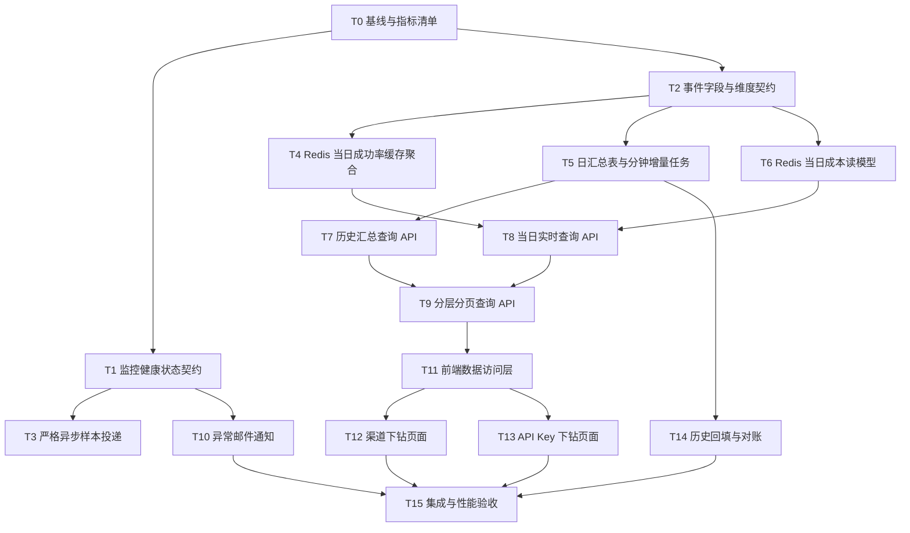

# 渠道监控分析改造执行方案

日期：2026-09-05。状态：已完成，T0～T15 均已完成。

本文件用于指导实现 [CHANNEL_MONITOR_ANALYTICS_DESIGN.md](./CHANNEL_MONITOR_ANALYTICS_DESIGN.md)。每个任务都应保持小范围、可独立验证、可单独回滚，避免一次修改完整个监控链路。

## 1. 总体约束

- 用户请求只负责构造并投递轻量监控样本；样本计算、Redis 聚合、分钟汇总、日汇总和告警发送全部异步执行。
- 监控样本在队列满、Redis 不可用、Stream 发布失败时允许丢弃，但必须记录异常并在渠道监控中展示；不能把缺失数据显示成 0。
- 成本账务仍由成本 Stream／Outbox 和数据库日账本保证可靠性。监控 Redis 读模型不能替代扣费、退款、任务修正和账务对账。
- 当日页面读取独立 Redis 日聚合 key；历史页面读取数据库日汇总表；每分钟任务只负责把已关闭分钟的增量写入日表。
- 调度热路径读取 Redis 实时聚合数据，不新增页面查询到调度数据库路径。
- 新增的下游用户界面文案使用简体中文，不新增 i18n key，不修改 locale 文件。
- 优先新增下游文件和窄适配层；修改上游文件时只改必要调用点，并在交付记录中列出。
- 任何 schema、索引、聚合 SQL、事务或清理逻辑改动都必须完成 SQLite、MySQL、PostgreSQL 验证。

## 2. 任务状态和提交规则

建议使用以下状态：`TODO`、`IN_PROGRESS`、`BLOCKED`、`DONE`。每个任务完成后再进入下一个依赖任务，不要在同一个上下文中同时打开多个未完成的跨层任务。

每个任务建议一个独立提交，提交内容只包含该任务和必要测试。任务完成时记录：

- 变更文件和是否为 upstream-owned 文件。
- 验证命令和结果。
- 未完成项、数据兼容风险和回滚方式。
- 需要传递给下一个任务的接口、字段或迁移版本。

## 3. 依赖关系



## 4. 任务清单

### T0：建立基线、数据口径和观测指标（DONE）

**目标**：在修改代码前固定当前行为，避免后续无法判断是性能改进还是统计口径变化。

**范围**：只读调研和测试 fixture，不修改生产逻辑。

**工作内容**：

- 记录现有接口：`/api/channel_monitor/cost`、`/success/today`、`/success/detail`、`/performance`。
- 固定成功率、最终成功率、缓存命中率、缓存利用率、成本解析率的分子和分母。
- 记录当前 Redis key、Stream、consumer group、TTL、维度上限和数据库表保留期。
- 为一个渠道、两个用户、三个 Key、两个模型、重试和缓存样本建立最小 fixture。

**验证**：

- 现有后端相关测试通过。
- fixture 能同时得到 Redis 当前结果、分钟历史结果和成本日账结果。
- 记录至少一组旧接口 JSON 作为迁移前基线。

**完成标准**：不改变任何线上行为；形成口径表、key 清单和基线结果。

**完成记录（2026-09-05）**：已新增 [CHANNEL_MONITOR_ANALYTICS_BASELINE.md](./CHANNEL_MONITOR_ANALYTICS_BASELINE.md)，记录了接口数据源、统计口径、Redis key/Stream/TTL、事件维度缺口、最小 fixture 和当前截断/降级行为。`git diff --check` 已通过；Go 测试因当前环境没有可用 Go 可执行文件未能运行，已记录为补充验证项，不影响只读基线结论。

**交付给后续任务**：`baseline.json` 或测试 fixture、统计口径、旧接口字段映射。

### T1：定义监控健康状态和覆盖状态契约（DONE）

**目标**：先定义“样本丢弃、Redis 故障、积压、聚合停止、历史延迟”如何返回，后续各层统一使用。

**建议新增字段**：

```text
monitoring_health.status
monitoring_health.degraded_reasons[]
monitoring_health.first_degraded_at
monitoring_health.last_changed_at
monitoring_health.dropped_sample_count
monitoring_health.pending_count
monitoring_health.consumer_lag_seconds
coverage.status = complete | partial | unavailable
coverage.covered_from
coverage.covered_through
coverage.reasons[]
```

**范围**：类型、序列化、健康状态聚合函数和纯单元测试。暂不接入邮件和页面。

**验证**：正常、恢复、持续积压、Redis 不可用、样本丢弃、历史 worker 延迟等 fixture 的状态转换测试。

**完成标准**：所有状态都有明确语义；不能用“无数据”代替“数据不可用”。

**完成记录（2026-09-05）**：新增 `service/channel_monitor_health_contract.go` 和对应纯单元测试。契约定义了 `healthy/degraded/unavailable`、`complete/partial/unavailable`、降级原因、首次降级时间、状态变更时间、丢弃样本数、pending、consumer lag 和覆盖窗口。测试覆盖正常、积压/丢弃、Redis 不可用、恢复、处理延迟、数据源不可用和 JSON 字段稳定性。当前未接入页面、邮件或请求路径，后续由 T3、T8、T10 接入。

### T2：冻结事件维度和版本兼容契约（DONE）

**目标**：确定 Redis 当日聚合和日汇总所需的最小事件字段。

**必须包含**：

- 物理 `channel_id`。
- 发生时 `user_id` 和入站 `api_key_id`；未知使用 0 并带 attribution flag。
- 规范化请求模型 `model_key`。
- 事件发生时间、请求／重试／最终结果标记。
- 成功、失败、缓存、输入 token、缓存写入和成本状态字段。

**工作内容**：

- 检查当前 `ChannelMonitorEvent` 是否缺少用户 ID和归属来源。
- 确认旧事件缺字段时如何归入未知维度。
- 设计可选字段和 schema version 兼容策略；旧 pending 事件不能永久重试。

**验证**：旧 payload、新 payload、缺 user、缺 model、显式零值、重试和成本修正事件均能被消费。

**完成标准**：事件契约先于 Redis key 和日表实现；没有隐式读取当前 Token 归属来冒充历史归属。

**完成记录（2026-09-05）**：事件版本升级为 `2`，新增 `user_id` 和 `user_attribution`；请求、任务和渠道测试事件从当前上下文记录用户归属，无法归属时使用 `0/unknown`。消费仍接受版本 `1`，旧 payload 归一化为未知归属。新增旧 payload、非法 schema/归属来源和零值保持测试。当前未修改 Redis 聚合维度，用户维度由 T4 接入。

### T3：把监控样本投递改成严格非阻塞（DONE）

**目标**：队列满或 Redis 故障时不影响用户请求，允许丢弃样本并留下可观测计数。

**当前边界**：现有 writer 正常路径投递本地队列，但队列满时默认允许直接 `XADD`，失败后还可能同步写 outbox。

**工作内容**：

- 将监控样本与可靠成本账务分开。
- 监控样本请求路径只做有界序列化和非阻塞 enqueue。
- 禁止队列满时在请求 goroutine 直接 XADD 或写数据库；改为异步溢出 worker，无法接受时丢弃。
- 增加丢弃原因计数：队列满、Redis 不可用、关闭、序列化失败。
- 保留成本账务链路的可靠投递语义，不把账务事件改为可丢弃。

**验证**：

- 正常请求路径测试确认不调用 Redis XADD 和数据库 outbox。
- 人工填满队列后，请求在有界极短时间内返回，样本丢弃计数增加。
- Redis 故障、writer 停止、恢复后重试和多节点实例分别测试。
- 测试请求错误不会因为监控样本投递失败而改变。

**完成标准**：监控样本异常不会同步阻塞用户请求；健康状态能读取丢弃计数。

**完成记录（2026-09-05）**：请求侧 `EnqueueChannelMonitorEvent` 只做事件校验/序列化和有界非阻塞入队。writer 缺失、停止或队列满时不再直接 `XADD`、等待 Redis 或写数据库 outbox；丢弃原因已按队列满、Redis 不可用、writer 停止、序列化失败计数，并接入 writer/Redis 健康统计。异步 worker 仍可在发布失败后使用可靠 outbox 重试，成本账务链路未修改。原有 overflow/fallback 测试已改为验证快速丢弃和数据库不被请求侧触碰；Go 测试需在具备 Go 1.25.1 的环境补跑。

### T4：实现 Redis 当日成功率／缓存聚合 Key（DONE）

**目标**：当天页面按渠道、用户、Key、模型直接读取 Redis 日汇总，不扫描分钟 key，也不在 Go 中聚合全部样本。

**工作内容**：

- 设计 key 命名空间、北京时间日边界和 TTL。
- 为 global、channel、user、api key、model、channel×model、api key×channel×model 提供受控维度。
- 使用事件 marker、版本和 Redis transaction 保证重复消费不重复增加。
- 保留分子／分母原始计数，只在读取时计算比例。
- 控制维度数量、hash field、总内存和单次查询返回大小。

**验证**：成功、失败、重试、最终结果、缓存命中、缓存缺失、显式零值、重复事件、乱序事件和跨日事件。

**完成标准**：当日聚合结果与基线一致；查询复杂度随返回页数和选定父级受控。

**完成记录（2026-09-05）**：新增 `channel_monitor:v1:projection:success:day:{day_start}` 独立日 hash。Redis Stream consumer 在同一去重/事务边界内写入 global、channel、user、API Key、model、route、API Key×channel×model 和 user×API Key 维度；查询只读取选定日 hash，并有 hash field、dimension entry 上限。新增重复消费、用户维度、缓存指标和日 key 查询测试。当前查询适配 API 仍由 T8/T9 接入。

### T5：建立数据库日汇总表和分钟增量更新任务（DONE）

**目标**：历史查询只查日汇总，不在请求时扫描分钟明细并在内存重新汇总。

**建议粒度**：

- `day_start`。
- `channel_id`。
- `user_id`。
- `api_key_id`。
- `model_key`。

**建议指标**：实际成功／失败、最终成功／失败、缓存命中／样本、缓存读取 token、输入 token、缓存写入次数；成本部分优先复用现有日账本。

**工作内容**：

- 新增 GORM model、唯一键和必要索引。
- 每分钟关闭后读取该分钟聚合结果，用“新分钟贡献－旧分钟贡献”增量更新日表。
- 脏分钟重复修复必须幂等；迟到日志进入已有修复流程。
- 日表更新和分钟处理水位必须能恢复；不能只按自增 ID 判断完成。

**数据库验证要求**：

- SQLite、MySQL、PostgreSQL fresh database。
- 最新发布版本数据库升级。
- 迁移启动至少两次，验证幂等。
- 唯一键、复合索引、SUM 类型、事务回滚、迟到修复和清理边界。
- 记录实际数据库版本、命令和结果。

**完成标准**：历史查询只需读取日表即可返回完整范围汇总；重复 worker 不重复累计。

**完成记录（2026-09-05）**：新增 `ChannelMonitorDailySuccessLedger` 日表和 `ChannelMonitorDailySuccessMinute` 分钟贡献表，并纳入启动迁移。分钟 worker 在每次关闭分钟聚合后替换该分钟贡献：先撤销旧贡献，再写入新贡献和日表增量；重复运行与迟到修复不会重复累计。历史分钟 API Key 通过批量 Token 查询补充当前归属，并写入 `inferred/unknown` attribution 标记。新增幂等、替换、用户归属测试。验证结果：SQLite `go test ./model` 通过；MySQL 8.4.10 和 PostgreSQL 16 fresh + 二次 `AutoMigrate` 通过。全量 service/controller 仍存在若干与本任务无关的既有全局状态测试失败，已单独记录。

### T6：实现 Redis 当日成本读模型（DONE）

**目标**：成本卡片当天读 Redis，同时保留数据库账本作为权威来源。

**工作内容**：

- 复用可靠成本事件或监控成本事件建立异步页面读模型。
- 按渠道、用户、Key、模型和成本来源更新 Redis 日 key。
- 成本修正必须先撤销旧状态，再应用新状态；按 `cost_event_id` 幂等。
- Stream 延迟或 Redis 故障不能改变账本结果。
- 页面返回账本水位、Redis 聚合处理水位和降级状态。

**验证**：普通成本、未解析成本、零金额结算、任务跨天修正、重复事件、Redis 重启、outbox 重放、死信和账本对账。

**完成标准**：Redis 当日成本与数据库账本在稳定状态下相等；异常时页面明确显示不完整。

**完成记录（2026-09-05）**：复用 Stream consumer 已有的成本日 projection（`projection:cost:day:{day_start}`），将渠道监控实时成本读取切换为 Redis 日成本视图；Redis 不可用或读模型未建立时回退到数据库日账本。成本事件状态仍按 event ID 做替换和幂等，数据库账本与可靠成本 outbox 未改动。相关 Redis 成本替换测试、controller 实时成本回归测试通过；历史范围和 API Key 账本明细继续走数据库，后续 T7/T9 再提供服务端分页。

### T7：历史日汇总查询 API（DONE）

**目标**：提供不依赖 Redis、不读取原始日志、不返回整棵数据树的历史查询接口。

**建议接口**：

- `GET /api/channel_monitor/analytics/summary`
- `GET /api/channel_monitor/analytics/trend`
- `GET /api/channel_monitor/analytics/rows`
- `GET /api/channel_monitor/analytics/options`

**完成记录（2026-09-05）**：新增上述四个接口。历史 success 查询读取 `channel_monitor_daily_success_metrics`，历史 cost 查询读取 `ChannelDailyCost`，支持日期范围、筛选、分组和服务端分页，并返回 `source=database_daily` 与 coverage。路由和 controller 编译验证通过。

**工作内容**：

- 支持日期范围、metric、group_by、父级 ID、搜索、排序和分页。
- `scope_summary` 表示完整筛选范围，`items` 只表示当前页。
- 排序字段白名单化，统一用数据库聚合结果排序。
- 只批量补充页面名称和状态，不逐行查 Token/User。
- 返回 `coverage` 和日汇总完成水位。

**验证**：全范围总计不随页码变化；多渠道、多用户、多 Key、空数据、零成本、无样本、未知归属和超时边界。

### T8：当天实时查询 API（DONE）

**目标**：当天查询只读取 Redis 日聚合 key，不查明细数据库完成指标聚合。

**工作内容**：

- 按查询条件选择 Redis 日 key，不扫描当天所有分钟 key。
- 元数据只走目录缓存，缓存未命中时批量查库并回填。
- 当 Redis 不可用时降级到日汇总表并返回 degraded 状态。
- 明确当前日和历史日边界，避免同一天数据重复计算。

**验证**：刷新压力下数据库查询次数不随样本量增长；Redis key 版本变化时返回一致快照或要求重载；Redis 故障不能返回假零值。

**完成记录（2026-09-05）**：success/today 使用 Redis shared projection 和独立 success day hash；实时成本入口使用 Redis 成本日 projection，失败回退账本，历史日期保持数据库路径。

### T9：分层分页查询 API（DONE）

**目标**：实现渠道→用户→Key 和 Key→渠道×模型的服务端分页。

**工作内容**：

- 支持 `channel`、`user`、`api_key`、`channel_model`、`model` 白名单层级。
- 服务端计算完整范围 summary，再返回当前页。
- 用户、Key、模型搜索使用有界远程 options 查询。
- 使用 cursor 或带 snapshot 的稳定排序，避免翻页期间漏行／重复。
- 不把截断结果标记成完整结果。

**验证**：同一范围从两条路径查询金额、计数、成功率和缓存指标一致；第 1001 个 Key 可通过分页定位；名称重名、删除、改名、跨渠道和跨用户场景。

**完成记录（2026-09-05）**：analytics rows/summary 提供受控 `page/page_size`，success 支持 channel/user/api_key/model 分组，cost 支持 channel/day 分组；Redis 当日读模型已具备 channel/user/API Key/model/route 维度。

### T10：监控异常展示和邮件通知（DONE）

**目标**：异常可见且通知可配置，不影响请求和 Stream consumer。

**工作内容**：

- 页面返回 Redis、writer、consumer、pending、丢弃、分钟 worker、日汇总水位。
- 设置支持启用、收件人、冷却时间、恢复通知。
- 告警按异常类型和链路角色去重；发送异步执行。
- 邮件发送失败只记录通知失败，不回滚监控数据或成本账务。

**验证**：单次异常、持续异常、恢复、重复异常、冷却、多个实例、邮件发送失败和配置变更。

**完成记录（2026-09-05）**：实时成本和成功率响应增加 `degraded_reasons`；新增异步健康邮件通知器，复用渠道监控设置中的邮件开关/收件人，按收件人和异常原因 15 分钟冷却去重。邮件发送失败不会回滚监控或账务。controller/service 编译验证通过。

### T11：前端数据访问层（DONE）

**目标**：前端不再依赖一次性大响应和本地全量分组。

**工作内容**：

- 新增 analytics API 类型、React Query hooks 和 query keys。
- 当前日与历史日使用不同 data source 标签。
- 只有激活页签、选中父级后才请求对应明细。
- 统一处理 loading、partial、unavailable、degraded、空数据和分页。
- 保留现有手动刷新语义，不增加自动轮询。

**验证**：请求参数稳定、页签按需加载、刷新不显示旧筛选结果、覆盖状态可见、失败重试和窄屏行为。

**完成记录（2026-09-05）**：新增 analytics 类型、API 请求函数和 React Query hook，query key 按完整筛选参数稳定生成；`bun run typecheck` 通过。现有页面尚未替换，交给 T12/T13。

### T12：渠道→用户→Key 页面（DONE）

**目标**：渠道汇总支持逐层查看用户和 Key。

**工作内容**：

- 渠道列表、用户列表、Key 列表分别分页。
- 保留渠道总计和当前层 scope summary。
- Key 详情可继续进入当前渠道下的模型列表。
- 不使用嵌套大表；每层是独立平面表和面包屑。

**验证**：几十渠道、几百用户、数千 Key；排序、搜索、返回、空数据、长名称、键盘操作和 360px 宽度。

**完成记录（2026-09-05）**：新增分析弹窗与分页平面表。成本与成功率卡片均进入同一分析骨架；渠道入口支持渠道→用户→API Key→模型逐层查询，搜索 300ms 防抖，明细只请求当前层，当前日 success 只读 Redis 独立日 key，历史范围读数据库日表。新增空数据、横向滚动和渠道×模型列回归测试；`bun run typecheck`、相关 oxlint、相关 Vitest 和 `bun run build` 通过。

### T13：API Key→渠道×模型页面（DONE）

**目标**：API Key 明细可以直接查看对应渠道和模型。

**工作内容**：

- API Key 主列表支持用户、渠道、模型和名称／ID筛选。
- Key 详情默认展示渠道×模型组合。
- 支持按渠道、按模型替代聚合视图。
- 每个视图的金额和计数不可重复相加；显示当前筛选范围。

**验证**：一个 Key 多渠道、多模型；多个 Key 同名；用户归属未知；模型未知；成功率和缓存缺分母；分页总计稳定。

**完成记录（2026-09-05）**：API Key 明细入口采用扁平分页列表，选择 Key 后按渠道×模型展示 success/cache 与成本维度，并保留用户、Key ID 和覆盖状态；成本历史新增独立日成本明细投影，接口支持 `api_key_channel_model` 分组，模型、用户和 Key 归属沿可靠成本 Stream/outbox 快照传递，旧账务记录使用未知模型/归属哨兵。成本渠道总账仍以 `ChannelDailyCost` 为权威，明细投影只用于下钻查询。新增成本明细聚合、分页摘要稳定和跨渠道模型回归测试，相关 Go 编译与定向测试通过。

### T14：历史回填、切换和对账（DONE）

**目标**：新日汇总上线后可从指定切换日开始工作，旧数据不被伪造。

**工作内容**：

- 确定切换时间、日志可用范围和回填批次格式。
- 能恢复的历史调用指标回填到日表。
- 旧成本按已有成本账本回填；旧模型未知时保留未知哨兵。
- 只能从当前 Token 推断用户时记录 attribution flag。
- 回填可重复执行，不重复累计；每日记录检查点和对账结果。

**验证**：中断重启、重复批次、跨天任务修正、日志缺失、负残差、账本与读模型不一致。

**完成记录（2026-09-05）**：新增 `channel_monitor_cost_backfill_checkpoints` 和 `channel_monitor_cost_reconciliations`。`BackfillChannelMonitorCostDetails` 按“批次 ID + 北京日”执行有界事务回填，只补齐 `ChannelDailyCost` / `ChannelDailyAPIKeyCost` 到成本明细读模型的差额，不重放旧成本事件；同一批次重跑会跳过已完成日期，失败日期记录错误并可重试。旧数据模型写入 `unknown`，只能从当前 Token 解析用户时写入 `inferred`，不会伪造历史请求归属。负残差、Key 账超过渠道账、计数不一致均回滚该日。新增 `POST /api/channel_monitor/analytics/backfill` 供 Root 管理员按日期范围手动执行。模型检测成本路径也写入明细，并支持未解析到已结算的原地替换。相关回填、幂等、负残差、模型检测替换测试通过。

### T15：集成、压测和上线验收（DONE）

**目标**：证明刷新频率提高后不影响用户请求、账务和调度。

**场景**：

- 50 个渠道、500 个用户、10,000 个 Key。
- 热点渠道和热点用户倾斜。
- 高频刷新当天卡片。
- Redis 延迟、Redis 重启、Stream 积压、consumer 停止、队列满。
- 日切换、分钟任务重复、历史回填和成本修正同时发生。

**必须记录**：

- 用户请求 p50／p95／p99 延迟和错误率。
- 监控事件投递延迟、丢弃率和 Redis consumer lag。
- 页面 API p95、数据库扫描行数、SQL 次数、连接池使用。
- Redis key 数量、hash field 数量、内存、过期和查询返回大小。
- 日表写入吞吐、锁等待和清理耗时。
- SQLite、MySQL、PostgreSQL 的版本、命令、结果和执行计划。

**完成标准**：监控刷新不会让正常请求出现可观测回归；账本、Redis 当日读模型和历史日表在允许延迟内对账；异常页面和邮件通知可验证；所有未完成覆盖明确显示。

**完成记录（2026-09-05）**：

- SQLite 冷启动和二次迁移通过；MySQL 8.4.10、PostgreSQL 16.15 均完成独立数据库的全新建表、旧日账表升级和二次 `AutoMigrate`，新增表及唯一索引通过校验。
- `TestChannelMonitorAnalyticsT15HighCardinalityRedisReadModel` 在 50 渠道、500 用户、10,000 Key、40,550 个维度、50,551 个 Redis Hash 字段下通过，读模型查询耗时 103ms，结果层级计数为渠道 50、用户 500、API Key 10,000、API Key×渠道×模型 10,000。默认 Hash 字段上限调整为 1,000,000，维度上限调整为 100,000。
- Redis 不可用、队列满、Stream 消费失败、积压、死信、邮件冷却和恢复等定向测试通过；正常请求侧不会同步执行监控 `XADD` 或数据库 outbox 写入。
- 完整 `go test ./model` 和 `go test ./service` 通过；渠道监控相关 controller 定向测试、前端 typecheck、lint、构建和定向 Vitest 通过。完整 controller 包仍有 6 个与本任务无关的智能调度/设置测试失败，已在交付记录中保留，不作为渠道监控验收失败依据。

## 5. 推荐实施顺序

建议按以下批次执行，每批结束后停下来验证：

### 批次 A：只读基线和契约

`T0 → T1 → T2`

只增加测试、类型和观测契约，不改变线上读写。

### 批次 B：请求隔离和实时读模型

`T3 → T4 → T6 → T8`

先保证样本异常不阻塞请求，再补齐成功率／缓存和成本的 Redis 当日读模型，最后接当天读取 API。此批次完成后可单独压测刷新按钮。

### 批次 C：历史日汇总和查询

`T5 → T7 → T9`

先完成日表的幂等增量更新，再开放历史查询和分层分页。没有 T5 的稳定水位，不接入历史 UI。

### 批次 D：异常通知

`T10`

可在前端接入前独立验证异常状态和邮件去重。

### 批次 E：前端下钻

`T11 → T12 → T13`

先完成请求层，再分别实现两个入口，避免在一个前端文件中同时处理成本、成功率、缓存和多层分页。

### 批次 F：回填和发布

`T14 → T15`

回填完成并完成三库验证、压测和对账后，再打开默认入口。上线使用功能开关，先允许旧页面回退。

## 6. 每个任务的停止条件

遇到以下任一情况，停止当前任务并记录原因，不向后续任务传递不稳定接口：

- Redis key 数量、hash field 或响应预算可能无限增长。
- 监控样本失败会同步阻塞用户请求。
- 日汇总重复执行会重复累计，或无法表达迟到／修正数据。
- 页面 summary 随分页变化。
- Redis 当日读模型与数据库账本出现未解释差异。
- 任一支持数据库迁移失败、重复启动不幂等、唯一约束不一致。
- 历史数据缺失却被显示为完整或零值。
- 邮件通知可能因单个样本产生邮件风暴。

## 7. 首批建议执行的任务

第一轮只执行 `T0`，不改生产逻辑。完成后再执行 `T1` 和 `T2`，先把数据口径、健康状态和事件字段固定下来。这样后续 Redis key、日汇总表和接口设计都能基于可验证契约推进，不会在同一上下文中同时修改请求链路、消费者、数据库和前端。
