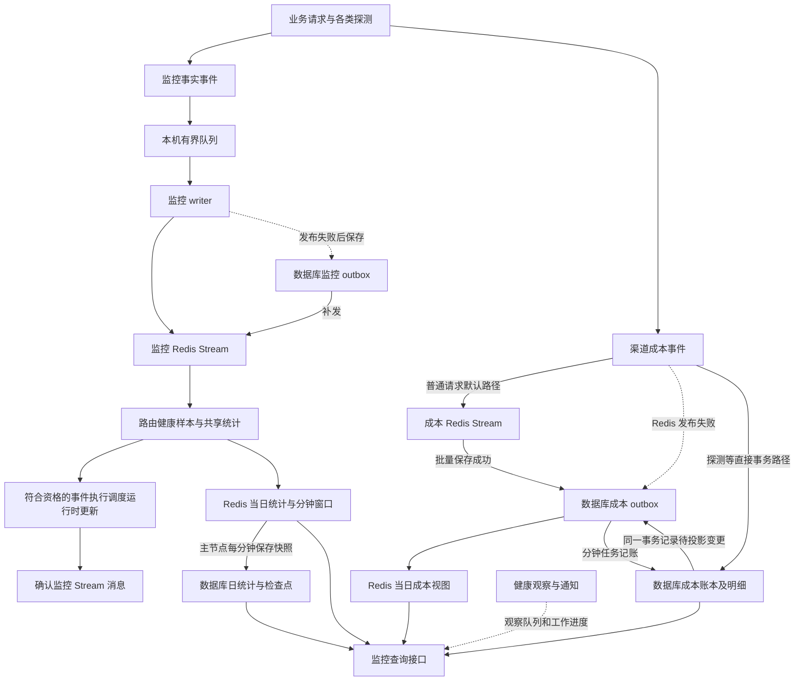

# 渠道监控当前设计与流程核对

核对日期：2026-09-14。源码基线：`611c6f394e41f26afb7367988b7012ada1a27570`。

本文保留该源码基线的现状。后续成本积压修复的实现与验证结果见 [渠道监控成本积压修复执行计划](CHANNEL_MONITOR_COST_BACKLOG_IMPLEMENTATION_PLAN.md)。

本文描述 new-api 当前下游代码中已经实现的渠道监控、成本统计、智能调度联动和后台恢复。依据为实际调用路径及本次用户提供的线上日志；未连接生产数据库，未核验生产镜像对应的完整源码版本。文中的时间、批量和超时为此源码的默认值，环境变量覆盖项单独说明。

此前根目录的设计方案和 `CHANNEL_MONITOR_DATA_FLOW.md` 记录了不同阶段的实现。本文重新核对当前代码，尤其是请求侧队列满的处理、成本即时投影、历史分析来源和恢复统计口径，不直接沿用旧方案的“当前实现”描述。

## 1. 对复杂度的判断

**当前有值得收敛的复杂度，最突出的是监控事件的确认绑定了调度写入，以及成本存在多种写入入口和两个独立的完成状态。**

可以先把整个功能理解为四件事：

1. **采集运行事实**：一次上游尝试是否成功、耗时、用量、缓存及归属。
2. **保存渠道成本**：成本事件可靠交接，更新 Redis 当日视图和数据库日账本。
3. **调整调度状态**：读取健康样本及当前配置，更新路由保护、优先级、权重等。
4. **解释运行状态**：后台观察各条链路，形成页面告警、恢复状态和邮件通知。

这四件事的可靠性要求不同。普通监控样本允许在有界队列满时丢弃并报告；成本需要保留事件身份和记账幂等；调度需要防止旧配置覆盖新配置。分开这些责任是有必要的。当前维护困难主要来自责任之间的同步等待、重复状态、历史兼容路径，以及页面用一个“待处理”数字汇总不同阶段。

本文第 2～9 节记录现状，第 10 节分析本次故障，第 11 节给出尚未实施的收敛方向。

## 2. 总体流程



图中的 `CL → CO` 只适用于直接记账、任务修正等入口；成本 outbox 的分钟记账器不会再追加一条同类 outbox，因而不是无限循环。监控链路中无需调度处理的事件，在完成统计后即可进入确认阶段。

另有配置同步、主动探测、全量智能调度等系统任务。它们使用数据库任务和执行记录，不能与上图的 Redis 待确认消息混为同一种“后台任务”。

## 3. 数据分别由谁负责

| 数据或状态 | 保存位置 | 当前责任与边界 |
| --- | --- | --- |
| 普通监控采集队列 | 每个应用进程的内存 | 解耦请求与 Redis；入队成功尚不代表持久化 |
| 监控 Stream | `channel_monitor:v1:events` | 传递监控事实，保留待确认消息和一段已确认重放尾部 |
| 监控 outbox | `ChannelMonitorEventOutbox`，主数据库 | 保存后台 writer 发布失败的事件，之后补发 Stream；不是所有监控事件的永久明细库 |
| 路由健康样本 | Redis 路由窗口 | 为限流、熔断、稳定性及池级刷新提供近期样本 |
| 成功率、缓存、性能视图 | Redis 当日及分钟维度 | 用于当日和近期查询；业务日统计按事件来源、尝试/最终结果分别计数 |
| 成功率历史 | `ChannelMonitorDailySuccessLedger`、`ChannelMonitorDailyCheckpoint` | 保存日维度累计快照和覆盖水位；旧分钟聚合路径仍有兼容用途 |
| 普通成本可靠缓冲 | `channel_cost:v1:events` | 普通请求先发布成本事件，消费者交接给主数据库 |
| 成本 outbox | `ChannelDailyCostOutbox`，主数据库 | 兼任事件去重记录、待记账队列、待 Redis 投影队列 |
| 渠道日成本总账 | `ChannelDailyCost` | 日 × 渠道的持久化成本总额及分类；金额使用 `int64` 纳元 |
| Key 日成本 | `ChannelDailyAPIKeyCost` | 日 × 渠道 × Key 指纹，保留 API Key 归属信息 |
| 成本分析明细 | `ChannelMonitorDailyCostDetail` | 日 × 渠道 × 用户 × API Key × 模型 × 来源，支持下钻和归属核对 |
| 当日成本及事件版本 | Redis 成本日 Hash 及其 `:events` Hash | 从可靠成本记录投影；允许先于分钟账本更新，用事件身份和版本避免重复计算 |
| 任务成本状态 | `ChannelTaskCostEvent` | 保存任务当前成本、原始日期、投影版本，支持后续修正 |
| 调度配置与可写状态 | 主数据库 | 当前路由状态、经济参数及版本校验的依据 |
| 已发布选路视图 | Redis 路由快照及本机缓存 | 供实际选路和调度展示读取；发布可以晚于数据库更新 |
| 恢复状态 | 本机快照及按节点保存的 Redis 状态 | 记录本节点观察到的运行状态、历史缺口、恢复时间和通知进度 |

当日边界由 `ChannelDailyCostDayStart()` 统一计算，为北京时间自然日。近期性能窗口与自然日累计是不同口径。

渠道成本统计与用户钱包扣费是不同责任。本文追踪的 outbox 超时不能直接等同于用户扣费失败、重复扣费或退款异常。

## 4. 普通监控事件链路

### 4.1 请求侧采集

入口包括 `EmitChannelMonitorSuccessEvent()`、`EmitChannelMonitorFailureEvent()` 和探测专用事件入口。事件携带渠道、用户、API Key、模型、分组、来源、尝试结果、最终结果、性能和用量等信息。

`EnqueueChannelMonitorEvent()` 在请求侧克隆、校验、序列化，再非阻塞入队：

- 默认容量 8192，默认 writer 数 1；分别可通过 `CHANNEL_MONITOR_EVENT_WRITER_QUEUE_CAPACITY`、`CHANNEL_MONITOR_EVENT_WRITER_WORKERS` 配置。
- **队列满时直接报告丢弃，不在这个入口同步写 Redis 或数据库兜底。** 不能把后台 writer 的持久化补偿解释为“请求入队永不丢失”。
- writer 未启动、已经停止、事件序列化失败，也会返回对应失败状态并计数。
- 进程内已入队数据仍有非持久化窗口。优雅停机有排空/补偿逻辑，强制退出不能视为同等保证。

### 4.2 writer 发布与数据库补发

后台 writer 将队列中的事件发布到监控 Stream。普通发布使用 2 秒上下文超时；最多尝试 3 次，尝试间隔 100 毫秒。

发布持续失败后，writer 尝试将事件存入监控 outbox。此补偿等待默认 250 毫秒，并发槽位 16。只要配置了数据库句柄，当前 `persistOverflowEnabled()` 就启用这个后台持久化尝试；同名历史配置字段不能理解为关闭它的有效开关。数据库不可用或补偿失败时仍会报告样本丢弃。

补发 worker 每批领取最多 100 条，租约 30 秒。领取到记录后按 500 毫秒节奏继续；没有领取到记录时按 1、2、4、5 秒退避，之后维持 5 秒。本机新记录提交会唤醒扫描，跨进程写入依靠周期扫描发现。发布成功后标记 outbox 完成；标记失败可以再次补发，后续统计通过事件身份去重。

### 4.3 消费、统计与确认

监控消费组是 `channel_monitor:v1:aggregators`。默认每批最多读取 100 条，优先处理 pending，并用 `XAUTOCLAIM` 接管空闲至少 30 秒的记录。

跨实例由 Redis 聚合租约协调，默认租约 15 秒、每 5 秒续约；这不是简单地给每个应用副本各开一个完全独立的聚合器。处理器内部可按渠道分区并发，默认仍是 1 个 worker；`CHANNEL_MONITOR_REDIS_CONSUMER_WORKERS` 可配置，当前最大 32。

生产聚合器的实际顺序是：

```text
路由健康样本写入 Redis
  → 共享统计写入 Redis
  → 对 SchedulingEligible 事件执行调度运行时更新
  → 处理成功后写完成标记并 XACK
```

每次分区处理调用默认有 3 秒上下文期限，可通过 `CHANNEL_MONITOR_REDIS_HANDLER_TIMEOUT_MS` 调整，并受租约时长约束。它覆盖上述组合处理，不能当成每个步骤都独享 3 秒。

这里存在直接耦合：**调度软刷新失败会让相关监控消息继续 pending，即使前面的统计已经成功。** 重放依靠各阶段的幂等标记跳过已完成部分。这也解释了为什么“待确认”不能直接解释为“统计完全没处理”。

生产构造器没有安装可选的全量调度触发回调。请求事件会参与运行时保护和池级刷新，不能描述成“每个请求触发一次全量智能调度”。

### 4.4 重试和隔离

| 失败类型 | 当前处理 |
| --- | --- |
| 可恢复配置冲突、上下文超时、网络故障、Redis 连接池等待超时、所有权竞争等 | 保留 pending，继续重试；不消耗坏消息隔离次数 |
| 不合法事件或 payload | 写隔离记录，再确认对应原消息 |
| 其他处理错误 | 累积失败次数，默认达到 20 次后单条复核；仍失败且不属于可恢复错误时隔离 |
| 消费者退出 | 外层 runtime 重新初始化并重启消费，使用退避等待 |

默认连续 pending 失败重试达到 3 轮后给新消息一次读取机会，避免一条坏记录无限占住新流量；失败 pending 仍保留。这个调度公平性机制不等于超时事务拆批，也不保证积压消化速度高于新事件产生速度。

监控 Stream 依据各消费组的安全水位裁剪，额外默认保留 600 秒已确认尾部用于恢复。`CHANNEL_MONITOR_REPLAY_RETENTION_SECONDS` 当前限制在 120～86400 秒。它不是永久事件仓库。

代码依据：[事件 writer](service/channel_monitor_event_writer.go)、[发布器](service/channel_monitor_event_publisher.go)、[消费者](service/channel_monitor_redis_consumer.go)、[组合聚合器](service/channel_monitor_redis_aggregator.go)、[可恢复错误分类](service/channel_monitor_redis_retry.go)。

## 5. 渠道成本链路

### 5.1 普通业务请求的默认路径

可靠成本入口默认开启，开关为 `CHANNEL_DAILY_COST_RELIABLE_OUTBOX`。成本值及来源在业务结算路径生成，outbox 负责传输、去重和持久化，不重新执行用户计费公式。

```text
生成并校验 ChannelDailyCostDelta，带稳定 EventId
  → 尝试 XADD 到 channel_cost:v1:events，超时 250 毫秒
  → Redis 发布失败时，尝试写数据库成本 outbox，超时 750 毫秒
  → 两者都失败时记录未接受该成本事件
```

这个入口可以等待 Redis/数据库，与普通监控事实的非阻塞内存入队不同。Redis 接受事件后的抗重启能力还取决于实际 Redis 持久化和部署方式；没有核验生产配置时，不能承诺任何故障下都不丢。

### 5.2 成本 Stream 消费：交接成功即可确认

消费组是 `channel-cost-ledger-v1`，每批最多 256 条。使用 pending 领取、当前消费者 pending 重读和新消息读取；空闲接管阈值 30 秒。

每批依次执行：

1. 校验事件；无效数据或相同 EventId 对应不同内容的碰撞会单独隔离。
2. 通过 `StoreChannelDailyCostOutboxEventsWithRecords()` 将合法事件保存到主数据库，返回已经提交的记录和持久化 ID。
3. 使用返回记录立即更新 Redis 当日成本，不等待补偿扫描。
4. Redis 投影成功后更新 `redis_projected_at`。投影失败时保留数据库记录待补偿。
5. 只要完成数据库交接，即可对原成本消息执行 `XACK + XDEL`；不等待分钟账本完成。即时投影失败也不会撤销已成功的数据库交接。

因此，成本 Stream 已清空只能证明这部分消息完成了交接或隔离，不能证明日账本已全部更新。

### 5.3 同一张成本 outbox 有两个完成状态

| `processed_at` | `redis_projected_at` | 实际含义 |
| --- | --- | --- |
| 0 | 0 | 已存库，等待账本和 Redis 投影 |
| 0 | 大于 0 | Redis 当日成本已经更新，数据库日账本仍待处理 |
| 大于 0 | 0 | 日账本已经更新，Redis 投影待补偿；直接记账入口也会生成这种记录 |
| 大于 0 | 大于 0 | 两项均完成，保留记录用于去重、重建等 |

“已保存”“已投影”“已记账”是三个不同阶段。监控页面的“待记入成本账本”统计的是 `processed_at = 0`，不能根据它推断 Redis 当日成本同样滞后。

### 5.4 分钟记账器

`runDBRecovery()` 启动后先执行一轮，之后使用 1 分钟 ticker。每轮保存本轮开始时间作为候选记录截止时间；在没有候选、遇到错误或批次间检查到本轮耗时达到 45 秒时结束。

**每分钟一轮不等于每分钟最多 256 条。** 正常时一轮可以连续处理多批。45 秒是在批次之间检查的工作预算，不能当成每个数据库调用的强制终止时刻。

每批最多领取 256 条，租约 30 秒。领取和记账分别创建 3 秒上下文；记账事务执行：

```text
锁定仍由本 worker 持有且尚未完成的 outbox 行
  → 按渠道、日期合并更新 ChannelDailyCost
  → 对有 Key 指纹的事件逐条更新 ChannelDailyAPIKeyCost
  → 明细表存在时逐条更新 ChannelMonitorDailyCostDetail
  → 同一事务设置 outbox.processed_at，释放租约
  → 提交
```

总账、Key 汇总、明细和完成标记在一个事务中。中途失败时不能把已经执行过的前半批 SQL 当成已记账；在正常事务回滚语义下整批撤销，事件仍待重试。

当前普通超时错误会释放本批租约、记录错误和下次可尝试时间，并结束本轮。失败重试按尝试次数指数退避；当前移位公式实际封顶 256 秒，之后还受分钟扫描节奏影响。代码另有 5 分钟上限，但当前公式不会达到 300 秒。

**当前没有为超时自动缩小批次的逻辑。** 多条记录遇到已识别的账本溢出错误时有逐条隔离处理，不能把这条特殊路径描述成一般超时恢复能力。下一轮受截止时间、重试时间和租约筛选，未必领取完全相同的一批记录。

### 5.5 Redis 成本补偿与重建

成本投影 worker 每秒检查 Redis 版本、跨日和状态；数据库补偿正常每 5 秒扫描一次，遇到失败或仍有积压则下一次秒级检查继续。每批最多 256 条，补偿循环在批次之间检查约 2 秒工作预算。

Redis 投影按成本事件身份及 outbox ID 版本去重。任务成本修正保留稳定身份，新版本替换旧金额，不能把修正事件简单重复相加。

重建日成本视图时，从一致的数据库快照读取已记账成本、outbox 和任务成本版本，再补入尚未记账的尾部。因此即使数据库分钟记账有延迟，重建也要保留已被可靠接收的当日成本，避免重建后金额暂时倒退或重复累计。

补投影只处理昨日及之后的记录；更早的成本继续通过日账本保留，不为每条旧消息重新创建已经过期的 Redis 日期。Redis 成本日视图、事件版本 Hash 等当前使用 48 小时 TTL。

### 5.6 仍然存在的其他成本入口

| 入口 | 当前行为 |
| --- | --- |
| 状态探测、分组探测 | `recordChannelDailyCostEvent()` 选择同步成本写入；在同一数据库事务内追加已经记账、待投影的 outbox 记录 |
| 模型检测 | 保留专用成本结算和分类入口，向日账本和 Redis 投影传递检测成本 |
| 异步任务初始成本及后续修正 | 通过任务成本事务更新账本及任务版本，追加待投影记录 |
| 可靠生产入口关闭或未激活 | 保留旧内存 batcher；按旧直接写入方式运行，不具有普通可靠成本 EventId outbox 的同等幂等边界 |

旧 batcher 的默认参数是 4096 个待处理聚合项、256 项一批、1 秒刷新、每次数据库写入 2 秒期限及最多 3 次尝试。它还服务于部分同步写入，不能仅按“旧代码”判断当前不会运行。关闭可靠生产入口也不会停止排空此前已经接受的可靠成本事件。

普通监控事件也携带成本状态，保留近期窗口成本及兼容投影逻辑。在可靠成本日视图已建立数据库快照标记后，共享监控投影会跳过该日成本累加；正式当日成本查询要求可靠投影版本。不能把两条流的金额直接相加。

代码依据：[成本入口](service/channel_daily_cost.go)、[可靠成本 runtime](service/channel_daily_cost_outbox.go)、[成本 outbox 模型](model/channel_daily_cost_outbox.go)、[账本写入](model/channel_daily_api_key_cost.go)、[成本分析明细](model/channel_monitor_daily_cost_detail.go)、[即时投影与补偿](service/channel_daily_cost_projection.go)、[可靠成本重建](service/channel_monitor_reliable_cost_projection.go)、[直接记账投影](model/channel_daily_cost_projection.go)、[任务成本](model/channel_task_cost_event.go)、[旧 batcher](service/channel_daily_cost_batcher.go)。

## 6. 调度和其他后台任务

### 6.1 两种调度更新

**全量智能调度**由系统任务入口执行，读取当前数据库路由和经济参数，计算池内角色及路由结果，再做版本校验和写入。配置冲突保留上一轮生效结果，后续通过合并的持久化任务重试，退避约为 5、10、20、40、60 秒，之后封顶 60 秒。

**事件驱动的运行时更新**位于监控消费处理器内。它读取近期 Redis 健康样本，执行故障保护和池级自适应刷新；当前池级刷新使用主数据库当前路由状态与经济参数，仍需在写入时校验版本。读完后其他线程或节点继续更新，依然可能发生真实并发冲突。

两种路径的写入通过后，路由快照发布 worker 合并变更，重建并发布供选路和页面读取的版本化快照。数据库写入完成和页面看到新快照之间允许存在传播延迟。

本次日志的“路由状态版本已变化（快照 N，当前 N+1）”描述写入校验时的版本差异；错误里使用“快照”一词，本身不能证明读取的是过期页面缓存。需要结合部署版本、读取入口和并发写入方判断。

### 6.2 启动与归属

| 组件 | 当前启动和运行方式 |
| --- | --- |
| 监控 Stream runtime、监控 writer | Redis 启用时在应用启动；Stream 初始化要求 Redis 至少 6.2 |
| 成本 outbox runtime | 应用启动时建立；内部运行数据库记账、成本消费、Redis 投影及健康观察；Redis 分支按启用状态启动 |
| 日统计持久化 | 只有主节点启动，约每分钟执行 |
| Redis 未启用时的统计兼容 | 不启动监控 Stream/writer；聚合 worker 保留从消费/错误日志生成旧分钟统计的路径；健康接口提示实时监控未启用 |
| 上游倍率/余额同步、主动探测、全量调度 | 各自的周期或手动任务，使用任务框架及各自启用条件、租约、执行历史 |

Redis 的业务、监控写、监控读、监控消费客户端可以使用独立连接池；兼容初始化下也可能共享。两个 Stream 的消费者都使用监控消费角色。连接池隔离不等于两套独立 Redis 服务，也不隔离主数据库压力。

代码依据：[启动入口](main.go)、[监控日持久化 worker](service/channel_monitor_aggregation.go)、[事件调度联动](controller/channel_ratio_monitor_schedule_redis_runtime.go)、[池级更新](controller/channel_ratio_monitor_schedule_runtime.go)、[全量调度](controller/channel_ratio_monitor_schedule_route.go)、[全量冲突重试](controller/channel_ratio_monitor_schedule_retry.go)、[快照发布](model/channel_smart_schedule_refresh.go)、[Redis 客户端角色](common/redis.go)。

## 7. 页面读取与历史保存

### 7.1 查询来源

| 查询 | 当前主要来源 |
| --- | --- |
| 当日成本 | 可靠 Redis 成本日视图 |
| 当日成功率、缓存及对应日维度分析 | Redis 当日统计及事实维度 |
| 近期分钟性能/成功率分析 | Redis 分钟窗口 |
| 历史成功率分析 | 数据库日成功率账本，结合检查点判断覆盖完整性 |
| 历史成本 | 数据库日成本、Key 汇总；用户/模型等下钻使用成本明细表 |
| 同时包含今天与历史日期 | 以今天日界拆分，合并 Redis 当日与数据库历史，避免重复读取今天 |
| 渠道名、用户名、配置和执行历史 | 仍可能查询数据库，不能把“指标读取 Redis”理解为“页面完全不查数据库” |
| 后台恢复 | `/api/channel_monitor/health` 读取后台生成的本节点恢复快照 |
| 今日诊断 | `/api/channel_monitor/diagnostics` 读取共享 Redis 当日诊断计数 |

主要分析接口为 `/api/channel_monitor/analytics/summary`、`/rows`、`/trend`。筛选、分页、来源和覆盖状态属于接口合同；缺少明细、旧归属不完整或检查点缺失时需要展示覆盖限制，不能直接当作零数据。

页面读取不会直接执行成本 outbox 记账或监控 Stream 消费。关闭页面后后台仍运行；刷新页面也不会保证立刻完成一次上游余额查询或主动探测。

### 7.2 日统计检查点

Redis 启用时，主节点将日统计累计快照和检查点一起保存到数据库。保存前检查 Redis 修订号，确认水位之前的 pending 已完成共享统计；当前 pending 超过 1000 条时会暂缓这个检查点。

这带来一个额外影响：调度失败可能让消息保持 pending，进而影响日检查点推进。不能仅凭后台总待办超过 1000 推断命中该条件，因为该检查只看监控消费组 PEL，不看成本待记账总数。

Redis 日统计丢失时，按数据库检查点和保留的 Stream 尾部恢复；尾部缺失或覆盖不完整会保留缺口提示。正常 Redis 模式不将所有事件永久写入 SQL，也不保证任意久远的缺口都能自动补齐。

代码依据：[路由定义](router/channel-monitor-router.go)、[分析来源选择](controller/channel_monitor_analytics.go)、[跨日合并](controller/channel_monitor_current_analytics.go)、[成本来源](controller/channel_monitor_cost_read_source.go)、[日快照与检查点](service/channel_monitor_daily_persistence.go)。

## 8. “后台恢复”实际上怎么工作

### 8.1 它是观察与通知层

健康观察默认每 10 秒执行一次。它检查 Redis 各有效客户端、writer、成本 worker 的近期运行记录、数据库 outbox、消费组 pending、投影状态和历史缺口，推导恢复状态并按配置通知。

**执行重试的是各自的 writer、消费者和记账器。** 页面显示 `manual_required` 不会自动停止它们，也不代表存在一个需要管理员点击才能启动的统一修复任务。

状态包含本节点运行信息和共享队列信息；多副本经负载均衡访问时，应结合 `node_id` 和 `checked_at` 比较。

### 8.2 后台待处理的实际公式

`deriveChannelMonitorRecovery()` 当前计算：

```text
后台待处理 =
    监控消费组 pending
  + 本进程监控 writer 队列长度
  + 数据库监控 outbox 待补发数
  + 数据库成本 outbox 待记账数
  + 成本消费组 pending
  + 成本 Stream 未读估计数
```

这个数存在明确边界：

- 它是多个阶段的工作量合计，不是历史累计计数，也不是去重后的业务请求数。
- 原始监控 `pending_count` 只表示 Redis 已投递未确认数；监控 Stream 尚未投递的新消息没有直接加进这个合计，它们的滞后主要通过最早未处理时间反映。
- 成本未读数当前按 `max(0, XLEN − pending)` 计算，依赖正常消费后删除消息的约定；不是消费组原生 `lag` 的严格读取。
- 成本事件可能在已存 outbox、Stream 尚未确认的短暂交接期被两个阶段同时计数。
- 本机队列、共享 Redis、数据库及本地计数分次采样，不构成同一时刻的全局事务快照。
- 不包含所有系统任务；旧成本 batcher、仅待 Redis 投影的已记账行，也没有各自作为独立数量加入公式。

所以 2,112 条能说明当前观测到一批待处理工作，不能推断为 2,112 个请求失败、2,112 条坏数据或 2,112 次漏扣费。需要拆看各阶段数量、最早时间和完成进度。

### 8.3 主要判定规则

| 条件 | 当前解释 |
| --- | --- |
| 少量新事件正在流转 | 可以仍为正常；普通成本分钟批次待办本身不直接证明故障 |
| 监控消费延迟至少 30 秒、监控 outbox 最早记录至少 30 秒，或相关积压 30 秒无进展 | 形成实时事件积压原因；该计算也观察部分成本队列，原因标签并非严格独立 |
| 成本 Stream 最早剩余事件至少 30 秒 | 成本事件积压 |
| 成本账本 pending 大于 0，且出现失败/过期尝试或最早记录超过 120 秒 | 成本账本积压；有效租约内的首次正常尝试不算重试 |
| Redis 成本投影持续 pending 至少 30 秒 | 成本投影延迟；投影错误或状态缺失、过期另作不可用判断 |
| 异常期间有处理进度且仍有待办 | 满足条件时显示自动恢复中 |
| 新增隔离、观察不完整、writer/成本 worker 不正常，或异常持续至少 300 秒 | 需要人工处理；持续超时阈值不要求完全没有进展 |
| 故障后连续健康观察达到 60 秒 | 确认恢复并更新 `recovered_at`；正常新批次不必全部清零 |
| 后台观察超过 30 秒未更新 | 健康接口显示状态待确认，不沿用旧健康结论 |

当前“进展”判据是监控 `last_processed_at` 推进、此进程成本 `ledger_applied` 增长，或总待办减少。它不是各队列分别计算的输入/输出速率；一条链路推进不证明其他链路也在推进。

页面还会将实时接口 metadata 与恢复接口快照合并，再过滤部分已知历史告警。实时 metadata 对“队列非空”的提示比恢复状态机的持续时间规则更敏感，因此需要核对具体来源与采样时间，不能认为所有文案都来自同一次后台判定。

### 8.4 历史、清理和通知

- `recovered_at` 是上次确认恢复的时间，后续再异常时仍保留；它不是最后一条消息处理成功的时间。
- 标记清理正常、Stream 清理正常，只表示对应清理故障标记未激活，不代表账本写入和调度写入正常。
- 历史缺口单独保留。运行恢复不会自动消除曾经的样本丢弃、隔离或重放覆盖不足。
- 今日诊断用一个共享 Hash 按北京时间换日；手动重置只重置五类今日诊断次数，不会清空 pending、账本、历史隔离或恢复状态。
- 短暂、仅队列类异常先自动处理；持续到人工关注阈值或出现其他可操作故障后按通知配置告警。已告警故障稳定恢复后再发恢复通知，同类持续故障沿用 15 分钟提醒间隔。
- 成本 outbox 已处理记录默认保留 30 天并分批清理；未处理记录不属于这个已完成历史清理范围。监控隔离和成本死信各有约 10000 条长度限制，累计数字不会随明细裁剪下降。

代码依据：[健康采样](service/channel_monitor_health_worker.go)、[恢复状态机](service/channel_monitor_recovery.go)、[实时统计](service/channel_monitor_redis_observability.go)、[通知](service/channel_monitor_recovery_notification.go)、[今日诊断](service/channel_monitor_diagnostics.go)、[页面状态合并](web/src/features/channel-monitor/lib/runtime-status.ts)。

## 9. 当前复杂度集中在哪里

| 设计点 | 解决的问题 | 当前代价 |
| --- | --- | --- |
| 监控流与成本流分开 | 样本与金额采用不同可靠性策略 | 两套消费、重试和状态，需明确完成定义 |
| 监控统计和调度运行时共享确认边界 | 让事件相关副作用能够重试 | 调度冲突会放大监控 pending、延迟和检查点问题 |
| 成本同时提供 Redis 实时值和 SQL 日账本 | 兼顾页面时效、历史查询和持久化 | 必须维护交接、两个完成标记、版本去重和重建尾部 |
| 多种成本写入入口 | 兼容探测、任务修正及旧模式 | 幂等和失败保证不完全一致，不能用普通请求链路概括全部成本 |
| 一次成本事务更新三类表 | 保持金额、明细和完成状态一致 | 逐条 Key/明细更新放大 SQL 次数，共用较短事务期限 |
| Redis、数据库、本机发布快照 | 多节点共享与低延迟选路 | 多个版本并存，读状态与写状态必须严格区分 |
| 健康状态、历史缺口、今日诊断、前端再合并 | 保留历史证据并减少短暂误报 | 操作人员很难从一个红色标签和总数判断具体故障 |
| 旧聚合、旧 Hash、旧成本 batcher 等兼容路径 | 支持升级及非默认运行方式 | 文档和测试必须覆盖实际条件，删除前要核对仍在使用的入口 |

本次最值得优先处理的是两个问题：成本事务在超时后缺少适应性处理；调度写入失败牵连监控事件确认。去重、事务原子性和配置版本保护本身承担真实业务约束，精简时需要保留。

## 10. 本次线上证据能说明什么

用户提供的日志时间为 2026-09-14。Docker 外层时间是 UTC，日志内部时间为 UTC+08:00；例如 `08:07Z` 对应 `16:07`。以下仅记录排障所需错误，不保存请求标识、Key、用户明细或上游凭据。

| 观察 | 已确认的结论 | 不能据此推出 |
| --- | --- | --- |
| 16:07、16:08、16:11、16:12、16:13 多轮 `渠道成本 outbox 恢复失败…context deadline exceeded` | 成本后台记账多次失败并安排重试，足以解释成本待办不能及时消化 | 这些轮次用了完全同一批事件；全部 2112 条都属于成本 |
| 错误位置为 `channel_daily_api_key_cost.go:399`，另一次为 `channel_monitor_daily_cost_detail.go:101` | 超时在 Key 成本或分析明细更新路径被观察到 | 那一条 SQL 单独执行了完整 3 秒；必然缺索引或必然死锁 |
| 调度软刷新出现当前版本比输入版本大 1 | 写入版本校验拒绝本轮结果，相关事件保留重试 | 已证实仍是过去的固定旧快照缺陷；有管理员持续改配置 |
| Sub2API 查询和探测请求存在 deadline exceeded | 上游访问/探测链路也有超时 | 这些外部 HTTP 错误直接证明主数据库或 Redis 出故障 |

对前一次口头判断的精确限定：**源码确认“最多 256 条的记账事务共用 3 秒上下文，且普通超时不拆批”；日志确认多轮记账超时。两者构成明确的设计风险和排查方向，但尚未完成“批次过大就是本次唯一根因”的因果验证。**

要进一步定因，应采集失败批次的条数与维度数量、领取/记账/提交耗时、实际错误、数据库连接等待、锁等待和相关执行计划，并核对镜像版本。正常事务失败会回滚并保留待办；最终是否有缺失、重复或已补齐，仍应以 outbox、日账本和对应明细核对，不能只看 pending 数字。

## 11. 可考虑的收敛方向（尚未实施）

| 优先级 | 方向 | 必须保留的约束 |
| --- | --- | --- |
| 1 | 把各阶段输入、完成量、最早待办、最后成功及错误独立展示；区分已保存、已投影、已记账 | 历史缺口、持续异常和当前采样时间不能被总数掩盖 |
| 1 | 成本写入先按目标维度合并重复更新；在明确的批量超时场景逐步减小事务批次 | 金额溢出校验、总账/明细/完成标记原子提交、EventId 去重及任务修正语义 |
| 2 | 让统计消费完成后，把需要刷新哪些调度池可靠交接给独立且可合并的后台工作 | 必须先可靠交接再确认原事件；故障保护时效、顺序、水位和重启恢复不能丢失 |
| 2 | 明确每种成本入口的事实身份和持久化责任，逐步收敛旧直接写入及兼容分支 | 探测、零成本、未知成本、任务修正、旧版本升级都要有对应语义 |
| 3 | 统一后台状态的主要解释来源，让页面直接展示具体阶段状态 | 新故障不能被过期的健康快照压住；历史统计与运行恢复仍要区分 |

这些方向需要逐项设计和验证。直接删除 outbox、去重标记或版本校验，会损失现有可靠性约束；把所有超时调大也不能替代定位锁等待、SQL 数量和吞吐问题。

后续如果实施数据库行为变更，应遵守项目三数据库验证要求；涉及模型或迁移时还要覆盖升级与幂等。本文只整理现有设计与证据，不代表上述方向已经修改、测试或部署。

## 12. 本次文档核对范围

- 核对了启动入口、请求事件 writer、Redis 消费和副作用顺序、普通及直接成本入口、成本事务、投影与重建、历史查询、日检查点、恢复判定和诊断计数。
- 以当前源码为依据，对照用户提供的线上日志；已有文档仅作为历史背景。
- 本次仅新增本文件，未修改业务代码、数据库结构、运行配置、上游所有文件或已有设计文档。
- 文档检查包括代码引用路径、所述入口和常量、Markdown 结构及 Git 空白检查；没有把旧文档中的测试记录当作本次重新执行的验证。
