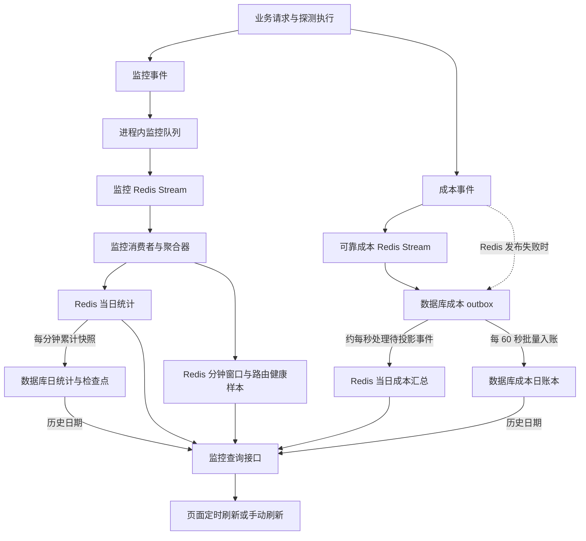

# 渠道监控数据链路说明

更新时间：2026-09-08。本文依据当前工作区代码，说明已实现的数据产生、消费、存储和展示逻辑；不代表生产环境已经部署。此前的修改方案和验证记录见根目录 `CHANNEL_MONITOR_COST_REALTIME_CONSISTENCY_PLAN.md`。

## 1. 整体规则

正常运行路径以 **Redis 已启用、监控消费者与后台任务正常运行** 为前提；当前监控代码要求 Redis 6.2 及以上，以支持 `XAUTOCLAIM`：

- **当日统计读取 Redis 汇总**：当日成本、成功率、缓存统计及当日分析下钻使用对应的日汇总 key。
- **每分钟持久化到数据库日维度**：统计保存当日累计快照，成本消费待入账事件并更新日账本；不新增成本分钟表。
- **近期性能和调度健康度读取 Redis 窗口数据**：它们按所选时间窗口或调度策略计算，不等同于当日累计值。
- **调度展示使用实际运行快照**：正常模式下，调度页面与实际选路共享 Redis 发布的路由版本及其本地镜像。
- **配置、任务历史仍有数据库来源**：渠道配置、上游余额记录、探测任务进度、执行历史、成本 outbox 等不会因为当日统计改用 Redis 而全部消失。

“当日”统一为 **北京时间自然日，00:00 至次日 00:00**。后端使用 `ChannelDailyCostDayStart()` 计算日边界，key 中的日期是该边界对应的 Unix 秒时间戳。查询区间采用左闭右开 `[from, to)`，不是最近 24 小时。

### 两条主要数据链路



图中成本分支是普通业务请求的默认路径。状态探测、分组巡检、模型检测及异步任务结算中保留了直接写日账本的事务路径，随后通过 outbox 同步 Redis，详见第 3 节。

## 2. 数据怎么产生

### 2.1 监控事件：记录一次上游尝试及最终结果

成功请求通过 `EmitChannelMonitorSuccessEvent()` 上报；失败、重试等路径通过 `EmitChannelMonitorFailureEvent()` 上报。渠道测试、巡检和模型检测也有对应的事件入口。

事件模型为 `model.ChannelMonitorEvent`，主要携带：

| 内容 | 字段及含义 |
| --- | --- |
| 身份与时间 | `event_id`、`occurred_at`、`created_at`；消费者根据 Stream ID 补充顺序水位 `event_sequence` |
| 归属 | 渠道、用户、入站 API Key、模型、实际使用的分组、请求 ID、节点 |
| 来源 | `business`、`status_probe`、`group_probe`、`smart_probe`、`manual_test`、`model_detection` |
| 结果 | 成功、失败、取消等；是否已发往上游、是否重试、是否最终尝试、是否最终重试汇总 |
| 测量 | 首字时间、尝试耗时、输出速度、输入/输出 token、缓存读写 token |
| 控制资格 | 是否可用于调度、是否可触发运行时保护，以及当前请求的选路信息 |

可选测量值使用指针区分“没有数据”和“明确测得 0”。没有可靠用量或计时信息时，不能补造有效样本。

**业务日统计只计入 `business` 来源**。探测、模型检测等事件可参与其对应状态视图；只有满足调度资格的事件才进入相应调度处理，不能将所有探测都算作用户业务请求。

主要指标口径如下：

| 指标 | 计算方式 |
| --- | --- |
| 实际成功率 | 实际成功次数 ÷（实际成功次数＋实际失败次数），按已发往上游的尝试计数，重试可形成多个尝试 |
| 最终成功率 | 最终成功次数 ÷（最终成功次数＋最终失败次数），按最终结果标记统计 |
| 最终重试失败汇总 | 只增加最终失败计数，不再增加一次实际上游尝试、性能样本或成本 |
| 平均首字时间 | 有效首字时间之和 ÷ 有效样本数 |
| 聚合 TPS | 有效样本的输出 token 总数 ÷ 生成时间总秒数，不是简单平均每个请求的 TPS |
| 缓存命中率 | 有缓存读取的请求数 ÷ 有输入 token 的缓存统计样本数 |
| 缓存利用率 | 流式请求的缓存读取 token 总数 ÷ 流式请求的输入 token 总数；与按请求数计算的命中率不同 |

未发往上游的事件不增加实际尝试数；取消或结果未明事件也不直接冒充成功/失败样本。无样本时需要结合样本数理解结果。

### 2.2 成本事件：独立记录渠道成本事实

渠道成本在用量结算、按次计费、任务结算等业务路径生成，入口主要在 `service/channel_daily_cost.go`。它与普通监控样本分开传递，不能用监控事件数量推算成本账本。

成本计算保留已有口径：

```text
成本换算系数：
  不换算：1
  充值换算：实付人民币 ÷ 到账美元额度
  订阅换算：订阅人民币价格 ÷（每日美元额度 × 周期天数）
  周期天数按天 / 周 / 月分别取 1 / 7 / 30

渠道成本倍率 = 上游倍率 × 成本换算系数

单次成本（纳元） = Round(
  分组倍率作用前的 quota ÷ QuotaPerUnit
  × 本次请求冻结的渠道成本倍率
  × 1,000,000,000
)

展示人民币金额 = 成本纳元 ÷ 1,000,000,000
```

这里的 quota 由已有计费逻辑根据用量或按次价格计算。渠道成本使用分组倍率作用前的计费基数；用户分组售价倍率不再乘入上游成本。成本倍率和换算参数按请求快照使用，后续修改配置不会重新计算过去已经记录的请求成本。

金额用 `int64` 纳元保存，计算时检查非数值、负数和溢出，聚合时也检查结果范围，避免浮点反复累加造成金额漂移。

- `settled_count`：已有可确认成本的事件数，明确成本为 0 的事件也可以是已结算。
- `unresolved_count`：已发生但暂不能确认成本的事件数，例如缺少可信上游用量或有效成本配置。
- 当日金额是已确认成本的累计；未确认成本不按估算金额补齐，也不能把“未结算”理解为“免费”。

成本类别是包含关系：**分组巡检成本包含在探测成本中，探测成本和模型检测成本均包含在总成本中**。业务成本展示按“总成本－探测成本－模型检测成本”拆分，不能再重复扣除一次分组巡检成本。

### 2.3 并发、限流和配置数据

当前并发由请求获取、续期和释放 Redis 租约产生，不等待监控事件消费或分钟汇总。正常结束会释放占用；运行中的请求定期续期，过期占用在查询/获取时清理。

当前 RPM 使用限流组件的滑动窗口数据；此处的 RPM 计数与限流启用状态有关，不应把它当作独立、完整的请求报表。

上游倍率、换算配置、分组售价、上游余额、最近同步时间等来自配置或同步任务记录。页面上的余额是相应同步/评估结果，刷新监控页面本身不会立即向所有上游重新查询余额。

## 3. 数据怎么消费

### 3.1 普通监控 Stream

1. 请求线程克隆、校验并序列化事件，然后非阻塞地放入进程内队列。
2. 后台 writer 将事件发布到 `channel_monitor:v1:events`。默认队列容量为 8192，writer 数为 1，可由环境变量调整。
3. 消费组 `channel_monitor:v1:aggregators` 使用 `XREADGROUP` 读取新事件，使用 `XAUTOCLAIM` 接管超时 pending，默认每批最多 100 条。
4. 逻辑聚合器先更新路由健康样本，再更新共享统计；符合资格的事件继续进入运行时保护和调度刷新处理。
5. 按事件 ID 去重，并在成功处理后确认消息。共享统计、事件去重标记、日版本和 dirty 标记一起提交；外部副作用还有独立的执行标记，支持安全重试。
6. 消费失败会重试；无效或持续处理失败的事件进入死信，相关计数用于展示降级状态。

普通监控采样不是无限可靠队列：队列已满或 writer 不可用时会记录丢弃，避免阻塞请求。**已经进入 writer 的事件发布失败时**，后台尝试写 `ChannelMonitorEventOutbox`，再由 outbox worker 重放；如果此处也失败，仍会记录异常/丢失。因此不能声称所有监控样本在任何故障下都完整保留。

消费者通过 Redis 租约协调；默认租约 15 秒、续期 5 秒、pending 接管空闲阈值 30 秒。断连后运行时会重建消费组并恢复消费。

### 3.2 可靠成本 Stream 与 outbox

默认开启 `CHANNEL_DAILY_COST_RELIABLE_OUTBOX`。普通业务成本的消费顺序是：

1. 生产端校验 `ChannelDailyCostDelta`，优先写 `channel_cost:v1:events`；发布失败时写数据库 `ChannelDailyCostOutbox`。
2. 成本消费者将 Stream 消息持久化到数据库 outbox，成功后才执行 `XACK` 和 `XDEL`。重复的同一事件不会再次入账，同 ID 不同内容会作为冲突处理。
3. Redis 成本 worker 约每秒扫描尚未投影的 outbox，默认每批最多 256 条，更新成本日 key；成功后标记 `RedisProjectedAt`。
4. 数据库入账 worker 启动时执行一次，此后每 60 秒领取待入账 outbox，批量更新成本日表，并在同一数据库事务里标记 `ProcessedAt`。

这两个时间表示不同进度：

| outbox 状态 | 含义 |
| --- | --- |
| `RedisProjectedAt > 0`，`ProcessedAt = 0` | 页面已能从 Redis 看见成本，数据库日账本等待本轮分钟入账 |
| `ProcessedAt > 0`，`RedisProjectedAt = 0` | 日账本已有记录，Redis 尚待同步；直接事务入账路径也可能短暂处于此状态 |
| 两者均大于 0 | 两条链路都已处理 |

**当前实现仍然逐事件写成本 outbox，Redis 成本 worker 也会查询 outbox。**“分钟级汇总到日”限制的是报表账本的粒度，并不表示所有成本相关数据库写入都延迟一分钟，或完全取消数据库事件缓冲。减少的是频繁扫描统计表/日志的压力及分钟报表行的增长。

成本投影保存每个事件的最新版本，使用 Redis `WATCH` 和事务同时更新汇总、事件状态、版本及时间。普通监控事件即使也携带成本字段，在可靠日成本基线建立后不会再重复增加该日成本。

### 3.3 探测、模型检测和异步任务的结算例外

部分业务必须与任务状态一起提交，所以保留直接更新数据库日账本的事务，同时写入“已入账、仅待投影”的 outbox：

- 状态探测、分组巡检可同步写入成本日账本，再异步同步 Redis。
- 模型检测先记录未确认成本，后续确认时增加已结算金额/次数、减少未结算次数。
- 异步任务可能在完成后修正成本。以稳定的成本事件身份和单调版本替换旧金额，保留原始发生日；不会因第二天完成就再计入第二天，也不会每次回调重复增加结算次数。

因此，“Redis 一定先于数据库更新”只适用于普通成本路径的常见情况，不能作为所有路径的固定顺序。

## 4. 数据怎么存储

### 4.1 Redis 保存当天和近期的查询数据

下表中的 `<dayStart>` 是北京时间日边界的 Unix 秒，`<minuteStart>` 是整分钟 Unix 秒；路由身份会经过编码，排查时应使用代码中的 key 构造函数。

| key / 前缀 | 内容与用途 |
| --- | --- |
| `channel_monitor:v1:events` | 普通监控 Stream，消费后保留短期重放尾部 |
| `channel_monitor:v1:dead_letters` | 普通监控死信 |
| `channel_monitor:v1:projection:success:day:<dayStart>` | 业务日累计统计；包含成功/失败、缓存、性能累计量及元数据 |
| `channel_monitor:v1:daily:dirty` | 发生变化、等待保存到数据库的日期集合 |
| `channel_monitor:v1:projection:dashboard:minute:<minuteStart>` | Redis 分钟桶，用于近期窗口聚合；不是数据库分钟表 |
| `channel_monitor:v1:projection:route:*:health:v2:samples` | 路由健康窗口样本，供稳定性、性能、保护和调度读取 |
| `channel_cost:v1:events` / `channel_cost:v1:dead` | 可靠成本 Stream / 死信 |
| `channel_monitor:v1:projection:cost:day:<dayStart>` | 可靠成本日汇总，包含渠道总额、分类金额及用户/模型/API Key 下钻数据 |
| 成本日 key 加 `:events` | 每个成本事件的最新版本和金额状态，用于去重与任务修正 |
| `channel_cost:v1:projection:status` | 成本投影 worker 的 `checked_at`、`pending`、`failed`，TTL 为 30 秒 |
| `channel_smart_schedule:v1:route_snapshot:*` | 版本化路由快照、当前版本指针及同版本监控数据 |
| `channelConcurrency:v1:active:*` / `channelConcurrency:v1:rpm:*` | 当前并发租约和限流窗口 |

日统计与分钟桶、成本日汇总及成本事件状态采用约 48 小时的 TTL 策略；它们不承担长期历史保管。普通监控去重/副作用标记同样保留 48 小时。具体写入和重建会设置或续期 TTL，不应将 Redis key 是否还在视为历史日期的数据来源规则。

普通监控 Stream 已确认尾部默认保留 600 秒，可用 `CHANNEL_MONITOR_REPLAY_RETENTION_SECONDS` 调整，代码限制在 120～86400 秒；裁剪还会保护 pending 和尚未消费的位置。成本 Stream 在持久化 outbox 后删除对应消息，恢复依靠数据库 outbox。

日统计 hash 有两类字段：

- `global:*`、`channel:*`、用户、API Key、模型、分组等范围汇总，方便页面直接读取。
- `fact:*` 标准明细维度：渠道＋用户＋API Key 身份＋模型＋分组，保存累计计数和测量，用于日持久化与组合筛选。

成本 hash 使用 `cost_detail:*` 保存渠道、用户、API Key 身份、模型和来源维度，使用 `cost_key:*` 保存 Key 成本。成本明细的维度与业务统计 `fact:*` 不完全相同。凭据只保存身份指纹和脱敏展示值。

### 4.2 数据库保存日累计、可靠事件和业务历史

| 模型 | 存储粒度与用途 |
| --- | --- |
| `ChannelMonitorDailySuccessLedger` | 日＋渠道＋用户＋API Key＋模型＋分组；实际表名 `channel_monitor_daily_success_metrics`，`AggregateJSON` 还保存性能/缓存累计数据 |
| `ChannelMonitorDailyCheckpoint` | 每日一个检查点，保存版本、事件水位、处理时间和恢复缺口标记 |
| `ChannelDailyCost` | 日＋渠道的成本账本，含总额、探测/检测分类、已结算与未结算次数 |
| `ChannelDailyAPIKeyCost` | 日＋渠道＋Key 身份的成本汇总 |
| `ChannelMonitorDailyCostDetail` | 日＋渠道＋用户＋API Key＋模型＋来源的成本下钻汇总，不是每请求一行的消费日志 |
| `ChannelDailyCostOutbox` | 逐事件可靠成本缓冲及两条消费进度；已处理历史默认保留 30 天并分批清理 |
| `ChannelMonitorEventOutbox` | 普通监控 writer 发布失败后的补偿缓冲 |
| `ChannelTaskCostEvent` 等 | 异步任务成本身份和最新结算状态；探测、模型检测另有任务/执行记录 |

正常 Redis 模式下，主节点每分钟把变化日期的 `fact:*` 累计量更新到同一天、同维度的数据库记录，保留原行身份，不每分钟增加一套日记录；同时更新该日检查点。

保存前会检查 Redis 版本是否稳定、选定水位之前是否存在未聚合的 pending 缺口；数据库在事务中保存日数据和检查点，并拒绝旧版本覆盖新版本。提交后只在 Redis 版本仍相同时清除 dirty 标记，保存过程中到来的新事件留到下一轮。

历史分钟表及兼容代码仍然存在，但正常 Redis 主流程不再依赖扫描日志生成分钟贡献再合并日统计。已有表和数据不会因本次变更自动删除；日统计仍随日期和实际维度组合增长，outbox、日志、任务历史也各自占用空间。

## 5. 数据怎么查询和展示

### 5.1 接口按数据类型和日期选择来源

下列路径统一位于 `/api/channel_monitor` 下：

| 页面/接口 | 当前读取逻辑 |
| --- | --- |
| 总览 `/` | 渠道及配置记录＋Redis 当日渠道成本＋当前并发；响应的 `today_cost_summary` 与渠道行成本由同一次成本快照生成 |
| 成本 `/cost` | 今天读取 Redis 成本日 key；历史日期读取数据库日账本；跨日结果排除数据库中的今天，再合并 Redis 今天，避免双计 |
| 今日成功率 `/success/today`、成功率详情 `/success/detail` | 当天读取 Redis 日统计；历史部分读取数据库日统计 |
| 分析 `/analytics/summary`、`trend`、`rows` | 根据成本/统计分析类型选择对应日数据；含今天的范围合并 Redis 今天与数据库历史，再完成汇总、排序和分页 |
| 性能 `/performance` | 读取 Redis 近期窗口，按请求的分钟范围计算首字时间、TPS、成功率和缓存等；可跨北京时间日边界 |
| 智能调度 `/schedule` | Redis 路由快照的本地镜像＋同版本经济参数＋Redis 健康窗口和运行时排除状态 |
| 并发 `/concurrency` | Redis 并发/限流状态；渠道清单和限制配置仍有模型层读取 |
| 状态探测 `/status` | 当日探测成本取 Redis；配置、执行状态、最近记录和历史窗口仍读取对应任务/执行数据 |
| 模型检测 `/model_detection` | 当日检测金额/成本结算次数取 Redis；任务进度、单次执行用量与证据仍取任务/运行记录 |
| 任务历史、调度执行历史 | 查询数据库历史，反映当时执行结果，不是当前运行快照 |

总览频繁刷新只读成本 hash 的 `meta:*`、`global:*`、`channel:*`，需要下钻时才读取成本维度明细。Redis 日 hash 的查询有字段/结果数量上限，并通过版本一致性检查避免把更新前后的数据拼成一次返回。

旧数据如果缺少用户、模型或 Key 归属，会保留未知归属部分，并通过覆盖信息说明下钻不完整，不能为了让筛选结果好看而把未归属成本丢掉。

### 5.2 页面刷新规则

- 总览、成本摘要、今日成功率、当前性能和调度查询默认每 **5 秒**刷新。
- 包含今天的已启用分析查询每 5 秒刷新；纯历史分析不做固定间隔轮询，可手动刷新，并在重新打开、重新聚焦或重连时重新查询。
- 常规实时查询不在浏览器后台持续轮询；常规查询在重新聚焦和重连时刷新。实际是否发起请求还取决于视图是否挂载、查询是否启用。
- 探测和模型检测的活动任务进度保留 **1 秒**刷新；非活动时使用对应视图的刷新策略。
- 手动刷新会重新获取公共摘要、当前视图及已经打开的分析/历史查询；总览响应本身也携带并发数据。它只读取当前服务端数据，不同步等待 Stream 消费、强制执行成本入账或重算调度。
- 头部今日成本优先使用总览的 `today_cost_summary`，与该次总览渠道成本共享版本；昨日成本等仍来自历史查询。

不同接口是独立请求，可能正好读到相邻版本；页面所有卡片不是一个跨 Redis、数据库和所有 HTTP 请求的全局事务。

## 6. 与智能调度怎样保持一致

调度涉及两组不同数据：

1. **评分和保护输入**：Redis 中的业务/合格探测健康样本，按策略窗口计算稳定性、首字时间、TPS 等；经济参数包含渠道成本倍率、分组售价和毛利分类。
2. **已经生效的选路结果**：路由参与状态、有效优先级、权重、固定主渠道、逻辑渠道成员、流量暂停/保护状态等，来自当前发布的路由快照及运行时约束。

发布器从一致的数据库快照构建路由和监控附带数据，写入 Redis 版本 key；同版本监控数据保存在该版本 key 的 `:monitor` 伴随 key 中，并与当前路由指针一起提交。

节点后台默认每秒检查刷新状态，将完整版本应用到本地镜像。请求选路使用这个镜像，调度页面通过 `GetChannelSmartScheduleMonitorRuntimeSnapshot()` 读取同一版本下的实际路由状态和经济参数，避免页面自行读取另一版配置并推导“应该如何调度”。配置变更、冷启动和后台重建仍需要数据库；正常的路由/经济参数读取不在每次请求中重复查统计表。

需要区分：

- **今日累计成本不是调度成本分数**。累计金额回答今天花了多少；成本倍率/毛利与窗口质量用于当前调度决策。
- **业务日成功率不等于策略窗口稳定性**。日期范围、样本资格、保护规则不同，即使都来自 Redis，数值也不一定相等。
- 当前窗口指标可以先更新，已经生效的优先级/权重则以执行及发布后的路由版本为准。页面应结合快照版本、生成时间和降级状态理解这种短暂间隔。
- 同版本的页面与实际选路保持一致，不等于所有节点在同一毫秒切换。缺少伴随快照、版本过旧或使用本地启动回退时，状态信息会反映快照未就绪/降级，并由后台刷新恢复。

## 7. 更新时序与异常恢复

### 7.1 正常更新节奏

| 环节 | 当前节奏 |
| --- | --- |
| 监控事件写入与消费 | 持续处理；消费者空闲阻塞等待约 1 秒，不能理解为每秒只消费一次 |
| Redis 日统计/窗口更新 | 消费到事件后更新，无需等待数据库分钟任务 |
| Redis 成本更新 | outbox 投影 worker 约每秒扫描并分批处理 |
| 业务日统计落库 | 主节点启动执行，此后通常在每个整分钟后约 1 秒执行 |
| 成本日账本入账 | 启动执行，此后每 60 秒批量处理；与统计快照任务独立 |
| 路由快照后台刷新检查 | 默认约 1 秒，实际发布还取决于变更、租约及构建完成时间 |
| 页面常规实时轮询 | 默认 5 秒 |

例如，一次请求在 10:00:10 完成：其统计样本消费后即可进入 Redis；成本进入 outbox 后，后续秒级投影即可供页面读取；数据库日统计和日成本随后由各自的分钟任务更新。用户在这之前刷新页面，也可以看到超过数据库日表进度的数据。

这些是调度周期，不是延迟上限。请求尚未完成、流式响应仍在传输、异步任务尚未结算、队列积压、数据库/Redis 重试，都会延后可见时间。成本修正也可能让累计值减少，不能仅以金额是否一直上涨判断消费者是否正常。

### 7.2 缺 key、重启与跨日

统计链路在启动及后台持久化时确保今天/昨天的日 key 就绪；缺失时以数据库日统计和检查点为基线，重放仍保留的监控 Stream 尾部。重放依据事件水位和去重标记处理，不只按事件发生时间判断，避免迟到事件被错误跳过。

若检查点之后的必要 Stream 尾部已经丢失，代码会设置 `coverage_partial`，保留“日统计存在恢复缺口”的信息；不把缺失数据当作确定的 0，也不根据日累计伪造历史分钟分布。

成本日 key 或独立的成本事件状态 key 缺失时，通过该日重建租约协调，从数据库日账本、明细、outbox 和任务最新结算状态恢复成本投影。重建只补入尚未包含在日账本中的部分，避免把已入账 outbox 再加一遍。常规 Redis 投影处理重点覆盖今天/昨天，较早日期由数据库历史查询负责。

跨北京时间零点后，今天切换到新的日 key，昨天转为数据库历史来源；上一日的最后一批数据仍可能等待分钟任务或迟到结算完成，因此刚跨日的历史值也可能随后补齐。

### 7.3 不可用时的返回规则

Redis 已启用时，当日汇总缺失、损坏、超过查询上限或快照不稳定，会返回不可用/错误或相应降级信息；不会静默改读较旧的数据库今天数据并声称是实时结果。仍能读到有效快照但消费者积压时，可以返回该快照并附带更新中/降级状态。

成本链路与普通监控消费状态分别观测：普通 Stream 消费正常，不能证明可靠成本已经追平。普通成本尚待分钟入账本身也不等于 Redis 成本过期。

Redis 整体未启用或可靠成本生产开关关闭时，代码保留旧聚合/批处理兼容路径；这不具备本文正常模式的同等实时读取保证。关闭可靠成本生产开关后，已接受事件的 drain worker 仍继续工作，避免遗留 outbox 被抛弃。

## 8. 排查“刷新后成本没变化”

1. **确认比较范围**：是否都是北京时间今天、相同渠道/用户/Key/模型；不要把近期窗口、单次任务记录或调度成本倍率与今日总额直接比较。
2. **确认成本是否已产生**：请求/任务是否已到结算点，是否只有 `unresolved_count` 增加；页面显示精度也可能把小额变化舍入成相同文本。
3. **检查成本自己的进度**：总览看 `today_cost_summary.revision`、`processed_at`、`projection`；成本接口看 `cost_source`、`cost_revision` 及对应时间/覆盖字段。`generated_at` 只是接口生成时间，不能证明数据刚刚消费。
4. **区分两段积压**：成本 Stream 是否已进数据库 outbox；outbox 的 `RedisProjectedAt` 与 `ProcessedAt` 哪个尚未完成。正常成本消息被确认只证明已交给 outbox，不证明 Redis 或日账本已经完成；无效消息另查死信。
5. **检查普通统计恢复状态**：成功率/缓存异常时看 `snapshot_revision`、`event_watermark`、`coverage_partial`、writer 丢弃计数、pending、消费者 lag 和死信。
6. **检查运行快照版本**：调度显示与选路不一致时，对比节点和快照的 revision、source watermark、生成时间、dirty/降级状态，以及冷却/保护等实时排除条件。

## 9. 代码入口索引

以下路径均相对于项目根目录：

| 环节 | 主要文件 |
| --- | --- |
| 启动与停止 | `main.go`、`service/channel_monitor_redis_runtime.go` |
| 监控事件模型与产生 | `model/channel_monitor_event.go`、`service/channel_monitor_event_emit.go`、`controller/channel_monitor_event_emit.go` |
| 普通事件队列与消费 | `service/channel_monitor_event_writer.go`、`service/channel_monitor_event_publisher.go`、`service/channel_monitor_redis_consumer.go`、`service/channel_monitor_redis_aggregator.go` |
| Redis 统计/路由健康 | `service/channel_monitor_redis_keys.go`、`service/channel_monitor_redis_shared_projection.go`、`service/channel_monitor_redis_route_health.go` |
| 统计日持久化与恢复 | `service/channel_monitor_aggregation.go`、`service/channel_monitor_daily_persistence.go`、`model/channel_monitor_daily_checkpoint.go`、`model/channel_monitor_daily_success.go` |
| 成本计算与换算 | `service/channel_daily_cost.go`、`service/channel_monitor_cost_conversion.go` |
| 可靠成本投递与入账 | `service/channel_daily_cost_outbox.go`、`model/channel_daily_cost_outbox.go`、`model/channel_daily_cost.go`、`model/channel_daily_api_key_cost.go` |
| 成本 Redis 投影与任务修正 | `service/channel_monitor_reliable_cost_projection.go`、`model/channel_daily_cost_projection.go`、`model/channel_task_cost_event.go` |
| Redis 日数据读取 | `service/channel_monitor_redis_daily_snapshot.go`、`service/channel_monitor_redis_daily_success.go`、`service/channel_monitor_redis_daily_cost.go` |
| 成本与分析接口 | `controller/channel_ratio_monitor.go`、`controller/channel_monitor_cost_read_source.go`、`controller/channel_monitor_current_analytics.go`、`controller/channel_monitor_analytics.go` |
| 探测/检测当日成本 | `controller/channel_status_probe.go`、`service/channel_model_detection_query.go`、`service/channel_model_detection_daily_cost.go` |
| 调度运行快照 | `model/channel_smart_schedule_redis_snapshot.go`、`model/channel_smart_schedule_monitor_snapshot.go`、`model/channel_smart_schedule_route_runtime_view.go`、`controller/channel_ratio_monitor_schedule_route_api.go` |
| 并发与 RPM | `service/channel_concurrency.go`、`controller/channel_concurrency.go` |
| 页面查询与刷新 | `web/src/features/channel-monitor/index.tsx`、`web/src/features/channel-monitor/lib/query-options.ts`、`web/src/features/channel-monitor/hooks/use-channel-monitor-analytics.ts` |
| 状态与降级展示 | `service/channel_monitor_redis_observability.go`、`web/src/features/channel-monitor/lib/realtime-metadata.ts`、`web/src/features/channel-monitor/components/channel-monitor-realtime-status.tsx` |
