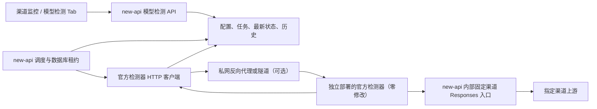
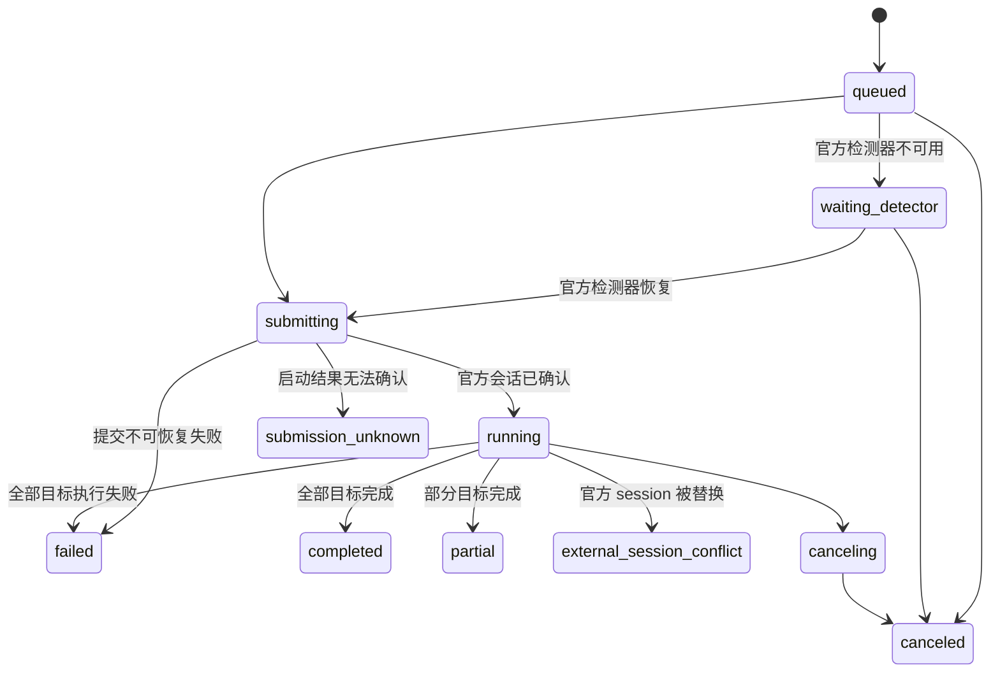
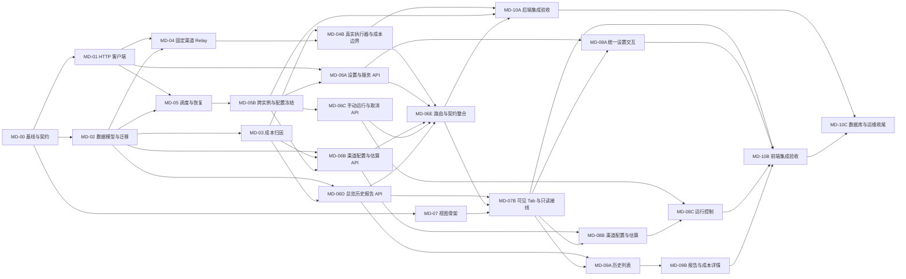

# 渠道 GPT-5.6 模型检测集成设计

> 文档状态：实施与验收完成；MD-00 至 MD-10C 均已完成
> 目标模块：渠道监控下游扩展
> 检测器调研参考：[chen-006/gpt56_api_detector](https://github.com/chen-006/gpt56_api_detector) 4.1.0（仅用于确认现有 HTTP 契约，非运行时依赖）
> 调研提交：`ca7443a50dbd34296ed025de5b160c5cd077a44b`（2026-08-11，仅表示设计时观察版本；部署实例可独立更新）

## 1. 目标

在现有“渠道监控”页面新增独立的“模型检测”Tab，用于检查渠道中申报为 `gpt-5.6-sol`、`gpt-5.6-terra` 或 `gpt-5.6-luna` 的模型是否出现型号不一致、旧模型混入、输出改写或证据不足。

页面始终按“一渠道一卡片”展示全部渠道，包括未配置、已暂停、手动禁用和自动禁用渠道。管理员可以为每个渠道配置一个或多个待检测模型，手动发起检测，或按计划定时检测，并在卡片和历史抽屉中查看进度与报告。

官方检测程序由管理员单独部署并独立更新，`new-api` 负责控制面、串行调度、渠道访问控制和结果持久化。集成只调用官方程序现有 HTTP API，不修改、导入、复制或重新打包官方检测器源码。

### 1.1 不可变集成原则

以下原则是本设计的硬约束，后续实现不得放宽：

- 官方检测器源码保持原样，不创建或维护检测器 Fork，不向其运行目录注入补丁。
- 不把官方 Python 包作为库导入，不调用 `DetectorSession` 等内部类或函数。
- 不读取或修改官方检测器 SQLite，不依赖其内部表和文件布局实现业务功能。
- 不把官方源码复制到 `new-api` 仓库或随 `new-api` 构建产物发行。
- 官方检测器由管理员在独立目录、进程或容器中安装和更新；更新不要求重新编译或发布 `new-api`。
- 不额外开发或部署一个“检测桥接服务”；`new-api` 内的 HTTP 客户端只负责调用官方现有端点，队列和渠道 Relay 属于主系统控制面。
- 每次任务均从官方 `/api/bootstrap` 获取当前预设，不在 `new-api` 固化官方探针数量、并发、题面或上下文参数。
- 官方接口不兼容时停止创建新任务并提示升级 `new-api` 适配，不通过修改官方源码维持兼容。

## 2. 首版范围

首版必须完成：

- 新增“模型检测”Tab，一渠道一卡片，未配置渠道也可见。
- 每渠道配置多个“请求模型 + 申报型号”检测目标，并单独决定是否参加统一定时检测。
- 提供统一设置，集中配置官方检测器地址、定时检测档位、执行周期、基准执行时间和时区；手动检测可以单独选择档位。
- 支持手动检测和定时检测。
- 支持低、中、高三个原项目官方单次检测档位。
- 展示官方检测器状态、队列状态、执行进度、最新结论、最近检测时间和下次检测时间。
- 保存每轮汇总结论、逐目标报告和必要的网络/用量摘要。
- 按真实上游请求记录检测成本，并汇总到目标、渠道轮次和定时批次；同时保留等价系统计费额度与渠道实际成本，未决成本不得伪装成已结算金额。
- 首版检测成本属于管理员监控的成本归因和审计数据，不从普通用户余额、令牌额度或订阅额度中扣费；记录的 `quota` 是复用现有渠道测试计价得到的等价额度，不代表发生了用户扣款。
- 支持取消排队中或运行中的任务。
- 多实例部署时通过数据库租约保证同一配置不会重复执行。
- 所有管理 API 使用 `RootAuth`，所有下游界面和错误文案使用简体中文常量。

首版明确不做：

- 不把检测结论用于自动启用、禁用、降权或切换渠道。
- 不把检测结果写入智能调度样本。
- 不使用检测器的持续监控模式；定时由 `new-api` 统一调度单次检测。
- 不在 `new-api` Go 进程内重写或复制 Python 检测算法。
- 不修改、派生、Monkey Patch 或运行时注入官方检测器源码。
- 不让官方检测器直接持有渠道原始 API Key。
- 不开放自定义探针生成器、探针导入和原始完整请求/响应留存。
- 不批量启动全部渠道检测；首版先保证单渠道任务闭环和负载边界。

## 3. 核心决策

采用“`new-api` 控制面 + 官方检测器黑盒独立部署”的集成方式。最终结论是：不再单独开发一个检测桥接服务，也不把检测器代码集成进 `new-api`；`new-api` 自身实现官方 HTTP 客户端、队列和固定渠道 Relay，官方程序只作为可替换的独立进程或容器：



若 `new-api` 与官方检测器运行在同一主机，客户端可以直接访问其 `127.0.0.1` 端口，不需要图中的代理。跨主机部署时，代理或隧道只解决网络可达和服务鉴权，不转换官方 API，也不修改官方进程。

职责划分如下：

| 模块 | 负责 | 不负责 |
| --- | --- | --- |
| 渠道监控前端 | 配置、触发、取消、筛选、进度和报告展示 | 直接调用官方检测器、保存会话/代理密钥 |
| `new-api` | 权限、调度、租约、固定渠道凭证、任务状态、结果持久化 | 复刻探针算法和评分算法 |
| 官方检测器客户端 | 调用现有 API、单会话排队、轮询、兼容性检查 | 导入内部模块、修改官方配置或数据库 |
| 官方检测器 | 按当前部署版本执行探针、重试、取消、恢复和生成报告 | 管理渠道配置、持有渠道原始 Key、决定渠道启停 |
| 私网代理或隧道 | 跨主机网络可达、TLS/mTLS 或服务鉴权 | 修改请求正文、实现检测逻辑、暴露公网访问 |
| 内部固定渠道 Relay | 校验任务凭证、锁定渠道和模型、复用渠道适配配置 | 自动换渠道、开放给普通用户 |

`new-api` 把官方实例视为只有一个当前会话的黑盒设备。管理员可以随时用官方新版本替换部署；重新启动后，`new-api` 重新读取 bootstrap 并判断接口是否兼容。Python、Node.js、SQLite 和检测会话实现均留在官方程序内。

## 4. 官方检测器现状与部署边界

调研版本的官方检测器是面向本机单用户的 Web 程序：

- Web 服务默认仅监听 `127.0.0.1`。
- `AppState` 同一时间只维护一个检测会话，并用本地 SQLite 保存运行状态。
- API 令牌是进程启动时生成的浏览器会话令牌，不是服务间鉴权方案。
- 高档需要 Node.js 执行 Native Codex 请求，并包含固定 32K 上下文。
- API Key 只存在进程内存，重启恢复时需要重新提供。
- 调研信息只用于编写 HTTP 适配，不代表运行时必须锁定该提交；官方后续发布由管理员按其发布说明独立处理。

这些限制全部由 `new-api` 的串行调度和部署网络吸收，不要求官方程序改造：

1. 同一官方实例同一时间只分配一个检测目标，其他渠道和目标保留在 `new-api` 数据库队列中。
2. 官方程序继续监听 `127.0.0.1`；同机部署直接访问，跨主机通过私网反向代理、SSH 隧道、WireGuard 或同类网络层方案转发。
3. 反向代理必须增加独立代理鉴权和 TLS/mTLS，且只能允许访问下列官方端点：`/api/health`、`/api/bootstrap`、`/api/detector/estimate`、`/api/detector/start`、`/api/detector/status`、`/api/detector/report`、`/api/detector/stop`。
4. 官方程序升级由管理员独立执行；`new-api` 不运行 `git pull`、不写官方目录，也不负责回滚官方版本。
5. 官方程序重启后会更换页面会话令牌，`new-api` 必须重新请求 bootstrap，不能持久化复用旧令牌。

本项目不复制、修改或重新分发官方源码。管理员独立获取和部署官方程序，并自行遵守其发布条款；本仓库只维护 HTTP 客户端兼容层。

## 5. 官方 HTTP API 集成设计

### 5.1 部署形态

推荐优先同机部署，官方程序仍按原方式启动：

```powershell
python gpt56_vnext_web.py --port 18080 --no-browser --runs-root D:\data\gpt56-runs
```

首次部署可用环境变量提供检测器地址默认值（只保存地址，不保存其源码或 SQLite 路径）：

```text
GPT56_DETECTOR_URL=http://127.0.0.1:18080
```

Root 管理员随后可在“模型检测 → 统一设置”中读取和修改地址。数据库中的统一设置是运行时有效值；`GPT56_DETECTOR_URL` 只用于尚未创建统一配置时的首次初始化，不在每次启动时覆盖管理员已保存的地址。

若检测器位于另一台主机，则由管理员部署反向代理或私网隧道，在统一设置中保存代理地址。代理凭证仍由环境变量提供；它是网络层鉴权，不是官方 `X-GPT56-Session`，也不通过前端写入数据库：

```text
GPT56_DETECTOR_PROXY_TOKEN=<service-token>
```

官方检测器仍只监听本机回环地址。普通 Docker Compose 容器拥有独立回环网络，因此不能让两个普通容器直接以各自的 `127.0.0.1` 通信；可使用同一 Pod/共享网络命名空间、将 `new-api` 运行在同主机网络，或使用上述私网代理。不得通过修改官方 `create_server` 监听地址来解决。

日志、错误和报告不得记录官方 `session_token`、代理凭证、短期任务凭证或渠道密钥。

### 5.2 官方 API 调用流程

`new-api` 只能调用官方现有页面 API，不导入检测器内部模块。每个检测目标按以下顺序执行：

1. `GET /api/bootstrap`：取得本次官方进程的 `session_token`、`single_presets` 和当前能力数据。
2. 从 `single_presets[preset]` 原样取得完整配置，不在 `new-api` 硬编码探针数、并发、请求格式、上下文或题面。
3. `POST /api/detector/estimate`：让官方程序校验配置并返回当前请求量和配置哈希。
4. `POST /api/detector/start`：按官方接口字段传入 `base_url`（内部 Relay 地址）、`api_key`（短期任务凭证）、`model`（申报型号）和第 2 步得到的完整官方配置；恢复时另传 `resume_session_id`。这里的 `api_key` 是任务级短期凭证，不是渠道原始 Key。
5. `GET /api/detector/status`：轮询当前会话状态和进度。
6. `GET /api/detector/report`：报告可用后立即读取并持久化到 `new-api`。
7. `POST /api/detector/stop`：管理员取消当前运行目标时调用。

所有官方 POST 请求携带 bootstrap 返回的 `X-GPT56-Session`。客户端不得调用 `/api/generator/*`、导入自定义探针或开启原始交换留存。

官方 `/start` 只有一个 `model` 字段，官方检测器会把它同时作为判定用的申报型号和发往 `base_url` 的请求模型；它没有“申报型号”和“渠道请求模型”两个字段。为兼容渠道别名，`new-api` 的内部 Relay 必须校验请求中的 `model` 等于任务凭证绑定的 `claimed_model`，再把它映射为凭证绑定的 `request_model` 转发到指定渠道。这个映射属于 `new-api` 的渠道适配，不要求也不得要求官方检测器增加字段或修改源码。

官方 API 只有“当前会话”语义。必须在一个目标报告读取并保存完成后才能开始下一个目标，否则新会话会替换当前报告引用。

### 5.3 官方更新与兼容检查

管理员可以随官方更新随时替换检测器，不需要修改或重新发布 `new-api`：

1. 更新前在页面将官方检测器置为维护状态，`new-api` 停止领取新任务。
2. 等待当前目标完成，或显式取消当前目标。
3. 管理员在官方部署中执行更新和重启；`new-api` 不参与文件更新。
4. `new-api` 重新调用 bootstrap，并用返回的低档配置执行一次 `estimate` 契约检查。
5. 检查必需端点、字段类型和目标档位存在后恢复队列。

兼容性按能力判断，不使用固定版本白名单。未知官方版本只要接口契约兼容即可运行；不兼容时状态变为 `incompatible`，任务保留在 `waiting_detector`，历史仍可查看。此时应更新 `new-api` 的 HTTP 适配代码，而不是修改或降级官方程序。

每轮保存官方返回的 `config_hash`、实际请求量和管理员可选填写的部署版本标识。官方更新可能调整档位请求数、报告字段或结论，因此页面请求量和档位说明必须来自最近一次 bootstrap/estimate；本文的 4.1.0 数值只作参考。

### 5.4 `new-api` 内部任务抽象

虽然官方实例是单会话 API，面向前端的 `new-api` 接口仍使用异步任务，不维持同步长请求。

#### 健康与能力

`new-api` 根据 health、bootstrap、estimate 和当前会话状态形成内部健康快照。下面只展示字段形态；`preset_estimates` 的数值必须由当前官方实例实时返回，不能使用文档示例初始化：

```json
{
  "status": "ready",
  "deployment_label": "管理员可选标识",
  "supported_presets": ["low", "medium", "high"],
  "preset_estimates": {
    "low": {"total_requests": null, "fixed_32k_requests": null},
    "medium": {"total_requests": null, "fixed_32k_requests": null},
    "high": {"total_requests": null, "fixed_32k_requests": null}
  },
  "max_concurrent_sessions": 1,
  "running_sessions": 0,
  "official_api_compatible": true
}
```

示例中的 `null` 表示尚未成功执行当前官方 `estimate`；可用时由每个档位的实际返回值填充。调研版本 4.1.0 曾返回 `14 / 64 / 202`，但这些不是产品常量。`unavailable` 表示官方进程或代理不可达，`incompatible` 表示官方已更新但当前 HTTP 客户端无法安全调用。档位能力、请求量、长上下文量和重试配置均来自当前官方实例。

当前官方 HTTP API 不返回程序 `VERSION` 或 Git 提交。页面不得把仓库调研版本冒充为正在运行实例的版本；只能显示管理员可选配置的 `deployment_label`，以及已完成报告真实携带的 schema、scoring、baseline 和 build 元数据。

#### 创建本地任务并启动官方会话

渠道监控手动或定时触发时，`new-api` 先在本地创建 `run_id` 和逐目标执行行。全局 Worker 每次只领取一个目标，在确认官方实例空闲后调用 `/api/detector/start`。一个渠道轮次可包含多个目标，但每个目标都必须是独立官方会话，不能直接创建 `DetectorSession`。

#### 查询官方会话

后台 Worker 轮询 `/api/detector/status`，并把计划请求数、逻辑完成数、HTTP 尝试数、错误数和当前结论写入本地执行行。前端永远查询 `new-api` 本地 API，不直接读取官方状态。

#### 获取报告

目标完成后由 Worker 调用 `/api/detector/report`，保存完整结构化报告。客户端必须容忍官方新增字段，稳定读取字段固定在第 10 节的数据契约中。

#### 取消任务

取消本地排队目标时不调用官方接口；取消当前运行目标时调用 `/api/detector/stop`。取消必须幂等，且只有与当前官方 `session_id` 匹配的本地目标可以停止官方会话。

### 5.5 轮询与状态同步

- 官方程序不向 `new-api` 回调，状态同步只使用轮询。
- 运行中每 3 秒查询 `/api/detector/status`；无本地活动任务时每 30 秒执行 bootstrap 健康检查。
- 本地执行保存官方 `session_id`；只有 session 匹配时才接受状态和报告，防止管理员在官方页面手动启动的会话被错误归属。
- 检测期间不允许管理员同时通过官方页面启动另一会话。若发现 session 被替换，本地任务标记 `external_session_conflict`，不读取不属于它的报告。
- `new-api` 重启后先查询官方当前状态和 session：匹配则恢复轮询；官方返回 `interrupted` 且身份匹配时按第 7.3 节调用其现有恢复入口；不匹配时标记冲突，绝不盲目重新提交。

### 5.6 并发边界

- 一个官方实例同一时间只能运行 `1` 个检测目标，`new-api` 全局调度严格串行。
- 同一渠道最多一个活动轮次。
- 每个轮次内的探针并发由原检测器官方预设决定，不在 `new-api` 中改写。
- 官方实例忙碌时保持排队，不把排队当作失败，也不绕过官方的单会话检查。
- `new-api` 对排队时长设置告警阈值，但不因等待超时自动创建重复任务。

调研版本把 `workers`、请求次数、格式和上下文纳入官方预设哈希。客户端每次从 bootstrap 获取完整预设并原样回传，因此官方更新预设后自动使用新值。调度层只能控制何时启动一个完整目标，不能为了减负改变目标内部参数。

## 6. 固定渠道访问设计

### 6.1 不传递渠道原始 Key

官方检测器不得读取 `Channel.Key`。`new-api` 为每个运行目标签发短期任务凭证，官方检测器使用该凭证请求 `new-api` 的内部 Responses 入口，再由主系统转发到指定渠道。

这样可以继续复用：

- 渠道模型映射。
- 渠道 Base URL、代理、Header Override 和 Param Override。
- 多 Key 选择与渠道并发限制。
- Responses 协议适配、流式解析、用量和渠道成本记录。
- 现有敏感信息脱敏规则。

### 6.2 内部入口

建议新增：

```http
POST /internal/model-detector/v1/responses
Authorization: Bearer <short-lived-job-token>
```

凭证至少绑定：

| 声明 | 说明 |
| --- | --- |
| `run_id` / `target_id` | 归属检测任务和目标 |
| `channel_id` | 唯一允许访问的渠道 |
| `request_model` | 唯一允许的客户端模型名 |
| `claimed_model` | 报告申报型号，仅供审计 |
| `preset` | 当前档位 |
| `max_http_attempts` | 本目标最大 HTTP 尝试预算 |
| `expires_at` | 任务最晚完成时间 |
| `nonce` | 撤销和防重放标识 |

入口必须执行：

1. 校验签名、有效期、撤销状态、请求次数预算和模型精确匹配。
2. 强制绑定渠道，不允许官方检测器通过 Header、Query 或请求体选择其他渠道。
3. 禁止跨渠道重试；原检测器自身的单任务重试仍按预设执行。
4. 获取该渠道的并发租约，满载返回 `429`，不绕过生产流量上限。
5. 允许管理员手动检测已禁用渠道；定时检测默认跳过手动禁用渠道。该特例只存在于内部入口，不能扩大普通指定渠道 Token 权限。
6. 标记请求来源为 `gpt56_model_detection`，把 `run_id`、`target_id`、`cost_event_id` 写入管理员可见的结构化日志信息；消费日志仅作辅助审计，不表示用户扣费，并与普通业务、状态探测分开统计。
7. 每次请求递增原子尝试计数，超过预算后拒绝，防止失控 Worker 无限消耗。

一个检测器逻辑请求可能因同渠道重试或多 Key 选择产生多个真实上游尝试，因此成本不能只按内部入口请求计一笔。内部入口为逻辑请求生成 `detector_request_id`；Relay 在每个上游尝试进入传输边界前生成独立 `cost_event_id` 并创建 `prepared` 事件，跨过传输边界后标记 `dispatched`。同一逻辑请求的重试共享 `detector_request_id`，但每个实际付费尝试都有不同 `cost_event_id`，从而既不漏记重试成本，也不因 Worker 对账重复记账。

成本事件是模型检测专属的归因事实，不是新的用户消费流水。它可以与现有“模型测试”消费日志关联，便于审计，但不得触发 `BillingSession`、用户余额变更或订阅额度扣减。`new-api` 只冻结本次请求所使用的计价上下文和渠道成本快照；若将来需要让指定账号承担检测费用，应另行设计显式的扣费策略和授权，不在本首版范围内。

### 6.3 请求模型与申报型号

每个检测目标保存两个不同字段，但官方 `/start` 只接收一个 `model`：

- `request_model`：`new-api` 内部 Relay 最终发给当前渠道的模型名，必须是渠道实际支持的客户端模型名。
- `claimed_model`：传给官方检测器 `/start.model` 的申报型号，只能是 `gpt-5.6-sol`、`gpt-5.6-terra`、`gpt-5.6-luna`；官方检测器也会用该值作为它发出的模型字段。

例如渠道对外提供 `gpt-5.6`，但需要用 Sol 申报型号检测，配置可以是：

```json
{
  "request_model": "gpt-5.6",
  "claimed_model": "gpt-5.6-sol"
}
```

执行时官方请求使用 `model=gpt-5.6-sol`，请求到达 `new-api` 内部入口后，入口仅在该任务凭证已绑定的前提下把它映射为渠道的 `request_model=gpt-5.6`。若渠道实际上需要把 `gpt-5.6-sol` 原样发给上游，则两个字段填写相同值。不得让官方检测器自行选择或拼接模型名。

不能根据模型名字符串自动猜测申报型号，管理员必须明确选择，避免模型映射或别名导致错误判定。

## 7. 调度语义

### 7.1 统一设置

首版只维护一份全局设置，不允许渠道配置持久化覆盖定时档位、周期或时间；手动轮次可以在发起时单次选择档位：

| 配置 | 说明 |
| --- | --- |
| `detector_url` | 官方检测器或其私网代理的完整 `http/https` 地址 |
| `scheduled_preset` | 统一定时检测档位：`low` / `medium` / `high` |
| `schedule_enabled` | 是否启用统一定时调度 |
| `interval_hours` | 统一执行周期，建议枚举 `6 / 12 / 24 / 48 / 72 / 168` 小时 |
| `schedule_time` | 统一基准执行时间，格式 `HH:mm` |
| `timezone` | IANA 时区，默认服务器配置时区；示例 `Asia/Shanghai` |
| `schedule_anchor_at` | 当前周期相位的首个计划时间；修改周期/时间/时区时重建 |
| `next_batch_at` | 按上述配置计算的下一次全局批次入队时间 |
| `revision` | 乐观锁版本，防止并发设置相互覆盖 |

统一设置保存后适用于所有渠道的定时检测：渠道卡片只配置检测目标和“参加定时检测”开关，不再保存档位、周期或每日时间。统一设置中的 `scheduled_preset` 只控制定时批次；手动检测在发起时单独选择 `low` / `medium` / `high`，默认预选当前 `scheduled_preset`，但不修改它。更改定时档位只影响保存之后新创建的定时轮次；已经排队或运行的轮次继续使用创建时冻结的档位名称。每个目标实际启动前仍从当前官方实例重新取得该档位的完整预设并冻结配置快照，不能把旧实例的官方配置直接提交给更新后的实例。

检测器地址也在统一设置中编辑。保存地址时只做格式和 SSRF 策略校验，不要求检测器当时在线；保存后提供独立“测试连接”。地址修改不切换正在运行的官方会话：若存在活动 session，设置保存成功但新地址标记为 `pending`，待当前 session 完成或取消后原子切换；新任务在切换完成并通过 health/bootstrap/estimate 契约检查前不启动。排队轮次只冻结档位名称，不冻结旧检测器地址；切换后在新实例上按当前官方预设执行。

### 7.2 定时检测

- 到达 `next_batch_at` 时创建一个全局定时批次，为所有“已配置目标 + `schedule_enabled=true`”的渠道各创建一轮，再进入统一队列。
- `schedule_time` 表示批次入队基准时间，不表示所有渠道同时开始请求。官方实例只有一个 session，各渠道及其目标仍严格串行。
- 同一批次按稳定顺序排队，建议使用 `(channel_id, target.position)`；不通过改变官方预设并发来加速。
- 首次保存或修改周期/时间/时区时，以保存日之后第一个 `schedule_time` 作为 `schedule_anchor_at`；之后从该锚点按 `interval_hours` 推进 `next_batch_at`。`interval_hours` 必须是 `24` 的整数因子或整数倍（建议允许 `6 / 12 / 24 / 48 / 72 / 168`）。例如 `24 小时 + 02:30` 表示每天当地时间 02:30；`48 小时 + 02:30` 的首个 02:30 建立两天周期相位。夏令时跳变按所选 IANA 时区的规则解析；不存在的本地时间顺延到首个有效时刻，重复时间只创建一次批次。
- 多实例使用全局设置的 `revision + lease_until` 条件领取，同一计划时间只能创建一个批次。
- 手动禁用渠道跳过定时轮次；自动禁用渠道仍允许参加定时检测，用于观察恢复情况。
- 官方检测器不可用时已创建任务保持 `waiting_detector`，按退避时间重新检查，不生成失败检测结论。
- 上一全局批次仍有非终态轮次时，不创建下一批重复任务；记录本次因积压跳过并推进 `next_batch_at`。队列恢复后从后续正常计划继续，不补齐积压期间的所有批次。
- 错过多个周期时只补最近一批，不追赶全部历史批次；批次保存原计划时间和实际创建时间。

### 7.3 手动检测

- 必须先保存至少一个检测目标。
- 点击“立即检测”后 API 返回 `202` 和 `run_id`，不维持长 HTTP 连接。
- 手动检测允许手动禁用或自动禁用渠道，但不改变渠道状态。
- 已存在 `queued/submitting/running/canceling/waiting_detector/submission_unknown` 任务时返回 `409`。
- 手动检测必须在发起时确定本次档位：请求显式传 `preset` 时使用该值，省略时使用发起瞬间的 `scheduled_preset` 作为默认值。手动档位只作用于本次轮次，不改变统一定时档位。
- 手动检测不移动全局定时调度的 `next_batch_at`。

### 7.4 租约与恢复

复用现有状态监测的数据库领取模式：

- 全局调度候选只查到期且未被有效租约占用的统一设置；已创建轮次再由任务 Worker 领取。
- 领取使用 `revision + lease_until` 条件更新，以 `RowsAffected == 1` 为成功。
- 每个领取生成 `lease_token`，运行中续租。
- 统一设置修改后旧租约不能覆盖新 revision 的 `next_batch_at`；渠道目标修改后旧执行不能覆盖新目标配置的最新状态。
- 官方 `/api/detector/start` 没有业务幂等键，`run_id` 仅用于 `new-api` 本地去重，不能作为官方接口的幂等保证。
- 启动前保存官方当前 `session_id` 和状态；若 `/start` 响应超时，必须先查询 `/status`。只有新 session 的 `config_hash`、申报模型、安全化 Base URL 和提交时间窗均与当前执行吻合时才能接管；无法唯一确认时标记 `submission_unknown` 并停止自动派发，绝不盲目再次调用 `/start`。
- 每个目标在调用 `/start` 前持久化官方完整配置快照、`config_hash`、申报模型和内部 Base URL；成功后立即保存 `official_session_id`。
- `new-api` 进程重启后，租约接管者用 `official_session_id` 对账：相同 session 仍在运行则继续轮询，已完成则读取报告，session 不同则标记 `external_session_conflict`。
- 官方重启后若 `/status` 返回同一 `official_session_id` 且状态为 `interrupted`，调用现有 `/api/detector/start`，传入 `resume_session_id`、完全相同的官方配置、申报模型和 Base URL，以及新签发的短期任务凭证。官方拒绝恢复时明确终止，不创建新 session 顶替。
- 恢复时 HTTP 尝试预算继续使用 `new-api` 数据库中的已消费计数，不因签发新凭证而重置。
- 所有恢复判断只使用官方 HTTP API 和 `new-api` 自有数据，禁止读取官方 SQLite、运行目录或其他内部文件。

## 8. 任务状态与结果语义

### 8.1 任务状态



`waiting_detector`、`submission_unknown` 和 `external_session_conflict` 都是基础设施或会话归属状态，不应显示为渠道模型异常。`partial` 表示本轮有目标取得报告、有目标未完成；它也不能直接等同于“检测到混用”。

### 8.2 原始七种结论

必须原样保存检测器的稳定 `outcome_code`：

| `outcome_code` | 中文展示 | 归纳级别 |
| --- | --- | --- |
| `juice_pass_fingerprint_strong` | Juice 通过；指纹强烈指向目标型号 | 正常 |
| `juice_pass_fingerprint_unclear` | Juice 通过；指纹证据不明确 | 正常或信息不足 |
| `juice_mismatch_fingerprint_strong` | Juice 与申报型号不一致；指纹强烈指向其他型号 | 硬异常 |
| `juice_mismatch_fingerprint_unclear` | Juice 与申报型号不一致；指纹证据不明确 | 硬异常 |
| `juice_insufficient_fingerprint_strong` | Juice 证据不足；指纹强烈指向某型号 | 需关注 |
| `juice_insufficient_fingerprint_unclear` | Juice 与指纹证据均不足 | 证据不足 |
| `possible_non_gpt` | 可能非 GPT | 硬异常 |

低档不运行正式行为指纹，因此 `juice_pass_fingerprint_unclear` 是预期正常结果，卡片不得仅因“指纹不明确”显示红色异常。

### 8.3 卡片健康状态

卡片按渠道聚合为：

| 状态 | 条件 |
| --- | --- |
| `unconfigured` | 未保存检测目标 |
| `paused` | 已配置但全局定时关闭或该渠道未参加统一定时检测，且无活动任务 |
| `pending` | 尚无完成报告，或任务正在排队 |
| `running` | 当前轮次正在提交、运行或取消 |
| `healthy` | 所有目标最近一次均为正常结论 |
| `attention` | 至少一个目标证据不足或需关注，无硬异常 |
| `unhealthy` | 至少一个目标为硬异常 |
| `detector_unavailable` | 当前无活动任务且官方检测器不可用；保留最后模型结论 |
| `stale` | 最近报告超过 `max(2 × 全局 interval_hours, 48 小时)`，且没有更高优先级状态 |

优先级为：`running > unhealthy > attention > detector_unavailable > stale > healthy > pending > paused > unconfigured`。官方检测器不可用不覆盖已存在的硬异常视觉提示，卡片可以同时显示检测器离线 Badge。

检测器 README 明确说明，不通过也可能由官方风控、出口 IP、反向代理或并发导致。因此 UI 使用“检测到型号不一致证据”，不使用“确认渠道造假”等确定性措辞。

## 9. 数据模型

建议使用“统一设置 + 检测器状态缓存 + 渠道配置 + 目标 + 全局批次 + 轮次 + 目标执行 + 成本事件”模型。所有 JSON 列使用 TEXT，通过 `common.Marshal`、`common.UnmarshalJsonStr` 等包装函数读写；不使用数据库专属 JSON 类型。

成本字段的单位和空值约定先固定下来：计数和 `quota` 使用非负整数；人民币使用 `nano CNY`（`1 CNY = 1_000_000_000 nano CNY`）。数据库中的金额字段使用可空 `BIGINT`（Go 中用 `*int64` 或等价 nullable 字段），以区分“明确为 0”与“无法估算”；API 的金额字段使用整数 `nano CNY` 加固定 9 位小数字符串，无法估算时两个金额字段都返回 `null`。`null` 不得在序列化、求和或 UI 格式化时被转换成 0。

### 9.1 `ChannelModelDetectionGlobalConfig`

全系统一行：

| 字段 | 说明 |
| --- | --- |
| `id` | 固定单行主键，由代码维护 |
| `detector_url` | 官方检测器/私网代理地址；返回前端时脱敏 |
| `scheduled_preset` | 统一定时检测档位 `low` / `medium` / `high` |
| `schedule_enabled` | 全局是否启用定时批次 |
| `interval_hours` | 统一周期枚举 `6 / 12 / 24 / 48 / 72 / 168` |
| `schedule_time` | 统一基准时间 `HH:mm` |
| `timezone` | IANA 时区 |
| `schedule_anchor_at` | 当前周期相位起点 Unix 秒 |
| `next_batch_at` | 下一次计划批次 Unix 秒 |
| `pending_detector_url` | 活动 session 期间保存的新地址；空闲后切换 |
| `revision` | 乐观锁版本 |
| `lease_token` / `lease_until` | 多实例创建全局批次的租约 |
| `created_at` / `updated_at` | 审计时间 |

`detector_url` 是普通配置但属于敏感基础设施信息：Root API 可返回脱敏展示值和 `configured=true/false`；编辑 Sheet 中只有新输入值，不回填完整地址。管理员留空表示保持原值，显式执行“清除地址”才删除。代理 Token 和任务签名密钥不进入该表。

### 9.2 `ChannelModelDetectionConfig`

每渠道一行：

| 字段 | 说明 |
| --- | --- |
| `id` / `channel_id` | GORM 主键、渠道唯一索引 |
| `schedule_enabled` | 是否参加统一定时检测，默认由代码设置为 false |
| `manual_request_id` / `manual_requested_at` | 待执行手动请求 |
| `revision` | 乐观锁版本 |
| `running_run_id` | 当前轮次，便于总览快速展示 |
| `created_at` / `updated_at` | 审计时间 |

渠道配置不保存 `preset`、`interval_hours`、`schedule_time` 或 `next_run_at`。卡片底部的定时档位和下次时间来自统一设置；最新结果区域展示的实际档位及来源来自对应轮次快照，手动轮次不被统一定时档位覆盖。

### 9.3 `ChannelModelDetectionTarget`

每个渠道检测目标一行：

| 字段 | 说明 |
| --- | --- |
| `id` / `config_id` / `channel_id` | 关联配置和渠道 |
| `target_key` | 稳定 UUID，编辑顺序不改变身份 |
| `request_model` | 实际请求渠道的模型 |
| `claimed_model` | Sol / Terra / Luna 精确枚举 |
| `position` | 渠道内执行和展示顺序 |
| `enabled` | 是否参与后续轮次 |
| `created_at` / `updated_at` | 审计时间 |

唯一索引使用 `(channel_id, request_model, claimed_model)`；同一请求模型若需变更申报型号，应编辑现有目标，不保留两个互相冲突的活动目标。

### 9.4 `ChannelModelDetectionBatch`

每次统一定时触发一行，手动任务不需要批次：

- `id`、`batch_id`、`global_config_revision`。
- 冻结的 `preset`、`scheduled_for`、`created_at` 和 `finished_at`。
- `channel_count`、`run_count`、完成/失败/取消汇总和 `status`。
- 成本汇总：`estimated_quota`、`estimated_cost_nano_cny`、`cost_estimate_unknown_count`、`settled_quota`、`cost_basis_quota`、`settled_cost_nano_cny`、`unresolved_cost_nano_cny`、`unresolved_cost_unknown_count`、`settled_request_count`、`unresolved_request_count`；金额按成本桶分别展示，不能生成一个合并“总成本”字段。

唯一索引至少包括 `batch_id` 和 `scheduled_for`，保证多实例不会为同一计划时间重复创建批次。

### 9.5 `ChannelModelDetectionRun`

每渠道每轮一行：

- `id`、`run_id`、可空 `batch_id`、`channel_id`、`config_revision`、`global_config_revision`。
- `trigger`：`scheduled` / `manual`。
- `preset`、`preset_source`：`scheduled_default` / `manual_selected`；保存触发时的档位、部署标识和逐目标预设估算汇总。手动任务必须为 `manual_selected`，即使选择值恰好等于 `scheduled_preset` 也不标记为定时默认。
- `status`；不保存官方 API 不存在的任务 ID 或事件序号。
- `target_count`、`completed_target_count`。
- 进度汇总：计划逻辑请求、完成请求、HTTP 尝试、重试、错误、在途数量。
- 计价上下文：`pricing_context_user_id`，按现有渠道测试执行账号策略解析并冻结，仅用于复现模型/分组计价，不接受请求方自定义，也不表示向该账号扣费。
- 成本预算：`budget_quota_limit`、`budget_cost_nano_cny`（可估算时）；这是服务端防失控上限，不是用户余额预扣。
- 成本汇总：`estimated_quota`、`estimated_cost_nano_cny`、`cost_estimate_unknown_count`（启动前计划估算），`settled_quota`（按实际 Usage 计算的等价系统额度），`cost_basis_quota`（现有渠道日成本链路的计价基数），`settled_cost_nano_cny`（实际渠道成本），`unresolved_cost_nano_cny`（已发出但只能保守估算的成本）、`unresolved_cost_unknown_count`（连可靠估算也无法取得的尝试数）、`settled_request_count`、`unresolved_request_count`。
- `queued_at`、`started_at`、`finished_at`、`updated_at`。
- `cancel_requested_at`、`error_code`、脱敏错误摘要。
- `created_by_user_id`、`created_by_username`。

索引至少包括：唯一 `run_id`、`(channel_id, created_at desc)`、`(status, updated_at)` 和历史清理用 `finished_at`。

### 9.6 `ChannelModelDetectionExecution`

每轮每目标一行：

- `id`、`run_id`、`target_key`、`channel_id`。
- `request_model`、`claimed_model`、`preset`。
- `status`、`outcome_code`、`title_cn`、`subtitle_cn`。
- `juice_verdict_state`、`fingerprint_verdict_state`、`fingerprint_model`。
- `official_session_id`、`official`、`config_hash`、`official_config_json`。
- 报告身份：`schema_version`、`scoring_version`、`baseline_id`、`baseline_sha256`、`build_hash`。
- 逻辑请求、成功、最终错误、取消、HTTP 尝试、重试数量。
- Usage 汇总：输入、输出、总 Token；无法获得时显式标记不可用。
- 成本汇总：`estimated_quota`、`estimated_cost_nano_cny`、`cost_estimate_unknown_count`、`settled_quota`、`cost_basis_quota`（去除本地用户/分组倍率的渠道成本计价额度）、`settled_cost_nano_cny`、`unresolved_cost_nano_cny`、`unresolved_cost_unknown_count`、`settled_request_count`、`unresolved_request_count`。这里的 `settled_request_count` 和 `unresolved_request_count` 均按真实上游 HTTP 尝试计数，不按官方检测器的逻辑请求计数；`cost_estimate_unknown_count` 按计划中无法估算成本的目标/尝试单元计数。
- `report_json`：完整结构化报告 TEXT JSON，写入前校验大小，首版上限建议 1 MiB。
- `report_sha256`：报告完整性校验。
- `started_at`、`finished_at`、`error_code`、脱敏错误摘要。

唯一索引使用 `(run_id, target_key)`。卡片最新状态可从每个目标最近执行读取；若总览性能不足，再增加每目标最新快照表，不在首版提前复制数据。

非空成本字段全部使用整数：`quota` 沿用系统额度单位，人民币使用 `nano CNY`（`1 CNY = 1_000_000_000 nano CNY`）；可估算但明确为零时写整数 0，无法估算时写 `null`，禁止用 `float` 直接累计金额。轮次和批次字段是消费日志/成本事件的可重建汇总，不是第二套计费事实；归集使用唯一 `cost_event_id` 保证重试、Worker 接管和重复对账不会重复计入。所有非空成本字段必须非负并使用溢出保护。

### 9.7 `ChannelModelDetectionCostEvent`

每次真实发往渠道上游的 HTTP 请求一行，作为成本追溯和幂等事实：

- `id`、唯一 `cost_event_id`、`run_id`、`target_id`、`execution_id`、`channel_id`。
- `request_model`、`claimed_model`、`preset`、`detector_request_id`、`attempt_no`、`request_id`、`upstream_request_id`（有则保存）。
- `upstream_key_id`、`upstream_key_fingerprint`、`upstream_key_display`（可用时保存脱敏身份，不保存原始 Key）。多 Key 重试必须各自记录实际选中的脱敏 Key 身份。
- `dispatch_state`：`prepared` / `dispatched` / `not_started`；事件在发送前以 `prepared` 状态落库，未跨过上游传输边界的事件最终标记 `not_started`，不计入成本。
- `settlement_status`：`pending` / `settled` / `unresolved` / `not_applicable`；只有 `dispatch_state=dispatched` 的事件进入成本汇总。
- `usage_source`：`upstream_authoritative` / `local_estimate` / `unavailable`；输入、输出、总 Token 和 `usage_available`。
- `estimated_quota`、`settled_quota`、`cost_basis_quota`；`estimated_quota` 在发送前冻结，`settled_quota` 是按实际 Usage 得到的等价系统额度，`cost_basis_quota` 是交给现有渠道成本公式的去本地倍率额度，三者均不表示用户余额已被扣除。若未来引入显式扣费，必须另加独立的扣费流水，不复用这些字段。
- `estimated_cost_nano_cny`、`settled_cost_nano_cny`；前者是发送前冻结的保守估算，后者只在实际渠道成本可可靠结算后填入。两者均允许为 `null`，表示金额无法计算；不能用 `0` 代替未知。明确没有可计费用量时才允许填 0。事件从 `unresolved` 对账为 `settled` 时保留原估算用于审计，但汇总按当前状态只取其中一个，绝不把同一事件两列相加。
- `cost_ratio_cny`、`quota_per_unit`：请求开始前冻结的换算快照，便于审计历史配置变化；任一快照缺失或非法时成本为未知，不得默认按 0 计算。
- `cost_scope`：固定为 `channel_upstream_api`；首版只记录渠道上游 API 的可归因成本，不把检测器主机资源、代理带宽或运维人工成本混入金额。
- `error_code`、脱敏错误摘要、`created_at`、`settled_at`、`updated_at`。

唯一索引为 `cost_event_id`；按 `run_id`、`target_id`、`channel_id`、`dispatch_state`、`settlement_status` 和 `created_at` 建查询索引。`ChannelModelDetectionRun.status` 表示执行状态，`ChannelModelDetectionCostEvent.settlement_status` 只表示该真实请求的成本结算状态，两个字段不得混用。状态组合固定为：发送前 `prepared + pending`；确认未跨过传输边界后 `not_started + not_applicable`；跨过边界等待结果为 `dispatched + pending`；有权威 Usage 和成本快照为 `dispatched + settled`；只有保守估算或成本配置缺失为 `dispatched + unresolved`。Worker 接管时，超时的 `prepared` 事件必须先按传输边界对账，再保守标记为 `unresolved` 或 `not_started`，不能静默归零。该表不保存渠道原始 Key、官方 session token、任务凭证或完整请求/响应正文。消费日志中的 `Other` 只保存 `cost_event_id` 及必要的展示摘要，详细事实以成本事件表为准。

归集规则固定为“一个事件只进入一个成本桶”：`settled` 事件进入 `settled_*`；`unresolved` 且有保守估算的事件进入 `unresolved_cost_*`；`unresolved` 但没有任何可靠估算的事件不填金额，只增加 `unresolved_cost_unknown_count`；`not_started` 事件不进入任何成本金额或请求数。明确无可计费用量的已发出请求可进入 `settled` 桶但金额为 0。预估字段是运行前的计划快照，不与已结算或待核实金额相加。

成本换算沿用现有渠道日成本公式，使用十进制定点运算：

```text
cost_basis_quota = 实际结算额度中去除本地用户/分组倍率的部分
settled_cost_nano_cny = round(cost_basis_quota / quota_per_unit * cost_ratio_cny * 1_000_000_000)
unresolved_cost_nano_cny = ceil(保守 estimated_quota / quota_per_unit * cost_ratio_cny * 1_000_000_000)
```

其中 `cost_ratio_cny` 和 `quota_per_unit` 都来自发送前冻结的渠道成本快照；`round`/`ceil`、非负校验和溢出保护必须使用现有安全额度/金额工具，不得用浮点累计或裸 `int` 转换。官方检测器主机的 CPU、Node.js、磁盘、代理带宽等固定运维成本不在本首版金额内，`cost_scope` 固定为 `channel_upstream_api`。

### 9.8 保留与删除

- 轮次和目标执行历史默认保留 30 天，可配置 `7..180` 天。
- 清理使用现有渠道监控保留任务，按主键小批删除，支持中断后继续。
- 删除渠道时同步删除渠道配置、目标、轮次、目标执行和成本事件；全局批次保留汇总但减少对已删除渠道的直接关联。
- 成本事件与轮次使用相同保留期限；清理前先完成可恢复的 `prepared`/`pending` 对账，不能删除尚未确定是否已发出的请求成本事实。
- 只删除历史不影响统一设置、渠道配置和下一次全局计划。
- 官方运行目录及会话保留完全由管理员按官方程序能力独立管理；`new-api` 不读取、清理或改写该目录。恢复只依赖官方 HTTP API 是否仍暴露可恢复会话。

## 10. 稳定数据契约

`new-api` 不应把整个上游报告结构暴露为唯一业务契约。适配层至少归一化以下字段：

```json
{
  "run_id": "uuid",
  "target_id": "uuid",
  "status": "complete",
  "official_session_id": "official-session-id",
  "trigger": "manual",
  "preset": "medium",
  "preset_source": "manual_selected",
  "official": true,
  "schema_version": 3,
  "scoring_version": "trusted-fingerprint-v3",
  "config_hash": "sha256",
  "baseline_id": "gpt56-fingerprint-baseline",
  "baseline_sha256": "sha256",
  "build_hash": "sha256",
  "request_model": "gpt-5.6-sol",
  "claimed_model": "gpt-5.6-sol",
  "outcome_code": "juice_pass_fingerprint_strong",
  "title_cn": "Juice通过；指纹强烈指向 Sol",
  "subtitle_cn": "...",
  "juice_verdict_state": "pass",
  "fingerprint_verdict_state": "strong_match",
  "fingerprint_model": "gpt-5.6-sol",
  "progress": {
    "planned": 64,
    "logical_completed": 64,
    "successful": 64,
    "errors": 0,
    "cancelled": 0,
    "http_attempts": 64,
    "retries": 0
  },
  "usage": {
    "available": true,
    "input_tokens": 0,
    "output_tokens": 0,
    "total_tokens": 0
  },
  "cost": {
    "currency": "CNY",
    "estimated_quota": 14000,
    "estimated_cost_nano_cny": 28000000,
    "estimated_cost_cny": "0.028000000",
    "cost_estimate_unknown_count": 0,
    "settled_quota": 12840,
    "cost_basis_quota": 12840,
    "settled_cost_nano_cny": 25680000,
    "settled_cost_cny": "0.025680000",
    "unresolved_cost_nano_cny": 0,
    "unresolved_cost_cny": "0.000000000",
    "unresolved_cost_unknown_count": 0,
    "settled_request_count": 64,
    "unresolved_request_count": 0,
    "status": "settled",
    "cost_scope": "channel_upstream_api"
  },
  "report": {}
}
```

其中检测器报告身份字段必须原样取自 `/api/detector/report`，不能由 `new-api` 猜测或生成。`schema_version` 是官方报告 schema，不是 `new-api` API schema；若主系统还需要自己的契约版本，应使用独立字段名，例如 `normalized_contract_version`。

`cost` 来自 `new-api` 内部 Relay 的模型检测成本事件，不取自官方检测报告，也不代表向 `pricing_context_user_id` 或任何普通用户扣款。`settled_quota` 是本次请求已经完成成本计算的等价系统额度，`cost_basis_quota` 是现有渠道日成本公式使用的去本地分组倍率额度；二者都是审计和成本归因字段。API 同时返回整数 `nano CNY` 作为精确机器契约和固定 9 位小数的字符串作为展示值，禁止返回 JSON 浮点金额。

`cost.status` 是根据成本事件聚合出的状态，与轮次的执行 `status` 分开。聚合优先级固定为：只要存在 `pending` 事件就是 `pending`；否则没有任何已发出事件为 `not_started`；全部已发出事件为 `settled` 时为 `settled`；全部已发出事件为 `unresolved` 时为 `unresolved`；其余同时存在 `settled` 和 `unresolved` 时为 `partial`。终态中存在 `unresolved_request_count > 0` 时，UI 必须将 `unresolved_cost_*` 标为“待核实预计成本”，不能与已结算成本相加后显示成一个精确实付数。

`estimated_*` 表示任务创建或请求发送前的预算快照，`settled_*` 表示已完成可靠成本计算，`unresolved_*` 表示已发出但只有保守估算。`cost_estimate_unknown_count` 统计启动前无法取得成本预估的目标/预估单元；`unresolved_cost_unknown_count` 统计真实已发出但连保守金额也无法取得的上游尝试。聚合金额的规则是：有已知值就返回已知值之和；存在未知尝试且没有任何已知金额时返回 `null`，同时返回对应 `*_unknown_count`；没有该类事件时金额返回 `0`。官方 `/api/detector/estimate` 只提供档位请求量和配置哈希，成本预览还必须结合 `new-api` 当前模型计价、预计 Token、渠道成本倍率和重试上限计算；无法取得这些信息时对应金额返回 `null` 并显示“暂无法估算”，不能把请求数量直接换算成金额。

无法估算金额时的 API 形态示例：

```json
{
  "estimated_quota": null,
  "estimated_cost_nano_cny": null,
  "estimated_cost_cny": null,
  "cost_estimate_unknown_count": 1,
  "settled_quota": 0,
  "cost_basis_quota": 0,
  "settled_cost_nano_cny": 0,
  "settled_cost_cny": "0.000000000",
  "unresolved_cost_nano_cny": null,
  "unresolved_cost_cny": null,
  "unresolved_cost_unknown_count": 1,
  "settled_request_count": 0,
  "unresolved_request_count": 1,
  "status": "unresolved",
  "cost_scope": "channel_upstream_api"
}
```

这个示例表示请求确实跨过了上游传输边界，但没有任何可靠的 Token、价格或渠道成本倍率；它不是免费请求。若有保守估算，则只填 `unresolved_cost_*` 的已知金额，并将未知次数单独累加。

未知 `outcome_code` 必须保存并在 UI 显示为“检测器返回了新结论，请升级主系统适配”，不能错误归类为正常。

## 11. `new-api` 管理 API

所有接口位于 `/api/channel_monitor/model_detection` 并使用 `RootAuth`。

### 11.1 总览

```http
GET /api/channel_monitor/model_detection?status=&group=&model=&search=
```

返回：

- `server_now`。
- 统一设置摘要：当前定时档位、周期、基准时间、时区、下一批次时间和检测器地址是否已配置。
- 官方检测器健康、兼容性、预设估算和单会话占用摘要。
- 各卡片状态数量。
- 模型检测成本摘要：今日及当前定时批次的已结算渠道成本、待核实预计成本、无法估算请求数，以及等价计费额度和计价基数。
- 分组与模型筛选候选。
- 全部渠道基础信息、配置、目标、活动任务、各目标最新执行，以及各渠道最近一轮的成本汇总。

服务端批量查询，禁止每渠道 N+1。即使筛选条件无结果，也应保留服务健康信息和完整筛选候选。

### 11.2 读取与保存统一设置

```http
GET /api/channel_monitor/model_detection/settings
PUT /api/channel_monitor/model_detection/settings
Content-Type: application/json
```

```json
{
  "detector_url": "http://127.0.0.1:18080",
  "clear_detector_url": false,
  "scheduled_preset": "medium",
  "confirm_high_cost": false,
  "schedule_enabled": true,
  "interval_hours": 24,
  "schedule_time": "02:30",
  "timezone": "Asia/Shanghai",
  "revision": 3
}
```

- GET 只返回 `detector_url_masked` 和 `detector_url_configured`，不返回完整地址；首次初始化时可提示环境变量默认值已生效。
- PUT 的 `detector_url` 使用可选字段：省略表示保留原地址，传入非空完整值表示替换；`clear_detector_url=true` 才表示显式清除。`detector_url` 与 `clear_detector_url=true` 互斥，不能把 GET 返回的脱敏值提交回来。
- 服务端验证 `http/https`、静态主机、端口、无 UserInfo、无 Fragment，并执行 DNS/IP SSRF 检查；生产环境默认仅允许回环或私网目标。检测器专用 Transport 在每次实际拨号时重新解析 hostname，只有全部候选 IP 均通过相同策略后才直连已验证 IP；混合公网/私网结果整体拒绝，URL Host、TLS SNI 和证书主机名校验保持原 hostname。
- `scheduled_preset`、`interval_hours`、`schedule_time`、`timezone` 必须同时校验，保存后重新计算 `next_batch_at`。
- `confirm_high_cost` 是 PUT 命令字段，不持久化且 GET 不返回；当 `schedule_enabled=true` 且 `scheduled_preset=high` 时必须显式为 `true`，其他情况忽略该字段。
- `revision` 冲突返回 `409`。地址暂时离线不阻止保存；响应标记 `connection_test_required=true`。
- 保存统一设置不取消已排队或运行任务；这些任务使用创建时快照。关闭 `schedule_enabled` 只阻止后续批次，不删除已生成队列。

### 11.3 保存渠道配置

```http
PUT /api/channel_monitor/model_detection/channel/:id/config
Content-Type: application/json
```

```json
{
  "schedule_enabled": true,
  "targets": [
    {
      "target_key": "uuid-or-empty-for-create",
      "request_model": "gpt-5.6-sol",
      "claimed_model": "gpt-5.6-sol"
    }
  ],
  "revision": 3
}
```

- 服务端重新读取渠道并验证 `request_model` 是其精确支持模型。
- 至少一个目标，最多建议 10 个目标。
- `revision=0` 创建；冲突返回 `409`。
- 修改配置不取消已发出的上游 HTTP 请求，但会撤销当前任务凭证并请求官方检测器停止当前会话。
- `schedule_enabled=true` 表示该渠道参加统一定时检测；接口不接受渠道级 `preset`、周期或执行时间。
- 启用定时参与前必须确认统一设置中已配置检测器地址；检测器暂时离线仍允许保存。

### 11.4 立即检测

```http
POST /api/channel_monitor/model_detection/channel/:id/run
Content-Type: application/json

{
  "preset": "high",
  "confirm_high_cost": true
}
```

`preset` 可选，允许值为 `low` / `medium` / `high`；省略时使用请求创建瞬间的 `scheduled_preset`。前端交互必须让管理员确认本次档位，不能静默沿用上一次手动选择。选择 `high` 时 `confirm_high_cost` 必须显式为 `true`；该字段只确认本次任务，不持久化为偏好。服务端将实际值和 `preset_source=manual_selected` 冻结到轮次，即使该值恰好等于 `scheduled_preset` 也不能记为 `scheduled_default`；手动选择不改变统一定时配置。返回 HTTP `202`：

```json
{
  "success": true,
  "data": {
    "run_id": "uuid",
    "status": "queued",
    "preset": "high",
    "preset_source": "manual_selected"
  }
}
```

### 11.5 成本预估

手动档位弹层需要在真正发起任务前展示本渠道、本目标的预估。预估接口只读取配置和最近一次官方 `bootstrap/estimate`，不向渠道发送请求、不创建成本事件，也不扣除任何用户额度：

```http
POST /api/channel_monitor/model_detection/channel/:id/estimate
Content-Type: application/json

{
  "preset": "high"
}
```

响应至少包含当前官方 `estimate`、每个目标的 `estimated_logical_requests`、`estimated_http_attempts`、`estimated_quota`、`estimated_cost_nano_cny`、`estimated_cost_cny`、`cost_estimate_unknown`（布尔值）和 `estimate_basis`。成本估算按目标逐项计算：官方请求量 × 现有渠道测试的保守额度估算 × 当前渠道成本快照；官方预设已经包含的重试不再重复放大，只有服务端额外允许的重试上限才可按契约明确加到 `estimated_http_attempts`。无法取得模型价格、Token 估算或渠道成本倍率时，金额字段返回 `null`，`cost_estimate_unknown=true`，并增加 `cost_estimate_unknown_count`，不能返回 `0`。

### 11.6 取消检测

```http
POST /api/channel_monitor/model_detection/runs/:run_id/cancel
```

只允许取消属于该功能且尚未终结的任务。接口幂等，返回当前状态。

### 11.7 历史与详情

```http
GET /api/channel_monitor/model_detection/channel/:id/runs?page=1&page_size=20&trigger=&status=&model=&outcome=
GET /api/channel_monitor/model_detection/runs/:run_id
```

列表返回每轮的等价已结算额度、计价基数、已结算渠道成本、待核实预计成本、无法估算请求数和对应真实请求数；详情返回相同轮次汇总及逐目标拆分。`page_size` 限制 `1..100`，所有枚举使用白名单验证。历史 API 的金额遵循第 10 节契约：精确整数 `nano CNY` + 固定 9 位小数字符串，不返回浮点金额；金额不可估算时返回 `null`，并返回未知计数。

### 11.8 官方检测器检查

```http
GET /api/channel_monitor/model_detection/service
POST /api/channel_monitor/model_detection/service/test
```

这里的路径是 `new-api` 管理 API，为减少接线改动可以保留 `/service` 命名，但它只代理检查官方检测器。GET 返回最近健康缓存；POST 由 Root 管理员显式触发 `/api/health`、bootstrap 和 estimate 契约测试。响应不得回显官方 `session_token`、代理凭证或完整内部 URL 中的敏感查询参数。

## 12. 前端信息架构

### 12.1 Tab 位置

Tab 顺序建议调整为：

1. 渠道
2. 状态监测
3. 模型检测
4. 智能调度
5. 分组
6. 模型性能

“状态监测”回答“渠道当前能否正常请求、性能如何”，“模型检测”回答“申报的 GPT-5.6 型号证据是否一致”。两者不能合并成一个 Tab。

继续使用现有可横向滚动的 `TabsList`。新 Tab 使用 Hugeicons 中已有且语义明确的扫描、AI 或指纹类图标；实现时以项目当前 `@hugeicons/core-free-icons` 实际导出为准，不手绘 SVG。

### 12.2 页面顶部

Tab 内容从上到下为：

1. 官方检测器状态条。
2. 统一设置摘要和“统一设置”按钮。
3. 状态分段筛选。
4. 分组、模型、排序、搜索和刷新控制。
5. 渠道卡片网格。
6. 按需加载的统一设置 Sheet、渠道配置 Sheet 和历史 Sheet。

检测器状态条使用未嵌套的 `Alert`：

- 正常：显示“可用”、空闲/运行、最近检查时间，以及可选部署标识；没有可靠版本元数据时不显示版本。
- 降级：提示高档依赖不可用，仍允许低/中档时按服务能力控制。
- 离线：显示最后错误和“重新检查”按钮；配置仍可编辑，立即检测按钮禁用并解释原因。
- 版本不兼容：明确阻止新任务，历史仍可查看。

状态条下方用一行紧凑摘要显示“定时：中档 · 每 24 小时 · 02:30（Asia/Shanghai）· 下批时间”，右侧提供设置图标按钮。地址只显示脱敏主机，不在页面暴露完整内部 URL。

### 12.3 筛选和排序

状态筛选使用单选 `ToggleGroup`：

- 全部
- 异常
- 需关注
- 检测中
- 正常
- 已暂停
- 未配置

筛选控件复用状态监测布局：状态分段在窄屏横向滚动；第二行包含分组、模型、排序、搜索和图标刷新按钮。

排序选项：

- 最近检测：从新到旧（默认）。
- 最近检测：从旧到新。
- 异常优先。
- 定时参与状态：已参加优先。
- 渠道 ID：从小到大。

搜索命中渠道名称、备注和 ID。模型筛选使用检测目标的 `request_model`，不是 `claimed_model`；申报型号另作为卡片 Badge 展示。

### 12.4 渠道卡片

网格保持现有断点：

```text
手机：1 列
md：2 列
xl：3 列
```

卡片使用固定高度和稳定布局，建议约 `25rem`，结构如下：

```text
┌──────────────────────────────────────────────┐
│ ● 渠道名称 #12       [异常]       ⏸ ▶ ⚙     │
│   检测器离线 / 排队中 / 检测中 38/64          │
├──────────────────────────────────────────────┤
│ 备注：主线路                                  │
│                                              │
│ gpt-5.6              申报 Sol                 │
│ Juice 通过 · 指纹强烈指向 Sol                 │
│ 中档 · 64/64 · 2 小时前                       │
│ 已结算成本 ¥0.025680000 · 额度 12,840         │
│                                              │
│ gpt-5.6-terra        申报 Terra               │
│ Juice 证据不足 · 指纹不明确                   │
│ 中档 · 51/64 · 2 小时前                       │
│ 待核实预计成本 ¥0.010000000 · 51 次请求        │
│                                              │
│ 参加定时 · 定时中档   下批 明天 02:30           │
└──────────────────────────────────────────────┘
```

卡片头部：

- 左侧状态点、渠道名和 ID；长名称截断并提供原生标题或 Tooltip。
- 第二行显示聚合状态 Badge，以及排队、运行、取消或检测器离线 Badge。
- 右侧仅使用熟悉图标按钮：加入/退出定时、立即检测或取消、配置目标；均带 Tooltip 和可访问名称。
- 活动任务时，立即检测图标替换为取消图标；取消需要确认弹层，避免误触终止高成本任务。无活动任务时，点击立即检测先打开档位选择 Popover，再提交任务。

手动检测档位 Popover 的交互约定：

- 固定显示低、中、高三个选项；默认预选打开 Popover 时读取到的 `scheduled_preset`，但每次打开都重新读取，不记忆上一次手动选择。
- 每个选项同时显示当前官方实例返回的 `estimate`（逻辑请求数、固定 32K 请求数和可用性）；检测器不支持或尚未通过契约检查的档位置灰并不可提交。
- 选择高档时显示本次任务的预计请求量和成本确认；未确认不能提交。服务端也必须再次校验档位能力和高档确认状态，不能只依赖前端限制。
- 成本预览同时显示预计等价计费额度和预计渠道成本；渠道未配置可用成本倍率或 Usage 无法预估时明确显示“暂无法精确估算”，金额使用 `null` 语义，不能用 `0` 冒充免费，也不触发用户余额预扣。
- 点击“开始检测”后只提交本次选择的 `preset`，成功后关闭 Popover 并显示队列状态；接口失败时保留选择，允许修改后重试。
- 手动任务的卡片和历史均显示 `trigger=manual`、实际 `preset` 和 `preset_source=manual_selected`；即使选择与统一定时档位相同，也不能显示为定时默认。

卡片主体：

- 显示备注。
- 每个目标一行或一个紧凑分区，展示请求模型、申报型号、结论、档位、进度、完成时间和该目标最近一次成本；成本至少区分“已结算成本”“待核实预计成本”“暂无法估算”，并可显示等价计费额度和真实上游请求数。档位必须带来源语义，例如“定时·中档”或“手动·高档”。
- 多于 3 个目标时主体内部滚动，不增高整张卡片。
- 点击卡片主体打开历史 Sheet；图标按钮必须阻止冒泡，不误开历史。
- 运行中显示稳定尺寸的 `Progress`，文本显示 `逻辑完成 / 计划`；HTTP 重试数只在详情中显示。
- 未配置时显示简洁空状态和“配置”命令，不在卡片内堆叠说明卡片。

颜色只表达严重性：成功、警告、错误和中性状态沿用现有语义变量，不能把整个页面做成单一蓝紫色主题。结论必须同时有文字和图标/状态点，不能只靠颜色。

### 12.5 统一设置 Sheet

使用右侧 `Sheet` 集中配置：

- 官方检测器地址输入框，以及“测试连接”命令；已保存地址只显示脱敏值，修改时重新输入完整地址。
- 定时检测档位 Select：低、中、高。
- 统一定时 Switch。
- 周期小时数字输入或步进器。
- 基准执行时间输入，使用浏览器时间控件或项目现有时间选择器。
- 时区 Select，默认 `Asia/Shanghai` 或服务器配置时区。
- 当前定时档位动态 estimate、预计整批目标数/逻辑请求量和下一批入队时间。

地址测试是显式操作，不因每次输入变化自动请求。保存按钮文案为“保存统一设置”。若选择高档并启用定时，提交前显示明确成本确认；首版允许统一配置高档，但必须展示当前 estimate 和预计整批成本风险。

### 12.6 渠道配置 Sheet

使用右侧 `Sheet`，不使用卡片内编辑。表单使用 React Hook Form + Zod，包含：

- 参加统一定时检测 Switch（绑定渠道配置的 `schedule_enabled`）。
- 检测目标列表。

每个目标包含：

- 请求模型 Combobox：只允许选择当前渠道精确支持的模型。
- 申报型号 Select：Sol、Terra、Luna。
- 删除图标按钮。

底部显示继承的定时档位和只读成本提示，并允许查看三个档位最近一次 estimate；手动运行的档位选择器也使用这份估算数据：

| 档位 | 单目标逻辑请求 | 固定 32K 请求 | 使用建议 |
| --- | ---: | ---: | --- |
| 低 | 当前 estimate | 当前 estimate | 定时初筛 |
| 中 | 当前 estimate | 当前 estimate | 日常正式检测 |
| 高 | 当前 estimate | 当前 estimate | 手动复核 |

预计定时批次请求量为“参加定时渠道的启用目标数 × 定时档位 estimate 的逻辑请求数”；手动任务按该次选择的档位单独估算。成本预览在能够取得各渠道当前价格、成本倍率和请求估算时，分别显示“预计等价计费额度”和“预计渠道成本”，且明确标注为估算值；最终历史以实际请求结算为准。实际 HTTP 尝试上限和长上下文输入量依据当前官方配置/estimate 展示，不固定写成 3 次或某个请求数。若检测器离线、新版本尚未通过契约检查，或成本配置不足，显示“暂无法估算”，不得回退到旧常量或显示为 `0`。调研版本 4.1.0 曾返回低/中/高 `14 / 64 / 202`，只用于理解量级。

保存按钮文案为“保存渠道目标”。渠道 Sheet 不允许修改档位、周期、执行时间、时区或检测器地址；这些值只显示为继承自统一设置的只读摘要。

### 12.7 历史 Sheet

使用右侧宽 Sheet，顶部展示渠道、最新状态和以下操作：立即检测、配置、取消当前任务。

内容分两层：

- 轮次列表：触发方式、实际档位（如“手动·高档”或“定时·中档”）、状态、整体进度、已结算渠道成本、待核实预计成本、无法估算请求数、开始/完成时间和可选部署标识。
- 展开轮次或进入详情后展示每个目标的报告摘要。

目标详情至少展示：

- 七种结论的中文标题和说明。
- Juice 状态、行为指纹状态及强指向型号。
- Sol、Terra、Luna 匹配度和正式阈值。
- 失败项目、未完成探针格和脱敏网络错误。
- 逻辑请求、HTTP 尝试、重试、取消和 Token 用量。
- 该目标的等价计费额度、计价基数、已结算渠道成本、待核实预计成本、无法估算请求数和真实上游请求数；有未决项时使用警告状态，不把两类金额合并为“总实付”，也不显示用户余额扣款。
- 官方 session、`official` 标记、配置哈希、报告 schema/scoring 版本、baseline ID/哈希和 build 哈希。
- 可折叠技术 JSON；只展示已脱敏报告，不展示任务凭证或认证 Header。

报告详情不能只显示一个“通过/失败”Badge，否则会丢失检测器最重要的证据边界。

### 12.8 加载、轮询和错误

- 仅 `view === 'model-detection'` 时启用总览查询。
- 有活动任务时每 3 秒刷新，无活动任务时每 20 秒刷新。
- 页面不可见时停止轮询；恢复可见时立即刷新一次。
- 服务健康单独使用查询键，默认每 30 秒刷新；实时检查走显式 mutation。
- 配置、触发或取消后只失效模型检测相关查询，不刷新成本、成功率和智能调度大查询。
- 历史 Sheet 关闭后停止详情轮询。
- 使用 `keepPreviousData` 保留筛选上下文，避免刷新时卡片和选择项闪空。
- 加载、空、错误、离线、部分数据和未知结论均有独立 UI 状态。

## 13. 计费、日志与容量

检测请求会产生真实上游费用，且远高于普通状态探测。首版必须做到：

- 内部 Relay 复用现有安全计费和渠道日成本链路，不能绕过配额数学和饱和转换。
- 成本记录与用户扣费完全分离。内部 Relay 可以复用现有渠道测试的模型计价、Usage 解析、额度换算和 `ChannelDailyCost` 计算，但不得调用普通业务的 `PreConsumeBilling` / `SettleBilling`，不得改变 User、Token 或 Subscription 的余额。`pricing_context_user_id` 只冻结计价上下文；`budget_quota_limit` 只用于服务端防失控，不能当作余额预扣。若现有公共调用链会自动进入用户计费，模型检测内部入口必须使用独立的“仅计价/仅记录”路径，并在代码和测试中明确禁止余额变更。
- 成本桶的产品语义固定如下：

| 成本桶 | 何时产生 | 页面含义 | 是否计入实付成本 |
| --- | --- | --- | --- |
| `estimated_*` | 创建轮次或发送尝试前 | 本次档位的保守预算 | 否，只用于预览和预算 |
| `settled_*` | 已发出且有可靠 Usage/成本快照 | 已结算的渠道上游成本 | 是 |
| `unresolved_*` | 已发出但只有保守估算 | 待核实预计成本 | 否，不能伪装成已结算 |
| `*_unknown_count` | 成本配置或 Usage 完全不可得 | 暂无法估算的请求数 | 金额未知，不是免费 |
| `not_started` | 未跨过上游传输边界 | 未发出 | 不计成本 |

- 不要把普通 `RecordConsumeLog` 或 `QuotaData` 作为模型检测成本事实来源；它们可能受全局日志开关、用户可见性和数据导出影响。模型检测必须先独立写入成本事件表；若需要关联消费/错误日志，只写入管理员可见的 `cost_event_id` 摘要，并明确排除用户日志、QuotaData、普通业务统计和智能调度样本。
- 每个真实上游尝试记录一个唯一成本事件，并在该尝试的消费/错误日志中使用同一个 `cost_event_id`，标记 `channel_monitor_model_detection=true`；成功结算的消费日志 Token 名称使用“模型检测”。成本事件必须独立于消费日志开关存在，日志只作辅助审计。成本事件的事实字段不可覆盖，状态按 `pending -> settled/unresolved` 或 `unresolved -> settled` 单向推进，终态不能回退；成本事件至少保存 `run_id`、`target_id`、`channel_id`、请求模型、档位、发生时间、Usage 来源、输入/输出/总 Token、等价 `quota`、`cost_nano_cny`、结算状态和脱敏错误摘要。普通消费日志若因全局日志开关关闭而不存在，不影响成本事件入库或历史汇总。
- 检测日志不进入普通业务成功率、普通业务分钟性能或智能调度样本。
- 轮次表保存从成本事件归集的 Token、计费额度和渠道成本摘要；报告返回的 Usage 只用于交叉检查，不作为唯一计费依据。归集必须按 `cost_event_id` 幂等，失败重试不能重复累加。
- 成本口径固定为：`settled_quota` 是按检测响应实际 Usage 计算的等价系统额度；`cost_basis_quota` 是现有渠道日成本链路用于计价的去本地分组倍率额度；`settled_cost_nano_cny` 由请求时冻结的渠道成本快照按现有公式计算。三者都保存，不能把 `settled_quota` 直接换算成人民币，也不能另建一套价格公式；这些字段均不表示用户被扣款。
- 检测成本事件与现有 `ChannelDailyCost` 使用同一次结算结果：一次请求先生成任务归属成本事件，再由现有渠道日成本聚合链路累计；模型检测汇总只聚合成本事件，不再次写入 `ChannelDailyCost`，否则会把渠道总成本重复计算。
- 服务端预算必须覆盖目标最大请求量和允许的最大重试倍数；预算按最近一次官方 `estimate` 动态计算，不能使用固定请求数。预算只限制检测器任务，超过预算时拒绝后续尝试并把任务标为成本异常，不检查或消耗任何用户余额。预算估算不是最终成本，完成后仍按真实 Usage 结算并记录差额。
- 已发出请求但没有可靠 Usage、无法完成结算时，按发出前冻结的保守估算写入 `unresolved_cost_nano_cny`，成本事件状态为 `unresolved`；后续对账成功只能把该事件从未决改为已结算一次，不能同时保留两笔。
- 取消、401/403、429、超时和检测器中断都按“是否真实发出上游请求”决定是否产生成本事件；仅排队、参数校验失败或未到达上游的任务成本为零且状态为 `not_started`。
- 任务凭证限制最大 HTTP 尝试次数，计数必须原子且跨实例共享。
- 渠道并发租约必须按每个真实 HTTP 请求获取和释放，不以整个检测轮次长期占用一个租约。

官方预设内部并发取自当前 bootstrap 配置。若渠道并发上限小于当前预设 `workers`，官方检测器会收到部分 `429`，导致证据不足。统一设置 Sheet 和渠道配置 Sheet 都应显示风险提示，但不能修改官方 `workers` 或绕过渠道并发限制。管理员若要得到正式结果，应为检测预留足够容量或选择低峰时段。

## 14. 安全设计

- 管理 API 全部使用 `RootAuth`。
- 官方 `session_token` 只在内存中短暂使用，每次 bootstrap 后更新，不写入数据库或返回前端。
- 跨主机代理凭证只从环境变量读取，不通过普通系统设置 API 返回前端；同机直连无需额外服务 Token。
- 官方检测器 URL 由 Root 管理员在统一设置中配置；普通管理响应只返回脱敏主机和健康状态，完整值不回显。环境变量仅提供首次默认值。
- 短期任务凭证使用专用签名密钥，与用户 JWT 和普通 API Token 分离。
- 凭证过期时间按档位设置并有绝对上限；取消或配置修订后立即写撤销状态。
- 内部入口校验来源、内容类型、请求体大小、模型、渠道和请求预算。
- 发给官方检测器的 Base URL 只能是配置的 `new-api` 内部地址，前端或单次任务不能覆盖为任意目标。
- 报告和错误写库前进行敏感信息脱敏、深度和大小限制；拒绝 NaN/Inf 等非标准 JSON 值。
- 原始完整交换留存默认关闭；首版 API 不提供开启入口。
- 管理审计记录配置变化、手动触发、取消、服务测试和报告删除操作。
- 使用 SSRF 防护校验官方检测器地址；生产环境推荐只允许静态回环或内网地址，不接受每请求传入任意 URL。

## 15. 失败与降级处理

| 场景 | 处理 |
| --- | --- |
| 官方检测器离线 | 配置可保存；定时任务进入等待；手动按钮禁用；不产生渠道异常结论 |
| 官方 HTTP API 不兼容 | 阻止新任务，保留历史，只提示升级 `new-api` 适配；不修改或降级官方检测器 |
| `/start` 响应超时 | 立即查询 `/status` 并核对 session、配置、模型和 Base URL；无法唯一确认则标记 `submission_unknown`，不自动重提 |
| 轮询短暂中断 | 保持本地租约并退避重试；超过阈值显示连接异常，不把渠道判为模型异常 |
| `new-api` 重启 | 按本地 `official_session_id` 与 `/status` 对账；匹配则继续轮询或取报告，不匹配则标记冲突 |
| 官方检测器重启 | 仅当 HTTP 状态显示同一 session 可恢复时，用 `resume_session_id`、相同配置/模型/Base URL 和新短期凭证恢复；否则明确终止 |
| 官方页面并发操作 | 发现 session 不匹配即标记 `external_session_conflict`，不停止、不接管也不读取该外部会话报告 |
| 渠道返回 401/403 | 检测器停止该目标后续派发，保存执行失败及网络证据 |
| 渠道 429 或超时 | 按检测器预设重试预算处理，最终可能形成证据不足；不自动禁用渠道 |
| 报告过大或结构异常 | 保存归一化摘要和校验错误，原始报告拒绝入库，任务标为部分完成 |
| 未知结论码 | 保存原值，UI 标记适配升级，不按正常处理 |
| 已发出请求但 Usage/成本无法可靠结算 | 保存 `unresolved` 成本事件和保守预计成本，历史显示“待核实”；不能显示为零成本，也不能写成已结算 |
| 成本事件写入或聚合失败 | 当前目标进入可恢复的计费异常状态，停止派发后续请求并告警；恢复时按 `cost_event_id` 幂等重放，不丢弃已发出请求的成本 |
| 统一定时档位或时间被修改 | 已创建轮次继续使用冻结快照；新计划按新 revision 重新计算，不重复创建旧时间批次；手动轮次的档位不受影响 |
| 检测器地址运行中被修改 | 新地址进入待切换状态；当前 session 继续使用旧地址，结束后切换并重新检查兼容性 |
| 渠道目标运行中被修改 | 撤销旧任务凭证并请求取消；旧结果保留历史但不覆盖新配置的最新状态 |

## 16. 建议代码位置

优先新增下游文件，对现有文件只做注册和接线修改。

### 16.1 后端新文件

```text
model/channel_model_detection.go
model/channel_model_detection_global_config.go
model/channel_model_detection_batch.go
model/channel_model_detection_run.go
model/channel_model_detection_cost_event.go
controller/channel_model_detection.go
controller/channel_model_detection_worker.go
service/channel_model_detector_client.go
service/channel_model_detector_token.go
service/channel_model_detector_report.go
service/channel_model_detection_cost.go
router/channel-model-detector-router.go
```

内部 Relay 是否放在新 router/controller 文件中，应根据现有 relay 初始化边界决定，但不要修改 `relaykit/`，也不要让 `relaykit/` 依赖根模块。

### 16.2 前端新文件

```text
web/src/features/channel-monitor/components/channel-model-detection-view.tsx
web/src/features/channel-monitor/components/channel-model-detection-card.tsx
web/src/features/channel-monitor/components/channel-model-detection-settings-sheet.tsx
web/src/features/channel-monitor/components/channel-model-detection-config-sheet.tsx
web/src/features/channel-monitor/components/channel-model-detection-history-sheet.tsx
web/src/features/channel-monitor/components/channel-model-detection-report.tsx
web/src/features/channel-monitor/lib/model-detection-schema.ts
web/src/features/channel-monitor/lib/model-detection.ts
```

### 16.3 必要接线文件

- `router/channel-monitor-router.go`：注册 Root 管理 API。
- `router/relay-router.go` 或独立内部 router 注册点：接入固定渠道内部入口。
- `model/main.go`：增加跨数据库迁移表。
- `controller/system_task_handlers.go`：启动专用检测任务扫描器。
- 渠道删除清理和渠道监控历史保留入口。
- `web/src/features/channel-monitor/components/channel-monitor-view-tabs.tsx`：新增 Tab。
- `web/src/features/channel-monitor/index.tsx`：增加 `MonitorView`、懒加载和 `TabsContent`。
- `web/src/features/channel-monitor/api.ts`、`types.ts`：增加 API 和明确类型。

渠道监控属于下游新增模块，所有新界面文案直接使用简体中文常量，不调用 `t()`，不修改 locale 文件。

## 17. 测试计划

### 17.1 后端

- 统一设置验证：检测器 URL、SSRF、档位、周期、`HH:mm` 和 IANA 时区边界。
- 渠道配置验证：空目标、重复目标、不支持模型和非法申报型号；拒绝渠道级档位/时间字段。
- 乐观锁：统一设置和渠道配置并发修改都只有一个 revision 成功。
- 调度：统一基准时间和时区对齐、周期推进、不补跑多批、手动不移动 `next_batch_at`。
- 多实例领取：同一 `scheduled_for` 只创建一个全局批次；任务租约过期恢复；旧 revision 不覆盖新设置。
- 快照：统一定时档位/时间修改不改变已经排队或运行的轮次。
- 手动档位：显式选择低/中/高档均能创建独立快照；省略 `preset` 时以当时的 `scheduled_preset` 为默认值，但轮次仍标记 `manual_selected`，且不修改统一定时档位或 `next_batch_at`；不可用档位被拒绝，高档缺少 `confirm_high_cost=true` 时被拒绝。
- 地址切换：空闲时立即生效，活动 session 时延迟切换，完整地址不被管理 GET 回显。
- 启动结果不确定：`/start` 响应丢失后先按官方状态和身份字段对账，无法确认时不重复提交。
- session 归属：状态和报告只有在 `official_session_id` 匹配时才被接收，外部会话不会污染本地任务。
- 重启恢复：匹配的运行 session 继续轮询；匹配的 interrupted session 只用官方 `resume_session_id` 机制恢复。
- 恢复约束：配置、申报模型或 Base URL 任一不一致时拒绝恢复，且不读取官方 SQLite。
- 任务凭证：过期、撤销、模型不匹配、渠道不匹配、请求超预算均被拒绝。
- 固定渠道：不跨渠道重试；手动禁用仅允许手动轮次；定时轮次跳过。
- 并发限制：每个 HTTP 请求遵守渠道租约，429 不被主系统篡改为成功。
- 报告适配：七种结论、未知结论、低档指纹不明确和不完整报告。
- 状态聚合：多目标正常、需关注、硬异常和基础设施离线优先级。
- 成本归因：启动前估算、实际 Usage 归一化、渠道成本换算、未决成本和 `cost_event_id` 幂等；每次真实请求只有一份成本事件，不会进入业务指标和智能调度样本，也不会扣用户余额。
- 成本边界：排队/校验失败不产生成本事件；真实发出但无 Usage 的请求进入未决成本；对账后只能从未决转为已结算一次；成本配置缺失时金额为 `null` 而不是 `0`。
- 成本配置缺失时必须区分两种情况：若请求已发出且有保守 Token/价格估算，计入 `unresolved_cost_nano_cny`；若连保守估算也没有，只增加 `unresolved_cost_unknown_count`。只有未跨过传输边界的请求才计为零成本 `not_started`。
- 清理：历史保留、渠道删除、运行中任务撤销。
- 成本安全：金额非负、`nano CNY` 加法溢出被拒绝；`prepared` 崩溃恢复按传输边界判定；每个真实重试独立事件；成本事件与 `ChannelDailyCost` 不双算；消费日志关闭时成本事件仍存在；模型检测路径不改变用户/令牌/订阅余额。
- SQLite、MySQL 和 PostgreSQL 的迁移与 GORM 查询兼容。

新增或大幅修改的 Go 测试使用 `testify/require` 和 `testify/assert`，只覆盖真实业务契约和回归边界。

### 17.2 官方检测器 HTTP 契约测试

- `/api/health`、bootstrap、estimate、start、status、report 和 stop 的已知字段与错误响应。
- 每次 bootstrap 更新 `X-GPT56-Session`，旧 token 不再复用且从不落库。
- bootstrap 返回的官方档位配置被原样传给 estimate/start，未知新增字段得以保留。
- estimate 请求量变化会动态反映到预算和前端，不依赖 `14 / 64 / 202` 常量。
- 单会话忙碌、停止和官方页面抢占时，队列与 session 归属处理正确。
- `/start` 超时后的状态对账不会创建第二个 session。
- interrupted session 使用 `resume_session_id`、相同配置/模型/Base URL 和新短期凭证恢复。
- 报告的 `schema_version`、`scoring_version`、`session_id`、`config_hash`、`baseline_id`、`baseline_sha256`、`build_hash` 和 `official` 被原样保存。
- 短期任务凭证不写入数据库、报告或日志；测试只通过公开 HTTP API，不读取官方 SQLite。

### 17.3 前端

- 全部渠道各有一张卡片，未配置渠道也显示。
- 官方检测器正常、降级、离线和接口不兼容状态可见且操作正确。
- 状态、分组、模型、搜索和排序可以组合。
- 卡片多目标、长模型名、未知结论、无报告和活动任务布局稳定。
- 手动运行先展示低/中/高档单选，默认预选当前定时档位；每次选择独立生效，不记忆覆盖统一定时档位。
- 手动档位展示当前 estimate 和本渠道预计请求量；不可用档位禁用，高档提交 `confirm_high_cost=true` 并需要成本确认；取消确认和重复任务 `409` 正确处理。
- 成本展示：手动预览显示预计等价计费额度与预计渠道成本；完成后卡片和历史显示已结算成本；无 Usage 时显示待核实预计成本，无法估算时显示 `null` 和未知次数，金额和请求数不重复累计，也不显示用户扣款。
- 成本状态展示：分别覆盖“已结算”“待核实预计”“暂无法估算”“未发出”；金额不可估算时前端不能格式化为 `¥0.000000000`，`null` 与未知次数必须可见。
- 统一设置的地址、连接测试、档位、周期、时间、时区、动态估算和 revision 冲突。
- 渠道配置表单目标增删、重复校验、参加统一定时开关和 revision 冲突。
- 低档 `juice_pass_fingerprint_unclear` 不显示为异常。
- 历史分页、筛选、进度轮询、逐目标展开和技术 JSON。
- 卡片主体支持鼠标和键盘打开历史，图标操作不误触。
- 页面不可见时停止轮询，切换 Tab 后不继续请求。
- 360px 手机和常见桌面宽度下 Tab、筛选、卡片和 Sheet 无重叠或文字溢出。

### 17.4 建议验证命令

```powershell
go test ./controller ./service ./model ./router
Set-Location web
bun test src/features/channel-monitor
bun run typecheck
bun run lint
bun run build
```

若实现最终触及 `relaykit/`，还必须执行：

```powershell
Set-Location relaykit
$env:GOWORK='off'
go build ./...
```

## 18. 分阶段实施

### 阶段一：官方 HTTP 契约适配

- 实现可由 Root 管理员维护的统一设置，包含独立部署检测器 URL、定时档位、周期、时间和时区；跨主机时配置纯网络层代理和环境变量鉴权。
- 实现现有官方端点客户端、动态 bootstrap/estimate、单会话互斥、轮询、停止和兼容性检查。
- 建立公开 HTTP 契约测试；不 Fork、不改源码、不读取 SQLite，也不固定版本白名单。

### 阶段二：主系统执行闭环

- 全局设置/批次数据表、迁移、配置 API、统一调度租约和官方 HTTP 客户端。
- 内部固定渠道 Responses 入口、短期凭证、尝试预算、复用渠道测试计价、成本事件/日志标记；完成真实 Usage 归一化与渠道成本汇总，不接入用户余额扣费。
- 可单次选择档位的手动任务、使用统一定时档位的定时任务、取消、session 对账和轮询/中断恢复。

### 阶段三：模型检测 Tab

- 官方检测器状态、统一设置 Sheet、筛选、渠道卡片、渠道配置 Sheet 和历史 Sheet。
- 七种结论与完整报告摘要。
- 响应式布局、键盘操作和按需轮询。

### 阶段四：运维增强

- 失败和恢复通知。
- 全局负载预算、队列时长和检测成本统计。
- 批量配置与错峰计划。
- 经人工确认后再考虑与渠道处置策略联动；不得默认自动联动。

## 19. 验收标准

- 渠道监控中出现独立“模型检测”Tab，且每个现有渠道恰好一张卡片。
- Root 管理员可以在 Tab 内统一配置检测器地址、低/中/高定时档位、周期、基准时间和时区；完整检测器地址不在读取 API 中回显。
- 官方检测程序可单独部署和随时独立更新；其离线不会影响 `new-api` 普通业务和其他渠道监控功能。
- 官方检测器源码、SQLite、运行目录和构建流程均未被 `new-api` 修改、读取、复制、导入或重新打包。
- 官方检测器从不获得渠道原始 Key，只使用短期、固定渠道、固定模型和有请求预算的任务凭证。
- 单渠道可以保存多个请求模型与申报型号，并选择是否参加统一定时检测；渠道配置不能覆盖统一定时档位和时间。
- 每次手动检测都可以独立选择低/中/高档，默认预选统一定时档位；高档必须确认本次成本风险。该选择只冻结到本次轮次，不修改统一定时档位、周期或下次批次时间。
- 同一渠道不会有两个活动轮次，多实例不会重复领取；`/start` 结果不确定时不会盲目重提。
- 原项目低、中、高官方预设不被主系统改写；请求量从当前 estimate 动态取得。
- 报告原样保存官方 session、schema/scoring、配置、baseline 和 build 身份字段，不伪造检测器版本或提交 SHA。
- 成本按真实上游请求记录并汇总：历史能看到预估等价额度/成本、实际已结算等价额度/渠道成本、待核实预计成本、无法估算次数、真实请求数和结算状态；排队或未发出的任务显示零成本，不把未知成本显示为免费，也不产生用户余额扣款。
- 每个成本事件具备唯一 `cost_event_id`，可追溯到轮次、目标、渠道、档位和成本换算快照；重试、Worker 接管和未决对账不会重复计入。
- 卡片能区分未配置、暂停、排队、运行、正常、需关注、硬异常、过期和检测器不可用。
- 低档指纹不明确不会误报异常，未知结论不会误报正常。
- 历史可区分 `scheduled_default` 与 `manual_selected`，并还原每轮实际档位、触发方式、进度、逐目标七种结论、错误、用量，以及官方报告提供的 schema/scoring/baseline/build 身份。
- 检测结果不会自动启停、降权或切换渠道，也不会进入智能调度样本。
- 每个真实上游请求遵守渠道并发与计费安全边界，任务请求次数受服务端预算限制。
- 每个真实上游请求均能按 `cost_event_id` 追溯到渠道、目标、轮次、档位和冻结的成本倍率；历史同时显示实际已结算成本与待核实预计成本，金额使用 `nano CNY` 和固定 9 位小数字符串。
- 在 360px 手机和桌面宽度下，Tab、筛选、卡片、按钮和 Sheet 无重叠、溢出或不可操作状态。

## 20. 最终建议

首版按本设计实现“官方检测器独立原样部署 + 主系统模型检测 Tab”。`new-api` 统一负责何时检测、检测哪个渠道、权限、单会话队列和历史；官方检测器只通过其现有 HTTP API 执行探针与评分。无需开发、部署或维护额外的检测桥接服务。

默认统一定时策略建议为：中档、每 24 小时、`02:30`、`Asia/Shanghai`，每个官方实例全局单会话、渠道内目标串行。管理员可在统一设置中切换低/中/高定时档位和执行时间；手动检测则在每次发起时独立选择档位。高档无论用于定时还是手动都必须经过成本确认。所有结论先用于观测和人工判断，不自动改变渠道状态或调度。

## 21. 可验证实施任务拆分

本节把设计拆成可独立验收的小任务。每个任务都有明确的代码边界和命令行验收条件；任务完成后必须回写本表的状态和验证结果，再开始依赖它的任务。

### 21.1 状态定义

| 状态 | 含义 |
| --- | --- |
| 未开始 | 尚未分配或尚未修改代码 |
| 进行中 | 已分配，正在实现或验证 |
| 已完成 | 完成标准满足，验证命令已通过，代码边界已审查 |
| 阻塞 | 同一外部阻塞连续三轮无法推进，需主代理或用户处理 |

“已完成”不能仅以编译通过为依据；必须同时满足契约、边界测试和本节规定的文件范围。任何触碰官方检测器源码、运行目录、SQLite 或 `relaykit/` 依赖边界的改动均自动判定为违规，任务停止并报告。

### 21.2 任务总览

| ID | 任务 | 主要产出 | 前置依赖 | 状态 |
| --- | --- | --- | --- | --- |
| MD-00 | 基线与契约冻结 | DTO、枚举、错误码、版本兼容矩阵 | 无 | 已完成 |
| MD-01 | 官方检测器 HTTP 客户端 | 独立 HTTP client、契约 DTO、Mock/契约测试 | MD-00 | 已完成 |
| MD-02 | 数据模型与跨库迁移 | 配置、批次、轮次、执行、成本事件模型及迁移 | MD-00 | 已完成 |
| MD-03 | 成本归因与安全换算 | 预计/结算/未决成本、幂等聚合、`nano CNY` 安全算术 | MD-02 | 已完成 |
| MD-04 | 短期凭证与固定渠道 Relay 核心 | 任务凭证、固定渠道协调器、请求预算和 Usage 归一化 | MD-01、MD-02 | 已完成 |
| MD-04B | 固定渠道真实执行器与成本传输边界 | 现有 Relay 适配器、内部入口、MD-03 成本事件接线 | MD-03、MD-04 | 已完成 |
| MD-05 | 调度、队列和恢复核心 | 定时批次、手动独立档位、官方 session 对账 | MD-01、MD-02 | 已完成（有限边界） |
| MD-05B | 跨实例租约、地址快照和定时高档门禁 | 数据库 Worker 租约、执行地址冻结、统一高档确认 | MD-05 | 已完成 |
| MD-06A | Root 设置与检测器服务 API | 设置读写、地址脱敏、连接/兼容性测试 | MD-01、MD-05B | 已完成 |
| MD-06B | Root 渠道目标与估算 API | 渠道目标配置、模型校验、逐目标成本估算 | MD-02、MD-03、MD-05B | 已完成 |
| MD-06C | Root 手动运行与取消 API | 单次档位冻结、高档确认、排队和幂等取消 | MD-05B | 已完成 |
| MD-06D | Root 总览、历史与报告 API | 批量总览、分页历史、运行详情和成本分层 | MD-02、MD-03 | 已完成 |
| MD-06E | Root 路由与契约整合 | 管理路由注册、内部 Relay 路由、组合契约测试 | MD-04B、MD-06A 至 MD-06D | 已完成 |
| MD-07 | 前端模型检测视图骨架 | 类型、卡片及加载/空/错状态 | MD-00 | 已完成 |
| MD-07B | 前端可见 Tab 与只读总览接线 | Tab 注册、总览请求、筛选排序和轮询 | MD-06D、MD-06E、MD-07 | 已完成 |
| MD-08A | 前端统一设置交互 | 地址、档位、周期、时间、时区和高档确认 | MD-06A、MD-07B | 已完成 |
| MD-08B | 前端渠道配置与手动估算 | 目标编辑、模型校验、低中高档选择和成本预览 | MD-06B、MD-07B | 已完成 |
| MD-08C | 前端运行控制 | 手动提交、进度轮询、取消和冲突恢复 | MD-06C、MD-08B | 已完成 |
| MD-09A | 前端历史列表 | 分页、筛选、触发方式、实际档位和成本状态 | MD-06D、MD-07B | 已完成 |
| MD-09B | 前端报告与成本详情 | 逐目标报告、未知结论、Usage 和成本分层 | MD-09A | 已完成 |
| MD-10A | 后端集成与恢复验收 | Relay、Worker、成本、重启、幂等和清理测试 | MD-04B、MD-05B、MD-06E | 已完成 |
| MD-10B | 前端集成与构建验收 | 全流程组件测试、类型检查、lint 和生产构建 | MD-07B、MD-08A 至 MD-09B | 已完成（仓库级既有门禁已记录） |
| MD-10C | 数据库与运维收尾 | 三数据库迁移、部署说明、监控和设计记录 | MD-10A、MD-10B | 已完成 |

依赖关系如下：



### 21.3 任务卡

#### MD-00：基线与契约冻结

- **目标**：把官方 HTTP 字段、请求/响应 DTO、档位/触发方式/结论/成本状态枚举和错误码冻结为主系统契约；记录 `upstream/main` 对照结果。
- **允许修改**：本设计文档；必要时新增 `dto/channel_model_detection.go`、`constant/channel_model_detection.go`；不得修改官方检测器仓库或其源码。
- **禁止修改**：现有渠道监控业务逻辑、前端 locale、`relaykit/`。
- **完成标准**：所有后续任务引用同一字段名和状态枚举；未知官方字段可保留；契约明确 token 不落库、地址不回显、成本金额可为 `null`。
- **验证命令**：`git diff --check`；`go test ./dto ./constant`（若新增 Go 文件）；人工核对文档端点与官方公开 HTTP 契约。

验证结果：2026-08-13
- 命令：`git diff --check`
- 结果：通过
- 关键摘要：冻结端点、档位、触发来源、执行/成本状态、未知字段保留、token 不落库和未知金额为 `null` 的契约；未新增 DTO/constant 文件，契约类型分别落在 HTTP 客户端、model 和前端专属类型文件中。
- 实际修改：`GPT56_CHANNEL_MODEL_DETECTION_DESIGN.md`
- 遗留风险：官方未来新增或调整必需字段时，需要更新 MD-01 的能力检查，不能修改官方程序维持兼容。

#### MD-01：官方检测器 HTTP 客户端

- **目标**：仅通过 HTTP 调用 `/api/health`、`/api/bootstrap`、`/api/detector/estimate`、`/start`、`/status`、`/report`、`/stop`；实现超时、大小限制、session header、兼容性和未知字段保留。
- **允许修改**：新增 `service/channel_model_detector_client.go`、`service/channel_model_detector_client_test.go` 及 MD-00 声明的 DTO/常量；如需测试辅助，仅新增同目录文件。
- **前置条件**：MD-00 已完成；不得修改 `gpt56_api_detector` 源码、SQLite 或运行目录。
- **完成标准**：每次 bootstrap 获得新短期 session token 且不写库；`/start` 超时先对账；错误可区分离线、忙碌、不兼容；请求/响应遵守 `common.Marshal`/`common.Unmarshal`。
- **验证命令**：`go test ./service -run 'TestChannelModelDetector(Client|Contract)' -count=1`；`go vet ./service`；`git diff --check`。

验证结果：2026-08-13
- 命令：`$env:Path='D:\Go\sdk\go1.26.5\bin;'+$env:Path; go test ./service -run 'TestChannelModelDetector(Client|Contract)' -count=1`
- 结果：通过（`ok github.com/QuantumNous/new-api/service`）
- 命令：`$env:Path='D:\Go\sdk\go1.26.5\bin;'+$env:Path; go vet ./service`
- 结果：通过
- 关键摘要：只调用七个官方公开端点；bootstrap token 仅驻留内存并轮换；官方 preset/未知字段原样保留；start 超时先 status 对账；错误区分离线、忙碌、不兼容、未授权、响应过大和提交结果不确定。
- 实际修改：`service/channel_model_detector_client.go`、`service/channel_model_detector_client_test.go`
- 遗留风险：未对真实远端官方实例执行网络集成测试；当前用 `httptest` 固定公开 HTTP 契约。

#### MD-02：数据模型与跨数据库迁移

- **目标**：建立全局设置、渠道检测配置、批次、轮次、目标执行、报告摘要和成本事件的持久化模型，支持 SQLite/MySQL/PostgreSQL 和乐观锁/租约字段。
- **允许修改**：新增 `model/channel_model_detection*.go`、对应 `model/*_test.go`；仅在确有必要时最小修改 `model/main.go` 的迁移注册。
- **完成标准**：敏感 token/原始 Key 不落库；唯一键保证同渠道活动轮次、批次和 `cost_event_id` 幂等；时间字段统一 UTC 存储；迁移无方言专属语法。
- **验证命令**：`go test ./model -run 'TestChannelModelDetection|Test.*Migration' -count=1`；`go test ./model`；对 SQLite、MySQL、PostgreSQL 各执行一次迁移/回滚 fixture（环境可用时）。

验证结果：2026-08-13
- 命令：`$env:Path='D:\Go\sdk\go1.26.5\bin;'+$env:Path; go test ./model -run 'TestChannelModelDetection|Test.*Migration' -count=1`
- 结果：通过
- 命令：`$env:Path='D:\Go\sdk\go1.26.5\bin;'+$env:Path; go test ./model; go vet ./model`
- 结果：通过
- 关键摘要：新增全局设置、渠道配置/目标、批次、轮次、执行和成本事件；单渠道活动轮次使用跨数据库 CAS，不依赖 partial index；JSON 使用 TEXT 和 `common` 包装；敏感凭证不落库。
- 实际修改：`model/channel_model_detection.go`、`model/channel_model_detection_test.go`、`model/main.go`
- 遗留风险：当前环境没有 MySQL/PostgreSQL DSN，仅实际运行 SQLite 迁移、索引和约束测试；GORM schema 未使用方言专属 SQL。

#### MD-03：成本归因与安全换算

- **目标**：按真实上游 HTTP 尝试产生唯一成本事件，支持预计、已结算、待核实预计、无法估算和未发出状态；金额用非负 `nano CNY`，不触发用户扣费。
- **允许修改**：新增 `service/channel_model_detection_cost.go`、`service/channel_model_detection_cost_test.go`、必要的 `common`/`model` 扩展；不得改写现有 `ChannelDailyCost` 语义或重复入账。
- **完成标准**：重试和 Worker 接管幂等；传输边界前不产生成本事件；无 Usage 时保守估算并标记 `unresolved`，无估算时金额为 `null`；溢出、NaN、Inf 和负数被拒绝并可审计。
- **验证命令**：`go test ./service -run 'TestChannelModelDetectionCost' -count=1`；`go test ./common -run 'TestQuota|Test.*Nano' -count=1`；`go test ./service ./model`。

验证结果：2026-08-13
- 命令：`go test ./service -run 'TestChannelModelDetectionCost' -count=1`；`go test ./common -run 'TestQuota|Test.*Nano' -count=1`；`go test ./service ./model`；`go vet ./service ./model`
- 结果：通过
- 关键摘要：实现 `nano CNY` 十进制安全换算、真实尝试事件幂等、`prepared/dispatched/not_started` 传输边界、`pending/unresolved/settled` 单向对账，以及 execution/run/batch 三层预计与实际成本重建；未知金额保持 `null`。
- 实际修改：`service/channel_model_detection_cost.go`、`service/channel_model_detection_cost_test.go`
- 遗留风险：必须由 MD-04B 在真实上游传输边界调用事件 API；本任务不写 `ChannelDailyCost`，也不调用用户扣费。

#### MD-04：短期凭证与固定渠道 Relay 核心

- **目标**：为每个执行目标签发短期、固定渠道/模型、带最大尝试次数和过期时间的进程内凭证；建立窄固定渠道协调器和 Usage 归一化契约。
- **允许修改**：新增 `service/channel_model_detector_token.go`、`service/channel_model_detector_relay.go` 及专属测试；不修改共享 Relay/controller/router。
- **完成标准**：凭证不可跨渠道/模型/轮次使用，不返回给浏览器；原子预算和请求重放保护；协调器不选择或重试其他渠道，并持有渠道并发租约；Responses/Chat/SSE Usage 可归一化。
- **验证命令**：`go test ./service -run 'TestChannelModelDetector(Token|Relay)' -count=20`；`go test ./service`；`go vet ./service`。

验证结果：2026-08-13
- 命令：`go test ./service -run 'TestChannelModelDetector(Token|Relay)' -count=20`；`go test ./service`；`go vet ./service`
- 结果：通过
- 关键摘要：使用进程专用随机 HMAC 密钥和 opaque bearer；claims 仅在内存中绑定轮次、目标、渠道、模型、档位、Relay 地址、次数预算和过期时间；固定渠道协调器拒绝请求体渠道/Base URL 选择面并归一化 Usage。
- 实际修改：`service/channel_model_detector_token.go`、`service/channel_model_detector_token_test.go`、`service/channel_model_detector_relay.go`、`service/channel_model_detector_relay_test.go`
- 遗留风险：尚无真实渠道执行器和 HTTP 入口；多实例必须将请求粘滞到签发凭证的实例。该缺口由 MD-04B 处理。

#### MD-04B：固定渠道真实执行器与成本传输边界

- **目标**：把 MD-04 协调器接到现有渠道 Relay 的单一固定渠道执行路径，并在每次真实上游 HTTP 尝试的传输边界调用 MD-03 成本事件；补充仅供官方检测器使用的内部 HTTP 入口。
- **允许修改**：优先新增 `service/channel_model_detector_fixed_executor.go`、`controller/channel_model_detector_relay.go`、`router/channel-model-detector-relay-router.go` 及测试；对现有 Relay/controller/router 只允许最小接线。不得修改 `relaykit/`，不得进入普通用户扣费链路。
- **完成标准**：只执行凭证绑定渠道且不跨渠道重试；准备失败记 `not_started`，真实发出前后准确切换 `prepared -> dispatched`；权威 Usage 结算，缺失 Usage 记 `unresolved`；同一次现有渠道成本结算结果只复用、不重复写 `ChannelDailyCost`；凭证和渠道原始 Key 不落库、不进日志。
- **验证命令**：`go test ./service ./controller ./router -run 'TestChannelModelDetector(FixedExecutor|RelayEndpoint|CostBoundary)' -count=1`；`go test ./controller ./relay -run 'Test.*Usage' -count=1`；`go test ./service ./model`。

验证结果：2026-08-13
- 命令：`go test ./service ./controller ./router -run 'TestChannelModelDetector(FixedExecutor|RelayEndpoint|CostBoundary)' -count=1`；`go test ./controller ./relay -run 'Test.*Usage' -count=1`；`go test ./service ./model -count=1`；`go vet ./service ./controller ./router`；`git diff --check`
- 结果：通过
- 关键摘要：内部入口自动生成每次请求唯一 `detector_request_id`，不要求修改官方检测器；真实执行器只加载凭证绑定的渠道/轮次/目标，复用现有 Responses 适配器和实际 HTTP 传输边界；手动轮次允许显式检测手动禁用渠道，定时轮次仍拒绝；权威 Usage 结算为 `dispatched + settled`，缺失 Usage 为 `dispatched + unresolved`，发送前 URL/准备失败为 `not_started + not_applicable`；成本事件写入失败不静默忽略；普通用户额度、请求数、Token、订阅和 `ChannelDailyCost` 不变。
- 实际修改：`controller/channel_model_detector_fixed_executor.go`、`controller/channel_model_detector_fixed_executor_test.go`、`controller/channel_model_detector_relay.go`、`controller/channel_model_detector_relay_test.go`、`service/channel_model_detector_relay.go`
- 收口结果：内部 Router 已由 MD-06E 注册；任务凭证仍为进程内状态，多实例部署必须把检测器 Relay 请求粘滞到签发凭证的实例，或在后续版本引入共享凭证存储。

#### MD-05：调度、队列和恢复核心

- **目标**：实现统一定时计划、手动独立档位、批次/轮次快照、取消和官方 session 对账/恢复的核心状态机。
- **允许修改**：新增 `service/channel_model_detection_scheduler.go`、`service/channel_model_detection_worker.go`、对应测试；必要的专用任务注册文件。
- **完成标准**：多实例同一 `scheduled_for` 只创建一个批次；档位和目标冻结；手动检测不改 `next_batch_at`；session 不匹配时不接管外部会话；`/start` 不确定不盲目重提。
- **验证命令**：`go test ./service -run 'TestChannelModelDetection(Schedule|Worker|Recovery|Lease)' -count=1`；`go test ./service ./model`。

验证结果：2026-08-13
- 命令：`go test ./service -run 'TestChannelModelDetection(Schedule|Worker|Recovery|Lease)' -count=1`；并发调度回归 `-count=10`；`go test ./service ./model`；`go vet ./service ./model`
- 结果：通过（有限边界）
- 关键摘要：实现 IANA 时区统一调度、漏跑只取最新批次、调度租约和唯一批次、手动独立档位、官方配置冻结、启动不确定对账、session 归属、报告读取、取消和 interrupted resume。
- 实际修改：`service/channel_model_detection_scheduler.go`、`service/channel_model_detection_scheduler_test.go`、`service/channel_model_detection_worker.go`、`service/channel_model_detection_worker_test.go`
- 遗留风险：Worker 租约仅进程内；execution 未冻结 detector URL；定时高档缺少持久化确认门禁。由 MD-05B 补齐后才能开始 MD-06。

#### MD-05B：跨实例租约、地址快照和定时高档门禁

- **目标**：补齐多实例只允许一个 Worker 操作官方单会话、活动执行继续使用冻结检测器地址、以及统一定时高档必须经过明确确认的持久化契约。
- **允许修改**：`model/channel_model_detection.go`、对应模型测试、`service/channel_model_detection_worker.go`、`service/channel_model_detection_scheduler.go` 及专属测试；仅在迁移注册必要时最小修改 `model/main.go`。
- **完成标准**：数据库 CAS 租约覆盖 initial start、轮询和 interrupted resume；旧租约不能续期或完成新租约工作；execution 持久化脱敏不可回显的 detector URL 快照，活动 session 不受全局地址修改影响；`scheduled_preset=high && schedule_enabled=true` 只有在本次统一设置命令确认后才能保存并形成后续批次，确认字段不作为永久免确认偏好回显。
- **验证命令**：`go test ./model ./service -run 'TestChannelModelDetection(WorkerDBLease|DetectorURLSnapshot|ScheduledHighConfirmation)' -count=1`；`go test ./service ./model`；`go vet ./service ./model`。

验证结果：2026-08-13
- 命令：`go test ./model ./service -run 'TestChannelModelDetection(WorkerDBLease|DetectorURLSnapshot|ScheduledHighConfirmation|Schedule|Worker|Recovery|Lease)' -count=1`；`go test ./service ./model -count=1`；`go vet ./service ./model`
- 结果：通过
- 关键摘要：新增数据库 CAS Worker lease 和 lease token fencing；所有官方 session 外部操作与状态提交受同一租约保护，旧租约不能续期或提交；execution 冻结并只使用 detector URL snapshot；定时高档确认绑定本次 settings revision，不形成永久偏好。
- 实际修改：`model/channel_model_detection.go`、`model/channel_model_detection_test.go`、`service/channel_model_detection_scheduler.go`、`service/channel_model_detection_scheduler_test.go`、`service/channel_model_detection_worker.go`、`service/channel_model_detection_worker_test.go`
- 遗留风险：需要 MD-06A 在设置保存 API 中消费 `confirm_high_cost` 命令并调用已验证的确认契约。

#### MD-06A：Root 设置与检测器服务 API

- **目标**：实现统一设置 GET/PUT、最近健康摘要 GET 和显式连接测试 POST。
- **允许修改**：新增 `controller/channel_model_detection_settings.go` 及专属测试；可新增只服务本任务的 DTO/service 文件；不得注册共享路由。
- **完成标准**：完整地址只写不回显；revision 冲突返回 409；URL/SSRF 校验完整；定时高档使用 MD-05B 的单次确认命令；测试响应不包含 bootstrap token。
- **验证命令**：`go test ./controller ./service -run 'TestChannelModelDetection(Settings|ServiceAPI)' -count=1`。

验证结果：2026-08-13
- 命令：`go test ./service ./controller`；`go vet ./service ./controller`；`git diff --check`
- 结果：通过
- 关键摘要：settings GET/PUT 使用 revision CAS；完整地址只写不回显并限制静态回环/私网目标；活动 session 时地址进入 pending；定时高档确认绑定本次 revision；显式服务测试覆盖 health/bootstrap/三档 estimate，响应不含 session token 或完整 URL。
- 实际修改：`service/channel_model_detection_settings.go`、`service/channel_model_detection_settings_test.go`、`controller/channel_model_detection_settings.go`、`controller/channel_model_detection_settings_test.go`
- 遗留风险：统一设置后端路由已由 MD-06E 接通；前端设置 Sheet 的可见挂载仍需后续集成任务完成。

#### MD-06B：Root 渠道目标与估算 API

- **目标**：实现渠道目标配置 PUT 和手动档位估算 POST。
- **允许修改**：新增 `controller/channel_model_detection_channel.go`、`service/channel_model_detection_estimate.go` 及专属测试；不得注册共享路由。
- **完成标准**：服务端重读渠道并精确校验支持模型；目标数量、重复项和 claimed model 校验；估算不创建执行或成本事件；未知金额返回 `null` 和未知计数。
- **验证命令**：`go test ./controller ./service -run 'TestChannelModelDetection(ChannelConfig|EstimateAPI)' -count=1`。

验证结果：2026-08-13
- 命令：`go test ./controller ./service -run 'TestChannelModelDetection(ChannelConfig|EstimateAPI)' -count=1`；`go test ./controller ./service ./model ./router`；`go vet ./controller ./service ./model ./router`；`git diff --check`
- 结果：通过
- 关键摘要：渠道配置通过 revision CAS 保存并重读渠道支持模型，校验目标数量、重复项、请求模型和申报型号；配置变更会触发活动轮次取消钩子；低中高档估算只生成预估快照，不创建运行、执行或成本事件，未知金额保持 `null` 并累计未知计数；响应不回显渠道 Key 或完整检测器地址。
- 实际修改：`service/channel_model_detection_estimate.go`、`service/channel_model_detection_estimate_test.go`、`controller/channel_model_detection_channel.go`、`controller/channel_model_detection_channel_test.go`
- 遗留风险：前端渠道配置和手动估算交互仍由 MD-08B 接入。

#### MD-06C：Root 手动运行与取消 API

- **目标**：实现手动运行 POST 和运行取消 POST。
- **允许修改**：新增 `controller/channel_model_detection_run.go` 及专属测试；只调用 MD-05B 已验证的 scheduler/worker service API；不得注册共享路由。
- **完成标准**：每次请求冻结独立档位并标记 `manual_selected`；高档必须本次显式确认；不修改统一定时配置；取消幂等且不能取消其他功能任务。
- **验证命令**：`go test ./controller ./service -run 'TestChannelModelDetection(ManualRun|CancelAPI)' -count=1`。

验证结果：2026-08-13
- 命令：`go test ./controller ./service -run 'TestChannelModelDetection(ManualRun|CancelAPI)' -count=1`；`go test ./service ./controller`；`go vet ./service ./controller`；`git diff --check`
- 结果：通过
- 关键摘要：手动请求省略档位时读取当前统一档位，但始终冻结 `preset_source=manual_selected`；高档要求本次 `confirm_high_cost=true`；创建前验证渠道、配置、启用目标和检测器地址，不修改统一配置或 `next_batch_at`；取消通过窄 Worker canceler 接口执行，终态重复取消幂等，未知轮次返回 404，响应不包含检测器地址或凭证。
- 实际修改：`service/channel_model_detection_run.go`、`service/channel_model_detection_run_test.go`、`controller/channel_model_detection_run.go`、`controller/channel_model_detection_run_test.go`
- 遗留风险：后端运行与取消路由已由 MD-06E 接通；前端提交、进度和取消交互仍由 MD-08C 完成。

#### MD-06D：Root 总览、历史与报告 API

- **目标**：实现模型检测总览、渠道运行分页和运行详情查询。
- **允许修改**：新增 `service/channel_model_detection_query.go`、`controller/channel_model_detection_query.go` 及专属测试；不得注册共享路由。
- **完成标准**：总览批量查询且无每渠道 N+1；分页边界和枚举白名单正确；成本用整数 `nano CNY` 和固定 9 位字符串；未知金额保持 `null`；技术报告限制大小且未知 outcome 原样返回。
- **验证命令**：`go test ./service ./controller -run 'TestChannelModelDetection(Overview|History|ReportAPI)' -count=1`。

验证结果：2026-08-13
- 命令：`go test ./service ./controller -run 'TestChannelModelDetection(Overview|History|ReportAPI)' -count=1`；`go test ./service ./controller`；`go vet ./service ./controller`；`git diff --check`
- 结果：通过
- 关键摘要：总览使用固定批量查询且查询次数不随渠道数增长；历史分页和枚举白名单完整；成本使用 `nano CNY` 与固定 9 位字符串，未知金额保持 `null`；未知 outcome 原样返回；报告限制 1 MiB 并递归脱敏敏感字段。
- 实际修改：`service/channel_model_detection_query.go`、`service/channel_model_detection_query_test.go`、`controller/channel_model_detection_query.go`、`controller/channel_model_detection_query_test.go`
- 遗留风险：后端总览、历史和报告路由已由 MD-06E 接通；前端历史与报告详情仍由 MD-09A、MD-09B 完成。

#### MD-06E：Root 路由与契约整合

- **目标**：串行注册管理 API 和 MD-04B 内部 Relay 路由，并运行组合契约测试。
- **允许修改**：新增 `router/channel-model-detector-router.go`、路由测试；仅对 `router/api-router.go`、`router/main.go` 或现有注册文件做最小接线，优先复用 `registerChannelMonitorRoutes` 扩展点。
- **完成标准**：管理接口全部使用 `RootAuth`；内部 Relay 只接受任务 bearer，不经过普通 TokenAuth/Distribute；浏览器不可获得内部 bearer；所有文档端点均有路由测试。
- **验证命令**：`go test ./controller ./router -run 'TestChannelModelDetection(API|Routes|RelayEndpoint)' -count=1`；`go test ./controller ./service ./model ./router`。

验证结果：2026-08-13
- 命令：`go test ./controller ./router -run 'TestChannelModelDetection(API|Routes|RelayEndpoint)' -count=1`；`go test ./controller ./service ./model ./router`；`go vet ./controller ./service ./model ./router`；`git diff --check`
- 结果：通过
- 关键摘要：在 `/api/channel_monitor/model_detection` 精确注册 11 个管理端点并统一继承 `RootAuth`，无凭证返回 401、普通用户返回 403；内部仅注册 `POST /internal/model-detector/v1/responses`，不经过普通 `TokenAuth` 或 `Distribute`，普通 API Bearer 由专属 handler 拒绝；Worker 签发器和内部 Relay 共用进程级 TokenStore，官方 estimate 的动态请求数在签发前校验并冻结为请求预算；模型检测 Worker 已注册为系统任务，终态会提升 pending 检测器地址；响应不泄露 bearer、nonce、完整检测器 URL 或渠道 Key。
- 实际修改：`router/channel-model-detector-router.go`、`router/channel-model-detector-router_test.go`、`router/channel-monitor-router.go`、`router/main.go`、`service/channel_model_detector_runtime.go`、`service/channel_model_detector_runtime_test.go`、`controller/channel_model_detection_runtime.go`、`controller/channel_model_detector_fixed_executor.go`、`service/channel_model_detection_worker.go`、`controller/system_task_handlers.go`、`model/system_task.go`
- 遗留风险：任务凭证保存在进程内，多实例部署时必须让官方检测器对内部 Relay 的请求粘滞到签发该凭证的实例；在引入共享凭证存储前，负载均衡不得把同一检测会话的 Relay 请求分发到其他实例。

#### MD-07：前端模型检测 Tab 骨架

- **目标**：在渠道监控新增独立“模型检测”Tab；展示全部渠道卡片及未配置、加载、空、错误、检测器离线状态；建立明确 TypeScript 类型和 API 封装。
- **允许修改**：新增 `web/src/features/channel-monitor/components/channel-model-detection-view.tsx`、`channel-model-detection-card.tsx`、`lib/model-detection.ts`、`types-model-detection.ts`、专属 `__tests__/`；必要时最小修改 Tab 接线文件。
- **禁止修改**：locale 文件；不得与 MD-08/MD-09 同时编辑同一接线文件。
- **完成标准**：每个渠道恰好一张卡片；卡片主体可键盘操作；状态颜色/图标有文本等价；页面不可见时停止轮询；360px 无溢出。
- **验证命令**：`Set-Location web; bun test src/features/channel-monitor/components/__tests__/model-detection* -r dot`；`bun run typecheck`；`bun run lint`。

验证结果：2026-08-13
- 命令：`Set-Location web; bun test src/features/channel-monitor/components/__tests__/model-detection-card.test.tsx src/features/channel-monitor/components/__tests__/model-detection-view.test.tsx src/features/channel-monitor/lib/__tests__/model-detection.test.ts`
- 结果：通过（9 pass，0 fail）
- 命令：`bun run typecheck`
- 结果：通过
- 命令：`bunx oxlint -c .oxlintrc.json <本任务 7 个 TS/TSX 文件>`
- 结果：通过
- 命令：`bun run lint`
- 结果：失败（仓库既有无关错误；首个错误位于 `src/features/system-settings/general/channel-affinity/cache-stats-dialog.tsx`，并包含 `src/lib/utils.ts`、`src/components/data-table/*` 等未由本任务修改的文件；本任务 7 个文件定向 lint 通过）
- 关键摘要：建立显式类型、端点常量、筛选/排序/成本未知语义、检测器状态条、一渠道一卡片、键盘入口、加载/错误/空状态、360px 单列和隐藏页面停止轮询的行为契约；没有修改 locale 文件。
- 实际修改：`web/src/features/channel-monitor/types-model-detection.ts`、`lib/model-detection.ts`、`lib/__tests__/model-detection.test.ts`、`components/channel-model-detection-card.tsx`、`components/channel-model-detection-view.tsx`、两个专属组件测试。
- 遗留风险：依赖 MD-06 的真实管理 API；本轮遵守文件锁，尚未修改 `channel-monitor-view-tabs.tsx`、`index.tsx` 或现有 `api.ts` 做可见 Tab/请求接线。

#### MD-07B：前端可见 Tab 与只读总览接线

- **目标**：把已完成骨架接到真实 Tab 和只读总览 API。
- **允许修改**：仅最小修改现有 Tab/入口/API 文件，并补专属测试；不得实现设置、运行或历史弹层。
- **完成标准**：可见独立 Tab；全部渠道一渠道一卡片；筛选、排序、刷新、离线状态和页面隐藏停轮询使用真实响应。
- **验证命令**：`Set-Location web; bun test src/features/channel-monitor/components/__tests__/model-detection-view.test.tsx; bun run typecheck`。

验证结果：2026-08-13
- 命令：`Set-Location web; bun test src/features/channel-monitor/components/__tests__/model-detection-card.test.tsx src/features/channel-monitor/components/__tests__/model-detection-view.test.tsx src/features/channel-monitor/lib/__tests__/model-detection.test.ts src/features/channel-monitor/components/__tests__/channel-monitor-view-tabs.test.tsx src/features/channel-monitor/__tests__/model-detection-api.test.ts`
- 结果：通过（12 pass，0 fail）
- 命令：`bun test src/features/channel-monitor/__tests__/api.test.ts`；`bun run typecheck`；`bunx oxlint -c .oxlintrc.json src/features/channel-monitor/index.tsx src/features/channel-monitor/api.ts src/features/channel-monitor/components/channel-monitor-view-tabs.tsx src/features/channel-monitor/components/__tests__/channel-monitor-view-tabs.test.tsx src/features/channel-monitor/__tests__/model-detection-api.test.ts`；`bunx oxfmt --check <本任务 5 个 TS/TSX 文件>`
- 结果：通过（API 回归 13 pass，类型检查、定向 lint 和格式检查通过）
- 关键摘要：新增可见“模型检测”Tab并按需懒加载；只在该 Tab 激活时请求真实总览；活动轮次 3 秒、空闲 20 秒轮询，隐藏页面停止；模型检测视图使用自己的筛选、排序、刷新和离线状态，且本任务不传设置、配置、运行、取消或历史回调。
- 实际修改：`web/src/features/channel-monitor/api.ts`、`web/src/features/channel-monitor/index.tsx`、`web/src/features/channel-monitor/components/channel-monitor-view-tabs.tsx`、`web/src/features/channel-monitor/components/__tests__/channel-monitor-view-tabs.test.tsx`、`web/src/features/channel-monitor/__tests__/model-detection-api.test.ts`
- 遗留风险：真实 HTTP 可用性依赖 MD-06E 注册 `/api/channel_monitor/model_detection` Root 路由；本任务只完成前端只读接线，不包含写交互。

#### MD-08A：前端统一设置交互

- **目标**：实现统一设置 Sheet。
- **允许修改**：新增 `channel-model-detection-settings-sheet.tsx`、专属 schema 和测试；不修改渠道配置或历史组件。
- **完成标准**：地址只在编辑输入中出现；档位、周期、时间、时区校验；定时高档每次保存重新确认；409 可刷新重试；不改 locale。
- **验证命令**：`Set-Location web; bun test src/features/channel-monitor/components/__tests__/model-detection-settings*; bun run typecheck`。

验证结果：2026-08-13
- 命令：`Set-Location web; bun test src/features/channel-monitor/components/__tests__/model-detection-settings-sheet.test.tsx`
- 结果：通过（8 pass，0 fail）
- 命令：`bun run typecheck`；`bunx oxlint -c .oxlintrc.json src/features/channel-monitor/components/channel-model-detection-settings-sheet.tsx src/features/channel-monitor/components/__tests__/model-detection-settings-sheet.test.tsx src/features/channel-monitor/lib/model-detection-settings-schema.ts src/features/channel-monitor/lib/model-detection-settings-api.ts src/features/channel-monitor/types-model-detection.ts`；`bunx oxfmt --check <本任务 5 个 TS/TSX 文件>`；`git diff --check -- <本任务文件>`
- 结果：通过
- 关键摘要：新增独立统一设置 Sheet、专属 React Query API 和 Zod schema；完整地址始终只写不回显，脱敏地址不会填入输入框或提交；支持地址清除、显式连接测试、待切换地址保护、低中高档、固定周期、`HH:mm`、IANA 时区、下一批次摘要、保存/加载禁用状态；定时高档每次保存重新确认；revision 409 必须刷新后使用新 revision 重试；不修改 locale。
- 实际修改：`web/src/features/channel-monitor/components/channel-model-detection-settings-sheet.tsx`、`web/src/features/channel-monitor/components/__tests__/model-detection-settings-sheet.test.tsx`、`web/src/features/channel-monitor/lib/model-detection-settings-schema.ts`、`web/src/features/channel-monitor/lib/model-detection-settings-api.ts`、`web/src/features/channel-monitor/types-model-detection.ts`
- 遗留风险：本任务按边界不修改共享 `index.tsx`、现有 `api.ts` 或模型检测 view/card；可见入口由后续集成任务挂载。检测器程序源码、运行目录、SQLite 和构建流程均未修改或读取。

#### MD-08B：前端渠道配置与手动估算

- **目标**：实现渠道目标编辑和手动档位/成本预览弹层。
- **允许修改**：新增 `channel-model-detection-config-sheet.tsx`、`channel-model-detection-run-dialog.tsx` 及测试；不提交真实运行。
- **完成标准**：目标增删、重复和模型选择可校验；每次打开必须明确低/中/高档；高档确认独立；未知成本显示“暂无法估算”而不是 0。
- **验证命令**：`Set-Location web; bun test src/features/channel-monitor/components/__tests__/model-detection-(config|run)*; bun run typecheck`。

验证结果：2026-08-13
- 命令：`Set-Location web; bun test src/features/channel-monitor/components/__tests__/model-detection-config-sheet.test.tsx src/features/channel-monitor/components/__tests__/model-detection-run-dialog.test.tsx`
- 结果：通过（9 pass，0 fail）
- 命令：`bun run typecheck`；`bunx oxlint -c .oxlintrc.json <本任务 7 个 TS/TSX 文件>`；`bunx oxfmt --check <本任务 7 个 TS/TSX 文件>`；`git diff --check -- <本任务文件和设计文档>`
- 结果：通过
- 关键摘要：新增渠道配置 Sheet、手动成本估算 Dialog、专属 React Query API 和 Zod schema；目标数量限制为 1 至 10，过滤通配模型并校验精确支持模型、重复目标标识和重复模型/申报组合；保存保留已有 `target_key` 和当前 revision，新目标使用空标识交由服务端生成；revision 409 后锁定保存并要求刷新渠道重开，避免覆盖其他管理员修改；每次打开成本预览必须重新选择低/中/高档，高档使用独立单次确认；估算只调用 `/estimate` 并读取已保存目标，存在未保存配置时禁止误估；逐目标显示逻辑请求、HTTP 尝试、额度和成本，未知金额统一显示“暂无法估算”，不显示为 0。
- 实际修改：`web/src/features/channel-monitor/components/channel-model-detection-config-sheet.tsx`、`web/src/features/channel-monitor/components/channel-model-detection-run-dialog.tsx`、`web/src/features/channel-monitor/components/__tests__/model-detection-config-sheet.test.tsx`、`web/src/features/channel-monitor/components/__tests__/model-detection-run-dialog.test.tsx`、`web/src/features/channel-monitor/lib/model-detection-channel-schema.ts`、`web/src/features/channel-monitor/lib/model-detection-channel-api.ts`、`web/src/features/channel-monitor/types-model-detection.ts`
- 遗留风险：本任务按边界不修改共享 `index.tsx`、`api.ts`、模型检测 view/card、统一设置 Sheet、历史组件或 locale；两个弹层的可见入口和真实 `/run` 提交由 MD-08C/后续集成任务接线。检测器程序源码、运行目录、SQLite 和构建流程均未修改或读取。

#### MD-08C：前端运行控制

- **目标**：接通手动运行、进度轮询、取消和 revision/会话冲突恢复。
- **允许修改**：只修改模型检测 run dialog/view/card 的声明文件和测试。
- **完成标准**：提交值与预览档位一致；运行中按钮和取消状态正确；终态停止轮询；基础设施错误不显示为模型异常。
- **验证命令**：`Set-Location web; bun test src/features/channel-monitor/components/__tests__/model-detection-run*; bun run typecheck`。

验证结果：2026-08-13
- 命令：`Set-Location web; bun test src/features/channel-monitor/components/__tests__/model-detection-run-dialog.test.tsx`；`bun test src/features/channel-monitor/__tests__/model-detection-api.test.ts`；`bun test src/features/channel-monitor/components/__tests__/model-detection-card.test.tsx`；`bun test src/features/channel-monitor/lib/__tests__/model-detection.test.ts`
- 结果：通过（分别为 9、3、6、4 pass，0 fail，无 React act 警告）
- 命令：`bun run typecheck`；`bunx oxlint -c .oxlintrc.json <本任务 8 个 TS/TSX 文件>`；`bunx oxfmt --check <本任务 8 个 TS/TSX 文件>`；`git diff --check -- <本任务文件和设计文档>`
- 结果：通过
- 关键摘要：扩展专属启动、运行详情和幂等取消 API/类型；手动弹层采用“成本估算后显式启动”两步流程，估算成功时冻结本次档位和渠道配置 revision，档位或 revision 变化立即使旧估算失效，`/run` 只提交最后一次有效估算档位及本次高档确认；启动成功回调已接受的 `run_id` 并请求刷新，409、租约/活动任务冲突和启动结果未知统一按基础设施状态处理，清除旧估算且不生成模型异常文案；活动状态详情 3 秒轮询、页面隐藏和全部终态停止轮询的纯规则已覆盖；卡片保留 `waiting_detector`、`submission_unknown`、`canceling` 等独立状态，取消中按钮锁定。
- 实际修改：`web/src/features/channel-monitor/types-model-detection.ts`、`web/src/features/channel-monitor/lib/model-detection.ts`、`web/src/features/channel-monitor/lib/model-detection-channel-api.ts`、`web/src/features/channel-monitor/components/channel-model-detection-run-dialog.tsx`、`web/src/features/channel-monitor/components/__tests__/model-detection-run-dialog.test.tsx`、`web/src/features/channel-monitor/lib/__tests__/model-detection.test.ts`、`web/src/features/channel-monitor/__tests__/model-detection-api.test.ts`、`web/src/features/channel-monitor/components/__tests__/model-detection-card.test.tsx`
- 收口结果：共享 `index.tsx`、`api.ts` 的最小接线已由 MD-10B 完成，locale 保持未修改；设置/配置/运行/历史弹层、取消 mutation、accepted run 缓存及详情轮询均已挂载。后端 `/run` 不接收 revision，因此前端在提交前冻结比对，服务端仍以“同渠道仅一个活动轮次”的 409 契约作为最终并发保护。检测器源码、运行目录、SQLite 和更新流程均未修改或读取。

#### MD-09A：前端历史列表

- **目标**：实现渠道历史 Sheet 的分页和筛选。
- **允许修改**：新增 `channel-model-detection-history-sheet.tsx` 及测试；不渲染完整报告 JSON。
- **完成标准**：显示触发方式、实际档位、时间、状态和四层成本语义；分页和筛选参数与 API 一致；`null` 不格式化成零。
- **验证命令**：`Set-Location web; bun test src/features/channel-monitor/components/__tests__/model-detection-history*; bun run typecheck`。

验证结果：2026-08-13
- 命令：`Set-Location web; bun test src/features/channel-monitor/components/__tests__/model-detection-history-sheet.test.tsx`
- 结果：通过（7 pass，0 fail，无 React act 警告）
- 命令：`bunx oxlint -c .oxlintrc.json src/features/channel-monitor/components/channel-model-detection-history-sheet.tsx src/features/channel-monitor/components/__tests__/model-detection-history-sheet.test.tsx`；`bunx oxfmt --check <本任务 2 个 TSX 文件>`；`git diff --check`
- 结果：通过
- 命令：`bun run typecheck`
- 结果：通过（2026-08-13 在 MD-09B 完成后的前端组合复跑中再次确认）
- 关键摘要：新增纯受控右侧宽历史 Sheet；局部声明历史分页契约，不修改共享 API/类型；筛选字段精确对应 `trigger`、`status`、`model`、`outcome`，筛选和每页数量变更回到第 1 页，翻页保留筛选；每轮展示触发方式、实际档位、状态、逻辑/目标进度、排队/开始/完成时间和创建管理员；成本分开显示运行前估算、等价已结算额度/计价基数、已结算渠道成本、待核实预计成本和无法估算请求数，`null` 不显示为零；加载、刷新错误、空状态及 360px 无横向溢出均有测试；列表不渲染完整报告 JSON。
- 实际修改：`web/src/features/channel-monitor/components/channel-model-detection-history-sheet.tsx`、`web/src/features/channel-monitor/components/__tests__/model-detection-history-sheet.test.tsx`
- 遗留风险：本任务按文件边界不修改 `index.tsx`、现有 `api.ts`、共享类型或模型检测 view/card；真实请求和可见挂载由后续集成任务完成，逐目标报告详情由 MD-09B 完成。检测器源码、运行目录、SQLite 和更新流程均未修改或读取。

#### MD-09B：前端报告与成本详情

- **目标**：实现逐目标报告、未知结论和成本/Usage 详情。
- **允许修改**：新增 `channel-model-detection-report.tsx` 及测试；仅扩展已声明的模型检测类型。
- **完成标准**：未知 outcome 原样提示升级适配；低档不确定不误报异常；显示 session/schema/scoring/baseline/build 和脱敏技术摘要；成本区分 settled/unresolved/unknown/not_started。
- **验证命令**：`Set-Location web; bun test src/features/channel-monitor/components/__tests__/model-detection-report*; bun run typecheck`。

验证结果：2026-08-13
- 命令：`Set-Location web; bun test src/features/channel-monitor/components/__tests__/model-detection-report.test.tsx`
- 结果：通过（10 pass，0 fail）
- 命令：`bun run typecheck`；`bunx oxlint -c .oxlintrc.json src/features/channel-monitor/components/channel-model-detection-report.tsx src/features/channel-monitor/components/__tests__/model-detection-report.test.tsx`；`bunx oxfmt --check <本任务 2 个 TSX 文件>`；`git diff --check`
- 结果：通过
- 关键摘要：新增逐目标报告组件并在文件内声明局部详情 DTO，不修改共享类型和 API；防御性读取官方报告的七类稳定结论、Juice/指纹状态、Sol/Terra/Luna 匹配度和阈值、失败项目、未完成探针格、版本身份及未知字段；低档 `juice_pass_fingerprint_unclear` 保持正常或信息不足语义，未知 outcome 原样保留并要求升级主系统适配；Usage 缺失时明确显示“Usage 暂不可用”；运行前估算、等价已结算额度、计价基数、已结算渠道成本、待核实预计成本、未知请求数和真实上游请求数严格分层，`null` 不显示为零，`not_started` 明确表示尚未发出上游请求；技术 JSON 默认收起并进行前端二次递归脱敏，同时保留官方 `session_id`；360px 横向溢出契约有专属测试。
- 实际修改：`web/src/features/channel-monitor/components/channel-model-detection-report.tsx`、`web/src/features/channel-monitor/components/__tests__/model-detection-report.test.tsx`
- 收口结果：运行详情请求、历史到详情的可见挂载和生产构建验收已由 MD-10B 完成；检测器源码、运行目录、SQLite 和更新流程均未修改或读取。

#### MD-10A：后端集成与恢复验收

- **目标**：贯通配置、定时/手动、Relay、成本、报告和恢复，并补清理任务。
- **允许修改**：仅前述后端接线文件、集成测试、专用清理文件和检测器专用安全 Transport。
- **完成标准**：固定渠道不重试到其他渠道；重启/重复投递不双发不双算；旧租约不能完成新租约任务；普通用户余额、Token、订阅和 `ChannelDailyCost` 不变；检测器专用拨号器在每次建连前重新解析，仅允许回环或私网 IP，并整体拒绝任何包含公网、链路本地、未指定或组播 IP 的 DNS 结果。
- **验证命令**：`go test ./controller ./service ./model ./router -run 'TestChannelModelDetection' -count=1`；`go test ./controller ./service ./model ./router`。

验证结果：2026-08-13
- 命令：`D:\Go\sdk\go1.26.5\bin\go.exe test ./controller ./service ./model ./router -run 'TestChannelModelDetection' -count=1`
- 结果：通过（`controller`、`service`、`model`、`router` 四个包均实际执行模型检测测试）
- 命令：`D:\Go\sdk\go1.26.5\bin\go.exe test ./controller ./service ./model ./router`；`D:\Go\sdk\go1.26.5\bin\go.exe vet ./controller ./service ./model ./router`；`git diff --check`
- 结果：通过
- 命令：`D:\Go\sdk\go1.26.5\bin\go.exe test ./service -run 'TestChannelModelDetector(Dialer|Transport|ClientUsesDedicated)' -count=1`
- 结果：通过（检测器专用安全拨号器回归）
- 关键摘要：新增真实 HTTP 闭环，官方检测器 Mock 只通过公开 HTTP 契约调用 `new-api` 内部 Relay；第一次 Worker 冻结档位并启动会话，第二个全新 Worker 实例从匹配的官方 status/report 完成恢复。相同 detector request ID 第二次请求返回 409，绑定渠道只发送一次，备用渠道零请求，数据库只有一条 `settled` 成本事件；报告的 session/schema/scoring/baseline/build/outcome 与成本详情可查询，Bearer、渠道 Key 和 bootstrap token 不进入报告或响应。验收同时冻结并比较用户余额/已用额度/请求数、普通 Token 余额/已用额度/访问时间、订阅已用量、渠道已用额度、普通 `ChannelDailyCost` 和消费日志，全部保持不变。既有测试继续覆盖数据库 Worker 租约 fencing、启动结果不确定恢复、排队取消幂等、成本事件状态转换和固定渠道不故障转移。生产默认客户端改用独立直连 Transport，不复用通用客户端或全局 SSRF 开关；每次 `DialContext` 重新解析 hostname，全部候选 IP 通过回环/私网校验后才会直接拨号，混合公网/私网、链路本地、未指定、组播、空或非法解析结果均整体拒绝，同时保持原 URL Host 和 TLS SNI/证书主机名校验。
- 清理策略：模型检测历史默认保留 30 天，独立环境变量 `CHANNEL_MODEL_DETECTION_RETENTION_DAYS` 允许 `7..180` 天，非法值回退 30 天；只删除 `finished_at < cutoff` 的终态轮次，按成本事件、execution、run 顺序小批删除，`prepared` 或 `pending` 成本事件保护整轮不被清理，统一设置、渠道配置、目标和批次不受历史清理影响。删除渠道时先撤销活动轮次，撤销失败拒绝删除；撤销成功后事务删除配置、目标、轮次、execution 和成本事件，全局 batch 保留。
- 实际修改：新增 `model/channel_model_detection_cleanup.go`、`model/channel_model_detection_cleanup_test.go`、`service/channel_model_detection_channel_delete.go`、`service/channel_model_detection_channel_delete_test.go`、`service/channel_model_detector_transport.go`、`service/channel_model_detector_transport_test.go`、`controller/channel_model_detection_integration_test.go`、`controller/channel_model_detection_channel_delete_test.go`；修改 `service/channel_model_detector_client.go`、`model/channel_delete_cleanup.go`、`controller/channel_monitor_cost_retention.go`、`controller/channel_monitor_cost_retention_test.go` 和 `controller/channel.go`。
- 上游归属：本任务修改的现有文件中仅 `controller/channel.go` 存在于 `upstream/main`；三处窄接线分别覆盖单个删除、批量删除和删除禁用渠道，必须在删除事务前撤销进程内 Bearer 并请求停止官方会话，因此无法仅靠下游新增文件完成。其余逻辑均位于下游新增文件或下游既有扩展文件。
- 收口结果：三数据库迁移与完整部署说明已由 MD-10C 验收。任务凭证仍为进程内状态，多实例必须让官方检测器的内部 Relay 请求粘滞到签发凭证的实例，或暂时以单实例运行；共享凭证存储不在本任务范围。官方检测器源码、运行目录、SQLite、构建和自动更新流程均未修改或读取。

#### MD-10B：前端集成与构建验收

- **目标**：验证模型检测前端完整工作流和生产构建。
- **允许修改**：仅模型检测前端文件和必要的最小 Tab 接线。
- **完成标准**：360px 和桌面布局无溢出；键盘操作完整；加载/空/错/离线/运行/终态覆盖；不新增 locale；生产构建通过。
- **验证命令**：`Set-Location web; bun test src/features/channel-monitor --isolate --max-concurrency=1 --dots; bun run typecheck; bun run lint; bun run build`。

验证结果：2026-08-13
- 命令：`Set-Location web; bun test src/features/channel-monitor --isolate --max-concurrency=1 --dots`
- 结果：通过（296 pass，0 fail）。`--isolate` 是这些 Portal/DOM 组件测试的必要隔离参数；原设计中的 `-r dot` 会被当前 Bun 解释为名为 `dot` 的 preload，已更正。
- 命令：`bun run typecheck`；`bun run build`
- 结果：通过。
- 命令：对本任务涉及的 25 个 `web/src/features/channel-monitor` TypeScript/TSX 文件运行 `bunx oxlint -c .oxlintrc.json <files>` 与 `bunx oxfmt --check <files>`。
- 结果：通过，0 error。
- 仓库级门禁说明：`bun run lint` 和 `bun run copyright:check` 仍被本任务范围外的大量既有文件阻断；错误包含 `src/features/system-settings`、`src/components`、`src/features/pricing` 等既有 lint 债务，以及版权脚本对数百个既有文件的批量改写要求。本任务没有越界批量改写这些文件。生产构建、功能范围 lint/format、类型检查和完整渠道监控测试均已通过。
- 关键摘要：新增最终模型检测工作区，把统一设置、渠道目标配置、手动档位与成本估算、启动、取消、历史筛选、运行详情、逐目标报告和成本详情挂到真实 Tab；活动轮次按可见性轮询，终态停止；配置/运行冲突刷新总览；报告中的基础设施错误不会误报为模型异常。桌面和 360px 的宽度、溢出及键盘操作契约均有组件测试。所有下游文案使用简体中文常量，未新增或修改 locale。
- 实际修改：新增 `channel-model-detection-workspace.tsx`、`channel-model-detection-run-detail-sheet.tsx` 及工作区测试；完成既有模型检测 view/card/settings/config/run/history/report 文件的真实接线；对 `api.ts`、`index.tsx`、`channel-monitor-view-tabs.tsx` 做最小 Tab/API 接线。
- 遗留风险：无前端功能缺口；全仓 lint/copyright 基线需在独立任务中治理，不能作为本下游功能的无关重构混入。

#### MD-10C：数据库与运维收尾

- **目标**：完成三数据库迁移验证、部署/升级说明、监控指标和最终设计记录。
- **允许修改**：迁移测试、下游运维文档和本设计文档；不得打包或复制官方检测器。
- **完成标准**：SQLite/MySQL/PostgreSQL 迁移通过；说明检测器地址配置、滚动升级、粘滞/单实例约束、备份和故障恢复；所有任务状态和验证记录完整；`git diff --check` 通过。
- **验证命令**：按三数据库 fixture 执行迁移；`git diff --check`；人工核对官方检测器始终为独立部署。

验证结果：2026-08-13
- 命令：启动隔离的 `mysql:5.7` 与 `postgres:9.6` 临时容器，设置 `TEST_MYSQL_DSN`、`TEST_POSTGRES_DSN` 后执行 `D:\Go\sdk\go1.26.5\bin\go.exe test ./model -run 'TestChannelModelDetectionSchemaMigration' -count=1`；SQLite 使用测试临时目录中的真实数据库文件。
- 结果：SQLite、MySQL 5.7、PostgreSQL 9.6 均通过真实首次 `AutoMigrate` 和再次迁移；临时容器已删除。MySQL 首轮真实测试发现 `TargetKey` 同时声明匿名唯一索引和普通索引会生成重复列，已删除冗余普通索引标签并补 DDL 回归断言。
- 命令：`D:\Go\sdk\go1.26.5\bin\go.exe test ./controller ./service ./model ./router -count=1`；`D:\Go\sdk\go1.26.5\bin\go.exe vet ./controller ./service ./model ./router`；`git diff --check`。
- 结果：通过。
- 关键摘要：迁移测试支持通过环境变量接入真实 MySQL/PostgreSQL，MySQL 使用短随机表前缀，PostgreSQL 使用隔离 schema，均不触碰正式表；同时保留方言 DryRun DDL 契约。运维文档覆盖独立部署、地址配置、拨号时 DNS 重绑定防护、定时与手动档位、成本语义、升级、单实例/粘滞路由、备份恢复、历史清理、监控和敏感信息脱敏。
- 实际修改：`model/channel_model_detection.go`、`model/channel_model_detection_migration_test.go`、`docs/downstream/channel-monitor/model-detection.md` 和本设计文档。
- 遗留风险：短期内部 Relay 凭证仍存于签发实例的进程内存；多实例部署必须将检测器回调粘滞到该实例，或暂时使用单实例。共享凭证存储属于后续独立版本，不影响首版单实例闭环。

### 21.4 执行与协作规则

1. 每个代理只读取本任务卡和第 1 至 17 节中与其任务直接相关的章节；不得加载整份文档或无关模块。
2. 每个任务只修改“允许修改”范围；若必须越界，先暂停并向主代理报告原因、文件和最小替代方案。
3. 不允许多个代理同时修改同一文件。主代理负责跨任务 DTO、路由、迁移和前端接线冲突的最终合并。
4. 任务开始时把状态改为“进行中”；完成后立即运行验证命令，并在本表及任务卡追加“验证结果（日期、命令、摘要）”。
5. 任务失败先保留失败测试和诊断；不得通过放宽契约、跳过测试或修改官方检测器来“通过”。
6. 每轮只启动相互独立的任务；下一轮必须等待其依赖任务为“已完成”。推荐首轮并行 `MD-01`、`MD-02`、`MD-07`，但 `MD-07` 若缺少已完成的 Root API 类型，可先做纯骨架并明确 Mock API 边界。
7. 主代理每轮结束时检查 `git diff --stat`、`git diff --check`、上游文件归属和未授权改动，再更新状态表。

### 21.5 任务交付记录模板

每个任务完成时，在对应任务卡末尾追加以下记录，避免后续代理重新读取全部上下文：

```text
验证结果：YYYY-MM-DD
- 命令：<exact command>
- 结果：通过/失败
- 关键摘要：<契约、边界或失败原因>
- 实际修改：<files>
- 遗留风险：<none or concise risk>
```

### 21.6 当前轮次分派

截至 2026-08-13，MD-00 至 MD-10C 已全部完成并通过对应范围验收。后端、前端、三数据库迁移、运维文档和独立检测器边界均已收口。

| 代理/工作单元 | 任务 | 文件锁 | 交付状态 |
| --- | --- | --- | --- |
| 成本工作单元 | MD-03 | 仅 `service/channel_model_detection_cost.go`、`service/channel_model_detection_cost_test.go` | 已完成并解锁 |
| 内部 Relay 核心单元 | MD-04 | 仅新增 `service/channel_model_detector_token.go`、`service/channel_model_detector_relay.go` 及同名测试 | 已完成并解锁 |
| 调度核心单元 | MD-05 | 仅新增 `service/channel_model_detection_scheduler.go`、`service/channel_model_detection_worker.go` 及同名测试 | 已完成（有限边界）并解锁 |
| 固定渠道执行单元 | MD-04B | 新增固定执行器；共享内部 router/controller 接线先报告后由主代理串行合并 | 已完成并解锁 |
| Worker 边界单元 | MD-05B | `model/channel_model_detection.go`、`service/channel_model_detection_worker.go`、`service/channel_model_detection_scheduler.go` 及测试；必要时最小迁移注册 | 已完成并解锁 |
| 设置与服务 API 单元 | MD-06A | 新增 settings/service controller、专属 service 和测试；不注册共享路由 | 已完成并解锁 |
| 手动运行与取消单元 | MD-06C | 新增 run/cancel controller 和专属测试；不注册共享路由 | 已完成并解锁 |
| 查询与历史工作单元 | MD-06D | `service/channel_model_detection_query.go`、`controller/channel_model_detection_query.go` 及专属测试；不注册共享路由 | 已完成并解锁 |
| 渠道配置与估算单元 | MD-06B | 新增 channel/estimate controller、service 和专属测试；不注册共享路由 | 已完成并解锁 |
| 主代理 | MD-06E 共享接线与组合验证 | 管理/内部路由、运行时 TokenStore、系统任务最小接线和设计文档 | 已完成并解锁 |
| 后端验收工作单元 | MD-10A | 集成测试、历史清理、渠道删除前撤销和最小共享接线 | 已完成并解锁 |
| 前端验收工作单元 | MD-10B | 模型检测工作区、真实弹层/详情接线、完整测试和生产构建 | 已完成并解锁 |
| 数据库与运维工作单元 | MD-10C | 三数据库真实迁移、部署运维说明和最终设计记录 | 已完成并解锁 |

模型检测首版已形成完整闭环。多实例运维仍需遵守进程内任务凭证的粘滞路由约束，具体部署步骤和故障恢复方式见 `docs/downstream/channel-monitor/model-detection.md`。
