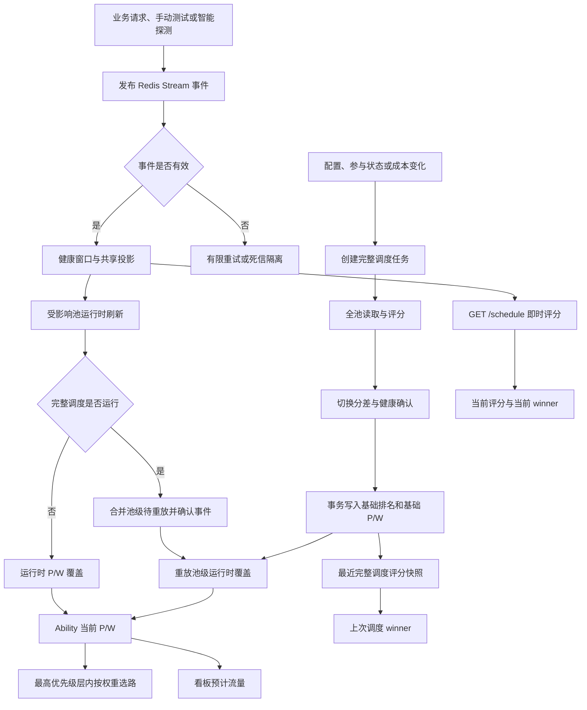

# 智能调度实现审查与整改需求

## 1. 文档信息

| 项目 | 内容 |
| --- | --- |
| 文档类型 | 现状审查、问题分析与整改需求 |
| 文档状态 | 第一阶段整改已实施，待评审 |
| 审查日期 | 2026-08-17 |
| 审查范围 | 智能调度配置、评分、完整调度、实时调度、稳定性保护、实际选路、任务可靠性、Redis 事件链路、管理看板 |
| 主要输入 | 当前代码、`智能调度产品需求文档.md`、`docs/downstream/channel-monitor/` 下的运维与实现文档、线上截图 |
| 本文目标 | 说明系统当前如何工作，解释线上“低倍率且高评分但预计流量不变”的原因，并形成可执行的整改与验收要求 |

### 1.1 2026-08-17 整改实施状态

本次已针对线上故障链完成止损和一致性修复，状态如下：

| 编号 | 状态 | 已实施内容 |
| --- | --- | --- |
| SCH-P0-001 | 已完成 | 生产 Redis 聚合器不再为请求事件安装完整调度回调；请求事件只执行运行时保护和受影响池刷新。完整调度运行期间，事件改为合并进池级重放队列并正常确认，不再向消费者返回协调错误。 |
| SCH-P0-002 | 已完成 | 无法解析、字段不一致或顺序非法的消息立即进入死信 Stream；处理器错误按消息记录失败次数，默认 20 次后逐条隔离，正常消息可独立提交。消费者优先重试本实例 pending，并在处理器失败期间保持心跳。死信 Stream 上限为 10000 条。 |
| SCH-P1-003 | 已完成 | “当前评分第一”改用 `current_window_score_details.decision`；上次完整调度赢家单独标注，实际主渠道和预计流量继续使用当前实际 P/W。 |
| SCH-P1-004 | 部分完成 | 页面已使用同一当前窗口决策生成赢家和未切换原因，但后端独立 `pool_decisions` 与完整输入/应用修订契约仍属于后续结构化改造。 |
| SCH-P1-005 | 部分完成 | 现有 required-task 合并和运行中后继任务机制继续生效；本次消除了请求事件造成的任务风暴。持久化 `dirty/input_revision/applied_revision` 仍需按阶段二实施。 |
| SCH-P1-006 | 已完成 | 控制面返回 `smart_schedule_config_error` 并关闭无效调度配置；数据面遇到已启用但无效的策略时按全部池受管处理，只允许已有参与状态的路由，不再回退官方候选。 |
| SCH-P2-007 | 已完成 | 当前评分第一但尚未成为实际主渠道的路由也展示软健康和切换证据。 |
| SCH-P2-008 | 已完成 | `realtime_degraded=true` 时不再显示“当前无需切换”，统一提示实时评分与实际流量可能不同步。 |
| SCH-P2-011 | 已完成（本次范围） | 新增请求事件不触发完整调度、完整任务期间池级重放、坏消息隔离、有限重试、配置失效保护、跨快照赢家和降级文案回归测试。 |

新增运行可观测字段：`quarantine_count`、`last_quarantined_at`。死信数据保存在 `channel_monitor:v1:dead_letters`，包含原消息 ID、事件 ID、原始 payload、错误、失败次数和隔离时间。

## 2. 审查结论

### 2.1 总体结论

本次线上问题不是单一评分算法错误，而是整改前存在三类叠加问题：

1. **展示数据不属于同一个决策快照。** 看板的“当前评分”是查询时即时重算，“评分第一”和部分“未切换原因”来自上一次完整调度，“预计流量”又来自当前实际 P/W。三种时间口径被放在同一视图中，造成自相矛盾的结论。
2. **实时事件链路与完整调度职责发生冲突。** 每批可调度业务事件在完成实时池刷新后，还会创建全局完整调度任务；完整调度运行时，实时刷新会返回错误并让 Redis 消息重试。这与原需求中“请求事件只刷新受影响池、不触发全池完整评分”的约束不一致，也会形成调度任务和 Redis 重试相互放大的反馈环。
3. **系统缺少可证明的最终收敛机制。** 多处管理变更忽略调度任务入队错误，完整调度失败后也没有基于输入修订号的自动补偿；同时，Redis 批处理中任一确定性错误可让整批消息无限重试。任何一处失败都可能让实际 P/W 长时间停留在旧结果。

因此，线上截图中的“预计流量 100% 仍在 `a-2`”在**当前实际 P/W 语义下计算正确**，但当时实际 P/W 没有及时收敛、看板又错误地把历史决策当成当前评分结论。

本次已完成故障主链整改：请求事件不再触发全局完整调度；完整调度运行期间改为合并池级重放且不阻塞消息确认；坏消息可有限重试并隔离；当前 winner、历史 winner、实际主渠道和预计流量已分开展示。当前仍未完全解决的是管理变更到完整调度结果之间缺少持久化 `input_revision/applied_revision` 收敛契约，以及服务端权威 `pool_decisions` 对象。

### 2.2 问题优先级

| 优先级 | 总数 | 已完成 | 部分完成/待处理 |
| --- | ---: | ---: | --- |
| P0 | 2 | 2 | 0 |
| P1 | 4 | 2 | 2（权威池级决策、持久化修订收敛） |
| P2 | 5 | 3 | 2（流量口径、暂停命名） |

## 3. 审查目标与非目标

### 3.1 审查目标

- 还原从配置变化或请求事件到最终渠道选路的完整链路。
- 区分评分第一、选中主渠道、实际最高优先级层和预计流量。
- 检查完整调度与运行时调度的职责边界、并发保护和失败恢复。
- 检查 Redis 消费、系统任务、配置解析和多实例场景下的最终一致性。
- 检查看板是否使用同一时点、同一版本、同一决策语义的数据。
- 给出可分阶段实施、可自动化验证的整改要求。

### 3.2 非目标

- 本文不直接修改评分权重、阈值或业务定价策略。
- 本文不要求取消主渠道切换分差、健康确认、稳定性保护等安全门槛。
- 本文不把“当前窗口分数更高”直接定义为“必须立即切换”；切换仍须满足明确配置的安全门槛。
- 本文不以看板推算替代真实请求流量统计。

## 4. 核心概念与真实语义

### 4.1 状态作用域

| 对象 | 当前作用域 | 说明 |
| --- | --- | --- |
| 调度池 | `(group, model)` | 同一分组和模型内比较、选主和分配 P/W |
| 路由决策状态 | `(channel, group, model)` | 参与状态、基础 P/W、运行时覆盖、稳定性状态、最近调度结果 |
| 请求观测 | `(channel, normalized model)` | Redis 中的业务、手动测试和定时探测样本可被多个分组投影复用 |
| 429 冷却 | `(channel, normalized model)` | 首请求优先避让；没有其他候选时允许最终兜底 |
| 实际选路 | `(group, request model)` | 在命中的最高优先级层内按权重随机选择 |

### 4.2 必须分开的四个概念

| 概念 | 含义 | 当前数据来源 |
| --- | --- | --- |
| 当前窗口评分第一 | 使用查询时窗口数据即时计算出的最高分渠道 | `GET /schedule` 的 `current_window_score_details.decision.raw_winner_channel_id` |
| 最近完整调度评分第一 | 上一次完整调度任务固化的最高分渠道 | `state.last_schedule_score_details.decision.raw_winner_channel_id` |
| 实际主渠道 | 当前有效路由中，实际最高优先级层内的唯一渠道，或该层中唯一最大权重渠道 | 当前 Ability P/W 加参与、暂停、冷却等过滤条件 |
| 预计流量 | 当前最高优先级层内的 `route.weight / top_layer_total_weight` | 前端根据当前实际 P/W 推算 |

这四个值允许因切换分差、健康确认、管理员固定、临时采样、稳定性保护或异步延迟而不同，但看板必须明确标注差异原因和各自时间点。

## 5. 当前实现方式

### 5.1 配置与参与准入

1. 全局开关和分组策略来自 `ChannelMonitorSmartScheduleEnabled` 与 `ChannelMonitorSmartScheduleGroupPolicies`。
2. 每个分组策略配置模型范围、评分方式、稳定性、样本补充、切换阈值和应用方式。
3. 智能调度开启后，命中策略的 `(group, model)` 池进入严格准入模式，只允许 `participation_set=true && excluded=false` 的路由承接首请求、亲和和重试流量。
4. 未命中策略的池继续使用原有渠道候选与渠道默认 P/W。
5. 路由级暂停会同时影响普通选路和亲和；429 冷却是独立的渠道模型避让状态。

主要实现：

- `controller/channel_ratio_monitor_schedule_group_policy.go`
- `model/channel_smart_schedule_traffic_policy.go`
- `model/channel_smart_schedule_route_cache.go`
- `model/channel_smart_schedule_affinity.go`

### 5.2 经济分层

系统根据渠道成本倍率与分组倍率计算毛利：

```text
gross_margin = group_ratio - cost_ratio
```

- `gross_margin > 0`：正常盈利候选。
- `gross_margin == 0`：`break_even_fallback`，放入 P1 保本兜底层。
- 成本或分组倍率缺失、或 `gross_margin < 0`：不具备正常评分资格。

“成本倍率更低”会提高成本指标的归一化得分，但它不是绕过样本、健康、切换阈值和保护状态的绝对选主规则。

主要实现：`controller/channel_ratio_monitor_schedule_economics.go`。

### 5.3 评分计算

同一调度池内对可用指标做相对归一化：

```text
成本倍率分 = (池内最大成本倍率 - 当前成本倍率) / (最大值 - 最小值)
首字耗时分 = (池内最大首字耗时 - 当前首字耗时) / (最大值 - 最小值)
TPS 分     = (当前 TPS - 池内最小 TPS) / (最大值 - 最小值)
```

规则如下：

1. 指标至少需要达到最小样本数和最小可比渠道数才参与评分。
2. 缺失指标不按零分处理，而是在剩余可用指标间重新归一化有效权重。
3. `smart` 默认业务权重为成本 40%、首字 40%、TPS 20%。
4. `ratio` 默认业务权重为成本 70%、首字 20%、TPS 10%。
5. 启用稳定性且稳定性样本有效时：

```text
final_score = business_score * (1 - stability_weight)
            + stability_score * stability_weight
```

6. 所有分数最终限制在 `[0, 1]`。

主要实现：

- `controller/channel_ratio_monitor_schedule_scoring.go`
- `controller/channel_ratio_monitor_schedule_score_details.go`

### 5.4 完整调度

完整调度任务类型为 `channel_smart_schedule`，按全部配置池执行：

1. 读取控制修订号、经济修订号、路由状态、Ability、渠道状态和窗口指标。
2. 按 `(group, model)` 构造候选并评分。
3. 计算原始评分第一、满足切换分差后的有效主渠道、基础排名和基础 P/W。
4. `priority_weight` 模式为正常候选生成唯一优先级，最高优先级承接正常流量；`weight` 模式在同层按目标比例分配权重。
5. 若启用自适应采样，评分第一的备用渠道还必须满足健康证据、健康状态和健康请求占比，才可替换当前主渠道。
6. 使用控制修订、经济修订、路由修订和整池 guard 做事务写入；任一池发生并发冲突时整池不应用。
7. 完整调度只更新基础快照；存在运行时覆盖时保留实际覆盖，提交后再触发池级软刷新。

主要实现：

- `controller/channel_ratio_monitor_schedule.go`
- `controller/channel_ratio_monitor_schedule_route.go`
- `model/channel_smart_schedule_route.go`
- `model/system_task_required.go`

### 5.5 主渠道切换门槛

评分第一不等于立即切换。当前至少存在两层门槛：

1. **得分差门槛**：挑战渠道得分减当前主渠道得分必须达到 `primary_switch_threshold_percent`。
2. **备用健康确认**：启用自适应采样时，备用渠道必须满足：
   - 样本欠账为 `0`；
   - 存在足够健康证据；
   - 当前健康状态为 `healthy`；
   - 健康请求占比达到 `adaptive_sampling_switch_confirm_request_percent`。

管理员固定主渠道、稳定性硬保护、429 冷却、路由暂停和请求大小限制还可能覆盖正常评分决策。

主要实现：

- 得分差：`controller/channel_ratio_monitor_schedule.go` 中 `channelSmartScheduleEffectivePrimaryId`
- 完整调度健康确认：同文件中的 `channelSmartScheduleApplySwitchConfirmation`
- 实时切换确认：`controller/channel_ratio_monitor_schedule_runtime.go` 中池级软刷新逻辑

### 5.6 实时调度与运行时覆盖

业务请求、手动测试和智能探测产生 Redis Stream 事件。逻辑聚合器依次执行：

1. 更新渠道模型健康窗口。
2. 更新共享监控投影。
3. 执行稳定性保护、429 冷却、自适应采样和受影响池软刷新。
4. 全部成功后写去重标记并确认 Stream 消息；生产聚合器不再触发完整调度任务。

受影响池刷新采用约 1 秒的进程内合并队列。若完整调度正在运行，事件对应的 `(channel, model)` 刷新项会重新进入队列，当前 Redis 消息仍正常确认；完整调度完成后仅按最新池状态重放，不把任务互斥升级为消费者错误。

Redis 消费者按消息隔离故障：格式、字段一致性或顺序校验失败的事件立即进入 `channel_monitor:v1:dead_letters`；处理器错误按消息累计投递次数，默认达到 20 次后逐条重试该批，合法事件独立提交，持续失败事件进入死信。消费者会优先读取本实例 pending，并在处理器错误期间保持租约心跳。

运行时软刷新只针对受影响池，负责：

- 样本欠账与探索流量。
- 主渠道有压力时的自适应备援流量。
- 备用渠道达到完整条件后的实时换主。
- 稳定性试放恢复。
- 基础主渠道与运行时主渠道的 P/W 交换。

主要实现：

- `service/channel_monitor_redis_aggregator.go`
- `service/channel_monitor_redis_consumer.go`
- `controller/channel_ratio_monitor_schedule_redis_runtime.go`
- `controller/channel_ratio_monitor_schedule_runtime.go`

### 5.7 稳定性保护与探测

- 连续失败或短窗口失败率达到阈值时，可立即把路由降级到安全 P/W。
- 降级后进入独立计时与试放，不依赖完整评分周期。
- 定时探测仅对支持文本 Responses 协议的渠道执行。
- 恢复需要满足样本数与稳定性分数，并推进共享观测边界，后续重新积累。
- 管理员固定可配置是否允许稳定性保护临时降级。

主要实现：

- `controller/channel_ratio_monitor_schedule_runtime.go`
- `controller/channel_ratio_monitor_schedule_probe.go`
- `model/channel_smart_schedule_route.go`

### 5.8 实际选路

首次选路的实际算法是：

1. 过滤未参与、已排除、渠道或 Ability 未启用、路由暂停、路径不支持、请求大小不匹配的候选。
2. 429 冷却渠道优先避让；没有其他候选时才作为最终兜底。
3. 找到当前最高优先级层。
4. 在该层内按 Ability 权重随机选择；全部权重为零时等概率选择。
5. 普通重试按下一优先级层或排除集合继续选择；稳定性降级路由只允许在重试兜底阶段出现。
6. 亲和渠道必须仍在当前最高优先级层，否则暂时失效。

主要实现：

- `model/channel_smart_schedule_route_cache.go`
- `model/channel_database_selection.go`
- `model/channel_weight_selection.go`
- `model/channel_smart_schedule_affinity.go`
- `controller/relay_retry_routing.go`

### 5.9 看板数据生成

`GET /schedule` 同时返回：

- 当前实际 P/W、参与状态和运行时状态。
- 上一次完整调度固化的 `last_schedule_score_details`。
- 查询时基于当前 Redis 窗口重新计算的 `current_window_score_details`。
- Redis 的 `processed_at`、`event_watermark`、积压、消费者心跳和降级状态。

前端当前行为：

- “当前评分”显示 `current_window_score`。
- “当前评分第一”读取当前窗口 `current_window_score_details.decision.raw_winner_channel_id`。
- “上次调度”单独读取 `last_schedule_score_details.decision.raw_winner_channel_id`，不再冒充当前 winner。
- “实际主渠道”和“预计流量”根据当前实际 P/W 在前端重建。
- “未切换原因”和健康证据来自当前 winner 的当前窗口 decision。
- `realtime_degraded=true` 时显示“实时链路已降级，当前评分与实际流量可能不同步”，不再显示确定性的“当前无需切换”。
- Redis 状态显示隔离数量和最后隔离时间；无效策略配置通过 `smart_schedule_config_error` 在主状态区显式展示。

主要实现：

- `controller/channel_ratio_monitor_schedule_route_api.go`
- `controller/channel_ratio_monitor_schedule_route_estimate.go`
- `web/src/features/channel-monitor/lib/smart-schedule-summary.ts`
- `web/src/features/channel-monitor/components/channel-monitor-smart-schedule-pool.tsx`

## 6. 端到端链路



当前链路把事件驱动的运行时调度与输入变更驱动的完整调度分开。请求事件不会创建完整调度任务；两条链只在基础快照提交后的池级重放处汇合。

## 7. 线上截图还原

截图时间约为 2026-08-17 10:24:20，关键数据如下：

| 渠道 | 成本倍率 | 当前窗口评分 | 基础 P/W | 当前 P/W | 看板预计流量 |
| --- | ---: | ---: | --- | --- | ---: |
| `md`，ID 14 | `0.05` | `90.0` | `P4 / W1000` | `P3 / W1000` | `0%` |
| `a-2`，ID 22 | `0.0544` | `76.7` | `P3 / W1000` | `P4 / W1000` | `100%` |

### 7.1 为什么预计流量没有变化

实际选路只在当前最高优先级层选择。`a-2` 当前为 P4，`md` 当前为 P3，因此首次选路只会进入 `a-2`，预计流量为 100%。该计算符合当前路由实现。

### 7.2 为什么“评分第一”仍显示 `a-2`

`md=90.0` 和 `a-2=76.7` 是查询时即时评分，但池头部“评分第一”读取的是上一次完整调度持久化 winner。因此看板把历史 winner `a-2` 与即时分数并列展示，造成明显矛盾。

### 7.3 为什么当前 P/W 没有回到 `md`

存在两种必须区分的可能：

1. **合理阻止切换**：`md` 尚未满足切换分差、样本欠账、健康证据或健康请求占比要求。
2. **调度链路未收敛**：实时消费者停止或持续重试，受影响池没有执行新的运行时刷新。

截图同时显示：

- 消费者已停止。
- 实时数据已降级。
- 消费延迟约 44 秒。
- 重试 4178 次、接管 3595 次。

这组指标与同一批 pending 消息被反复接管和失败高度一致。由于当前看板不显示备用渠道的切换健康证据，也没有权威的池级当前决策状态，用户无法从页面判断究竟是安全门槛阻止切换，还是消费者故障导致没有执行切换。

### 7.4 截图结论

- 预计流量公式本身没有把低倍率或高评分算错，它反映的是当时实际 P/W。
- 截图中的“评分第一”标签使用了错误时间口径，不能代表当时的当前窗口结果；本次已修正。
- 截图中的实时消费者异常很可能是 P/W 没有重新收敛的重要原因；对应反馈环和坏消息阻塞已修复。
- 截图时页面缺少足够证据证明“不切换”是正确决策；本次已补充当前 winner 的软健康与切换证据，完整的权威池级决策仍属于 SCH-P1-004。

## 8. 问题清单

### SCH-P0-001 请求事件触发完整调度，与实时刷新形成反馈环（已整改）

**整改前现状**

- 所有业务事件和智能探测事件默认 `scheduling_eligible=true`。
- 整改前，Redis 聚合器先执行运行时副作用，再调用 `requestChannelSmartScheduleRunForRedisEvents` 创建全局完整调度任务；该生产回调和对应文件现已删除。
- 完整调度运行时，`refreshChannelSmartScheduleRedisAdaptiveRoute` 返回“完整调度运行期间延后 Redis 自适应刷新”错误。
- 该错误会让整批 Stream 消息保持 pending，并使消费者退出本轮；监督器稍后重新启动消费。

**与需求的冲突**

`智能调度产品需求文档.md` 1.3 明确要求：请求事件只刷新受影响池，不针对单个请求重算全池完整评分和基础排名。整改前实现却为每批可调度事件创建全局完整调度任务。

**影响**

- 高频业务事件可持续创建或合并完整调度任务。
- 完整调度与实时刷新互相等待，增加消费者重试、接管和积压。
- 完整调度扫描所有池，工作量与事件涉及的单个池不匹配。
- 实时保护、采样、恢复和换主的延迟随全局池规模扩大。

**整改要求**

1. 删除业务请求事件对完整调度任务的直接触发。
2. 请求事件只提交受影响 `(group, model)` 池的运行时 dirty 标记或直接执行幂等软刷新。
3. 完整调度运行时到达的软事件不得返回消费者级错误；应记录 `event_sequence` 和池级待重放状态，待基础快照提交后重放。
4. 只有配置、参与状态、经济输入、管理员手动执行或强制重置可以触发完整调度。
5. 增加单位时间内完整调度触发来源、合并次数和运行耗时指标。

**验收标准**

- 连续发布 10 万条正常业务事件时，不新增 `redis.health_event` 来源的完整调度任务。
- 完整调度持续运行期间，Redis 消费者仍可确认事件，受影响池在任务完成后只重放一次最新状态。
- 事件处理不会因为“完整调度正在运行”增加 retry count。

**实施结果**

- 生产聚合器不再安装完整调度回调，请求事件仅执行运行时副作用。
- 完整调度运行时把受影响池重新放入合并队列并返回成功，消费者可正常确认消息。
- 已增加“不触发完整调度”和“完整任务期间池级重放”回归测试。

### SCH-P0-002 Redis 批处理缺少坏事件隔离和有限重试（已整改）

**整改前现状**

- 每批最多读取 100 条消息。
- 解析、投影、运行时副作用或任务触发中的任一错误会使整批消息不确认。
- pending 处理优先于新消息；只要存在 pending，消费者不会继续读取新消息。
- 没有单消息尝试次数、最大重试、隔离队列或死信队列。
- 监督器会以 1 至 30 秒退避重启，但会再次遇到同一确定性错误。

**影响**

- 一条无法修复的事件或一个持续配置冲突可以阻塞全部后续实时数据。
- heartbeat 在退避或持续错误期间过期，看板显示“消费者已停止”。
- retry/takeover 只累计数量，不告诉管理员是哪条消息、哪个阶段、最后一次错误。
- 健康窗口、稳定性保护、实时换主和监控数据同时停止推进。

**整改要求**

1. 按消息而不是按整批记录失败次数和最后错误阶段。
2. 可恢复错误使用有上限的指数退避；确定性格式错误立即隔离。
3. 达到阈值后将事件写入死信或隔离结构，保留原始 Stream ID、event_id、payload、错误、次数和时间，再确认原消息，避免阻塞后续事件。
4. 运行时配置冲突使用池级重放，不得当作坏事件无限重试。
5. 增加“最老失败事件、失败阶段、连续失败次数、隔离数量”管理端指标与告警。
6. 提供管理员重放、忽略和查看原始事件的受控操作。

**验收标准**

- 在 99 条合法事件中插入 1 条格式错误事件，合法事件仍能处理完成。
- 坏事件达到配置的重试上限后进入隔离，不再增加主消费组延迟。
- 看板能定位具体失败事件与处理阶段。

**实施结果**

- 确定性无效消息立即隔离；处理器错误默认在第 20 次投递后进入逐条判定。
- 合法消息可独立提交，持续失败消息写入 `channel_monitor:v1:dead_letters` 后确认原消息。
- 新增 `quarantine_count` 和 `last_quarantined_at`，并在看板 Redis 状态中展示。
- 管理员死信查看与受控重放接口尚未实现，保留在运维闭环范围。

### SCH-P1-003 看板混用即时评分和历史决策快照（已整改）

**整改前现状**

- 后端在每次 `GET /schedule` 时计算 `current_window_score_details`。
- 前端 `getChannelMonitorSmartSchedulePoolRoutingSnapshot` 只从 `last_schedule_score_details` 选择 winner。
- 路由表显示即时分数，但“评分第一”徽标和池头部评分第一使用历史 winner。
- “未切换原因”的显示条件取决于历史 winner，原因内容却可能来自当前窗口 decision。

**影响**

- 当前分数最高的渠道没有“评分第一”标记。
- 历史 winner 可被错误标为当前评分第一。
- 当前 winner 与实际主渠道不同时，页面仍可能显示“当前无需切换”。
- 管理员无法据此判断算法是否执行正确。

**整改要求**

1. “当前评分第一”必须只使用同一池的 `current_window_score_details.decision.raw_winner_channel_id`。
2. 历史结果单独命名为“最近完整调度评分第一”，显示任务时间和任务 ID。
3. “未切换原因”必须来自与当前 winner 同一决策快照，禁止混用历史 winner 和当前 reason。
4. 如果当前窗口不完整或实时数据降级，标签改为“当前窗口评分（数据降级）”，不得作为确定性结论。
5. 增加覆盖“即时 winner 与历史 winner 不同”的前端测试。

**验收标准**

- 输入截图中的数据后，页面显示“当前评分第一：md”“最近完整调度评分第一：a-2”。
- “未切换原因”只能显示 `md` 相对当前实际主渠道的切换门槛结论，或明确显示数据降级无法判定。

**实施结果**

- 当前 winner、上次调度 winner、实际主渠道和预计流量已使用各自明确的数据来源。
- 当前 winner 与历史 winner 不同、实时降级时隐藏确定性结论均已有前端回归测试。
- 服务端权威 `pool_decisions` 仍未实现，因此该次前端修复保持为现有 API 上的一致性修正。

### SCH-P1-004 缺少权威的池级当前决策与版本契约

**现状**

后端返回逐路由数据，前端自行推断：

- 实际最高层。
- 实际主渠道。
- 当前评分第一。
- 预计流量。
- 未切换原因。

当前没有一个服务端生成的、绑定同一 `generated_at/data_cutoff_at/event_watermark/control_revision/economic_revision` 的池级决策对象。

**影响**

- 前端只能从多个路由和多个时间点拼接结论。
- 运行时 P/W、基础 P/W 和完整调度快照之间的差异无法被权威解释。
- 多路由读取窗口期间到达新事件时，池内评分输入也可能不是严格一致的快照。
- API 消费方容易重复实现不同的推断规则。

**整改要求**

`GET /schedule` 应由后端返回 `pool_decisions[]`，至少包含：

| 字段 | 要求 |
| --- | --- |
| `group/model` | 池唯一键 |
| `generated_at/data_cutoff_at/event_watermark` | 当前窗口时间和事件位置 |
| `control_revision/economic_revision` | 评分输入版本 |
| `current_scoring_winner_channel_id` | 当前窗口评分第一 |
| `last_full_schedule_winner_channel_id` | 最近完整调度评分第一 |
| `actual_primary_channel_id` | 当前实际主渠道 |
| `actual_highest_priority/top_layer_channel_ids` | 当前实际路由层 |
| `decision_state` | `applied`、`blocked`、`pending`、`stale`、`degraded` 等明确状态 |
| `blocking_reasons[]` | 分差、样本欠账、健康证据、固定、稳定性、冷却、暂停、任务未应用等结构化原因 |
| `input_revision/scheduled_revision/applied_revision` | 调度收敛状态 |
| `realtime_degraded` | 当前结论是否受实时链路影响 |

前端不得再自行决定 winner 或拼接跨快照原因。

### SCH-P1-005 调度任务入队和执行失败不保证最终收敛

**现状**

- `requestChannelSmartScheduleRun` 会返回入队错误并写日志。
- 渠道创建、编辑、删除、启停、倍率更新、上游模型更新、路由暂停等大量调用点使用 `_ = requestChannelSmartScheduleRun(...)` 忽略错误。
- 部分接口即使调度任务入队失败，也返回业务变更成功且不返回调度 dirty 状态。
- 完整调度发生整池冲突时再次请求任务，但该错误也被忽略。
- 非周期完整调度任务失败后，没有按输入修订号自动重试到成功的机制。

**影响**

- 成本倍率或参与状态已经变化，但基础 P/W 仍保持旧值。
- 系统没有“最新输入已应用”的可证明条件。
- 日志之外没有持续可见的待应用状态，管理员容易把旧 P/W 当成当前策略结果。

**整改要求**

1. 所有会改变调度输入的写操作必须原子推进 `input_revision` 或写 durable dirty 记录。
2. API 成功语义二选一：调度任务成功持久化；或明确返回 `schedule_dirty=true` 和可跟踪的修订号。
3. 后台必须持续重试，直到 `applied_revision >= input_revision`，不能依赖下一次人工变更或业务事件。
4. 任务失败、租约过期、整池冲突都必须保留 dirty 状态，并使用有上限退避重试。
5. 看板显示输入修订、已排队修订、已应用修订、最后成功时间和最后错误。
6. 禁止新增忽略调度入队错误的调用点；现有调用点逐一改造并加测试。

**验收标准**

- 注入一次数据库入队失败后，业务变更不会静默显示为已完全生效。
- 恢复数据库后，无需再次编辑配置即可自动应用最新修订。
- 多次快速变更最终只需应用最新修订，且不会丢失 `force_reset` 等强语义。

### SCH-P1-006 配置解析失败在控制层与实际选路层行为不一致（已整改）

**整改前现状**

- 控制层 `parseChannelSmartScheduleGroupPolicies` 遇到 JSON 或规范化错误时返回空数组，并把内存中的 `smartScheduleEnabled` 改为 `false`。
- 实际选路层直接读取原始 Option；若原始 enabled 为 `true` 而策略 JSON 无法解析，会保留 `enabled=true` 但管理池集合为空。
- 结果是控制层认为智能调度已关闭，实际选路层却把所有池视为未管理池并回退官方候选。

**影响**

- 升级后旧配置不兼容、人工修改数据库或数据损坏时，调度可能静默失效。
- 严格参与准入被绕过，原本未参与的渠道可能重新进入候选。
- API、任务和实际选路对“是否启用”给出不同答案。

**整改要求**

1. 配置只允许通过一个共享的解析与验证结果进入控制层和选路层。
2. 保存前严格验证；启动和热加载时解析失败必须产生显式 `config_fault`，不得伪装成普通关闭。
3. 明确选择故障策略：优先保留最近一次已验证配置；没有可用快照时，对原已管理范围 fail closed，并提供管理员恢复入口。
4. 配置故障必须告警并进入管理审计，返回具体字段错误。
5. 增加旧版本配置迁移和损坏配置的启动测试。

**实施结果**

- 控制 API 通过 `smart_schedule_config_error` 显式返回配置错误，并在解析失败时关闭控制面调度执行。
- 实际选路对“已启用但策略无效”的状态 fail closed：所有池按受管处理，仅保留已有参与状态的路由，不再回退未受管官方候选。
- 已增加无效配置下控制面和选路层行为的回归测试。最近有效配置快照属于后续增强，不影响当前 fail-closed 一致性。

### SCH-P2-007 看板隐藏备用渠道的切换健康证据（已整改）

**整改前现状**

`RouteAdaptiveHealthSummary` 只在实际主渠道上展示健康状态。备用渠道是否具备 `health.evidence`、当前健康状态和健康请求占比，正是允许换主的关键条件，却没有在备用行直接显示。

**整改要求**

- 对当前评分第一但非实际主渠道的路由，展示样本欠账、健康证据、健康状态、健康请求占比、要求阈值和最近样本时间。
- 将每个未满足条件显示为结构化阻塞项，不仅显示一段合并文案。
- 健康确认通过后仍未应用时，显示任务或事件链路的 pending/stale 状态。

**实施结果**

- 当前评分第一即使尚未成为实际主渠道，也会展示软健康状态与切换证据。
- 完整的服务端 `pending/stale` 修订状态依赖 SCH-P1-004、SCH-P1-005，仍在后续结构化改造范围。

### SCH-P2-008 实时降级时仍以“当前”口吻展示调度结论（已整改）

**整改前现状**

页面顶部会提示消费者停止和实时数据降级，但池内仍继续显示“当前评分”“评分第一”“当前无需切换”等确定性文案。

**整改要求**

- `realtime_degraded=true` 时，所有依赖实时窗口的结论必须带降级标记。
- `data_cutoff_at` 落后超过策略允许阈值时，不得显示“当前无需切换”，改为“实时决策未知，实际 P/W 保持在最后已应用状态”。
- 实际 P/W 和按其计算的流量仍可展示，但必须标注“最后已应用路由”，并显示应用时间和修订号。

**实施结果**

- `realtime_degraded=true` 时统一显示“实时链路已降级，当前评分与实际流量可能不同步”。
- 降级状态下不会再显示“当前无需切换”。应用修订号和最后应用时间依赖 SCH-P1-005，待后续补齐。

### SCH-P2-009 “预计流量”口径不足以代表全部请求流量

**现状**

前端预计流量只按当前最高优先级层和权重计算，实际表达的是**首次普通选路概率**。它不包含：

- 普通重试进入下一优先级层。
- 快速同渠道重试。
- 渠道亲和。
- 429 冷却兜底。
- 请求大小限制的软过滤与兜底。
- 自动分组和跨组重试。
- 低请求量下随机误差。

**整改要求**

- 标签改为“预计首次选路占比”，并保留当前 P/W 公式说明。
- 如果产品需要“实际流量分布”，应新增基于真实事件的已选渠道计数和时间窗口统计，不得继续用 P/W 推算替代。
- 降级路由和重试层的预计值不要混入首次选路占比。

### SCH-P2-010 路由暂停的命名与需求文档不一致

**现状**

- 产品需求文档写明“不增加分组级暂停”，并建议使用单路由参与开关。
- 当前代码类型和接口处理器仍命名为 `GroupPause`，但实际唯一键是 `(channel, group, model)`，功能和页面文案均是“路由流量暂停”。
- 运维文档已说明“不提供分组级暂停接口”。

**整改要求**

- 明确产品是否接受“单路由临时流量暂停”作为正式能力。
- 若接受，更新主需求文档并统一命名为 `RouteTrafficPause`，迁移时保持数据库兼容。
- 若不接受，移除该能力并提供参与开关的等价操作说明。
- 在决定前不得继续以 `GroupPause` 名称扩展接口或数据模型。

### SCH-P2-011 缺少跨快照和故障收敛回归测试（本次范围已整改）

本次审查识别出的关键合同测试及当前状态：

1. 已完成：即时 winner 与历史 winner 不同时的池头部和徽标。
2. 已完成：实时数据降级时不显示确定性“当前无需切换”。
3. 已完成：完整调度运行期间业务事件不阻塞 Redis 消费。
4. 已完成：单条坏事件不阻塞同批及后续合法事件。
5. 待 SCH-P1-005 实现：管理变更入队失败后自动收敛到最新输入修订。
6. 已完成：损坏配置下控制层与实际选路层行为一致。
7. 待 SCH-P1-004 实现：服务端池级决策对象与实际 Ability P/W 一致。

## 9. 目标状态需求

### 9.1 调度职责边界

| 事件类型 | 目标处理方式 | 是否完整调度 |
| --- | --- | --- |
| 分组策略、评分参数、窗口配置变化 | 持久化输入修订，创建或合并完整调度任务 | 是 |
| 路由参与、渠道状态、模型集合变化 | 持久化输入修订，创建或合并完整调度任务 | 是 |
| 成本倍率、分组倍率变化 | 持久化经济修订，创建或合并完整调度任务 | 是 |
| 管理员立即调度、强制重置 | 创建完整调度任务 | 是 |
| 普通业务成功或失败 | 更新投影并刷新受影响池 | 否 |
| 429 | 更新冷却并立即刷新受影响池 | 否 |
| 连续失败或短窗口失败率触发 | 原子应用稳定性保护 | 否 |
| 样本欠账、探索、自适应备援 | 合并刷新受影响池 | 否 |
| 定时探测结果和恢复 | 更新共享样本并刷新受影响池 | 否 |

### 9.2 一致性状态机

每个调度输入变更都应拥有可比较的修订：

```text
input_revision > scheduled_revision
    -> dirty，必须创建或合并任务

scheduled_revision >= input_revision > applied_revision
    -> pending/running，尚未生效

applied_revision >= input_revision
    -> converged，最新输入已经应用

task failed && applied_revision < input_revision
    -> failed_dirty，自动重试且告警
```

完成任务只代表“执行结束”，不能代替“最新输入已应用”。整池并发冲突、部分失败或任务结果保存失败都不得推进 `applied_revision`。

### 9.3 实时事件处理状态机

```text
published -> projected -> runtime_effect_applied -> acknowledged
                |                  |
                v                  v
          retryable_error     pool_replay_pending
                |
                v
       quarantined_after_limit
```

- `pool_replay_pending` 不得阻塞消息确认。
- 幂等边界必须同时覆盖投影、运行时 P/W 和池级重放。
- 每个阶段都必须保存事件序号，旧事件不得覆盖新状态。

### 9.4 看板决策状态

池级状态至少支持：

| 状态 | 展示语义 |
| --- | --- |
| `applied` | 当前 winner 已满足条件并应用到实际 P/W |
| `blocked_by_margin` | 得分领先不足切换分差 |
| `blocked_by_samples` | 样本欠账或最小可比渠道不足 |
| `blocked_by_health` | 备用健康证据或健康请求占比不足 |
| `manual_override` | 管理员固定覆盖自动决策 |
| `protected` | 稳定性保护或运行时保护覆盖 |
| `pending` | 输入或当前窗口决策尚未应用 |
| `stale` | 已应用修订落后于输入修订 |
| `degraded` | Redis 或消费者异常，无法给出可信实时结论 |
| `config_fault` | 配置无法解析或迁移 |

## 10. 数据与 API 整改要求

### 10.1 新增池级决策对象

后端统一生成池级 `pool_decisions`，前端仅负责展示。逐路由 `current_window_score_details` 继续用于展开解释，但不能再作为跨路由拼接主结论的唯一来源。

### 10.2 新增收敛字段

建议增加：

- `input_revision`
- `scheduled_revision`
- `applied_revision`
- `last_applied_at`
- `last_task_id`
- `last_task_status`
- `last_task_error`
- `schedule_dirty`
- `replay_pending`

### 10.3 新增事件故障字段

建议增加：

- `failed_event_id`
- `failed_stream_id`
- `failed_stage`
- `failed_attempts`
- `failed_first_at`
- `failed_last_at`
- `failed_last_error`
- `quarantined_count`
- `last_quarantined_at`

### 10.4 兼容要求

- 新字段以增量方式加入，旧前端可忽略。
- 旧的逐路由 decision 在迁移期保留，只标记为 `last_full_schedule_decision`。
- P/W 和路由状态迁移必须继续支持 SQLite、MySQL 和 PostgreSQL。
- Redis key 或 effect state 升级需要版本前缀或向后兼容读取，避免滚动发布期间双写冲突。

## 11. 可观测性与告警要求

### 11.1 必须新增的指标

- 完整调度任务按触发来源的创建、合并、成功、失败和耗时。
- `input_revision - applied_revision` 的落后量和持续时间。
- 池级 replay pending 数量和最老等待时间。
- Redis 消息按处理阶段的失败次数。
- 单消息重试次数分布、隔离数量和最老隔离时间。
- 当前 pending 数、未投递 lag、消费者 heartbeat、最后成功处理时间。
- 每个池上一次实际 P/W 变化时间和原因。

### 11.2 告警条件

至少覆盖：

- 消费者 heartbeat 过期超过 30 秒。
- 最老未处理事件超过 30 秒并持续两个检测周期。
- 单事件失败超过 3 次。
- `input_revision > applied_revision` 超过 1 分钟。
- 完整调度连续失败或整池冲突超过阈值。
- 配置解析失败或回退最近有效配置。

告警必须包含节点、池、任务 ID、事件 ID、修订号、失败阶段和最后错误。

## 12. 分阶段整改计划

### 阶段一：止损与可信展示

1. 已完成：停止业务事件触发全局完整调度。
2. 已完成：完整调度运行期间的实时事件改为池级待重放，不再返回消费者错误。
3. 已完成：修正即时 winner、历史 winner 和未切换原因的数据来源。
4. 已完成：实时降级时禁止显示确定性当前决策。
5. 已完成：展示备用渠道的健康确认条件。

### 阶段二：保证最终收敛

1. 引入输入、排队、应用修订号和 durable dirty 状态。
2. 改造全部忽略入队错误的调用点。
3. 完整调度失败、冲突和租约丢失自动补偿。
4. 已完成第一步：控制层显式报告配置错误，实际选路对无效已启用配置 fail closed；后续可补最近有效配置快照。

### 阶段三：事件隔离与运维闭环

1. 已完成有限重试和死信隔离；待补管理员查看与受控重放。
2. 增加池级权威决策 API。
3. 完成监控指标、告警和管理操作。
4. 统一路由暂停命名和需求文档。

## 13. 验收测试矩阵

| 编号 | 场景 | 预期结果 |
| --- | --- | --- |
| AC-01 | 当前评分 winner 与历史 winner 不同 | 两者分开展示，徽标不混用 |
| AC-02 | winner 领先但未达到切换分差 | 实际 P/W 不变，明确展示分差和阈值 |
| AC-03 | winner 分差达标但健康确认不足 | 实际 P/W 不变，展示具体健康缺口 |
| AC-04 | winner 满足分差、样本和健康要求 | 受影响池运行时刷新后切换，不需要全局完整调度 |
| AC-05 | 完整调度运行时持续发布业务事件 | 消费者不报错、不停心跳，任务后只重放最新池状态 |
| AC-06 | Stream 中存在格式错误事件 | 错误事件隔离，后续合法事件继续处理 |
| AC-07 | 管理变更时任务入队暂时失败 | API 返回 dirty 状态，后台恢复后自动应用 |
| AC-08 | 完整调度整池 guard 冲突 | 旧结果不覆盖新配置，dirty 修订自动重试 |
| AC-09 | 策略 JSON 损坏 | 控制层和实际选路同时进入明确 `config_fault`，不静默放开候选 |
| AC-10 | Redis 不可用或消费者停止 | 看板显示最后已应用 P/W，不宣称当前无需切换 |
| AC-11 | 429 冷却且还有正常候选 | 首请求避让冷却渠道，预计首次选路占比同步变化 |
| AC-12 | 只有冷却渠道可用 | 允许最终兜底，页面明确标记 |
| AC-13 | 路由暂停、参与关闭、渠道禁用 | 首请求、亲和和重试均遵守各自准入规则 |
| AC-14 | 多实例同时消费和刷新同一池 | 事件序号和整池 guard 保证旧状态不能覆盖新状态 |
| AC-15 | SQLite、MySQL、PostgreSQL | 修订、dirty、隔离和事务行为一致 |

## 14. 审查涉及的主要代码

### 14.1 后端控制与调度

- `controller/channel_ratio_monitor_schedule.go`
- `controller/channel_ratio_monitor_schedule_route.go`
- `controller/channel_ratio_monitor_schedule_runtime.go`
- `controller/channel_ratio_monitor_schedule_redis_runtime.go`
- `controller/channel_ratio_monitor_schedule_route_api.go`
- `controller/channel_ratio_monitor_schedule_route_estimate.go`
- `controller/channel_ratio_monitor_schedule_scoring.go`
- `controller/channel_ratio_monitor_schedule_score_details.go`
- `controller/channel_ratio_monitor_schedule_group_policy.go`
- `controller/channel_ratio_monitor_schedule_economics.go`
- `controller/channel_ratio_monitor_schedule_probe.go`
- `controller/channel_ratio_monitor_schedule_group_pause.go`
- `controller/channel_ratio_monitor_settings.go`

### 14.2 数据、选路与任务

- `model/channel_smart_schedule_route.go`
- `model/channel_smart_schedule_route_cache.go`
- `model/channel_smart_schedule_traffic_policy.go`
- `model/channel_smart_schedule_affinity.go`
- `model/channel_smart_schedule_group_pause.go`
- `model/channel_database_selection.go`
- `model/channel_weight_selection.go`
- `model/system_task_required.go`
- `model/channel_monitor_redis_effect_state.go`
- `service/system_task.go`
- `service/system_task_required.go`
- `service/channel_monitor_redis_consumer.go`
- `service/channel_monitor_redis_runtime.go`
- `service/channel_monitor_redis_aggregator.go`
- `service/channel_monitor_redis_observability.go`
- `service/channel_affinity_schedule.go`

### 14.3 前端看板

- `web/src/features/channel-monitor/lib/smart-schedule-summary.ts`
- `web/src/features/channel-monitor/components/channel-monitor-smart-schedule-pool.tsx`
- `web/src/features/channel-monitor/components/channel-monitor-performance-coverage-alert.tsx`
- `web/src/features/channel-monitor/lib/__tests__/smart-schedule-summary.test.ts`
- `web/src/features/channel-monitor/components/__tests__/smart-schedule-board.test.tsx`

## 15. 最终评审建议

本次问题不建议先通过降低切换阈值或强制调度来掩盖。优先级应为：

1. 已完成故障止损：解除“请求事件触发完整调度”和“完整调度导致事件重试”的反馈环。
2. 已完成现有 API 范围内的展示修正：当前评分、历史决策和实际 P/W 可分开审查。
3. 下一优先级是建立输入修订到已应用修订的持久化最终收敛保证，并由后端输出权威池级决策。
4. 随后补齐死信查看/重放、告警、路由暂停命名和真实流量统计。

本次线上故障主链已经修复，但在 `input_revision/applied_revision` 和 `pool_decisions` 完成前，系统仍不能对所有管理变更给出“最新输入必然已应用”的强一致证明。“立即调度”可以用于人工触发完整重算，但不应替代后续的持久化收敛机制。
