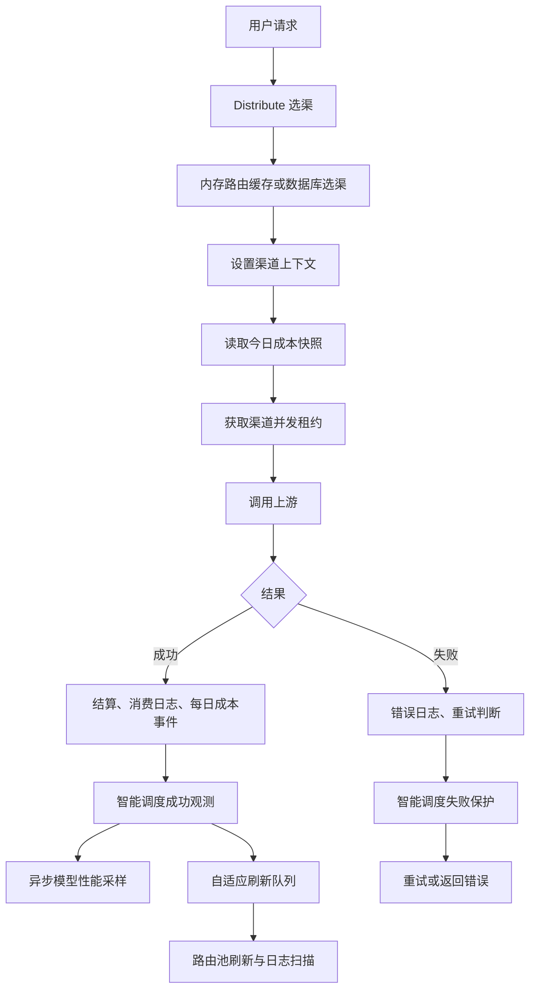

# 渠道监控对用户请求与系统性能的影响分析

> 优化前审查基线：`1e1e0d20b`（`feat(channel-monitor): add channel status monitoring`）
>
> 审查日期：2026-08-12
>
> 当前实现复核：`2a832c292`（`perf(channel-monitor): reduce monitoring overhead`）
>
> 范围：渠道监控、状态监测、智能调度、渠道并发、今日成本和模型性能中与真实用户请求或共享基础设施有关的链路。
>
> 文中源码位置以“文件 + 函数/符号”为准，不使用容易随提交漂移的行号；第 9 节记录的是本轮已执行的优化计划，其余章节描述复核后的当前状态和后续工作。

## 1. 结论

本轮决定：**暂不把真实用户请求写入状态监测执行记录，也不把它作为状态条中的单次状态记录。** 当前真实用户请求不会调用 `SaveChannelStatusProbeExecution`，状态监测数据仍由后台主动探测产生。

这个决定是合理的。若把每个用户请求直接写入状态监测表，会把高频业务流量转换为逐请求数据库插入和状态桶事务，既重复现有模型性能、消费日志和智能调度观测，又会明显放大数据库写入、锁竞争和存储量。

但从整个“渠道监控”模块看，已有若干逻辑直接进入用户请求热路径：

1. 渠道选择与智能调度路由过滤。
2. 渠道并发租约。
3. 今日成本配置快照与请求结算事件。
4. 智能调度的成功、失败运行时观测。
5. 消费日志、错误日志和模型性能采样。

优化前最需要处理的是**智能调度运行时观测与其触发的自适应刷新**：成功请求曾在返回前同步读写 Redis 窗口，失败请求也可能访问数据库。当前已改为成功事件本地更新并进入有界 Redis 批处理队列，运行时状态使用 64 个分片，池级自适应刷新增加去重和默认 10 秒限频；失败路径仍可能同步访问 Redis，刷新计算仍会读取原始日志，因此这些路径仍需压测。

优化前还存在状态探测日志污染业务统计的问题。当前已在分钟聚合、智能调度原始日志读取和样本统计入口统一排除 `channel_monitor_status_probe`，因此主动状态探测不会再作为业务首字、TPS、成功率或自动生产流量样本；显式开启“计入智能调度样本”时，探测结果仍会进入独立共享样本缓冲。这项修复不等同于把真实用户请求写入状态监测执行记录，后者仍明确不计入。

综合判断：

- 仅启用“状态监测”，且探测频率合理时，不会直接增加用户请求中的数据库写入；主要风险是探测与用户请求竞争渠道并发、数据库和 Redis 资源。
- 启用智能调度后，成功观测的同步 Redis 读写已移出请求线程；失败保护、429 冷却写入和配置缓存关闭时的数据库回退仍会影响故障场景尾延迟。
- 自适应刷新已按池去重和限频，但每次刷新仍可能读取最长 30 天的原始日志；这是当前最值得通过压测确认的数据库读放大风险。
- 状态总览已有 3 秒默认 TTL、generation 和 `singleflight`，不会在每次轮询都回源；缓存未命中时仍会读取多个监控表并返回完整时间桶，响应和前端 DOM 规模仍会随渠道、模型和展示窗口增长。
- 未显式启用 `MEMORY_CACHE_ENABLED=true` 时，每次选渠会进入数据库路径，智能调度开启后开销进一步放大，不建议用于生产高并发部署。
- 当前缓存已形成“路由/配置进程内快照、成功观测 Redis 异步汇总、数据库持久化”的分层，但并非所有路径都完全异步；可重算、可丢弃的遥测应失败开放，不能阻塞真实请求，失败保护、计费和租约等正确性路径不在此列。

## 2. 用户请求热路径



关键入口：

- 选渠：`middleware/distributor.go` 的 `Distribute`。
- 渠道上下文与成本快照：`middleware/distributor.go` 的 `SetupContextForSelectedChannel`。
- 并发租约：`controller/channel_concurrency.go` 的 `acquireRelayChannelConcurrency`。
- 上游请求和重试：`controller/relay.go` 的 `Relay`。
- 成功运行时观测：`controller/channel_ratio_monitor_schedule_runtime.go` 的 `observeChannelSmartScheduleRuntimeRequestSuccess`。
- 失败运行时保护：`controller/channel_ratio_monitor_schedule_runtime.go` 的 `protectChannelSmartScheduleRuntimeFailure`。

成功观测发生在上游调用完成后，因此通常不会增加首字时间，但会延迟处理器返回、连接完成和工作协程释放。失败保护发生在下一次重试或最终错误响应之前，对故障场景的用户尾延迟影响更直接。

## 3. 当前同步、异步与缓存情况

| 模块 | 当前行为 | 是否在用户请求同步链路 | 当前缓存 | 风险 |
| --- | --- | --- | --- | --- |
| 状态监测执行记录 | 仅由后台 Worker 主动请求上游并保存记录，真实用户请求不写入 | 否 | 数据库到期查询；配置/立即检测变化可唤醒 Worker | 间接中等 |
| 状态监测总览 | 管理页可见时空闲每 15 秒刷新，执行中每 3 秒刷新 | 否 | React Query + 服务端默认 3 秒 TTL、generation、`singleflight` | 缓存未命中或数据量大时中等 |
| 渠道选择 | 内存缓存关闭时直接查询 Ability、渠道和智能调度状态 | 是 | 可选内存缓存 | 高 |
| 今日成本快照 | 每次选中渠道时读取，命中后使用 1 分钟 | 是 | `sync.Map`、版本号、`singleflight` | 低到中等 |
| 今日成本累计 | 请求线程只聚合到内存，后台批量写库 | 少量同步内存操作 | 有界聚合器 | 低 |
| 渠道并发 | 配有限制时每次上游尝试同步 Redis Acquire/Release | 是 | 配置缓存 1 分钟 | 中到高 |
| 智能调度成功观测 | 配置原始值未变化时复用已解析设置；本地分片更新后投递有界 Redis 批处理 | 是（本地内存操作） | 原始值比较缓存、64 分片本地窗口、有界队列 | 中等 |
| 智能调度自适应刷新 | 成功事件按池合并，延迟处理并按池默认至少间隔 10 秒 | 间接，由用户流量持续触发 | 事件去重 + 池级限频 | 中到高 |
| 智能调度失败保护 | 优先读路由缓存；阈值迁移仍可能同步 Redis/数据库，成功后优先池级刷新 | 是 | 路由反向索引和运行时快照；缓存关闭时数据库回退 | 高（故障场景） |
| 429 冷却读取 | 请求选渠读取原子快照 | 是 | `atomic.Pointer` 快照 | 低 |
| 429 冷却写入 | 仍可能持锁检查数据库修订号并同步 Redis；调用侧未设置显式操作超时 | 是，仅 429 | 有本地原子快照 | 高尾延迟风险 |
| 模型性能采样 | 请求结束后投递 goroutine；每个样本更新本地原子小时桶，Redis 启用时再执行一次 pipeline | 异步 | 本地小时桶 | 间接中等 |
| 分钟聚合 | 每分钟重建最近 2 分钟，整点修复 65 分钟 | 否 | 结果缓存 10 秒、`singleflight` | 间接高 |
| 消费/错误日志 | 启用对应日志时同步写 `LOG_DB`，并重新读取用户设置 | 是 | 用户设置可走 Redis | 中到高 |

## 4. 重点问题

### 4.1 状态监测本身不写真实用户请求，但会竞争共享资源

状态监测 Worker 仅在 Master 节点启动，默认最多并行 5 个探测、上限 20 个。并发值可通过 `CHANNEL_STATUS_PROBE_CONCURRENCY` 配置；无效值回退为 5。单渠道探测间隔默认 300 秒，可配置为 30～86400 秒。

它默认每 1000ms 查询一次到期配置，周期可通过 `CHANNEL_STATUS_PROBE_SCAN_INTERVAL_MS` 调整到 200～30000ms；配置保存和立即检测会主动唤醒 Worker。相关实现位于 `controller/channel_status_probe_worker.go` 的 `startChannelStatusProbeWorker`、`wakeChannelStatusProbeWorker` 和 `model/channel_status_probe.go` 的 `ClaimDueChannelStatusProbes`。

每个模型探测会：

1. 获取与业务请求相同的渠道并发租约，见 `executeChannelStatusProbeModel`。
2. 通过预检、429 冷却和并发租约后才真实请求上游；请求一旦发出就可能产生上游费用，预检失败、冷却中或并发已满时不会发出。
3. 上游成功且完成响应解析后，只有启用消费日志时才会通过 `RecordConsumeLog` 同步写一条状态探测消费日志；关闭消费日志时不写。失败会保存状态探测执行记录，部分失败还会写服务端诊断日志，但不经过业务请求的 `processChannelError`，因此不会写业务错误日志。
4. 在事务中插入执行记录、读取并更新最新状态，同时解码、更新、编码分钟、小时、天三套 JSON 状态桶，见 `SaveChannelStatusProbeExecution`。
5. 已发出的请求按结算结果写入“已结算”或“未解析”的今日成本派生事件；请求未发出时不写，事件先进入内存批处理器。

优化前，状态探测消费日志虽然带有 `channel_monitor_status_probe`，但分钟聚合和智能调度的生产流量读取没有识别该字段，可能污染业务首字、TPS、成功率和调度样本。当前 `channelMonitorMinuteLogOther` 已增加 `StatusProbe`，分钟聚合、原始日志自适应指标和自动生产流量样本计数入口均明确排除状态探测日志；显式勾选“计入智能调度样本”时写入的是独立共享样本缓冲，不依赖这条消费日志。

最明显的用户影响不是代码调用，而是**资源竞争**：

- 如果渠道并发上限为 1，探测先获得租约时，真实用户请求会被迫重选渠道或收到本地 429。
- SQLite 或未配置独立日志库时，探测状态事务、启用后的状态探测消费日志和业务日志会竞争同一个数据库。
- 多个实例都保持默认 Master 身份时，会同时执行兜底扫描；CAS Claim 能避免重复执行，但不能消除重复查询。
- 最小探测间隔为 30 秒，每渠道最多 20 个模型。配置规模过大时，探测量约为：

```text
每秒探测数 ≈ Σ(渠道配置模型数 / 探测间隔秒数)
```

例如 100 个渠道、每个 3 个模型：默认 300 秒约为 1 次/秒；若全部改为 30 秒则约为 10 次/秒，并持续产生上游请求、日志和状态事务。

已完成的优化：

- Worker 仅在 Master 节点启动，扫描周期可配置，并支持配置保存/立即检测主动唤醒。
- 定时领取、手动领取、样本重试和历史筛选已补充组合索引；保存配置时会清理已移除模型的状态快照。

仍需关注或后续建议：

- 可配置地为业务请求保留至少一个并发槽，例如探测只允许使用 `limit - reserved_business_slots`；该规则当前未实现，且会改变并发租约语义，需单独设计。
- Worker 尚未使用内存最小堆或真正的无任务动态休眠，仍保留可配置的数据库兜底扫描；规模扩大时再根据查询计划评估。
- 探测与业务请求仍使用同一渠道并发租约；并发上限为 1 时仍存在资源竞争风险。
- 样本重试已增加 `(sample_requested, sample_status, created_at, id)` 组合索引；Worker 每 30 秒尝试一次、每批最多 20 条，创建超过 24 小时的 pending 样本会标记失败并停止重试。关闭“计入样本”后的重试调度是否值得进一步按指标优化，需结合实际任务量。
- 明确部署节点角色，保证只有预期的 Master 扫描；数据库租约继续作为容错，而不是常态去重手段。
- 探测并发、探测跳过数、租约竞争数和数据库耗时应暴露指标。

### 4.2 状态监测总览已有短 TTL 快照，但仍存在回源和响应体开销

状态 Tab 在页面可见时每 15 秒刷新，存在运行任务时每 3 秒刷新，且后台页面不会继续轮询，见 `channel-status-probe-view.tsx` 的总览查询配置。

服务端缓存未命中或 TTL 到期时会顺序读取：

1. 全部渠道。
2. 全部状态探测配置。
3. 全部模型最新状态。
4. 全部渠道成本配置。

随后为所有渠道解析配置和状态桶、计算最近窗口、平均首字和 TPS，并重新生成完整响应，见 `buildChannelStatusProbeOverview`。

小规模部署问题不大；渠道和模型数量增加、多个管理员同时打开页面时，会形成稳定的数据库全表读取和 JSON 解析压力。按服务端缓存持续未命中的上界估算，单个管理员页面空闲时约为 `4 次 SQL × 4 次轮询/分钟 = 16 次 SQL/分钟`；探测运行中约为 `4 × 20 = 80 次 SQL/分钟`。实际回源量会受 3 秒 TTL、轮询时序、主动失效和 `singleflight` 合并影响；浏览器内的 React Query 只能在单个页面内复用，不能替服务端抵挡多个管理员、多个浏览器或多个前端实例的并发轮询。

当前已增加“短 TTL + generation + `singleflight`”服务端快照：

- 默认 TTL 为 3 秒，可通过 `CHANNEL_STATUS_PROBE_OVERVIEW_CACHE_TTL_MS` 配置；配置保存、探测完成、立即检测和样本状态更新会主动失效本节点缓存，多节点依靠 TTL 收敛。
- 同一筛选的并发回源由 `singleflight` 合并，模型筛选在构建结果时完成。
- 当前未实现 `ETag`、`304 Not Modified` 或跨节点共享 generation；不能把 generation 当作 HTTP 缓存协商协议。
- 渠道查询已使用专用轻量字段（`id/type/status/name/models/group/remark`），避免加载渠道密钥等大字段。
- 后续可把渠道元数据、配置和倍率拆分为更长 TTL，但要保持筛选结果和成本倍率更新后的失效语义。

#### 4.2.1 完整时间桶响应和 DOM 会随渠道、模型数快速膨胀

后端会为每个模型补齐整个展示窗口，包括没有任何探测数据的空桶，见 `mergeChannelStatusProbeRecentWindow`。前端又为每个桶创建一个独立 `<span>`，并生成 Tooltip 文本，见 `channel-status-probe-card.tsx`。

当前每渠道最多配置 20 个模型，展示窗口按配置限制为最多 60 个分钟桶、24 个小时桶或 30 个天桶；同一张卡片实际只使用所选粒度。以 100 个渠道、每渠道 20 个模型、默认 60 分钟为例，最多约 120,000 个状态条 DOM 节点；小时/天展示的桶数较少，但响应仍包含完整 `latest`、支持模型和 bucket 字段。gzip 只能减少传输字节，不能消除 Go 对象构造、JSON 编码与压缩、浏览器解析、React reconciliation 和 GC。

后续建议（会改变接口或渲染实现，当前未实施）：

- API 返回稀疏桶，只携带有数据的 bucket，并额外返回 `window_start`、`bucket_seconds`、`bucket_count`；空桶由绘制层推导。
- 卡片摘要不要直接返回完整 `ChannelStatusProbeState`，只保留结果、结束时间、首字、TPS、执行 ID。
- `supported_models`、自定义模型能力和详细配置改为打开配置抽屉时懒加载。
- 状态条优先使用单个 CSS gradient、Canvas，或把连续相同状态合并为区段，避免每 bucket 一个 DOM 节点。
- 卡片列表已使用 `memo`、稳定回调和 `content-visibility: auto` 降低无效渲染；若规模压测仍不达标，再增加分页/虚拟化。

#### 4.2.2 历史抽屉和父页面查询仍有额外负载

探测运行时，历史抽屉仅第一页、页面可见时每 3 秒刷新，见 `channel-status-probe-history-sheet.tsx` 和 `getChannelStatusProbeHistoryRefetchInterval`。每次请求仍包含渠道存在性检查、`COUNT(*)` 和分页查询，因此单个打开的第一页抽屉约增加 20 次 HTTP 请求或约 60 条 SQL/分钟；第二页及以后不随最新执行 ID 改变 query key。总数仍未改为游标增量统计。

后续可使用“最新执行 ID 之后”的游标增量查询，并短缓存总数；当前仍保留分页总数查询，以避免改变历史分页接口。

状态 Tab 只在激活时挂载且页面隐藏时停止自身轮询；状态页激活时模型性能重型查询已暂停。但父页面总览、智能调度摘要、成本摘要和今日成功率仍按各自策略刷新，见 `web/src/features/channel-monitor/index.tsx`，后续可继续按 Tab 设置 `enabled` 或提供轻量摘要接口。

### 4.3 智能调度设置已缓存解析结果，但请求仍读取原始配置

成功和失败路径会调用 `getChannelMonitorRuntimeSettings()`。当前实现先在 `OptionMap` 读锁下读取七个原始字符串；若与 `atomic.Pointer` 中快照的原始值一致，直接复用已解析的 `channelMonitorSettings`，只有原始值变化时才在互斥锁内重新解析数字、布尔值和分组策略 JSON，见 `controller/channel_ratio_monitor_runtime_settings_cache.go`。

因此，“每个请求重复反序列化整套策略”已经修复，但它不是由配置变更事件主动发布的纯原子快照：智能调度关闭时，请求仍需读取原始配置并做结构比较。当前开销明显低于优化前，仍可通过基准测试判断是否值得继续改成保存配置时主动编译发布。

尚未实现的后续项：

- 策略中的模型集合仍以 slice 表达，没有预编译为 map；仅在证明确有热点时再增加结构复杂度。
- 错误信息映射仍可能在一次失败链路中重复解析 JSON，尚未使用相同的不可变快照机制。

### 4.4 成功请求已改为分片本地窗口和异步 Redis 批处理

当前成功请求的运行时观测流程是：

1. 读取已缓存解析结果；智能调度关闭时立即返回。
2. 开启进程内渠道缓存时，通过 `(channel_id, requested_model)` 反向索引判断是否参与智能调度，不参与时返回；缓存关闭时保留后续数据库回退语义。
3. 在 64 个分片之一更新本地状态，每个渠道/模型最多保留 1000 个事件。
4. 将成功事件写入有界队列，后台默认每 200ms 使用 Redis pipeline/Lua 批量同步；请求线程不再同步读取 Redis 完整窗口。
5. 队列满或重试回填超出上限时保留本地窗口、记录限频错误日志，并发布“不完整窗口”标记。
6. 后台清理 Worker 每次只处理一个分片，逐步回收失活状态；请求线程不再扫描整个分片做清理。

失败请求仍会在 64 个路由锁之一同步合并待写成功、当前失败和完整性标记，并使用默认 500ms Redis 超时读取共享窗口。Redis 读取错误时回退本地快照，仍可能按本地数据判断；只有读取到明确的不完整窗口标记时，才跳过连续失败、失败次数和失败率阈值，显式探测状态转换保持原有语义。

这两类窗口不是 30 天窗口：本地成功/失败运行时事件的最长保留范围由突发失败窗口上限决定，当前最大为 60 分钟。后文的 30 天只是自适应性能/稳定性刷新查询原始日志的最长健康窗口。

残余风险：

- 本地窗口仍是最多 1000 个事件的有界 slice，不是固定 ring，也不能严格视为 O(1)；高频单路由下仍有裁剪、插入和分配成本。
- 成功 Redis 队列有全局事件上限，但自适应刷新的 `pending` 集合只按唯一事件合并，没有独立容量上限，也没有容量指标。
- 缓存关闭时，成功路径无法使用反向索引提前过滤无关渠道/模型，事件会在后续刷新阶段通过数据库路由查询过滤。

#### 4.4.1 自适应刷新已限频，但长窗口仍扫描原始日志

成功观测仍会调用 `enqueueChannelSmartScheduleAdaptiveRefresh`。队列按事件去重并延迟 1 秒处理，随后按 `(group, model)` 池合并；同一路由池默认至少间隔 10 秒刷新，可通过 `CHANNEL_MONITOR_ADAPTIVE_REFRESH_MIN_INTERVAL_SECONDS` 配置为 1～300 秒。

每轮处理会：

1. 对 channel/model 事件查询参与路由；开启内存缓存时优先使用反向索引，缓存关闭时回退数据库。
2. 对每个 pool 读取完整路由池。
3. 调用 `GetChannelSmartScheduleEconomicSnapshot`，事务锁定经济修订与 `GroupRatio` option，并读取全部渠道成本元数据。
4. 为池内每条路由构造自适应、性能、稳定性三个窗口。
5. 通过 `GetChannelSmartScheduleAdaptiveHealthMetrics` 直接查询 `LOG_DB` 原始消费/错误日志，查询起点取所有窗口中最早值。
6. 根据结果执行路由事务和缓存刷新。

性能与稳定性窗口上限为 43,200 分钟，即 30 天。池级限频已经把“每请求/约每秒刷新”降为默认每池最多约 10 秒一次，但刷新仍读取原始消费/错误日志；活跃池多、窗口长时仍可能形成明显数据库读放大。

自适应健康指标当前没有采用“分钟汇总 + 实时尾部”替代原始日志，因为非整分钟窗口、聚合水位和重试去重边界尚不能证明语义完全一致。样本计数路径 `GetChannelSmartScheduleRouteSampleCount` 已使用分钟汇总并读取固定 5 分钟的未聚合日志尾部作补齐，但它只服务于稳定性样本数量报告，不能代表自适应、性能、稳定性三个健康窗口已经改用同一方案。后续建议以压测数据为前提：

- 只有健康状态、采样债务或路由压力跨越阈值时才触发刷新，不要每个成功请求都投递。
- 现有事件已按 `(group, model)` 合并并设置池级最小刷新间隔；补充触发、合并、队列深度和原始日志扫描行数指标。
- 只有能证明与当前精确统计等价时，才考虑短实时尾部加分钟汇总；不要直接恢复已删除的 `CHANNEL_MONITOR_RUNTIME_LIVE_TAIL_MINUTES` 方案。
- 经济快照当前仍会锁定 economic revision 与 `GroupRatio` option 并读取成本元数据；可在一轮 Worker 内及多个 pool 之间复用同一快照，避免每池重复取数。
- 路由池当前仍由 `GetChannelSmartScheduleRoutePool` 查询数据库。未来只有在进程内缓存可用、且能保证参与路由、路由池与经济数据同代发布时，才应将刷新读取转向不可变快照；缓存不可用时仍需保留数据库回退。
- 为刷新记录 `trigger_count/coalesced_count/dropped_count/pool_duration/raw_log_rows`，并设置单轮时间预算，超时后延后剩余 pool。

### 4.5 失败请求优先使用路由缓存，但状态迁移仍在同步链路

非 429 失败会调用 `GetChannelSmartScheduleRuntimeRoutes`，429 会调用 `GetChannelSmartScheduleRuntimeParticipatingRoutes`。

当 `MEMORY_CACHE_ENABLED=true` 时，这两个入口优先使用 `(channel_id, requested_model)` 反向路由索引，不再为普通失败读取渠道、Ability 和路由状态表；缓存关闭时仍保留数据库回退。达到保护阈值后，用户失败请求仍会同步执行保护事务和必要的 Redis 窗口合并。

路由发生变化后会优先调用池级缓存刷新，只有池级刷新失败时才回退全量 `model.InitChannelCache()`。因此全量重建已从常规路径移除，但同步事务和兜底重建仍可能增加故障尾延迟。

失败本来就是用户最敏感的尾延迟场景，这些数据库查询、事务和全量缓存重建还会发生在下一次重试或最终错误响应之前。

仍可评估的后续优化：

- 阈值触发时先原子发布本节点的临时路由覆盖层，使后续请求立即绕过故障渠道。
- 数据库保护事务和跨节点通知由单飞后台任务完成；同一 key 同时只允许一个任务。
- 只有接近阈值或真正触发状态迁移的失败才需要跨节点确认；普通失败只更新本地桶并异步汇总。

### 4.6 429 冷却读取设计较好，写入仍会阻塞失败请求

选渠时的 429 冷却读取已经使用原子快照，不会为每个请求访问 Redis，见 `service/channel_rate_limit_cooldown_cache.go` 和 `channelRateLimitCooldownChannelIds`。

但 `StartChannelRateLimitCooldownIfControlRevision` 创建受配置修订保护的冷却时，会持全局锁执行数据库修订号查询和 Redis Lua，锁直到函数退出才释放；这些调用使用 `context.Background()`，调用侧没有显式的单操作超时。

建议：

- 从不可变设置快照直接校验 control revision，不在 429 请求中查询数据库。
- 先原子发布本地冷却，让本节点立即停止选中该渠道。
- Redis 同步使用短超时和单飞后台任务；失败时保留本地冷却并告警。
- 冷却快照增加 `model -> channel ids` 反向索引，避免每次选渠扫描并排序全部冷却项。

### 4.7 关闭内存选渠缓存会放大热路径开销

`MEMORY_CACHE_ENABLED` 只有显式设置为 `true` 才开启，见 `common/init.go`。

关闭时，每次选渠会查询 Ability、暂停状态、渠道，智能调度管理的池还会查询路由状态，见 `model/channel_database_selection.go`。开启时主要是进程内读锁、slice 过滤、优先级计算和权重选择，见 `model/channel_cache.go`。

建议：

- 生产高并发环境建议启用 `MEMORY_CACHE_ENABLED=true`，并在关闭缓存且启用智能调度时通过管理页或启动日志明确提示额外数据库开销。
- 监控关键快照不应完全依赖该开关；配置快照、参与路由索引、冷却和状态总览应始终有独立进程内缓存。
- 后续可在路由缓存中预计算优先级分组和权重表，减少每请求创建 map、slice 和排序，但优先级低于移除同步数据库/Redis。

### 4.8 渠道并发限制需要 Redis 强一致，但配置不应由请求刷新

未配置并发限制时，请求通常只读取内存配置并立即通过。配置限制且启用 Redis 后，每次实际上游尝试会同步 Acquire，并在上游结束时同步 Release，见 `AcquireChannelConcurrency`、`takeChannelConcurrencyRedisLease` 和 `newChannelConcurrencyRedisLease`。

Acquire 直接使用用户请求上下文，没有额外固定的 5 秒操作超时；Release、每 30 秒一次的续租和部分配置同步则使用 5 秒超时。候选渠道饱和时，控制器可能逐个渠道串行 Acquire 后重选，见 `acquireRelayChannelConcurrency`。

并发计数是跨节点正确性约束，不能简单用本地缓存替代 Redis，但可以优化：

- 后台 refresh-ahead 并原子发布并发配置；不要让一分钟过期后的第一个用户请求同步查询全部配置。
- Redis 超时应受剩余请求预算约束，并单独记录 Acquire、Release 和重选耗时。
- 可用一个 Lua 在候选渠道集合中完成“检查并选择一个可租约渠道”，减少逐渠道 Redis 往返。
- Release 可使用短超时的可靠高优先队列；队列不可用时继续同步释放，租约 TTL 作为最终兜底。
- 可评估为状态探测增加独立低优先级配额或业务槽位预留；当前尚未实现，且需要先定义与渠道并发上限兼容的语义。

### 4.9 今日成本已有缓存和批处理，正常开销可控

渠道上下文设置时会调用 `CaptureChannelDailyCostSnapshot`。当前实现包含：

- 1 分钟进程内快照。
- 按渠道版本失效。
- `singleflight` 合并同一渠道的缓存穿透。
- 有界内存聚合，最多 4096 个 key、每批 256 个、每秒后台写库。

对应实现位于 `service/channel_daily_cost.go` 和 `service/channel_daily_cost_batcher.go`。

这是较合理的热路径设计。剩余问题是每个渠道每分钟首次请求可能同步查数据库，以及同一次请求在设置和结算阶段重复计算 API Key 的 SHA-256 身份。

建议：

- 在配置保存时显式失效并跨节点发布版本后，将 TTL 延长并做 refresh-ahead。
- 将成本配置直接并入渠道不可变快照，避免请求线程冷加载数据库。
- 直接复用请求内成本快照中已计算的 key fingerprint，避免结算阶段再次计算。
- 高 QPS 或高 API Key 基数部署可对聚合器分片，减少单 mutex 争用。

### 4.10 日志与模型性能会放大共享数据库、Redis 压力

消费日志和错误日志当前通过 `createLog` 同步写入 `LOG_DB`。未设置 `LOG_SQL_DSN` 时，`LOG_DB = DB`，见 `model/main.go`。

日志写入前还会重新读取用户设置；Redis 未命中时回退数据库：

- `model/log.go` 的 `RecordErrorLog` 和 `RecordConsumeLog`。
- `model/user.go` 的 `GetUserSetting`。

认证阶段已把用户设置放入请求上下文，见 `model/user_cache.go`，日志阶段应直接复用。重试全部失败时还可能写入每次尝试日志和最终汇总日志，进一步增加故障尾延迟。

模型性能采样虽然通过 goroutine 异步执行，但默认开启；Redis 启用时每个样本都会执行一次 Redis pipeline，完成的本地小时桶默认每 5 分钟由后台 flush loop 持久化：

- `pkg/perf_metrics/metrics.go` 的 `Record` 和 `recordRedis`。
- `setting/perf_metrics_setting/config.go` 的默认配置。

默认 Redis 连接池大小为 10，见 `common/redis.go`。模型性能、智能调度窗口、并发租约和冷却共享连接池时，后台 Redis QPS 会间接拖慢同步请求操作。

建议：

- 日志直接使用请求上下文中的用户设置。
- 错误日志可使用有界异步队列、采样和重试去重；消费日志属于计费审计数据，应使用独立日志库或持久化 outbox 后批量写入，不能静默丢弃。
- 生产环境优先配置独立 `LOG_SQL_DSN`，特别是 SQLite 或主库写压力较大的部署。
- 模型性能先在本地按时间桶聚合，每 1～5 秒批量同步 Redis，而不是每个请求一条 pipeline。
- 若仍共享 Redis，分别观测连接池等待时间，并按实际并发调整 `REDIS_POOL_SIZE`；扩容连接池不能替代减少每请求 Redis 操作。

### 4.11 分钟聚合、历史补齐和清理已有预算，但仍存在后台读写放大

分钟聚合已经避免管理页直接反复扫描日志库，这是正确方向；但当前重建策略本身较重：

- 稳态每分钟重建最近 2 分钟，见 `service/channel_monitor_aggregation.go` 的聚合常量和 Worker。
- 每个整点再修复最近 65 分钟。
- 按窗口长度上界粗略估算，每小时扫描 `120 + 65 = 185` 分钟日志，约为原始日志量的 3.08 倍；整点修复在距离下一分钟不足预留时间时会跳过，实际扫描行数还取决于流量、索引、水位复核，以及启动修复、按需 freshness 和历史补齐。
- 历史补齐窗口取智能调度性能/稳定性窗口最大值，最大可达 30 天；当前已限制每轮块数和时间预算，并支持块间让步，下一轮从数据库水位继续。
- 聚合事务取得共享状态行锁后才读取日志并替换汇总；`LOG_DB == DB` 时日志扫描、删除旧汇总和插入新汇总全部占用同一主库事务，见 `aggregateChannelMonitorMinuteRangeWithState`。
- 多个 Master 同时运行时，取得共享状态锁后会重新复核水位；只有并发节点发布范围完整覆盖本轮范围时才跳过，减少重复扫描。

分钟汇总维度还包含 API Key。高 API Key 基数会让分钟表按“渠道 × 模型 × 分组 × API Key × 分钟”增长；成本及分钟汇总共用的可配置保留期默认 120 天（范围 1～3650 天），可能比智能调度实际需要的路由级窗口更长。状态探测执行历史使用独立保留期，默认 7 天、可配置为 1～90 天，不跟随 120 天成本/分钟保留期。分钟汇总清理还会保护当前性能/稳定性窗口所需的数据，因此实际保留范围不会短于配置中的最长窗口。

建议：

- 将路由级分钟汇总与 API Key 明细拆开：智能调度使用低基数路由表，API Key 维度只保留较短周期或汇总到小时/天。
- 稳态聚合优先只处理新完成分钟；最近尾部修复降低频率，整点修复按观测到的迟到日志范围增量处理。
- 历史补齐已增加每轮块数、时间预算和块间让步；尚未根据数据库连接池压力或业务高峰自动暂停。
- 取得共享状态锁后的水位复核已实现，仍需在多节点和生产数据库上验证实际减载效果。
- SQLite 下将分钟重写、状态桶写入、历史清理等重型写任务统一串行；MySQL/PostgreSQL 也应使用全局后台 DB writer semaphore 控制并发。
- 清理任务已增加单轮时间预算、类别公平切片和短间隔续排；仍需观察连接占用和 SQLite 写锁等待。

### 4.12 状态桶 JSON 和查询索引还有写放大空间

每次模型探测执行会在一个事务中：插入执行记录、锁定 channel/model 状态行、分别解码和编码最多 60 个分钟桶、24 个小时桶、30 个天桶，然后整行保存，见 `SaveChannelStatusProbeExecution`。桶数有固定上限，内存不会无限增长，但频率升高时会形成重复 JSON 解析、排序和整段 TEXT 重写。

另外：

- 到期领取仍使用带 `OR` 的候选条件，但定时、手动领取所需组合索引已补齐；是否稳定命中最优计划仍需 MySQL/PostgreSQL 实库 `EXPLAIN`。
- 待重试样本已增加 `(sample_requested, sample_status, created_at, id)` 组合索引。
- 配置移除模型时会清理对应 `ChannelStatusProbeState`；并发中的旧 claim 仍保留执行历史，但不会重建已移除模型的状态快照。

当前继续保持固定上限 JSON 桶设计。若探测规模达到数百渠道或高频多模型，再根据写放大数据考虑把状态桶规范化为 `(channel, model, unit, bucket_start)` 行并批量 upsert，或者在内存中累计后周期性写快照；不要在没有压测证据时提前引入更复杂的表结构。

所有后台任务应共享统一资源治理：探测上游请求预算、重型数据库 writer semaphore、任务启动抖动、连接池压力降级和队列深度指标。后台监控的目标是提供可观测性，不能在系统繁忙时反过来抢占业务请求资源。

## 5. 当前缓存架构与后续方向

下表只描述已经存在的实现；“后续方向”不会被当作当前能力或接口承诺。

| 数据 | 用户请求读路径 | 当前更新方式 | 一致性与限制 |
| --- | --- | --- | --- |
| 渠道监控运行时设置 | 读取 `OptionMap` 原始值并与 `atomic.Pointer` 快照的原始值比较；未变化时复用解析结果 | 原始值变化时在请求侧加锁解析并发布快照；没有配置变更事件推送 | 节点内下一次读取生效，跨节点依赖配置同步；不是一次纯原子读取 |
| 智能调度参与路由 | 内存缓存开启时读取 `(channel, model)` 反向索引；关闭时保留数据库回退 | 路由事务后按池刷新索引，失败时回退全量缓存重建 | 节点内较快生效，跨节点依赖各自缓存刷新 |
| 成功运行时窗口 | 更新 64 分片本地有界 slice，并投递有界队列 | 默认每 200ms 后台用 Redis pipeline/Lua 批量同步；队列满会标记窗口不完整 | 成功观测最终一致；请求线程不等待 Redis；本地窗口最长 60 分钟且最多 1000 个事件，不是固定时间桶或严格 O(1) |
| 失败运行时窗口 | 失败链路在 64 个路由锁之一合并待写成功和失败事件，并按需读取 Redis | 单次 Lua 合并，Redis 超时默认 500ms；读取错误后回退本地快照 | 保护场景允许同步 Redis；只有明确不完整标记才跳过连续失败、失败次数和失败率阈值 |
| 自适应刷新输入 | 请求线程只投递去重事件 | 延迟约 1 秒按 `(group, model)` 池合并，默认每池至少间隔 10 秒 | 自适应健康窗口仍读取最长 30 天原始日志；样本计数另有分钟汇总 + 固定 5 分钟日志尾部补齐，二者不可混同 |
| 429 冷却 | 选渠读取 `atomic.Pointer` 快照 | 本地快照先更新；普通写入随后同步 Redis，另有每 500ms 一次、单次 400ms 超时的后台对账；配置修订保护路径仍同步查数据库/Redis | 本地读取低成本；写入仍可能增加 429 失败请求尾延迟 |
| 今日成本配置与事件 | 配置快照 1 分钟、`sync.Map` + `singleflight`；事件只做内存聚合 | 有界聚合器最多 4096 个 key、每批 256 个、每秒写库并重试 | 派生成本统计可在队列超限时丢弃并记录告警；额度结算和消费日志不由该队列承载 |
| 渠道并发配置与租约 | 配置最多 1 分钟惰性刷新；有限制时每次尝试同步 Redis 租约 | 配置刷新/保存时同步 Redis 配置；租约 Acquire/Release/心跳保持同步 | 租约必须强一致；Acquire 沿用请求上下文，Release/心跳和部分配置同步有 5 秒超时，Redis 延迟可直接影响请求 |
| 状态监测总览 | React Query + 服务端短 TTL 快照 | 默认 3 秒 TTL，generation 失效，`singleflight` 合并回源；始终返回完整 bucket 和 HTTP 200 | 本节点主动失效，多节点依赖 TTL；未实现 ETag/304 或跨节点 generation |
| 错误信息映射 | 每次失败从 `OptionMap` 读取原始 JSON 并解析 | 配置保存时只校验，不发布解析快照 | 失败热路径仍有重复解析；不可变 map 是后续优化项 |
| 模型性能采样 | 请求结束后异步 goroutine 更新本地小时桶；Redis 启用时每样本一次 pipeline | 后台 flush loop 默认每 5 分钟持久化本地热桶；单样本 Redis 操作仍存在 | 不在请求返回前等待，但共享 Redis 连接池仍有间接竞争 |

后续设计原则：

1. 先区分正确性数据、派生统计和普通遥测；只有明确可重算的遥测允许丢弃，不能把计费结算、消费日志或租约当作普通队列数据。
2. 成功请求的运行时观测保持本地更新 + 异步 Redis；失败保护和租约可以同步，但必须受请求剩余预算和短超时约束。
3. 不以“固定时间桶”“严格 O(1)”“ETag/304”或“稀疏 bucket”描述尚未落地的能力，也不把样本计数已有的有限日志尾部补齐误写成自适应健康窗口的统一实现。
4. 每个有界队列和后台任务都应有深度、重试、丢弃、降级、扫描行数和耗时指标；没有指标时不能宣称风险已闭环。
5. 路由保护当前优先池级刷新、失败回退全量缓存重建；任何改为后台异步都必须先证明修订号、跨节点和状态迁移的正确性。

## 6. 实施优先级

### 本轮已完成重点

1. 排除状态探测日志，避免污染分钟性能、成功率和智能调度自动生产流量样本；显式开启的探测样本仍进入独立共享样本。
2. 将成功运行时观测改为 64 分片本地窗口和有界 Redis 批处理；失败路径增加超时、回退和不完整窗口保护。
3. 缓存参与路由索引、运行时设置解析结果，并将自适应刷新改为池级合并和限频。
4. 为状态总览增加短 TTL、generation、`singleflight` 和轻量渠道查询；前端减少无效卡片渲染和非必要查询。
5. 为探测 Worker、历史补齐和清理增加唤醒、组合索引、预算、让步和续跑；移除模型时清理状态快照。

详细勾选项和配置见第 9 节。

### 后续 P0：先完成生产验收和故障场景压测

1. 在 MySQL 5.7+ 和 PostgreSQL 9.6+ 实库执行迁移、`EXPLAIN`、并发领取和状态写入验证；SQLite 结果不能替代生产数据库验收。
2. 在带 CGO 编译器的 CI/Linux 环境执行 Go race；当前 Windows 环境缺少 `gcc`，不能把 race 检查写成已完成。
3. 对 Redis 正常、延迟、不可用、成功队列满、失败阈值迁移和多节点不完整窗口执行压测，记录请求 p95/p99、重试尾延迟、Redis/数据库等待和降级比例。

### 后续 P1：降低共享基础设施压力

1. 为探测并发、租约竞争、自适应刷新池数、原始日志扫描行数、队列深度/丢弃和总览缓存命中率增加正式指标。
2. 评估自适应刷新触发条件、单轮时间预算和经济快照复用；长窗口仍使用原始日志，不能直接改成近似汇总。
3. 评估状态探测与业务请求的可配置资源隔离；当前不预留最后一个业务槽，任何改变都需兼容渠道并发语义。
4. 历史抽屉采用“最新执行 ID 之后”的游标增量查询并短缓存总数；父页面按 Tab 停止不相关摘要查询。
5. 对分钟聚合、状态写入和清理增加统一后台 DB writer 限流及连接池压力让步。
6. 将错误信息映射改为配置变更时解析的不可变快照，并复用请求上下文中的用户设置。

### 后续 P2：有压测证据后再做结构性优化

1. 将本地最多 1000 事件的 slice 改为保持顺序语义的 ring 或其他低分配结构。
2. Worker 采用到期最小堆/动态休眠，替代规模扩大后的兜底扫描。
3. 状态条合并连续区段、Canvas/gradient、稀疏 bucket、摘要懒加载或虚拟化；这些会改变接口或渲染契约，需单独版本化。
4. 为冷却缓存建立模型反向索引，为路由缓存预计算优先级/权重，为成本聚合器分片。
5. 拆分低基数路由分钟汇总与高基数 API Key 明细，并分别设置保留期。

## 7. 验证标准

当前实现应至少满足以下可观测行为约束：

- 智能调度关闭且配置原始值未变化时，成功/失败运行时观测只读取、比较并复用已解析快照后返回；首次读取或原始值变化时会加锁重新解析，但不产生运行时 Redis 或数据库操作。
- 智能调度开启且进程内渠道缓存可用时，不参与智能调度的 `(channel_id, model)` 不追加本地窗口、不进入 Redis 队列；缓存关闭时允许保留数据库回退语义。
- 普通成功请求中的智能调度观测同步执行有界本地窗口更新、有界 Redis 成功队列投递和自适应刷新去重事件写入，不同步访问 Redis/数据库；自适应 `pending` 集合当前没有独立容量上限。不要把整条请求链路描述为严格 O(1)，因为成本、日志、并发租约等路径仍可能访问共享基础设施。
- 同一路由池的自适应刷新受默认 10 秒最小间隔限制，但刷新仍可能读取最长 30 天原始日志；压测应验证扫描量和尾延迟。
- 普通失败在 `MEMORY_CACHE_ENABLED=true` 时优先读取路由反向索引；达到阈值的状态迁移仍可能同步访问 Redis/数据库，缓存关闭时普通失败也可能数据库回退。
- Redis 成功队列满或写入失败时，请求继续完成并保留本地观测；Redis 读取错误时回退本地窗口，仍可能按本地数据判断。只有读取到明确的“不完整窗口”标记时，才跳过连续失败、失败次数和失败率阈值，并记录限流/降级信息。
- 状态探测日志不会出现在业务分钟性能、成功率或自动生产流量样本中；“计入智能调度样本”会通过显式入口写入独立共享样本缓冲。
- 状态探测与业务请求当前共享渠道并发租约；不能声称已为业务请求保留最后一个并发槽。
- 总览缓存命中时不查询数据库；接口始终返回 HTTP 200 和完整 bucket，不提供 ETag/304 或稀疏 bucket。
- 每个模型的状态条窗口最多为 60 分钟桶、24 小时桶或 30 天桶，实际粒度由配置决定。
- 历史补齐和清理有单轮块数/时间预算、让步和续跑；分钟聚合的稳定尾部重建不等于所有任务共享一个统一时间预算。
- 额度结算、消费/错误日志和渠道并发租约不由智能调度成功遥测队列承载；每日成本派生聚合器超限时可能丢弃并告警，需通过对账发现。

建议压测矩阵：

- 智能调度关闭/开启。
- 内存选渠缓存关闭/开启。
- Redis 正常、延迟升高、不可用。
- 无并发限制、限制为 1、限制为 10。
- 状态探测关闭、默认 300 秒、最小 30 秒；并发 1/5/20；每渠道 1/3/20 个模型。
- 管理员未打开/打开状态 Tab，1/10 个管理员；100/500 个渠道，每渠道 1/5/20 个模型。
- 智能调度 1/10/100 个活跃 pool，性能窗口 60 分钟/24 小时/30 天。
- 冷启动无历史缺口/缺 1 小时/缺 30 天分钟汇总。
- SQLite、MySQL、PostgreSQL；日志库与主库共用/分离。

重点观察：请求 p50/p95/p99、首字时间、请求完成时间、失败重试耗时、每请求数据库查询数、每请求 Redis 操作数、Redis 连接池等待、数据库锁等待、原始日志扫描行数、pool 刷新次数、管理 API 响应大小、浏览器 DOM 节点与渲染耗时、探测跳过数、各异步队列深度和丢弃数。

建议把“智能调度关闭”作为基线：关闭态不应产生智能调度运行时观测的 Redis/数据库操作，网关吞吐和 p99 相对纯转发基线的差异应接近测量噪声；开启态改造后，普通成功请求中的智能调度成功观测同步 Redis/数据库操作数应为 0，但成本、日志、并发租约等既有请求路径不在此断言范围内。

## 8. 若未来需要利用真实用户流量展示状态

不要把真实请求逐条写入 `channel_status_probe_executions`。更合适的方式是新增独立的“业务流量状态桶”：

- 请求线程仅向 `(channel_id, model, minute)` 的进程内分片桶做常数级累加，实现应避免随窗口长度扫描。
- 记录请求数、成功数、失败数、429 数、首字总和/样本数、TPS 总和/样本数，不保存请求正文和逐请求明细。
- 后台每 1～5 秒批量同步 Redis，每分钟或更长周期批量落库。
- 状态卡片可把“主动探测”和“业务流量”作为两个明确来源叠加展示，不能混成同一种执行记录。
- 业务流量观测失败时直接降级，不允许影响请求、重试、结算或路由。

在当前阶段保持“不计入状态监测执行记录”。未来若要启用业务流量观测，应先单独定义数据来源、采样口径、缓存失效、丢弃和对账策略，再进行压测；不能把它直接接入现有状态探测执行记录。

## 9. 优化实施计划

本轮只做性能优化和统计隔离，不新增真实用户请求记录，不改变渠道状态判定、调度评分、失败阈值、探测结果展示含义或管理员操作流程。可调的缓存、限频、批量和后台让步参数使用环境变量，默认值保持现有交互时效或只引入秒级最终一致性。

### 9.1 批次一：请求热路径与统计正确性

- [x] 在分钟聚合、实时自适应指标和样本计数中排除 `channel_monitor_status_probe`，防止主动状态探测污染业务首字、TPS、成功率和自动生产流量调度输入；显式开启的探测样本仍走独立共享样本入口。
- [x] 缓存已解析的渠道监控设置，配置未变化时不重复解析数字、布尔值和分组策略 JSON；关闭智能调度时保持快速返回。
- [x] 从现有渠道/Ability/智能调度路由快照建立 `(channel_id, requested_model)` 反向只读索引，让成功、失败和 429 观测优先走内存；缓存关闭时保留原数据库回退行为。
- [x] 成功请求只更新本地有界窗口并进入有界 Redis 批处理队列，不再同步读取 Redis 完整窗口；失败判定才同步合并待写成功并读取共享窗口。
- [x] Redis 成功、失败事件统一使用共享序号；成功重试使用进程级水位幂等去重，失败路径使用 64 个路由锁分片，并把待写成功、当前失败和完整性标记合并为一次 Lua 执行。
- [x] 队列丢弃成功样本时发布带保留期的不完整窗口标记；任一节点读取到明确的不完整窗口标记时保留本地观测，但跳过连续失败、失败次数和失败率阈值，避免多节点误降级。Redis 读取错误本身不等同于不完整标记，会回退本地窗口继续判断；试放失败、降级探测失败等显式状态转换保持原语义。
- [x] 本地运行时健康状态改为 64 分片，增加 `lastSeen` 和后台轮转增量清理；不再由所有成功请求竞争单个全局锁，失活渠道/模型状态即使停止流量也会逐步回收。
- [x] 自适应刷新按 `(group, model)` 池合并并限频，持续成功流量不会让同一路由池按每请求频率刷新。
- [x] 路由保护成功后优先刷新受影响的池级缓存，只有池级刷新失败时才回退全量 `InitChannelCache()`。

配置项：

| 环境变量 | 默认值 | 范围/说明 |
| --- | ---: | --- |
| `CHANNEL_MONITOR_RUNTIME_REDIS_FLUSH_INTERVAL_MS` | `200` | `20`～`5000`；成功事件批量同步 Redis 的周期 |
| `CHANNEL_MONITOR_RUNTIME_REDIS_MAX_PENDING` | `4096` | `128`～`65536`；本地待同步路由事件上限 |
| `CHANNEL_MONITOR_RUNTIME_REDIS_TIMEOUT_MS` | `500` | `50`～`5000`；失败路径 Redis 合并与读取超时，超时后保留原本地降级行为 |
| `CHANNEL_MONITOR_ADAPTIVE_REFRESH_MIN_INTERVAL_SECONDS` | `10` | `1`～`300`；同一路由池软刷新最小间隔 |
| `CHANNEL_MONITOR_RUNTIME_LOCAL_CLEANUP_INTERVAL_SECONDS` | `5` | `1`～`300`；本地健康状态轮转清理节流周期，每次只扫描一个分片 |

### 9.2 批次二：状态接口与前端渲染

- [x] 状态总览增加短 TTL 进程内快照、generation 和 `singleflight`，同一筛选的并发请求只回源一次。
- [x] 状态总览渠道查询只读取卡片所需字段，避免加载密钥、完整渠道设置和其他大字段。
- [x] 配置保存、立即检测、执行结果和样本状态更新后主动失效本节点快照；多节点依靠短 TTL 收敛。
- [x] 历史抽屉只在第一页、任务活跃且页面可见时轮询；第二页及以后不再跟随最新执行 ID 改变 query key。
- [x] 使用 `memo`、稳定回调、稳定 props 和 `content-visibility` 隔离卡片/状态条渲染；`serverNow` 只在“下次执行”展示文本发生变化时触发卡片更新。
- [x] 状态 Tab 激活时暂停模型性能重型查询，手动刷新也不再额外触发该接口；保留筛选、排序、卡片内容和状态刷新时效。

配置项：

| 环境变量 | 默认值 | 范围/说明 |
| --- | ---: | --- |
| `CHANNEL_STATUS_PROBE_OVERVIEW_CACHE_TTL_MS` | `3000` | `0`～`30000`；`0` 表示关闭服务端总览缓存 |

### 9.3 批次三：探测 Worker、索引与后台数据库任务

- [x] 为定时领取、手动领取、样本重试及按结果/触发类型筛选的历史列表补齐组合索引；保留原无筛选、按模型历史索引，避免依赖 GORM 修改同名旧索引。
- [x] 保存探测配置时清理已移除模型的状态快照；并发中的旧 claim 仍保留执行历史，但不会重建已移除模型的状态快照。
- [x] 探测扫描周期改为可配置，并在本节点配置/立即检测变化时主动唤醒；状态总览返回按秒向上取整后的实际 Worker 扫描周期。
- [x] 探测间隔默认 300 秒、范围 30～86400 秒；待写共享样本每 30 秒重试一次、每批最多 20 条，最长重试 24 小时。
- [x] 分钟聚合取得共享状态锁后复核水位；仅当并发节点发布的范围完整覆盖本轮范围时跳过，避免窄范围修复误跳过更宽的 recent-tail 重建。
- [x] 历史补齐按单轮块数和时间预算让步，下一轮从数据库水位继续，不改变最终覆盖范围。
- [x] 状态历史及其他渠道监控批量清理增加单轮时间预算，按剩余类别公平切片；预算耗尽后短间隔续排，日常调度继续兜底。

配置项：

| 环境变量 | 默认值 | 范围/说明 |
| --- | ---: | --- |
| `CHANNEL_STATUS_PROBE_CONCURRENCY` | `5` | `1`～`20`；状态探测 Worker 最大并发数，无效值回退为默认值 |
| `CHANNEL_STATUS_PROBE_SCAN_INTERVAL_MS` | `1000` | `200`～`30000`；跨节点兜底扫描周期 |
| `CHANNEL_MONITOR_AGGREGATION_BACKFILL_MAX_CHUNKS` | `1` | `1`～`24`；每轮最多补齐的小时块数 |
| `CHANNEL_MONITOR_AGGREGATION_BACKFILL_BUDGET_SECONDS` | `10` | `1`～`300`；每轮历史补齐时间预算 |
| `CHANNEL_MONITOR_AGGREGATION_BACKFILL_YIELD_MS` | `50` | `0`～`5000`；小时块之间的让步时间 |

渠道监控保留期与清理控制已改为管理页“数据保留”Tab 中的数据库 options，不再读取渠道监控清理环境变量：

| Option | 默认值 | 范围/说明 |
| --- | ---: | --- |
| `ChannelMonitorCleanupEnabled` | `true` | 是否创建和续排渠道监控保留清理任务 |
| `ChannelMonitorCleanupIntervalMinutes` | `1440` | `60`～`10080`；周期清理间隔 |
| `ChannelMonitorCleanupBatchSize` | `1000` | `1`～`10000`；每批删除数 |
| `ChannelMonitorCleanupBudgetSeconds` | `10` | `1`～`300`；单轮渠道监控历史清理预算 |
| `ChannelMonitorCleanupContinuationSeconds` | `60` | `15`～`3600`；清理预算耗尽后的续排间隔 |
| `ChannelMonitorCostRetentionDays` | `30` | `1`～`3650`；渠道和 API Key 日成本保留期 |
| `ChannelMonitorRouteMetricRetentionDays` | `30` | `1`～`3650`；路由分钟指标和延迟分桶保留期 |
| `ChannelMonitorApiKeyMetricRetentionDays` | `7` | `1`～`3650`；API Key 分钟指标保留期 |
| `ChannelMonitorExecutionDetailRetentionDays` | `3` | `1`～`3650`；调度执行明细保留期 |
| `ChannelMonitorTaskRetentionDays` | `90` | `1`～`3650`；监控任务保留期，不能短于执行明细 |
| `ChannelMonitorRatioHistoryRetentionDays` | `365` | `1`～`3650`；倍率历史保留期 |
| `ChannelMonitorStatusProbeHistoryRetentionDays` | `7` | `1`～`90`；状态探测执行历史保留期 |
| `ChannelMonitorModelDetectionRetentionDays` | `30` | `7`～`180`；模型检测历史保留期 |

### 9.4 批次四：验证与回填

- [x] 增加确定性回归测试，覆盖探测日志隔离、缓存失效、路由反向索引、Redis 批处理/重试/不完整窗口、多节点阈值保护、池级限频、多 Master 水位复核、状态清理和后台预算续跑。
- [x] 运行受影响 Go 测试、仓库全量 `go test ./... -count=1`、前端渠道监控定向测试、类型检查、涉及文件 lint 和生产构建。
- [x] 使用 SQLite 完成自动迁移验证，包括聚合状态旧表字段回填以及 Worker/历史组合索引创建。
- [x] 对新增索引、字段迁移、事务锁和 GORM 查询做 SQLite、MySQL 5.7+、PostgreSQL 9.6+ 静态兼容检查；未引入方言专属 SQL、JSON 列或布尔默认迁移。
- [ ] 使用 MySQL 和 PostgreSQL 实库执行迁移、查询计划与压力验收；当前环境未提供连接信息。
- [ ] 执行 Go race 检查；默认构建提示需要 CGO，启用 `CGO_ENABLED=1` 后系统缺少 `gcc`，当前环境无法完成。
- [x] 回填实施状态、实际默认值、验证结果、回退决定和残余风险。

确定性回归还覆盖：Redis 模糊失败后的水位幂等、成功/失败共享全局顺序、待写成功与失败单 Lua 合并、同节点与跨节点不完整窗口、路由锁分片、失活本地状态回收、旧探测 claim 不重建已移除模型状态、状态总览缓存失效、历史第二页不受最新 ID 影响。执行历史仍保留，API 字段和现有状态判定语义不变。

本批次验证记录（2026-08-12）：相关 `model`、`controller`、`service` 定向测试通过；仓库全量 `go test ./... -count=1` 通过；前端渠道监控定向测试、`bun run typecheck`、涉及文件定向 `oxlint` 和 `bun run build` 通过；`git diff --check` 通过。SQLite 迁移测试通过，MySQL/PostgreSQL 尚未连接实库验收。

### 9.5 复核后回退或不实施的项目

以下项目会改变统计语义、数据模型、外部 API 或正确性数据的持久化方式，不属于“只优化、不改功能”的本轮范围：

- **自适应健康长窗口的“分钟汇总 + 实时尾部”已回退。** 非整分钟窗口、聚合水位缺口、retry/final summary 去重和 jitter bucket 的边界语义无法在本轮证明与原始日志完全一致，因此自适应、性能、稳定性三个健康窗口继续使用原始日志精确统计，并删除了原计划的 `CHANNEL_MONITOR_RUNTIME_LIVE_TAIL_MINUTES` 配置。`GetChannelSmartScheduleRouteSampleCount` 的样本计数仍保留既有的分钟汇总 + 固定 5 分钟日志尾部补齐；当前回退不涉及该路径。
- 不拆分路由分钟汇总与 API Key 明细表。
- 不把状态桶从 JSON 改为规范化明细表，也不改变现有状态总览响应字段。
- 不把完整状态条响应改成稀疏桶，也不改用 Canvas/gradient；本轮使用 `memo` 和 `content-visibility` 降低无效渲染，避免 API 契约变化。
- 不把消费日志改为 outbox，不改变计费审计日志的同步语义。
- 不把真实用户请求写入状态探测执行记录或状态条。
- 不改变智能调度阈值、评分公式、样本来源开关和渠道并发租约规则。

### 9.6 残余风险与后续压测项

- 本地成功/失败窗口已经分片、有界并主动回收，但仍使用最多 1000 个事件的 slice，不是固定 ring；极端单路由高并发下仍需通过基准测试确认分配量和 GC，再决定是否做不改变顺序语义的 ring 实现。
- 自适应刷新已经按池限频，但长窗口仍读取原始日志。需要在 1/10/100 个活跃池、60 分钟/24 小时/30 天窗口下记录扫描行数、数据库耗时和刷新队列深度。
- 总览接口仍返回完整桶，单卡片模型很多、窗口很长时响应和 DOM 规模仍与桶数成正比；应先用 100/500 渠道的浏览器性能数据判断是否值得新增 API 版本。
- 多节点明确标记的 Redis 不完整窗口会跳过连续失败、失败次数和失败率阈值，属于有数据丢失时的保守降级；普通 Redis 读取错误则回退本地窗口继续判断。需要补充队列丢弃次数、窗口不完整持续时间和 Redis 连接池等待指标，便于管理员发现保护暂时降级。
- MySQL/PostgreSQL 尚未实库执行 `AutoMigrate`、`EXPLAIN` 和并发领取测试；SQLite 已验证不能替代两种生产数据库的最终验收。
- Go race 检查受当前 Windows 工具链缺少 `gcc` 限制，需在带 CGO 编译器的 CI 或 Linux 环境补跑。

### 9.7 下游文件归属说明

本轮改动中，唯一存在于 `upstream/main` 的文件是 `model/channel_cache.go`。修改仅有两处窄集成：在全量渠道缓存构建时生成智能调度运行时反向索引，并在原缓存发布临界区内同步发布该不可变索引。该入口是保证索引与渠道缓存同代发布、避免请求读到跨代快照的必要位置；其他改动文件均为下游渠道监控功能文件。
