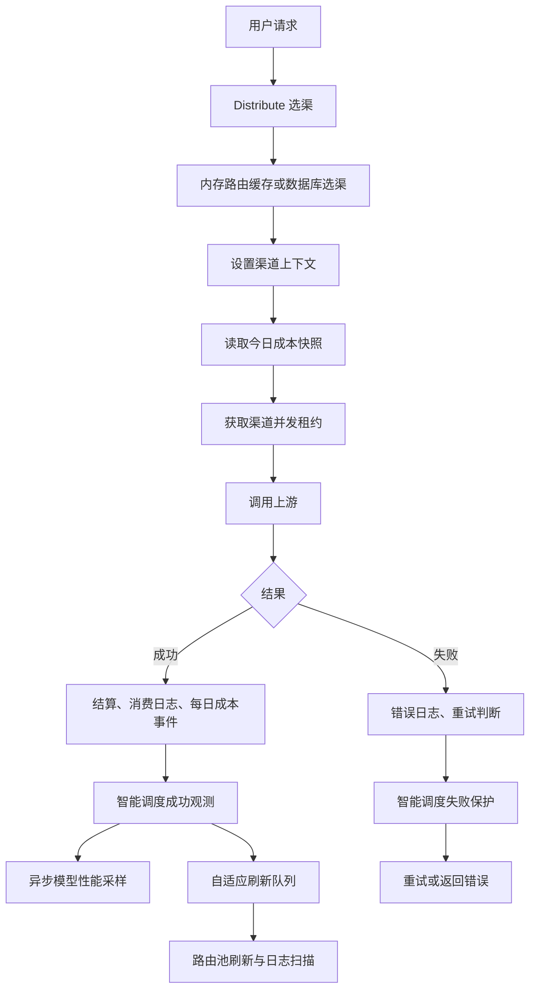

# 渠道监控对用户请求与系统性能的影响分析

> 审查基线：`1e1e0d20b`（`feat(channel-monitor): add channel status monitoring`）
>
> 审查日期：2026-08-12
>
> 范围：渠道监控、状态监测、智能调度、渠道并发、今日成本和模型性能中与真实用户请求或共享基础设施有关的链路。

## 1. 结论

本轮决定：**暂不把真实用户请求写入状态监测执行记录，也不把它作为状态条中的单次状态记录。** 当前真实用户请求不会调用 `SaveChannelStatusProbeExecution`，状态监测数据仍由后台主动探测产生。

这个决定是合理的。若把每个用户请求直接写入状态监测表，会把高频业务流量转换为逐请求数据库插入和状态桶事务，既重复现有模型性能、消费日志和智能调度观测，又会明显放大数据库写入、锁竞争和存储量。

但从整个“渠道监控”模块看，已有若干逻辑直接进入用户请求热路径：

1. 渠道选择与智能调度路由过滤。
2. 渠道并发租约。
3. 今日成本配置快照与请求结算事件。
4. 智能调度的成功、失败运行时观测。
5. 消费日志、错误日志和模型性能采样。

其中最需要优先处理的是**智能调度运行时观测与其触发的自适应刷新**：成功请求会在处理器返回前同步解析整套配置、更新全局状态，并在启用 Redis 时同步读写最多 1000 条请求窗口；随后还会投递自适应刷新。持续流量下，刷新 Worker 最快可约每秒执行一次，并可能反复扫描最长 30 天的原始日志。失败请求还会同步查询数据库、更新路由保护，并可能重建全部渠道缓存。这些操作会影响请求完成时间、故障重试延迟、数据库负载和系统吞吐。

审查还发现一个需要先修正的统计正确性问题：状态探测消费日志虽然写入了 `channel_monitor_status_probe` 标记，但分钟聚合和智能调度原始日志读取只排除了“渠道测试”和“智能调度探测”，**没有排除状态探测**。因此当前主动状态探测可能污染业务首字、TPS、成功率和智能调度生产流量样本；若同时开启“计入智能调度样本”，还存在重复计入的可能。

综合判断：

- 仅启用“状态监测”，且探测频率合理时，不会直接增加用户请求中的数据库写入；主要风险是探测与用户请求竞争渠道并发、数据库和 Redis 资源。
- 启用智能调度后，当前运行时观测存在较高的用户请求尾延迟风险。
- 自适应刷新在持续流量下存在很高的数据库读放大风险，是当前最严重的系统级问题。
- 状态总览轮询不会直接进入业务请求，但全表读取、完整时间桶响应和大量 DOM 会与业务请求争用数据库、CPU、内存和 GC。
- 未显式启用 `MEMORY_CACHE_ENABLED=true` 时，每次选渠会进入数据库路径，智能调度开启后开销进一步放大，不建议用于生产高并发部署。
- 缓存应以**进程内不可变快照为主、Redis 做跨节点汇总、数据库做最终状态持久化**；观测类逻辑应失败开放，不能阻塞真实请求。

## 2. 用户请求热路径



关键入口：

- 选渠：`middleware/distributor.go:33`
- 渠道上下文与成本快照：`middleware/distributor.go:540`
- 并发租约：`controller/channel_concurrency.go:67`
- 上游请求和重试：`controller/relay.go:216`
- 成功运行时观测：`controller/relay.go:279`
- 失败运行时保护：`controller/relay.go:499`

成功观测发生在上游调用完成后，因此通常不会增加首字时间，但会延迟处理器返回、连接完成和工作协程释放。失败保护发生在下一次重试或最终错误响应之前，对故障场景的用户尾延迟影响更直接。

## 3. 当前同步、异步与缓存情况

| 模块 | 当前行为 | 是否在用户请求同步链路 | 当前缓存 | 风险 |
| --- | --- | --- | --- | --- |
| 状态监测执行记录 | 后台 Worker 主动请求上游并保存记录 | 否 | 无任务时间表缓存 | 间接中等 |
| 状态监测总览 | 管理页可见时每 15 秒刷新，执行中每 3 秒刷新 | 否 | React Query 客户端缓存 | 数据量大时中等 |
| 渠道选择 | 内存缓存关闭时直接查询 Ability、渠道和智能调度状态 | 是 | 可选内存缓存 | 高 |
| 今日成本快照 | 每次选中渠道时读取，命中后使用 1 分钟 | 是 | `sync.Map`、版本号、`singleflight` | 低到中等 |
| 今日成本累计 | 请求线程只聚合到内存，后台批量写库 | 少量同步内存操作 | 有界聚合器 | 低 |
| 渠道并发 | 配有限制时每次上游尝试同步 Redis Acquire/Release | 是 | 配置缓存 1 分钟 | 中到高 |
| 智能调度成功观测 | 每次成功请求解析设置、更新窗口、同步 Redis | 是 | 本地事件数组，但非快照化 | 高 |
| 智能调度自适应刷新 | 成功事件去重并延迟 1 秒后刷新路由池 | 间接，由用户流量持续触发 | 仅事件 map 去重 | 很高 |
| 智能调度失败保护 | 同步查询路由、更新窗口、必要时事务改路由 | 是 | 路由选择有缓存，运行时查询未复用 | 很高 |
| 429 冷却读取 | 请求选渠读取原子快照 | 是 | `atomic.Pointer` 快照 | 低 |
| 429 冷却写入 | 持全局锁检查数据库修订号并同步 Redis | 是，仅 429 | 有本地快照 | 高尾延迟风险 |
| 模型性能采样 | 请求结束后投递 goroutine，每个样本写一次 Redis pipeline | 异步 | 本地小时桶 | 间接中等 |
| 分钟聚合 | 每分钟重建最近 2 分钟，整点修复 65 分钟 | 否 | 结果缓存 10 秒、`singleflight` | 间接高 |
| 消费/错误日志 | 同步写日志数据库，并重新读取用户设置 | 是 | 用户设置可走 Redis | 中到高 |

## 4. 重点问题

### 4.1 状态监测本身不写真实用户请求，但会竞争共享资源

状态监测 Worker 仅在 Master 节点启动，默认最多并行 5 个探测、上限 20 个：

- `controller/channel_status_probe_worker.go:60`
- `controller/channel_status_probe_worker.go:65`

它每秒查询一次到期配置：

- `controller/channel_status_probe_worker.go:71`
- `model/channel_status_probe.go:412`

每个模型探测会：

1. 获取与业务请求相同的渠道并发租约，见 `controller/channel_status_probe_worker.go:227`。
2. 真实请求上游并产生上游费用。
3. 成功探测会同步写测试消费日志；失败路径可能写错误日志，见 `controller/channel-test.go:583`。
4. 在事务中插入执行记录、读取并更新最新状态，同时解码、更新、编码分钟、小时、天三套 JSON 状态桶，见 `model/channel_status_probe.go:558`。
5. 将今日成本事件写入内存批处理器。

当前还有一个统计污染问题：

- 状态探测日志写入 `channel_monitor_status_probe`，见 `controller/channel-test.go:578`。
- 分钟聚合的 `channelMonitorMinuteLogOther` 没有该字段，过滤条件只检查 `SmartScheduleProbe` 和 `ChannelTest`，见 `model/channel_monitor_minute.go:90`、`model/channel_monitor_minute.go:371`。
- 智能调度自适应原始日志读取复用了同一过滤逻辑，见 `model/channel_smart_schedule_runtime.go:151`。

这意味着状态探测目前可能被当作真实业务流量计入首字、TPS、成功率和稳定性指标。该问题不只是性能问题，还会改变智能调度判断，应优先修复：为解析结构增加 `StatusProbe` 字段，并在分钟聚合、原始日志自适应指标和所有业务流量统计入口统一排除。

最明显的用户影响不是代码调用，而是**资源竞争**：

- 如果渠道并发上限为 1，探测先获得租约时，真实用户请求会被迫重选渠道或收到本地 429。
- SQLite 或未配置独立日志库时，探测状态事务、消费日志和业务日志会竞争同一个数据库。
- 多个实例都保持默认 Master 身份时，会同时每秒扫描数据库；CAS Claim 能避免重复执行，但不能消除重复查询。
- 最小探测间隔为 30 秒，每渠道最多 20 个模型。配置规模过大时，探测量约为：

```text
每秒探测数 ≈ Σ(渠道配置模型数 / 探测间隔秒数)
```

例如 100 个渠道、每个 3 个模型：默认 300 秒约为 1 次/秒；若全部改为 30 秒则约为 10 次/秒，并持续产生上游请求、日志和状态事务。

建议：

- 为业务请求保留至少一个并发槽。探测只允许使用 `limit - reserved_business_slots`，无限制渠道仍受全局探测并发控制。
- Worker 使用内存最小堆保存 `next_run_at`，按最近到期时间动态休眠；配置更新时唤醒。无任务时不要每秒查询数据库。
- 若仍保留数据库扫描，将手动任务和定时任务拆成两条可命中组合索引的查询，并根据 SQLite、MySQL、PostgreSQL 的 `EXPLAIN` 增加组合索引；当前只有 `lease_until`、`next_run_at`、`manual_requested_at` 的单列索引。
- 样本重试查询增加 `(sample_requested, sample_status, created_at, id)` 组合索引；关闭“计入样本”时不要启动无意义的重试读取。
- 明确部署节点角色，保证只有预期的 Master 扫描；数据库租约继续作为容错，而不是常态去重手段。
- 探测并发、探测跳过数、租约竞争数和数据库耗时必须暴露指标。

### 4.2 状态监测总览接口缺少服务端快照缓存

状态 Tab 在页面可见时每 15 秒刷新，存在运行任务时每 3 秒刷新，且后台页面不会继续轮询：

- `web/src/features/channel-monitor/components/channel-status-probe-view.tsx:138`

每次总览请求会顺序读取：

1. 全部渠道。
2. 全部状态探测配置。
3. 全部模型最新状态。
4. 全部渠道成本配置。

随后为所有渠道解析配置和状态桶、计算最近窗口、平均首字和 TPS，并重新生成完整响应：`controller/channel_status_probe.go:335`。

小规模部署问题不大；渠道和模型数量增加、多个管理员同时打开页面时，会形成稳定的数据库全表读取和 JSON 解析压力。单个管理员页面空闲时约为 `4 次 SQL × 4 次轮询/分钟 = 16 次 SQL/分钟`；探测运行中约为 `4 × 20 = 80 次 SQL/分钟`。浏览器内的 React Query 只能在单个页面内复用，不能替服务端抵挡多个管理员、多个浏览器或多个前端实例的并发轮询。

建议增加“短 TTL + generation + `singleflight`”服务端快照：

- 状态摘要快照 TTL 建议 2～5 秒；渠道元数据、配置和倍率可独立缓存 30～60 秒。
- 配置保存、探测执行完成、渠道信息变更和成本倍率变更时增加 generation，并用 100～500ms 防抖重建快照。
- 总览接口从快照读取，模型筛选只在快照上过滤，不再访问数据库。
- 对响应增加 `ETag`/generation；无变化时返回 `304`。
- 状态桶在执行写入后同步更新缓存中的已解析结构，避免每次管理页轮询重复 JSON 解码。
- 快照异常时回退数据库，但使用 `singleflight` 防止并发缓存穿透。
- 状态页使用专用轻量渠道查询，只读取 `id/type/status/name/models/group/remark` 等卡片必需字段；当前 `GetAllChannelsForMonitor` 只省略了 `key`，仍读取多个 text/json 字段，见 `model/channel_ratio_monitor.go:110`、`model/channel.go:23`。

#### 4.2.1 完整时间桶响应和 DOM 会随渠道、模型数快速膨胀

后端会为每个模型补齐整个展示窗口，包括没有任何探测数据的空桶：`controller/channel_status_probe.go:277`。前端又为每个桶创建一个独立 `<span>`，并重复生成 Tooltip 文本：`web/src/features/channel-monitor/components/channel-status-probe-card.tsx:392`。

当前上限是每渠道 20 个模型，每模型最多 60 个分钟桶。若有 100 个渠道全部配满，理论上会生成约 120,000 个状态条 DOM 节点；响应还包含完整 `latest` 状态、支持模型和重复的 bucket 字段。gzip 只能减少传输字节，不能消除 Go 对象构造、JSON 编码与压缩、浏览器解析、React reconciliation 和 GC。

建议：

- API 返回稀疏桶，只携带有数据的 bucket，并额外返回 `window_start`、`bucket_seconds`、`bucket_count`；空桶由绘制层推导。
- 卡片摘要不要直接返回完整 `ChannelStatusProbeState`，只保留结果、结束时间、首字、TPS、执行 ID。
- `supported_models`、自定义模型能力和详细配置改为打开配置抽屉时懒加载。
- 状态条优先使用单个 CSS gradient、Canvas，或把连续相同状态合并为区段，避免每 bucket 一个 DOM 节点。
- 卡片列表增加分页/虚拟化或 `content-visibility: auto`；先减少节点数，再考虑 `memo` 等微优化。

#### 4.2.2 历史抽屉和非活动 Tab 查询仍有额外负载

探测运行时，历史抽屉每 3 秒刷新：`web/src/features/channel-monitor/components/channel-status-probe-history-sheet.tsx:219`。每次请求会先确认渠道存在，再执行 `COUNT(*)` 和分页查询，约 3 次 SQL；单个打开的抽屉约增加 60 次 SQL/分钟。与运行中的状态总览叠加后，单个管理员可接近 140 次 SQL/分钟，尚未包含父页面其他一分钟轮询。

建议仅在第一页轮询，并使用“最新执行 ID 之后”的游标增量查询；运行中不要每 3 秒重复统计总数。总数可短缓存，任务结束、筛选变化或翻页时再刷新。

状态 Tab 虽然只在激活时挂载且页面隐藏时停止自身轮询，这是正确的；但父页面的主总览、模型性能、智能调度摘要、成本摘要和今日成功率仍持续每分钟刷新，见 `web/src/features/channel-monitor/index.tsx:393`。应按 Tab 设置 `enabled`，或为标签计数提供轻量摘要接口。

### 4.3 智能调度设置在每个请求中重复解析

成功和失败路径都会调用 `getChannelMonitorSettings()`：

- `controller/channel_ratio_monitor_schedule_runtime.go:201`
- `controller/channel_ratio_monitor_schedule_runtime.go:704`
- `controller/channel_ratio_monitor_schedule_runtime.go:750`

该函数每次读取多项全局配置、解析数字和布尔值，并反序列化、归一化最多 100 个分组策略：

- `controller/channel_ratio_monitor_settings.go:201`
- `controller/channel_ratio_monitor_schedule_group_policy.go:233`

即使智能调度关闭，成功请求仍会先完成这次设置读取和解析，然后才返回。

建议发布不可变配置快照：

```go
type channelMonitorRuntimeSnapshot struct {
    Enabled         bool
    ControlRevision string
    Policies        map[string]compiledPolicy
}
```

- 配置变更时解析一次并 `atomic.Pointer.Store`。
- 请求线程只做一次原子读取；关闭时一次布尔判断立即返回。
- 策略中的模型集合提前编译成 map，不在请求中遍历 slice。
- 错误信息映射也采用同样方式缓存已解析 map。当前一次失败可能在错误日志和最终响应阶段重复解析 JSON，见 `service/error_message_mapping.go:37` 和 `controller/relay_response_state.go:55`。

### 4.4 成功请求同步维护全局事件窗口并读写 Redis

当前所有渠道、模型共享同一把全局 mutex：

- `controller/channel_ratio_monitor_schedule_runtime.go:66`

每个成功请求会在锁内复制、裁剪、排序最多 1000 个事件，然后在锁外同步执行 Redis Lua：

- 本地更新：`controller/channel_ratio_monitor_schedule_runtime.go:554`
- Redis 更新：`controller/channel_ratio_monitor_schedule_runtime.go:575`

Redis Lua 每次执行 `ZREMRANGEBYSCORE`、`INCR`、`ZADD`、`ZCARD`、`EXPIRE`，最后 `ZRANGE` 返回整个窗口，最多 1000 条事件：`controller/channel_ratio_monitor_schedule_runtime.go:30`。调用使用 `context.Background()`，没有请求级短超时。

此外，成功路径只检查全局智能调度是否开启，没有先确认当前 `(渠道, 模型)` 是否参与任何智能调度分组。因此，只要开启了任意分组，其他无关渠道和模型也会进入 mutex 和 Redis 路径。

这会造成：

- 高 QPS 下所有成功请求争用同一把锁。
- Redis 操作数与请求数近似线性增长。
- Redis 抖动时处理器完成时间和连接占用增加。
- 本地 `states` map 对一次性模型名没有统一 TTL 清理，存在长期内存增长风险。

建议改为：

1. 使用不可变的“参与路由索引”先做 O(1) 门控：`(channel_id, normalized_model) -> compiled policies`。不参与时立即返回。
2. 本地窗口改为按 key 分片的固定时间桶或 ring buffer；每次更新为 O(1)，不排序、不复制整个窗口。
3. 请求只把紧凑事件写入有界队列，后台按 250ms～1s 或达到批量阈值时汇总。
4. Redis 保存时间桶计数，不保存每个成功事件；使用 `HINCRBY`/Lua 原子累加请求数和失败数，不再每次返回完整窗口。
5. 队列满时丢弃观测并计数告警，不能阻塞或拒绝用户请求。
6. 分片状态设置过期时间并由后台清理，避免高模型基数导致内存只增不减。

#### 4.4.1 每次成功还会持续触发重型自适应刷新

成功观测最后会调用 `enqueueChannelSmartScheduleAdaptiveRefresh`：`controller/channel_ratio_monitor_schedule_runtime.go:201`。队列会按事件去重并延迟 1 秒，但 `pending` map 没有容量上限、每池没有最小刷新间隔；持续流量下 Worker 可以长期以约每秒一轮运行：`controller/channel_ratio_monitor_schedule_runtime.go:960`。

每轮处理会：

1. 对 channel/model 事件查询参与路由：`controller/channel_ratio_monitor_schedule_runtime.go:1062`。
2. 对每个 pool 读取完整路由池。
3. 调用 `GetChannelSmartScheduleEconomicSnapshot`，事务锁定经济修订与 `GroupRatio` option，并读取全部渠道成本元数据：`controller/channel_ratio_monitor_schedule_runtime.go:1143`、`model/channel_monitor_economic_revision.go:110`。
4. 为池内每条路由构造自适应、性能、稳定性三个窗口：`controller/channel_ratio_monitor_schedule_runtime.go:1167`。
5. 直接查询 `LOG_DB` 原始消费/错误日志，查询起点取所有窗口中最早值：`model/channel_smart_schedule_runtime.go:78`、`model/channel_smart_schedule_runtime.go:122`。
6. 根据结果执行路由事务和缓存刷新。

性能与稳定性窗口上限为 43,200 分钟，即 30 天：`model/channel_monitor_option.go:21`。因此，活跃池可能每秒反复扫描很长时间范围的原始日志；即使默认窗口是 60 分钟，这种重复扫描也会远高于一分钟汇总的正常开销。这是当前渠道监控最严重的数据库放大风险，而且由成功用户流量持续驱动。

建议：

- 只有健康状态、采样债务或路由压力跨越阈值时才触发刷新，不要每个成功请求都投递。
- 事件按 `(group, model)` 合并，设置 10～30 秒最小刷新间隔、有界容量和丢弃合并指标。
- 自适应秒级判断只读取很短的 live tail，例如最近 5 分钟；长性能与稳定性窗口统一使用已有分钟聚合。
- 经济快照按 economic revision 缓存，一轮 Worker 内及多个 pool 之间共享，不要每池重复锁 option 行和读取全表。
- 参与路由与路由池从不可变缓存读取；数据库只用于实际状态迁移的持久化。
- 为刷新记录 `trigger_count/coalesced_count/dropped_count/pool_duration/raw_log_rows`，并设置单轮时间预算，超时后延后剩余 pool。

### 4.5 失败请求同步查数据库并可能重建全部渠道缓存

非 429 失败会调用 `GetChannelSmartScheduleRuntimeRoutes`，429 会调用 `GetChannelSmartScheduleRuntimeParticipatingRoutes`：

- `controller/channel_ratio_monitor_schedule_runtime.go:708`
- `controller/channel_ratio_monitor_schedule_runtime.go:757`

运行时路由读取依次查询渠道状态、Ability 和路由状态：

- `model/channel_smart_schedule_runtime.go:276`
- `model/channel_smart_schedule_runtime.go:291`
- `model/channel_smart_schedule_runtime.go:353`

达到保护阈值后，会在用户失败请求中同步执行保护事务；路由发生变化时调用全量 `model.InitChannelCache()`：`controller/channel_ratio_monitor_schedule_runtime.go:934`。

失败本来就是用户最敏感的尾延迟场景，这些数据库查询、事务和全量缓存重建还会发生在下一次重试或最终错误响应之前。

建议：

- 扩展已有 `channelSmartScheduleRouteCache`，发布按 `(channel_id, model)` 查询的只读索引，运行时失败判断不访问数据库。
- 阈值触发时先原子发布本节点的临时路由覆盖层，使后续请求立即绕过故障渠道。
- 数据库保护事务和跨节点通知由单飞后台任务完成；同一 key 同时只允许一个任务。
- 提交后只调用已有的池级刷新 `RefreshChannelSmartScheduleRoutePoolCache(group, model)`，禁止在用户请求中全量 `InitChannelCache()`。
- 只有接近阈值或真正触发状态迁移的失败才需要跨节点确认；普通失败只更新本地桶并异步汇总。

### 4.6 429 冷却读取设计较好，写入仍会阻塞失败请求

选渠时的 429 冷却读取已经使用原子快照，不会为每个请求访问 Redis：

- `service/channel_rate_limit_cooldown_cache.go:26`
- `service/channel_rate_limit_cooldown.go:431`

但创建冷却时会持全局锁执行数据库修订号查询和 Redis Lua，锁直到函数退出才释放：`service/channel_rate_limit_cooldown.go:174`。

建议：

- 从不可变设置快照直接校验 control revision，不在 429 请求中查询数据库。
- 先原子发布本地冷却，让本节点立即停止选中该渠道。
- Redis 同步使用短超时和单飞后台任务；失败时保留本地冷却并告警。
- 冷却快照增加 `model -> channel ids` 反向索引，避免每次选渠扫描并排序全部冷却项。

### 4.7 渠道选择必须依赖内存缓存

`MEMORY_CACHE_ENABLED` 只有显式设置为 `true` 才开启：`common/init.go:88`。

关闭时，每次选渠会查询 Ability、暂停状态、渠道，智能调度管理的池还会查询路由状态：`model/channel_database_selection.go:61`。开启时主要是进程内读锁、slice 过滤、优先级计算和权重选择：`model/channel_cache.go:127`。

建议：

- 生产环境将 `MEMORY_CACHE_ENABLED=true` 作为渠道监控和智能调度的运行前提，并在管理页或启动日志明确告警。
- 监控关键快照不应完全依赖该开关；配置快照、参与路由索引、冷却和状态总览应始终有独立进程内缓存。
- 后续可在路由缓存中预计算优先级分组和权重表，减少每请求创建 map、slice 和排序，但优先级低于移除同步数据库/Redis。

### 4.8 渠道并发限制需要 Redis 强一致，但配置不应由请求刷新

未配置并发限制时，请求通常只读取内存配置并立即通过。配置限制且启用 Redis 后，每次实际上游尝试会同步 Acquire，并在上游结束时同步 Release：

- `service/channel_concurrency.go:234`
- `service/channel_concurrency.go:471`
- `service/channel_concurrency.go:497`

Redis 操作超时为 5 秒，长请求每 30 秒续租一次。候选渠道饱和时，控制器可能逐个渠道串行 Acquire 后重选：`controller/channel_concurrency.go:79`。

并发计数是跨节点正确性约束，不能简单用本地缓存替代 Redis，但可以优化：

- 后台 refresh-ahead 并原子发布并发配置；不要让一分钟过期后的第一个用户请求同步查询全部配置。
- Redis 超时应受剩余请求预算约束，并单独记录 Acquire、Release 和重选耗时。
- 可用一个 Lua 在候选渠道集合中完成“检查并选择一个可租约渠道”，减少逐渠道 Redis 往返。
- Release 可使用短超时的可靠高优先队列；队列不可用时继续同步释放，租约 TTL 作为最终兜底。
- 状态探测使用独立低优先级配额，不能消耗最后一个业务槽位。

### 4.9 今日成本已有缓存和批处理，正常开销可控

渠道上下文设置时会调用 `CaptureChannelDailyCostSnapshot`。当前实现包含：

- 1 分钟进程内快照。
- 按渠道版本失效。
- `singleflight` 合并同一渠道的缓存穿透。
- 有界内存聚合，最多 4096 个 key、每批 256 个、每秒后台写库。

对应代码：

- `service/channel_daily_cost.go:31`
- `service/channel_daily_cost.go:192`
- `service/channel_daily_cost_batcher.go:15`

这是较合理的热路径设计。剩余问题是每个渠道每分钟首次请求可能同步查数据库，以及同一次请求在设置和结算阶段重复计算 API Key 的 SHA-256 身份。

建议：

- 在配置保存时显式失效并跨节点发布版本后，将 TTL 延长并做 refresh-ahead。
- 将成本配置直接并入渠道不可变快照，避免请求线程冷加载数据库。
- 将已计算的 key fingerprint 保存在请求上下文中复用。
- 高 QPS 或高 API Key 基数部署可对聚合器分片，减少单 mutex 争用。

### 4.10 日志与模型性能会放大共享数据库、Redis 压力

消费日志和错误日志当前同步写入 `LOG_DB`：`model/log.go:101`。未设置 `LOG_SQL_DSN` 时，`LOG_DB = DB`：`model/main.go:212`。

日志写入前还会重新读取用户设置；Redis 未命中时回退数据库：

- `model/log.go:330`
- `model/log.go:395`
- `model/user.go:1223`

认证阶段已把用户设置放入请求上下文：`model/user_cache.go:29`，日志阶段应直接复用。重试全部失败时还可能写入每次尝试日志和最终汇总日志，进一步增加故障尾延迟。

模型性能采样虽然通过 goroutine 异步执行，但默认开启，且每个样本都会执行一次 Redis pipeline：

- `pkg/perf_metrics/metrics.go:57`
- `pkg/perf_metrics/metrics.go:380`
- `setting/perf_metrics_setting/config.go:12`

默认 Redis 连接池只有 10：`common/redis.go:39`。模型性能、智能调度窗口、并发租约和冷却共享连接池时，后台 Redis QPS 会间接拖慢同步请求操作。

建议：

- 日志直接使用请求上下文中的用户设置。
- 错误日志可使用有界异步队列、采样和重试去重；消费日志属于计费审计数据，应使用独立日志库或持久化 outbox 后批量写入，不能静默丢弃。
- 生产环境优先配置独立 `LOG_SQL_DSN`，特别是 SQLite 或主库写压力较大的部署。
- 模型性能先在本地按时间桶聚合，每 1～5 秒批量同步 Redis，而不是每个请求一条 pipeline。
- 若仍共享 Redis，分别观测连接池等待时间，并按实际并发调整 `REDIS_POOL_SIZE`；扩容连接池不能替代减少每请求 Redis 操作。

### 4.11 分钟聚合、历史补齐和清理存在后台读写放大

分钟聚合已经避免管理页直接反复扫描日志库，这是正确方向；但当前重建策略本身较重：

- 稳态每分钟重建最近 2 分钟：`service/channel_monitor_aggregation.go:23`。
- 每个整点再修复最近 65 分钟：`service/channel_monitor_aggregation.go:25`、`service/channel_monitor_aggregation.go:432`。
- 按均匀流量粗略估算，每小时扫描 `120 + 65 = 185` 分钟日志，约为原始日志量的 3.08 倍；还未计算启动修复、按需 freshness 和历史补齐。
- 历史补齐窗口取智能调度性能/稳定性窗口最大值，最大可达 30 天，并按 1 小时块连续循环，没有块间让步：`service/channel_monitor_aggregation.go:345`、`service/channel_monitor_aggregation.go:400`。最坏可连续处理约 720 个小时块。
- 聚合事务取得共享状态行锁后才读取日志并替换汇总；`LOG_DB == DB` 时日志扫描、删除旧汇总和插入新汇总全部占用同一主库事务：`model/channel_monitor_minute.go:603`。
- 多个 Master 同时运行时，数据库状态行锁能串行写入，但第二个节点取得锁后不会重新计算本轮范围，仍可能重复扫描相同日志。

分钟汇总维度还包含 API Key：`model/channel_monitor_minute.go:104`。高 API Key 基数会让分钟表按“渠道 × 模型 × 分组 × API Key × 分钟”增长；默认成本保留期为 120 天，可能比智能调度实际需要的路由级窗口更长。

建议：

- 将路由级分钟汇总与 API Key 明细拆开：智能调度使用低基数路由表，API Key 维度只保留较短周期或汇总到小时/天。
- 稳态聚合优先只处理新完成分钟；最近尾部修复降低频率，整点修复按观测到的迟到日志范围增量处理。
- 历史补齐增加每轮时间/行数预算、块间短暂让步和数据库连接池压力检查；业务高峰自动暂停。
- 在取得共享状态行锁后重新读取水位并裁剪范围，避免多 Master 重复扫描。
- SQLite 下将分钟重写、状态桶写入、历史清理等重型写任务统一串行；MySQL/PostgreSQL 也应使用全局后台 DB writer semaphore 控制并发。
- 清理任务虽然按批删除，但当前会持续循环到完成；增加单轮时间预算、批间让步和续跑游标，避免长时间占用连接与写 I/O。

### 4.12 状态桶 JSON 和查询索引还有写放大空间

每次模型探测执行会在一个事务中：插入执行记录、锁定 channel/model 状态行、分别解码和编码 60 个分钟桶、24 个小时桶、30 个天桶，然后整行保存：`model/channel_status_probe.go:558`。桶数有固定上限，内存不会无限增长，但频率升高时会形成重复 JSON 解析、排序和整段 TEXT 重写。

另外：

- 到期领取使用带 `OR` 的条件和三个单列索引，未必能在三种数据库上稳定走最优计划：`model/channel_status_probe.go:412`。
- 待重试样本按 `sample_requested + sample_status` 过滤并按 `created_at, id` 排序，但没有匹配的组合索引：`model/channel_status_probe.go:669`。
- 配置移除模型后，旧 `ChannelStatusProbeState` 没有在保存配置时同步清理，会增加全表总览读取和存储体积。

建议优先保持当前固定上限设计，同时增加组合索引与旧状态清理。若探测规模达到数百渠道或高频多模型，再考虑把状态桶规范化为 `(channel, model, unit, bucket_start)` 行并批量 upsert，或者在内存中累计后周期性写快照；不要在没有压测证据时提前引入更复杂的表结构。

所有后台任务应共享统一资源治理：探测上游请求预算、重型数据库 writer semaphore、任务启动抖动、连接池压力降级和队列深度指标。后台监控的目标是提供可观测性，不能在系统繁忙时反过来抢占业务请求资源。

## 5. 推荐缓存架构

| 数据 | 用户请求读路径 | 更新方式 | 一致性要求 |
| --- | --- | --- | --- |
| 渠道监控运行时设置 | `atomic.Pointer` 一次读取 | 配置保存或配置同步时编译并发布 | 节点内立即，跨节点秒级 |
| 智能调度参与路由 | `(channel, model)` 不可变索引 | 路由事务后按池刷新 | 路由决策需快速生效 |
| 成功/失败窗口 | 分片固定时间桶，O(1) 更新 | 有界队列批量同步 Redis | 观测最终一致，保护本地即时 |
| 自适应刷新输入 | 短 live tail + 分钟汇总 | pool 级合并、阈值触发、限频刷新 | 秒级健康、分钟级趋势 |
| 429 冷却 | 已有原子快照，增加模型反向索引 | 本地先发布，后台同步 Redis | 本地即时，跨节点短暂最终一致 |
| 今日成本配置 | 并入渠道快照或独立原子快照 | 显式失效、refresh-ahead | 请求内固定快照 |
| 渠道并发配置 | 原子快照 | 后台周期刷新和配置变更推送 | 配置最终一致，租约 Redis 强一致 |
| 状态监测总览 | 短 TTL 快照 + `singleflight` | 探测/配置/渠道变更后 generation 失效 | 允许 2～5 秒延迟 |
| 错误信息映射 | 已解析不可变 map | 配置变更时发布 | 节点内立即 |

核心原则：

1. 用户请求只做原子读、O(1) 本地更新和必要的强一致租约操作。
2. 观测、统计和管理页展示失败时必须失败开放，不影响用户请求。
3. Redis 不应返回完整历史窗口；数据库不应参与普通成功请求的运行时判断。
4. 任何异步队列都必须有上限、丢弃/重试指标和明确的数据等级。计费数据不能按普通遥测处理。
5. 路由保护先发布本地覆盖，再异步持久化；恢复时使用修订号避免旧任务覆盖新配置。

## 6. 实施优先级

### P0：修复统计正确性并降低用户请求尾延迟

1. 在分钟聚合和智能调度原始日志指标中排除 `channel_monitor_status_probe`，避免主动探测污染或重复进入业务样本。
2. 将 `getChannelMonitorSettings()` 改为配置变更时编译的原子不可变快照，并提供关闭态快速返回。
3. 增加 `(channel_id, normalized_model)` 参与路由缓存，不参与智能调度的请求不进入运行时观测。
4. 移除成功请求中的同步 Redis 全窗口读写，改为分片本地桶加有界异步批处理。
5. 将运行时状态从单全局 mutex 改为分片结构，并增加 key TTL 清理。
6. 自适应刷新改为 pool 级阈值触发和限频；长窗口读取分钟汇总，禁止成功流量每秒扫描长范围原始日志。
7. 失败路径复用路由缓存，普通失败不查询渠道、Ability 和路由状态表。
8. 禁止用户失败请求触发全量 `InitChannelCache()`；使用本地覆盖层和池级刷新。
9. 429 冷却先本地生效，数据库修订检查和 Redis 同步移出用户请求。
10. 生产环境强制或明确告警开启内存选渠缓存。
11. 状态探测为业务请求预留渠道并发槽。

### P1：降低共享基础设施压力

1. 状态监测 Worker 使用内存到期堆和动态休眠，减少每秒空轮询，并补齐到期领取、样本重试组合索引。
2. 状态总览增加 2～5 秒服务端快照、generation、ETag 和 `singleflight` 回源。
3. 状态 API 改为稀疏桶和轻量卡片摘要；配置详情懒加载，卡片列表分页/虚拟化。
4. 历史抽屉只在第一页做游标增量轮询，避免重复 `COUNT(*)`；非活动 Tab 停止无关查询。
5. 分钟聚合和历史补齐增加时间预算、流量让步、多 Master 水位复核和后台 DB writer 限流。
6. 并发配置后台 refresh-ahead，避免请求线程按分钟冷加载。
7. 模型性能改为本地时间桶批量同步 Redis。
8. 今日成本快照延长 TTL、跨节点显式失效并缓存 key fingerprint。
9. 错误信息映射缓存已解析结果，日志复用请求上下文用户设置。
10. 独立日志数据库；错误日志异步化，消费日志使用可靠 outbox/批量写。

### P2：进一步优化 CPU 和内存分配

1. 冷却缓存按模型建立反向索引。
2. 路由缓存预计算优先级分组和权重表。
3. 今日成本聚合器按 channel/API Key 哈希分片。
4. 状态总览缓存已解析桶，避免重复 JSON 编解码。
5. 状态条合并连续区段或改用 gradient/Canvas，并用 memoized 子组件隔离父页面轮询重渲染。
6. 拆分低基数路由分钟汇总与高基数 API Key 明细，并按使用场景设置不同保留期。
7. 为所有缓存增加命中率、重建耗时、对象数量和过期清理指标。

## 7. 验证标准

改造后至少满足以下行为约束：

- 智能调度关闭时，成功和失败运行时观测不产生数据库或 Redis 操作。
- 智能调度开启但渠道模型不参与时，只发生一次原子缓存判断。
- 普通成功请求的智能调度观测为 O(1) 本地操作，不同步访问 Redis/数据库。
- 持续成功流量不会让同一路由池高于配置频率刷新；长性能/稳定性窗口不扫描原始日志。
- 普通失败请求不查询运行时路由数据库；只有实际状态迁移任务写数据库。
- 状态探测日志不会出现在业务分钟性能、成功率或生产流量自适应样本中。
- 状态探测不会占用渠道最后一个业务并发槽。
- 状态总览缓存命中时不查询数据库，无变化轮询可返回 `304`。
- 状态总览响应按稀疏 bucket 计量，响应大小和 DOM 节点数不再与“渠道数 × 20 模型 × 完整窗口”刚性相乘。
- 分钟聚合、历史补齐和清理均有单轮预算；业务高负载时能够延后，不长时间占满连接池或 SQLite 写锁。
- 遥测队列满或 Redis 不可用时，用户请求继续完成，并产生可观测的丢弃/降级指标。
- 计费、消费日志和租约等正确性数据不能因队列满而静默丢失。

建议压测矩阵：

- 智能调度关闭/开启。
- 内存选渠缓存关闭/开启。
- Redis 正常、延迟升高、不可用。
- 无并发限制、限制为 1、限制为 10。
- 状态探测关闭、默认 300 秒、最小 30 秒；每渠道 1/3/20 个模型。
- 管理员未打开/打开状态 Tab，1/10 个管理员；100/500 个渠道，每渠道 1/5/20 个模型。
- 智能调度 1/10/100 个活跃 pool，性能窗口 60 分钟/24 小时/30 天。
- 冷启动无历史缺口/缺 1 小时/缺 30 天分钟汇总。
- SQLite、MySQL、PostgreSQL；日志库与主库共用/分离。

重点观察：请求 p50/p95/p99、首字时间、请求完成时间、失败重试耗时、每请求数据库查询数、每请求 Redis 操作数、Redis 连接池等待、数据库锁等待、原始日志扫描行数、pool 刷新次数、管理 API 响应大小、浏览器 DOM 节点与渲染耗时、探测跳过数、各异步队列深度和丢弃数。

建议把“智能调度关闭”作为基线：关闭态不应产生运行时 Redis/数据库操作，网关吞吐和 p99 相对纯转发基线的差异应接近测量噪声；开启态改造后，普通成功请求同步 Redis/数据库操作数也应为 0。

## 8. 若未来需要利用真实用户流量展示状态

不要把真实请求逐条写入 `channel_status_probe_executions`。更合适的方式是新增独立的“业务流量状态桶”：

- 请求线程仅向 `(channel_id, model, minute)` 的进程内分片桶做 O(1) 累加。
- 记录请求数、成功数、失败数、429 数、首字总和/样本数、TPS 总和/样本数，不保存请求正文和逐请求明细。
- 后台每 1～5 秒批量同步 Redis，每分钟或更长周期批量落库。
- 状态卡片可把“主动探测”和“业务流量”作为两个明确来源叠加展示，不能混成同一种执行记录。
- 业务流量观测失败时直接降级，不允许影响请求、重试、结算或路由。

在当前阶段保持“不计入状态监测执行记录”，并先完成 P0 缓存和热路径改造，是风险最低的顺序。

## 9. 优化实施计划

本轮只做性能优化和统计隔离，不新增真实用户请求记录，不改变渠道状态判定、调度评分、失败阈值、探测结果展示含义或管理员操作流程。可调的缓存、限频、批量和后台让步参数使用环境变量，默认值保持现有交互时效或只引入秒级最终一致性。

### 9.1 批次一：请求热路径与统计正确性

- [x] 在分钟聚合、实时自适应指标和样本计数中排除 `channel_monitor_status_probe`，防止主动状态探测污染业务首字、TPS、成功率和调度输入。
- [x] 缓存已解析的渠道监控设置，配置未变化时不重复解析数字、布尔值和分组策略 JSON；关闭智能调度时保持快速返回。
- [x] 从现有渠道/Ability/智能调度路由快照建立 `(channel_id, requested_model)` 反向只读索引，让成功、失败和 429 观测优先走内存；缓存关闭时保留原数据库回退行为。
- [x] 成功请求只更新本地有界窗口并进入有界 Redis 批处理队列，不再同步读取 Redis 完整窗口；失败判定才同步合并待写成功并读取共享窗口。
- [x] Redis 成功、失败事件统一使用共享序号；成功重试使用进程级水位幂等去重，失败路径使用 64 个路由锁分片，并把待写成功、当前失败和完整性标记合并为一次 Lua 执行。
- [x] 队列丢弃成功样本时发布带保留期的不完整窗口标记；任一节点读取到不完整窗口时保留本地观测，但跳过依赖完整顺序或分母的连续失败、失败次数和失败率阈值，避免多节点误降级。试放失败、降级探测失败等显式状态转换保持原语义。
- [x] 本地运行时健康状态改为 64 分片，增加 `lastSeen` 和后台轮转增量清理；不再由所有成功请求竞争单个全局锁，失活渠道/模型状态即使停止流量也会逐步回收。
- [x] 自适应刷新按 `(group, model)` 池合并并限频，持续成功流量不会让同一路由池按每请求频率刷新。
- [x] 路由保护成功后优先刷新受影响的池级缓存，只有池级刷新失败时才回退全量 `InitChannelCache()`。

配置项：

| 环境变量 | 默认值 | 范围/说明 |
| --- | ---: | --- |
| `CHANNEL_MONITOR_RUNTIME_REDIS_FLUSH_INTERVAL_MS` | `200` | `20`～`5000`；成功事件批量同步 Redis 的周期 |
| `CHANNEL_MONITOR_RUNTIME_REDIS_MAX_PENDING` | `4096` | `128`～`65536`；本地待同步路由事件上限 |
| `CHANNEL_MONITOR_RUNTIME_REDIS_TIMEOUT_MS` | `500` | `50`～`5000`；失败路径 Redis 合并与读取超时，超时后保留原本地降级行为 |
| `CHANNEL_MONITOR_ADAPTIVE_REFRESH_MIN_INTERVAL_SECONDS` | `10` | `1`～`300`；同一路由池软刷新最小间隔 |
| `CHANNEL_MONITOR_RUNTIME_LOCAL_CLEANUP_INTERVAL_SECONDS` | `5` | `1`～`300`；本地健康状态轮转清理节流周期，每次只扫描一个分片 |

### 9.2 批次二：状态接口与前端渲染

- [x] 状态总览增加短 TTL 进程内快照、generation 和 `singleflight`，同一筛选的并发请求只回源一次。
- [x] 状态总览渠道查询只读取卡片所需字段，避免加载密钥、完整渠道设置和其他大字段。
- [x] 配置保存、立即检测、执行结果和样本状态更新后主动失效本节点快照；多节点依靠短 TTL 收敛。
- [x] 历史抽屉只在第一页、任务活跃且页面可见时轮询；第二页及以后不再跟随最新执行 ID 改变 query key。
- [x] 使用 `memo`、稳定回调、稳定 props 和 `content-visibility` 隔离卡片/状态条渲染；`serverNow` 只在“下次执行”展示文本发生变化时触发卡片更新。
- [x] 状态 Tab 激活时暂停模型性能重型查询，手动刷新也不再额外触发该接口；保留筛选、排序、卡片内容和状态刷新时效。

配置项：

| 环境变量 | 默认值 | 范围/说明 |
| --- | ---: | --- |
| `CHANNEL_STATUS_PROBE_OVERVIEW_CACHE_TTL_MS` | `3000` | `0`～`30000`；`0` 表示关闭服务端总览缓存 |

### 9.3 批次三：探测 Worker、索引与后台数据库任务

- [x] 为定时领取、手动领取、样本重试及按结果/触发类型筛选的历史列表补齐组合索引；保留原无筛选、按模型历史索引，避免依赖 GORM 修改同名旧索引。
- [x] 保存探测配置时清理已移除模型的状态快照；并发中的旧 claim 仍保留执行历史，但不会重建已移除模型的状态快照。
- [x] 探测扫描周期改为可配置，并在本节点配置/立即检测变化时主动唤醒；状态总览返回按秒向上取整后的实际 Worker 扫描周期。
- [x] 分钟聚合取得共享状态锁后复核水位；仅当并发节点发布的范围完整覆盖本轮范围时跳过，避免窄范围修复误跳过更宽的 recent-tail 重建。
- [x] 历史补齐按单轮块数和时间预算让步，下一轮从数据库水位继续，不改变最终覆盖范围。
- [x] 状态历史及其他渠道监控批量清理增加单轮时间预算，按剩余类别公平切片；预算耗尽后短间隔续排，日常调度继续兜底。

配置项：

| 环境变量 | 默认值 | 范围/说明 |
| --- | ---: | --- |
| `CHANNEL_STATUS_PROBE_SCAN_INTERVAL_MS` | `1000` | `200`～`30000`；跨节点兜底扫描周期 |
| `CHANNEL_MONITOR_AGGREGATION_BACKFILL_MAX_CHUNKS` | `1` | `1`～`24`；每轮最多补齐的小时块数 |
| `CHANNEL_MONITOR_AGGREGATION_BACKFILL_BUDGET_SECONDS` | `10` | `1`～`300`；每轮历史补齐时间预算 |
| `CHANNEL_MONITOR_AGGREGATION_BACKFILL_YIELD_MS` | `50` | `0`～`5000`；小时块之间的让步时间 |
| `CHANNEL_MONITOR_CLEANUP_BUDGET_SECONDS` | `10` | `1`～`300`；单次渠道监控历史清理预算 |
| `CHANNEL_MONITOR_CLEANUP_CONTINUATION_SECONDS` | `60` | `15`～`3600`；清理预算耗尽后的续排间隔 |

### 9.4 批次四：验证与回填

- [x] 增加确定性回归测试，覆盖探测日志隔离、缓存失效、路由反向索引、Redis 批处理/重试/不完整窗口、多节点阈值保护、池级限频、多 Master 水位复核、状态清理和后台预算续跑。
- [x] 运行受影响 Go 测试、仓库全量 `go test ./... -count=1`、前端渠道监控定向测试、类型检查、涉及文件 lint 和生产构建。
- [x] 使用 SQLite 完成自动迁移验证，包括聚合状态旧表字段回填以及 Worker/历史组合索引创建。
- [x] 对新增索引、字段迁移、事务锁和 GORM 查询做 SQLite、MySQL 5.7+、PostgreSQL 9.6+ 静态兼容检查；未引入方言专属 SQL、JSON 列或布尔默认迁移。
- [ ] 使用 MySQL 和 PostgreSQL 实库执行迁移、查询计划与压力验收；当前环境未提供连接信息。
- [ ] 执行 Go race 检查；默认构建提示需要 CGO，启用 `CGO_ENABLED=1` 后系统缺少 `gcc`，当前环境无法完成。
- [x] 回填实施状态、实际默认值、验证结果、回退决定和残余风险。

确定性回归还覆盖：Redis 模糊失败后的水位幂等、成功/失败共享全局顺序、待写成功与失败单 Lua 合并、同节点与跨节点不完整窗口、路由锁分片、失活本地状态回收、旧探测 claim 不重建已移除模型状态、状态总览缓存失效、历史第二页不受最新 ID 影响。执行历史仍保留，API 字段和现有状态判定语义不变。

本批次验证记录（2026-08-12）：相关 `model`、`controller`、`service` 定向测试通过；仓库全量 `go test ./... -count=1` 通过；前端渠道监控定向测试、`bun run typecheck`、涉及文件定向 `oxlint` 和 `bun run build` 通过；`git diff --check` 通过。SQLite 迁移测试通过，MySQL/PostgreSQL 尚未连接实库验收。

### 9.5 复核后回退或不实施的项目

以下项目会改变统计语义、数据模型、外部 API 或正确性数据的持久化方式，不属于“只优化、不改功能”的本轮范围：

- **长窗口“分钟汇总 + 实时尾部”已回退。** 非整分钟窗口、聚合水位缺口、retry/final summary 去重和 jitter bucket 的边界语义无法在本轮证明与原始日志完全一致，因此继续使用原始日志精确统计，并删除了原计划的 `CHANNEL_MONITOR_RUNTIME_LIVE_TAIL_MINUTES` 配置。当前通过池级限频降低扫描频率，不用近似数据覆盖正确结果。
- 不拆分路由分钟汇总与 API Key 明细表。
- 不把状态桶从 JSON 改为规范化明细表，也不改变现有状态总览响应字段。
- 不把完整状态条响应改成稀疏桶，也不改用 Canvas/gradient；本轮使用 `memo` 和 `content-visibility` 降低无效渲染，避免 API 契约变化。
- 不把消费日志改为 outbox，不改变计费审计日志的同步语义。
- 不把真实用户请求写入状态探测执行记录或状态条。
- 不改变智能调度阈值、评分公式、样本来源开关和渠道并发租约规则。

### 9.6 残余风险与后续压测项

- 本地成功/失败窗口已经分片、有界并主动回收，但仍使用最多 1000 个事件的 slice，不是固定 ring；极端单路由高并发下仍需通过基准测试确认分配量和 GC，再决定是否做不改变顺序语义的 ring 实现。
- 自适应刷新已经按池限频，但长窗口仍读取原始日志。需要在 1/10/100 个活跃池、60 分钟窗口下记录扫描行数、数据库耗时和刷新队列深度。
- 总览接口仍返回完整桶，单卡片模型很多、窗口很长时响应和 DOM 规模仍与桶数成正比；应先用 100/500 渠道的浏览器性能数据判断是否值得新增 API 版本。
- 多节点 Redis 不完整窗口现在会跳过阈值保护，属于有数据丢失时的保守失败开放；需要补充队列丢弃次数、窗口不完整持续时间和 Redis 连接池等待指标，便于管理员发现保护暂时降级。
- MySQL/PostgreSQL 尚未实库执行 `AutoMigrate`、`EXPLAIN` 和并发领取测试；SQLite 已验证不能替代两种生产数据库的最终验收。
- Go race 检查受当前 Windows 工具链缺少 `gcc` 限制，需在带 CGO 编译器的 CI 或 Linux 环境补跑。

### 9.7 下游文件归属说明

本轮改动中，唯一存在于 `upstream/main` 的文件是 `model/channel_cache.go`。修改仅有两处窄集成：在全量渠道缓存构建时生成智能调度运行时反向索引，并在原缓存发布临界区内同步发布该不可变索引。该入口是保证索引与渠道缓存同代发布、避免请求读到跨代快照的必要位置；其他改动文件均为下游渠道监控功能文件。
